# Project Management & Governance - GAIA-Q-Aerospace

The **Project Management & Governance** team within **GAIA-Q-Aerospace** ensures the efficient, transparent, and compliant execution of projects across all aerospace and quantum computing domains.

## 🚀 Mission

Our mission is to establish and maintain robust governance practices, optimize project workflows, and facilitate collaboration across interdisciplinary teams to achieve strategic objectives and sustainable growth.

## 📌 Key Responsibilities

* **Project Oversight:** Manage project lifecycles from inception through completion, including scheduling, resource allocation, and risk mitigation.
* **Governance Framework:** Develop and enforce standards, procedures, and policies that align with industry best practices and regulatory requirements.
* **Compliance Management:** Ensure projects comply with applicable aerospace regulations, quantum computing standards, and environmental sustainability guidelines.
* **Collaboration & Communication:** Facilitate effective communication among teams, stakeholders, and external partners to enhance transparency and efficiency.

## 📚 Documentation & Resources

* Project charters and detailed plans
* Governance policies and procedural guidelines
* Regulatory compliance documentation
* Risk assessment reports and mitigation strategies

## 🌐 Integration with GAIA Ecosystem

The team leverages **GAIA Platforms**, utilizing the **Model Context Protocol (MCP)** to maintain seamless interoperability with technical teams and external partners, promoting unified project management across GAIA’s AIR, SPACE, and COMMON domains.

## 📧 Contact

For inquiries or collaboration requests:

* **Email:** [amedeo.pelliccia@gmail.com](mailto:amedeo.pelliccia@gmail.com)
* **GitHub:** [Gaia-Q-Aerospace](https://github.com/Gaia-Q-Aerospace)

---
title: Technology-to-Impact Relationship Diagrams
id: GP-FD-07-003-FIG-A
version: 1.0.0
date: 2025-05-10
authors: [GAIA Quantum Aerospace Technical Team]
reviewers: [Systems Integration Working Group, Sustainability Integration Board]
approvers: [Chief Technology Officer, Chief Sustainability Officer]
tags: [relationships, visualization, technology-mapping, impact-assessment, systems-thinking]
related: [GP-FD-07-001-OV-A, GP-FD-07-002-SPEC-A, GP-FD-07-004-PLAN-A, GP-AM-ATA72-0200-001-SPEC-A, GP-GRO-H2-0402-001-OV-A]
sustainability_impact: direct
co2_reduction_potential: high
---

# Technology-to-Impact Relationship Diagrams

> **DISCLAIMER: GenAI Proposal Status**  
> This document was generated with assistance from artificial intelligence and represents a proposed structure for the GAIA AIR AMPEL360XWLRGA COAFI documentation system. It should be reviewed by subject matter experts before implementation in any operational context.

## 1. Introduction

This document provides **visual representations** of the key relationships between technologies, systems, operational practices, and environmental impacts within the **GA-SToP-CO2** framework. These relationship diagrams serve as critical tools for:

- Understanding **complex interdependencies**  
- Identifying **optimization opportunities**  
- Supporting **decision-making** across the aerospace value chain  

Using standardized notation and systems engineering principles, these diagrams ensure clarity, consistency, and actionability. They are designed as **living documents** that evolve as technologies mature and new relationships emerge.

### 1.1 Purpose and Scope

This document:
- **Visualizes** causal relationships between technologies and CO₂ emissions  
- **Maps** dependencies between different technological systems  
- **Identifies** critical pathways for decarbonization  
- **Highlights** potential synergies and trade-offs  
- **Supports** cross-domain optimization  

### 1.2 Diagram Types and Notation

#### 1.2.1 Relationship Types

| Relationship    | Symbol | Description                                        |
|-----------------|--------|----------------------------------------------------|
| **impacts**     | →      | Direct causal effect (positive or negative)        |
| **requires**    | ⇒      | Dependency relationship                            |
| **contributes_to** | ⇢   | Positive correlation or contribution               |
| **measured_by** | ⊢      | Measurement or quantification relationship         |
| **regulated_by**| ⊨      | Governance or regulatory relationship              |
| **trade_off**   | ⇄      | Inverse relationship or competing objectives       |
| **synergy**     | ⇆      | Mutually reinforcing relationship                  |

#### 1.2.2 Node Types

| Node Type   | Visual            | Description                                          |
|-------------|-------------------|------------------------------------------------------|
| **Technology** | Rectangle         | Technical systems or components                     |
| **Process**    | Rounded Rectangle | Operational processes or activities                 |
| **Metric**     | Diamond           | Quantitative measures or indicators                 |
| **Impact**     | Hexagon           | Environmental or performance outcomes               |
| **Enabler**    | Oval              | Supporting infrastructure or capabilities           |
| **Policy**     | Octagon           | Regulatory or governance elements                   |

#### 1.2.3 Color Coding

| Color   | Domain            | Sustainability Impact         |
|---------|-------------------|-------------------------------|
| **Green**  | Cross-cutting     | High positive impact            |
| **Blue**   | Air Systems       | Medium positive impact          |
| **Purple** | Space Systems     | Low positive impact             |
| **Orange** | Ground Operations | Neutral impact                  |
| **Yellow** | Supply Chain      | Low negative impact             |
| **Red**    | Any               | High negative impact            |

---

## 2. Cross-Domain Relationship Maps

### 2.1 Propulsion Technology Impact Network

```mermaid
graph TD
    A["Conventional Turbofan"] -->|"3.67 kgCO₂e/kg"| B["CO₂ Emissions"]
    C["Hybrid-Electric Propulsion"] -->|"2.20 kgCO₂e/kg"| B
    D["Hydrogen Combustion"] -->|"1.20 kgCO₂e/kg"| B
    E["Hydrogen Fuel Cell"] -->|"0.45 kgCO₂e/kg"| B
    C ==>|"requires"| F["Battery Technology"]
    C ==>|"requires"| G["Power Electronics"]
    D ==>|"requires"| H["H₂ Storage Systems"]
    D ==>|"requires"| I["H₂ Infrastructure"]
    E ==>|"requires"| H
    E ==>|"requires"| I
    E ==>|"requires"| J["Fuel Cell Systems"]
    F -->|"impacts"| K["Aircraft Weight"]
    H -->|"impacts"| K
    K -->|"impacts"| L["Fuel Efficiency"]
    L -->|"impacts"| B
    M["Sustainable Aviation Fuel"] -->|"2.10-3.50 kgCO₂e/kg"| B
    M ==>|"requires"| N["Biomass Feedstock"]
    M ==>|"requires"| O["SAF Production"]
    P["Electric Propulsion"] -->|"0.05-0.48 kgCO₂e/kg"| B
    P ==>|"requires"| F
    P ==>|"requires"| Q["Renewable Energy"]
    R["CORSIA"] -.->|"regulates"| B
    S["EU ETS"] -.->|"regulates"| B
    T["Well-to-Wake Metric"] -.->|"measures"| B
    U["FECI Metric"] -.->|"measures"| L

    %% CLASES DE COLOR SEGÚN TU TABLA
    classDef crosscutting fill:#157347,stroke:#0d3620,stroke-width:2px,color:#fff;
    classDef air fill:#2253a2,stroke:#11294f,stroke-width:2px,color:#fff;
    classDef space fill:#5f259f,stroke:#2e124b,stroke-width:2px,color:#fff;
    classDef ground fill:#b85c00,stroke:#704000,stroke-width:2px,color:#fff;
    classDef supply fill:#bba100,stroke:#7a6e00,stroke-width:2px,color:#222;
    classDef negative fill:#b10821,stroke:#4a0610,stroke-width:2px,color:#fff;
    classDef regulation fill:#666,stroke:#222,stroke-width:2px,color:#fff;

    class C,P,A,D,E,M air;
    class F,G,Q crosscutting;
    class O,N space;
    class I,H ground;
    class K,L,B negative;
    class J supply;
    class R,S,T,U regulation;
```

