# Technology-to-Impact Relationship Diagrams

> **DISCLAIMER: GenAI Proposal Status**  
> This document was generated with assistance from artificial intelligence and represents a proposed structure for the GAIA AIR AMPEL360XWLRGA COAFI documentation system. It should be reviewed by subject matter experts before implementation in any operational context.

## 1. Introduction

This document provides **visual representations** of the key relationships between technologies, systems, operational practices, and environmental impacts within the **GA-SToP-CO2** framework. These relationship diagrams serve as critical tools for:

- Understanding **complex interdependencies**  
- Identifying **optimization opportunities**  
- Supporting **decision-making** across the aerospace value chain  

Using standardized notation and systems engineering principles, these diagrams ensure clarity, consistency, and actionability. They are designed as **living documents** that evolve as technologies mature and new relationships emerge.

### 1.1 Purpose and Scope

This document:
- **Visualizes** causal relationships between technologies and CO₂ emissions  
- **Maps** dependencies between different technological systems  
- **Identifies** critical pathways for decarbonization  
- **Highlights** potential synergies and trade-offs  
- **Supports** cross-domain optimization  

### 1.2 Diagram Types and Notation

#### 1.2.1 Relationship Types

| Relationship    | Symbol | Description                                        |
|-----------------|--------|----------------------------------------------------|
| **impacts**     | →      | Direct causal effect (positive or negative)        |
| **requires**    | ⇒      | Dependency relationship                            |
| **contributes_to** | ⇢   | Positive correlation or contribution               |
| **measured_by** | ⊢      | Measurement or quantification relationship         |
| **regulated_by**| ⊨      | Governance or regulatory relationship              |
| **trade_off**   | ⇄      | Inverse relationship or competing objectives       |
| **synergy**     | ⇆      | Mutually reinforcing relationship                  |

#### 1.2.2 Node Types

| Node Type   | Visual            | Description                                          |
|-------------|-------------------|------------------------------------------------------|
| **Technology** | Rectangle         | Technical systems or components                     |
| **Process**    | Rounded Rectangle | Operational processes or activities                 |
| **Metric**     | Diamond           | Quantitative measures or indicators                 |
| **Impact**     | Hexagon           | Environmental or performance outcomes               |
| **Enabler**    | Oval              | Supporting infrastructure or capabilities           |
| **Policy**     | Octagon           | Regulatory or governance elements                   |

#### 1.2.3 Color Coding

| Color   | Domain            | Sustainability Impact         |
|---------|-------------------|-------------------------------|
| **Green**  | Cross-cutting     | High positive impact            |
| **Blue**   | Air Systems       | Medium positive impact          |
| **Purple** | Space Systems     | Low positive impact             |
| **Orange** | Ground Operations | Neutral impact                  |
| **Yellow** | Supply Chain      | Low negative impact             |
| **Red**    | Any               | High negative impact            |

---

## 2. Cross-Domain Relationship Maps

### 2.1 Propulsion Technology Impact Network

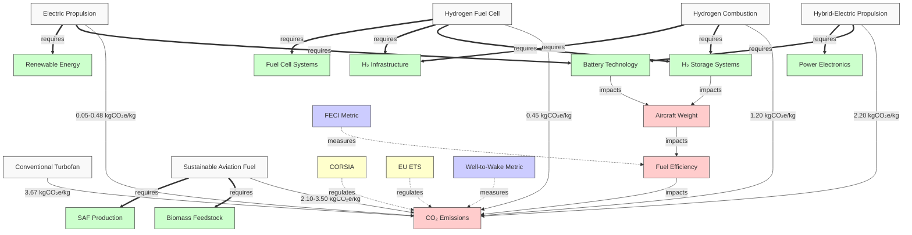

**Figure 2.1:** **Propulsion Technology Impact Network** illustrating the relationships among various propulsion technologies, their enabling components, and regulatory frameworks—along with how each impacts CO₂ emissions.

### 2.2 Hydrogen Value Chain Emissions Map

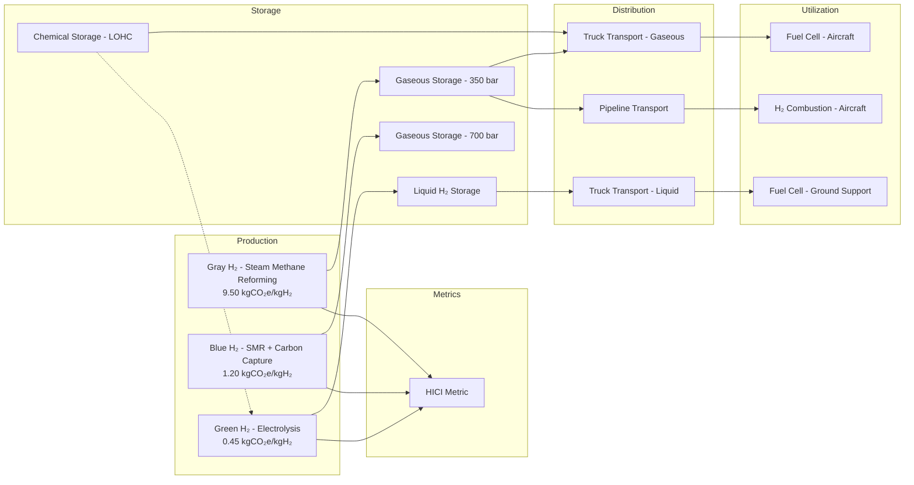

**Figure 2.2:** **Hydrogen Value Chain Emissions Map** depicting production pathways (gray, blue, green hydrogen), storage options, distribution modes, and utilization technologies—each with its associated emissions metric.

---

## 3. Air Systems Relationship Diagrams

### 3.1 Aircraft Propulsion Technology Dependency Map

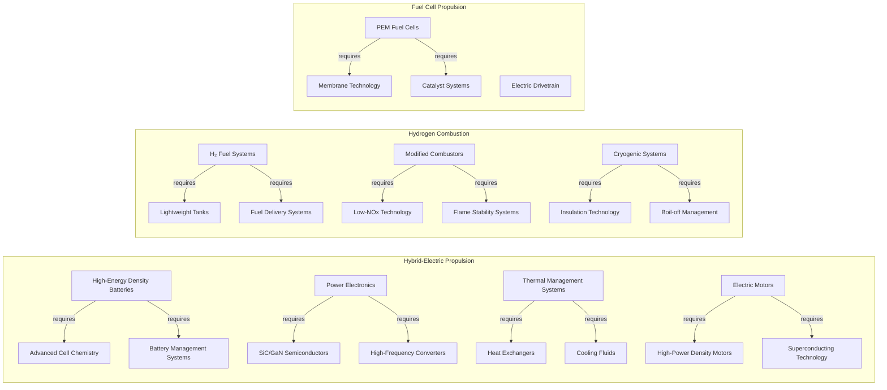

**Figure 3.1:** **Aircraft Propulsion Technology Dependency Map** highlighting hierarchical dependencies between propulsion system configurations and their enabling technologies.

### 3.2 Aircraft Emissions Reduction Pathway

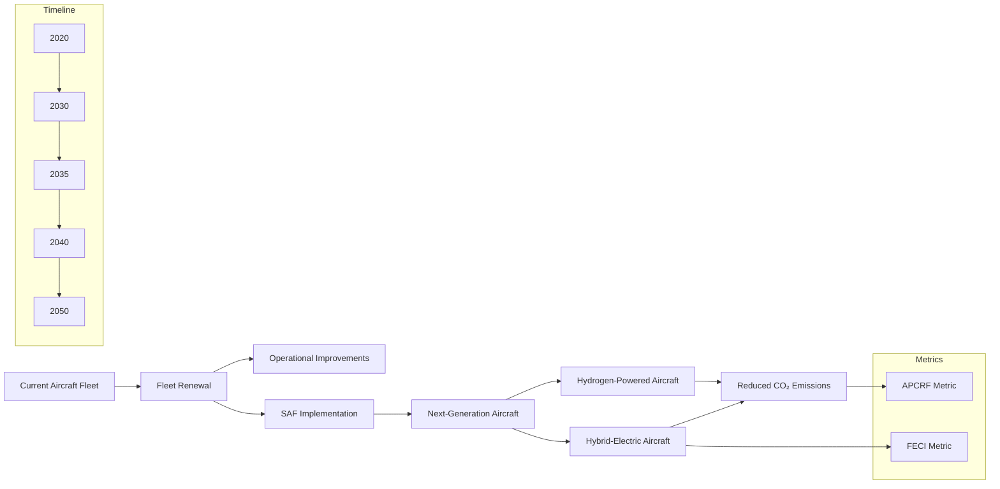

**Figure 3.2:** **Aircraft Emissions Reduction Pathway** illustrating the temporal evolution of aircraft technologies (fleet renewal → next-generation aircraft) and associated emissions savings, with relevant metrics noted.

---

## 4. Ground Operations Relationship Diagrams

### 4.1 Hydrogen Infrastructure System Map

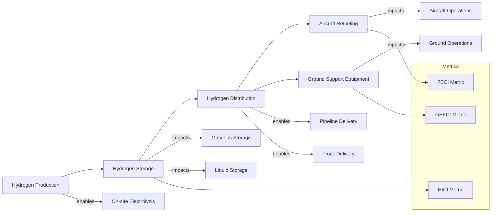

**Figure 4.1:** **Hydrogen Infrastructure System Map** outlining hydrogen production, storage, and distribution for ground operations—along with relevant impact metrics.

### 4.2 Ground Support Equipment Electrification Impact

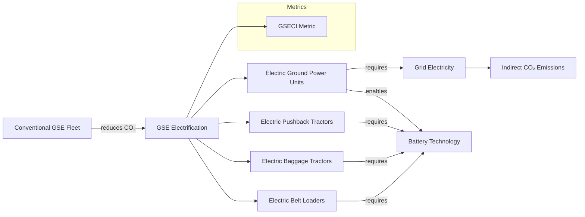

**Figure 4.2:** **Ground Support Equipment Electrification Impact** illustrating the direct emissions reduction from electrification and dependencies on grid electricity and battery technology.

---

## 5. Lifecycle Assessment Relationship Diagrams

### 5.1 Aircraft Lifecycle Carbon Footprint Map

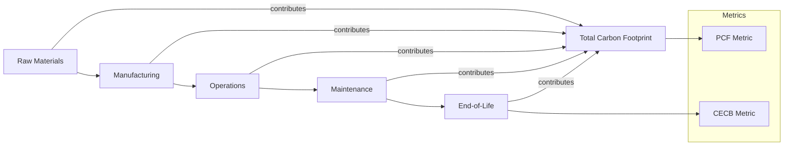

**Figure 5.1:** **Aircraft Lifecycle Carbon Footprint Map** showing major lifecycle phases and their respective contributions to the overall carbon footprint, alongside relevant LCA-based metrics.

### 5.2 Circular Economy Strategies Impact

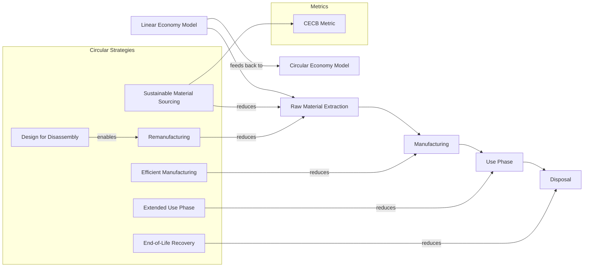

**Figure 5.2:** **Circular Economy Strategies Impact** demonstrating how circular principles (sustainable sourcing, remanufacturing, etc.) can lower overall resource demand and emissions compared to the linear model.

---

## 6. Cross-System Optimization Opportunities

### 6.1 Hydrogen System Integration Optimization

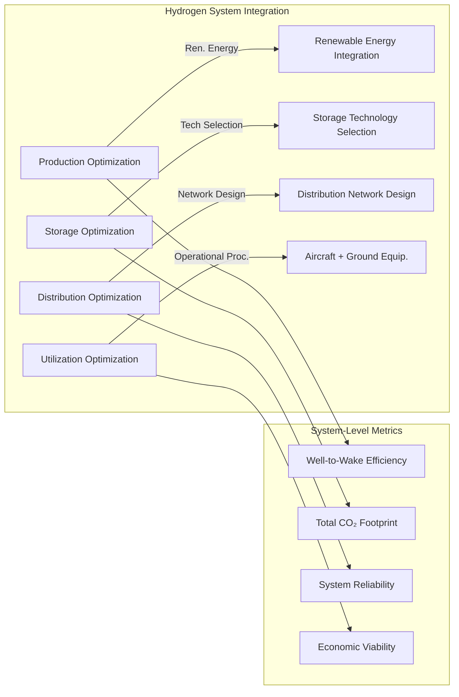

**Figure 6.1:** **Hydrogen System Integration Optimization** illustrating how various optimizations (production, storage, distribution, and utilization) can enhance system-level efficiency and lower CO₂ footprints.

### 6.2 Technology Readiness and Impact Assessment

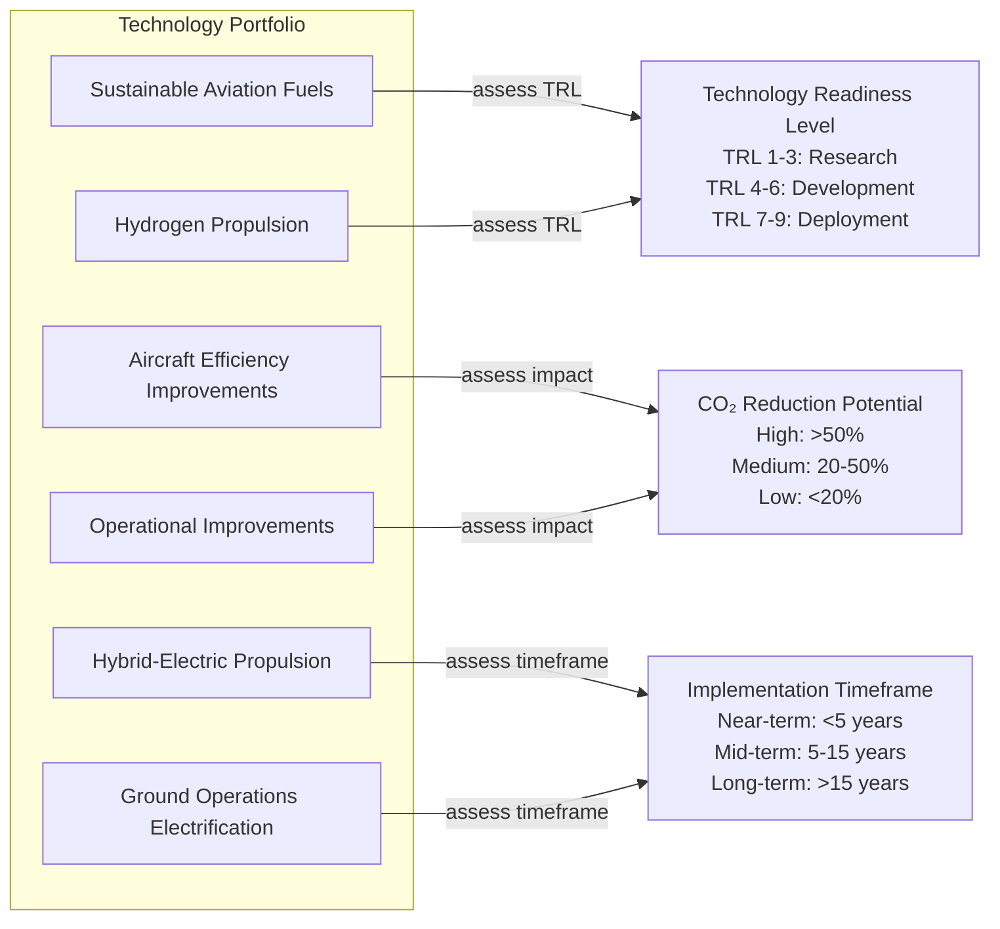

**Figure 6.2:** **Technology Readiness and Impact Assessment** illustrating how different technologies map to readiness level, CO₂ reduction potential, and implementation timeframes—helping prioritize R\&D investments.

---

## 7. Implementation Guidance

### 7.1 Using the Relationship Diagrams

1. **Identify Critical Pathways**
   Trace relationships to find the most effective routes to decarbonization.

2. **Analyze Dependencies**
   Highlight the enabling infrastructure, policies, or R\&D required for each technology.

3. **Assess Trade-offs**
   Weigh potential conflicts (e.g., weight vs. efficiency) or synergies (e.g., electrification + hydrogen).

4. **Support Decision-Making**
   Provide a visual context to guide technology investments, policy development, and operational strategies.

5. **Communicate Complexity**
   Present complex interconnections in an accessible format for diverse stakeholders.

### 7.2 Integration with Metrics

Each diagram aligns with the standardized metrics defined in **\[GP-FD-07-002-SPEC-A]**, ensuring both **qualitative (diagram-based)** and **quantitative (metric-based)** assessment. Key integration points include:

* **Metric Placement**: Where in the diagram a given metric applies (e.g., CO₂ intensity in a propulsion diagram).
* **Impact Quantification**: Diagrams show qualitative cause-and-effect; metrics provide the numerical evaluation.
* **System Boundaries**: Diagram nodes align with the system boundaries in metrics calculations.
* **Data Flow**: Can trace how data are collected for metrics and aggregated into final reports.

### 7.3 Updating Procedures

1. **Regular Review**
   Conduct quarterly reviews to align diagrams with new technologies or policy changes.

2. **Technology Updates**
   Incorporate emergent propulsion systems, fuels, or operational practices.

3. **Metric Alignment**
   Keep diagrams consistent with revised metrics from **\[GP-FD-07-002-SPEC-A]**.

4. **Stakeholder Input**
   Integrate feedback from domain experts and front-line implementers.

5. **Version Control**
   Log all edits and keep a comprehensive change history.

---

## 8. References

1. **International Civil Aviation Organization (ICAO).** (2022). *CORSIA Implementation Elements.*
2. **Air Transport Action Group (ATAG).** (2021). *Waypoint 2050: Balancing Growth in Connectivity with Climate Action.*
3. **Hydrogen Council.** (2022). *Hydrogen Insights Report.*
4. **International Energy Agency (IEA).** (2023). *The Future of Hydrogen.*
5. **Clean Sky 2 Joint Undertaking.** (2020). *Hydrogen-Powered Aviation: A Fact-Based Study.*
6. **European Union Aviation Safety Agency (EASA).** (2022). *European Aviation Environmental Report.*
7. **GAIA Quantum Aerospace.** (2025). *AMPEL Sustainability Assessment Framework.*
8. **Systems Engineering Body of Knowledge (SEBoK).** (2023). *Model-Based Systems Engineering.*

---

## Appendix A: Diagram Source Files

All Mermaid Markdown (.mmd), SVG (.svg), Draw\.io XML (.drawio), and Enterprise Architect (.eap) source files for these diagrams are stored in:

```
/diagrams/GP-FD-07-003/
```

within the **GAIA-CO-ASD-LIB** repository.

## Appendix B: Relationship Notation Reference

| Visual Element          | Meaning                                 | Example                       |
| ----------------------- | --------------------------------------- | ----------------------------- |
| **Solid Arrow (→)**     | Direct causal relationship              | `Technology → Emissions`      |
| **Double Arrow (⇒)**    | Dependency relationship                 | `System ⇒ Component`          |
| **Dashed Arrow (- ->)** | Measurement or classification           | `Metric - -> Parameter`       |
| **Bidirectional (↔)**   | Trade-off or balance                    | `Weight ↔ Performance`        |
| **Box Colors**          | Domain classification                   | \[Section 1.2.3 Color Coding] |
| **Box Shapes**          | Element type (technology, metric, etc.) | \[Section 1.2.2 Node Types]   |

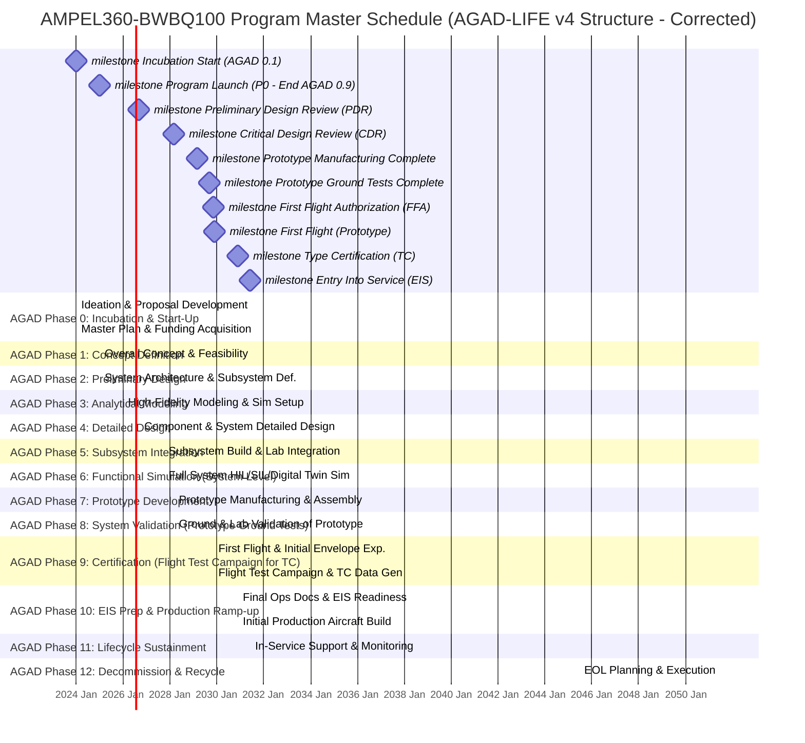