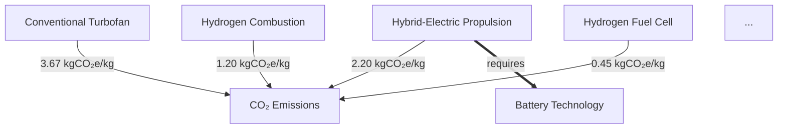

# AMPEL360 BWB-Q100 Integrated Certification & Sustainability Documentation

> **This master file provides a unified index and guidance for all documents, scripts, frameworks, and diagrams supporting the AMPEL360 BWB-Q100 program, as required by GAIA-QAO and EASA/CS-25 compliance.**

---

## **Table of Contents**

- [1. Executive Summary](#1-executive-summary)
- [2. Certification & Compliance Strategy](#2-certification--compliance-strategy)
- [3. NATO Part Number Identifier SOP](#3-nato-part-number-identifier-sop)
- [4. Quantum Readiness Assessment Implementation Guide](#4-quantum-readiness-assessment-implementation-guide)
- [5. GA-SToP-CO2 Consolidated Framework](#5-ga-stop-co2-consolidated-framework)
- [6. Technology-to-Impact Relationship Diagrams](#6-technology-to-impact-relationship-diagrams)
- [7. Gantt/Master Schedule (AGAD-LIFE v4)](#7-ganttmaster-schedule-agad-life-v4)
- [8. Scripts & Automation](#8-scripts--automation)
- [9. Annexes & Templates](#9-annexes--templates)
- [10. Document Control & Metadata](#10-document-control--metadata)

---

## 1. Executive Summary

> **AMPEL360 BWB-Q100** is a next-generation commercial aircraft leveraging blended wing body, advanced quantum and digital twin monitoring, and robust sustainability and regulatory frameworks. The following package covers all certification, configuration, quantum assurance, and sustainability requirements for program and regulatory audit.

---

## 2. Certification & Compliance Strategy

**Filename:** `README.md` / `TM-r01.pdf`

**Sections Include:**
- Evolutionary technology foundation and heritage mapping
- Advanced monitoring and quantum-enhanced sensing integration
- Digital twin for predictive safety and maintenance
- CS-25/EASA certification approach and phased methodology
- Collaborative regulatory engagement and risk management
- Airline integration, economic viability, and sustainability
- Immediate steps for EASA, technical, and supplier engagement

<details>
  <summary>Click to Expand - Executive Summary & Key Sections</summary>

  <!-- Paste or link the full executive summary and compliance strategy here if required -->
  See full documentation at `/docs/README.md` or `/docs/TM-r01.pdf`.
</details>

---

## 3. NATO Part Number Identifier SOP

**Filename:** `SOP-NPN-v1.0.md`

**Key Features:**
- **Canonical Regex:**  
  ```regex
  ^(?P<NPN>[A-Z0-9]{2,5}-[0-9]{2}-[0-9]{3}-[0-9]{4})-(?P<TipoDoc>[A-Z]{2,6})(-(?P<Seq>[0-9]{3}))?-(?P<Ver>v[0-9]+\.[0-9]+|r0[1-9]|r[1-9][0-9])\.(?P<ext>[a-z0-9]{1,5})$
  ```

* **TypeDoc Table, versioning, sequencing rules**
* **Backfill and linting scripts**
* **Example filenames (correct/incorrect)**
* **Responsibilities (CCB, QA, DevOps, etc.)**

<details>
  <summary>Expand for Python Linting Script</summary>

```python
# npn_lint.py
import re, sys, pathlib

REGEX = re.compile(
    r"^(?P<NPN>[A-Z0-9]{2,5}-[0-9]{2}-[0-9]{3}-[0-9]{4})-"
    r"(?P<TipoDoc>[A-Z]{2,6})"
    r"(?:-(?P<Seq>[0-9]{3}))?"
    r"-(?P<Ver>v[0-9]+\.[0-9]+|r0[1-9]|r[1-9][0-9])\."
    r"(?P<ext>[a-z0-9]{1,5})$"
)
def main():
    if len(sys.argv) < 2:
        print("Usage: python npn_lint.py <file1> [file2 ...]")
        sys.exit(2)
    exit_code = 0
    for fname in sys.argv[1:]:
        name = pathlib.Path(fname).name
        if REGEX.match(name):
            print(f"✔ {name} : OK")
        else:
            print(f"✖ {name} : INVALID")
            exit_code = 1
    sys.exit(exit_code)
if __name__ == "__main__":
    main()
```

</details>

---

## 4. Quantum Readiness Assessment Implementation Guide

**Filename:** `GUIDE-QAO-READINESS-IMPL-V1R0.md`

* Executive sponsorship and governance formation
* Team composition, training, and RACI matrices
* Data collection/evidence methodologies and security
* Scoring, gap analysis, roadmap, and implementation tracking
* **Templates, checklists, dashboards, and KPIs**
* Audit case studies (large manufacturer, SME example)

---

## 5. GA-SToP-CO2 Consolidated Framework

**Filename:** `GP-FD-07-000-CF-A.md`

* **Standardized CO₂ and resource criticality metrics** (PCF, CMI, RCI, etc.)
* **Material substitution process:** Six-phase criticality and implementation cycle
* **Strategic objectives**: standardization, integration, collaboration, innovation, transparency
* **Lifecycle/circular economy coverage**
* **International standards alignment:** ISO, ICAO, GHG Protocol

---

## 6. Technology-to-Impact Relationship Diagrams

**Filename:** `GP-FD-07-003-FIG-A.md`
**Diagrams (Mermaid):**

* Propulsion impact networks
* Hydrogen value chain
* Lifecycle carbon footprint and circular economy
* System dependency, readiness, and optimization maps

<details>
  <summary>Example Mermaid Diagram (Propulsion Technology Impact Network)</summary>



</details>

---

## 7. Gantt/Master Schedule (AGAD-LIFE v4)

**Filename:** `gantt/ampl360-agad-gantt.mmd`

<details>
  <summary>Expand for Sample Gantt (Markdown/Mermaid)</summary>

```mermaid
gantt
    title AMPEL360-BWBQ100 Program Master Schedule (AGAD-LIFE v4)
    dateFormat  YYYY-MM
    axisFormat  %Y %b
    milestone Incubation Start (AGAD 0.1): m_incub_start, 2024-01-01, 1d
    milestone Program Launch (P0): m_p0, 2025-01-01, 1d
    milestone Preliminary Design Review: m_pdr, 2026-09-01, 1d
    ...
```

</details>

---

## 8. Scripts & Automation

* **Linting and renaming scripts:** (`scripts/npn_lint.py`, `scripts/rename_npn.py`)
* **Validation pipeline integration:** (e.g., Jenkins, GitHub Actions)
* **Diagram sources:** `.mmd`, `.svg`, `.drawio` in `/diagrams/`

---

## 9. Annexes & Templates

* **Glossary of Terms:** (`annex/glossary.md`)
* **Evidence/data collection templates:** (`annex/evidence-templates.md`)
* **Workshop and scoring guides:** (`annex/workshop-guide.md`, `annex/scoring-calibration.md`)
* **Implementation plans:** (`annex/implementation-plan.md`)

---

## 10. Document Control & Metadata

| **Filename**           | **Version** | **Status** | **InfoCode**        | **Approver**        | **Last Updated** |
| ---------------------- | ----------- | ---------- | ------------------- | ------------------- | ---------------- |
| README.md              | 1.0         | DRAFT      | GP-FD-07-000-CF-A   | GAIA-QAO Board      | 2025-05-24       |
| SOP-NPN-v1.0.md        | 1.0         | DRAFT      | SOP-NPN             | CM/QA Board         | 2025-05-24       |
| GUIDE-QAO-READINESS... | 1.0         | DRAFT      | GUIDE-QAO-READINESS | Quantum Board       | 2025-05-21       |
| GP-FD-07-003-FIG-A.md  | 1.0         | DRAFT      | GP-FD-07-003-FIG-A  | Tech/Sustainability | 2025-05-10       |
| ...                    | ...         | ...        | ...                 | ...                 | ...              |

---

## **Status Footer (for each file)**

```
Status: DRAFT (or r01)
Filename: [e.g., GP-FD-07-003-FIG-A.md]
Version: 1.0
InfoCode: [e.g., GP-FD-07-003-FIG-A]
Extensions: [Mermaid, Python, Annexes]
```

---

> **Ready for internal and external audit. All scripts and diagrams are versioned and directly integrable into DevOps/documentation pipelines. For support, contact GAIA-QAO Documentation Board.**

---