# Procedimiento Operacional Estándar (SOP) para la Convención de Identificadores Basada en NATO Part Number (NPN)

---- [Procedimiento Operacional Estándar (SOP) para la Convención de Identificadores Basada en NATO Part Number (NPN)](#procedimiento-operacional-estándar-sop-para-la-convención-de-identificadores-basada-en-nato-part-number-npn)
  - [1. Propósito y alcance](#1-propósito-y-alcance)
  - [2. Normativa y referencias](#2-normativa-y-referencias)
  - [3. Responsabilidades](#3-responsabilidades)
  - [4. Convención de identificadores](#4-convención-de-identificadores)
    - [4.1 Sintaxis formal](#41-sintaxis-formal)
    - [4.2 Tabla de TipoDoc autorizados](#42-tabla-de-tipodoc-autorizados)
  - [5. Reglas de aplicación](#5-reglas-de-aplicación)
  - [6. Procedimientos operativos](#6-procedimientos-operativos)
    - [6.1 Asignación de Secuencia](#61-asignación-de-secuencia)
    - [6.2 Control de versiones (Detallado)](#62-control-de-versiones-detallado)
    - [6.3 Proceso Backfill (Renombrado de artefactos existentes)](#63-proceso-backfill-renombrado-de-artefactos-existentes)
    - [6.4 Linting automático](#64-linting-automático)
  - [7. Gestión de cambios y aprobaciones del SOP](#7-gestión-de-cambios-y-aprobaciones-del-sop)
  - [8. Anexos](#8-anexos)
# Procedimiento Operacional Estándar (SOP) para la Convención de Identificadores Basada en NATO Part Number (NPN)

---

## 1. Propósito y alcance

Este procedimiento establece la **convención oficial** para nombrar, versionar y gestionar **toda la documentación y artefactos** (software, hardware, datos, registros de fallo, etc.) asociados a un componente identificado mediante un **NATO Part Number (NPN)**.

Sus objetivos principales son garantizar la **unicidad**, **trazabilidad**, **interoperabilidad** y **eficiencia** en la gestión de la configuración a lo largo del ciclo de vida de los productos.

**Alcance:**

* Repositorios Git / SVN
* Herramientas PLM / ALM
* Servidores de artefactos (Docker / S‑BoM)
* Wikis y portales internos
* Sistemas de gestión de incidencias

Este SOP cubre el *versionado lineal* de artefactos ligados a un NPN. Variantes complejas pueden requerir NPN diferentes o mecanismos de control complementarios definidos por Gestión de la Configuración.

---

## 2. Normativa y referencias

| Ref.  | Documento / Norma            | Descripción breve                                | Ubicación / Acceso |
| :---- | :--------------------------- | :----------------------------------------------- | :----------------- |
| \[N1] | **STANAG 3150**              | Sistema OTAN de numeración de piezas             | Intranet / Calidad |
| \[N2] | **ISO 9001 / EN 9100**       | Sistemas de gestión de la calidad                | Intranet / Calidad |
| \[N3] | **ECSS‑Q‑ST‑40 / DO‑178C**   | Aseguramiento de software crítico                | Intranet / Calidad |
| \[N4] | **MIL‑STD‑973 / EIA‑649**    | Gestión de la Configuración (CM)                 | Intranet / Calidad |
| \[N5] | **ISO IEC 29119 / IEEE 829** | Procesos y formatos de documentación de software | Intranet / Calidad |

> **Nota:** Cada empleado es responsable de utilizar la **última versión** disponible de las normativas aplicables.

---

## 3. Responsabilidades

| Rol                             | Responsabilidad clave                                                                                                                                               |
| :------------------------------ | :------------------------------------------------------------------------------------------------------------------------------------------------------------------ |
| **CCB** (Change Control Board)  | • Aprobar NPN oficiales y revisiones `rXX`.<br>• Autorizar nuevos `TipoDoc`.<br>• Resolver disputas sobre la convención.                                            |
| **Ingeniería de Diseño**        | • Asignar `TipoDoc` y secuencias.<br>• Generar artefactos finales (PDF, BIN, etc.).                                                                                 |
| **Gestión de la Configuración** | • Mantener el registro maestro de identificadores.<br>• Garantizar unicidad y correcta aplicación del SOP.<br>• Punto de consulta primario y proponente de mejoras. |
| **DevOps / CI**                 | • Implementar linting y validación automática en los pipelines.                                                                                                     |
| **QA**                          | • Auditar cumplimiento.<br>• Asegurar formación en el SOP.                                                                                                          |
| **Todo el personal**            | • Conocer y aplicar la convención en artefactos bajo su responsabilidad.                                                                                            |

---

## 4. Convención de identificadores

### 4.1 Sintaxis formal

La forma canónica es:

```
<NPN>-<TipoDoc>(-<Secuencia>)-<Versión>.<ext>
```

| Campo         | Regex                                      | Ejemplo          | Descripción                                                                                             |
| :------------ | :----------------------------------------- | :--------------- | :------------------------------------------------------------------------------------------------------ |
| **NPN**       | `[A-Z0-9]{2,5}-[0-9]{2}-[0-9]{3}-[0-9]{4}` | `PN-02-137-0005` | NATO Part Number o identificador interno equivalente.                                                   |
| **TipoDoc**   | `[A-Z]{2,6}`                               | `SRS`, `DDS`     | Código del tipo de documento autorizado.                                                                |
| **Secuencia** | `[0-9]{3}` *opcional*                      | `001`            | Consecutivo interno para múltiples documentos del mismo NPN‑TipoDoc.                                    |
| **Versión**   | `v[0-9]+\.[0-9]+ \| r[0-9]{2}`             | `v0.3`, `r01`    | `vX.Y` para borradores; `rNN` para revisiones aprobadas por CCB. `r01` es la primera liberación formal. |
| **ext**       | `[a-z0-9]{1,5}`                            | `pdf`, `md`      | Extensión del archivo en minúsculas.                                                                    |

> **Regex completa:**
>
> ```regex
> ^(?P<NPN>[A-Z0-9]{2,5}-[0-9]{2}-[0-9]{3}-[0-9]{4})-(?P<TipoDoc>[A-Z]{2,6})(-(?P<Seq>[0-9]{3}))?-(?P<Ver>v[0-9]+\.[0-9]+|r0[1-9]|r[1-9][0-9])\.(?P<ext>[a-z0-9]{1,5})$
> ```
>
> Asegura que las revisiones formales comiencen en **r01**.

### 4.2 Tabla de `TipoDoc` autorizados

| TipoDoc | Descripción                          |
| :------ | :----------------------------------- |
| **SRS** | *Software Requirement Specification* |
| **DDS** | *Detailed Design Specification*      |
| **DWG** | Plano o esquema CAD                  |
| **TM**  | *Technical Manual*                   |
| **TR**  | *Test Report*                        |
| **FR**  | *Failure Report*                     |
| **CFG** | Fichero de configuración (XML/JSON)  |
| **BIN** | Binario compilado / firmware         |
| **…**   | (Extensible previa aprobación CCB)   |

La lista maestra se mantiene en la **Wiki corporativa → Gestión de Configuración**. Añadir un nuevo `TipoDoc` requiere petición formal a la CCB.

---

## 5. Reglas de aplicación

1. **Unicidad:** Ningún cuarteto `(NPN, TipoDoc, Secuencia, Versión)` puede duplicarse en los sistemas bajo alcance.
2. **Control de versión:**

   * **Borradores:** `vX.Y` incrementado por autores (X = cambio mayor, Y = menor).
   * **Liberación inicial:** `r01` asignada tras aprobación CCB.
   * **Revisiones sucesivas:** `rNN` (`r02`, `r03`, …) asignadas solo por CCB. Su desarrollo comienza desde `v(N+1).0`.
3. **Inmutabilidad:** Artefactos `rNN` firmados son *read‑only*; cualquier cambio → nueva versión.
4. **Integración automatizada:** Pipelines CI/CD extraen metadatos del nombre de archivo; NPN se mapea a la *clave primaria* en PLM/ALM.
5. **Formatos abiertos:** Priorizar `pdf`, `md`, `xml`, `json`, `yaml`, `txt` salvo restricciones técnicas.
6. **No conformidades:** Excepciones durante el **Backfill** deben documentarse y aprobarse por CCB.

---

## 6. Procedimientos operativos

### 6.1 Asignación de secuencia

1. Consultar el **registro maestro** (PLM preferido).
2. Tomar el siguiente número libre `001…999` para la pareja `NPN‑TipoDoc`.
3. Registrar la reserva *antes* de generar el artefacto.

### 6.2 Control de versiones (detallado)

| Estado           | Ejemplos       | Quién actualiza | Comentario                                 |
| :--------------- | :------------- | :-------------- | :----------------------------------------- |
| Borrador inicial | `v0.1`, `v0.2` | Autor           | Desarrollo antes de la 1ª revisión formal. |
| Pre‑r02          | `v2.0`, `v2.1` | Autor           | Borradores hacia la siguiente revisión.    |
| Formal           | `r01`, `r02`   | CCB             | Aprobación tras control de cambios.        |

### 6.3 Proceso **Backfill**

1. Inventariar artefactos existentes.
2. Mapearlos a los campos de la convención.
3. Ejecutar scripts `rename_npn.py` en entorno controlado.
4. Actualizar enlaces en wikis, tickets, documentación.
5. Verificar integridad post‑renombrado.

### 6.4 Linting automático

El script `npn_lint.py` verifica la regex de §4.1. Un fallo hace **break** en el pipeline.

---

## 7. Gestión de cambios y aprobaciones del SOP

| Rev | Fecha      | Descripción                                                                     | Autor | Aprobación CCB |
| :-- | :--------- | :------------------------------------------------------------------------------ | :---- | :------------- |
| 0   | 2025‑05‑14 | Versión inicial del SOP.                                                        | RBT   | ☐              |
| 1   | —          | Clarificaciones NPN, versionado, responsabilidades; detalles en procedimientos. | —     | ☐              |

---

## 8. Anexos

### Anexo A – Ejemplos de identificadores correctos / incorrectos

#### Ejemplos **correctos**

| Nº | Nombre de archivo                      | Comentario                          |
| -- | -------------------------------------- | ----------------------------------- |
| 1  | **PN-02-137-0005-SRS-v0.1.md**         | Primer borrador de la SRS           |
| 2  | **PN-02-137-0005-SRS-001-r01.pdf**     | Revisión formal aprobada            |
| 3  | **D0123-99-045-1234-DWG-003-v2.0.dxf** | Tercer plano CAD, trabajo hacia r02 |
| 4  | **GACI1-01-001-0001-DDS-001-v0.1.md**  | Ejemplo de DDS inicial              |

#### Ejemplos **incorrectos**

| Nº | Nombre de archivo             | Motivo de rechazo                                               |
| -- | ----------------------------- | --------------------------------------------------------------- |
| 1  | PN-02-137-SRS-v0.1.md         | Falta el bloque `-0005` del NPN                                 |
| 2  | PN-02-137-0005-SRS-r00.pdf    | `r00` no permitido; las revisiones formales empiezan en **r01** |
| 3  | PN-02-137-0005-SRS-1-v1.0.pdf | Secuencia debe ser *exactamente* tres dígitos (001‑999)         |
| 4  | pn-02-137-0005-srs-v0.1.md    | Uso de minúsculas en NPN y TipoDoc                              |

---

### Anexo B – Scripts de apoyo

> **Nota:** los scripts se proporcionan como referencia. Se recomienda integrarlos en el *repo* de utilidades DevOps y añadir tests antes de uso en producción.

```python
# npn_lint.py
"""
Valida que los nombres de archivo cumplan la expresión
canónica definida en el SOP.
Uso:  python npn_lint.py <archivo1> [archivo2 ...]
Devuelve 0 si todos los nombres son válidos; 1 en caso contrario.
"""
import re, sys, pathlib

REGEX = re.compile(
    r"^(?P<NPN>[A-Z0-9]{2,5}-[0-9]{2}-[0-9]{3}-[0-9]{4})-"
    r"(?P<TipoDoc>[A-Z]{2,6})"
    r"(?:-(?P<Seq>[0-9]{3}))?"
    r"-(?P<Ver>v[0-9]+\.[0-9]+|r[0-9][1-9]|r[1-9][0-9])\."
    r"(?P<ext>[a-z0-9]{1,5})$"
)

def main():
    if len(sys.argv) < 2:
        print("Usage: python npn_lint.py <file1> [file2 ...]")
        sys.exit(2)

    exit_code = 0
    for fname in sys.argv[1:]:
        name = pathlib.Path(fname).name
        if REGEX.match(name):
            print(f"✔ {name} : OK")
        else:
            print(f"✖ {name} : INVALID")
            exit_code = 1
    sys.exit(exit_code)

if __name__ == "__main__":
    main()
```

```python
# rename_npn.py
"""
Renombra de forma interactiva archivos que **no** cumplen la convención.
Lee los metadatos (NPN, TipoDoc, etc.) desde argumentos o mediante
preguntas al usuario y mueve el archivo al nuevo nombre.
Uso:  python rename_npn.py <ruta/al/archivo> --npn PN-... --tipodoc SRS --ver v0.1 [--seq 001] [--ext pdf]
"""
import argparse, pathlib, shutil, sys

parser = argparse.ArgumentParser(description="Renombrado seguro de artefactos NPN")
parser.add_argument("file", help="Ruta al archivo a renombrar")
parser.add_argument("--npn", required=True, help="NPN destino completo")
parser.add_argument("--tipodoc", required=True, help="TipoDoc (p.ej. SRS)")
parser.add_argument("--seq", default="", help="Secuencia opcional de tres dígitos")
parser.add_argument("--ver", required=True, help="Versión (vX.Y o rNN)")
parser.add_argument("--ext", help="Extensión destino (por defecto conserva la original)")
args = parser.parse_args()

src = pathlib.Path(args.file).expanduser().resolve()
if not src.exists():
    sys.exit(f"Archivo no encontrado: {src}")

ext = args.ext or src.suffix.lstrip(".")
seq_part = f"-{args.seq}" if args.seq else ""
new_name = f"{args.npn}-{args.tipodoc}{seq_part}-{args.ver}.{ext}"

dst = src.with_name(new_name)
print(f"Renombrando: {src.name} -> {dst.name}")
shutil.move(src, dst)
```

---

### Anexo C – Flujograma del ciclo de versionado `vX.Y` → `rNN`

```mermaid
flowchart LR
    A[Draft v0.1] --> B[Iteraciones v0.Y]
    B --> C[Freeze v1.0]
    C --> D[Revisión interna]
    D -->|Aprobado CCB| E[Release r01]
    E --> F[Operación / feedback de campo]
    F --> G[Arranque de nueva línea v2.0]
    G --> H[Iteraciones v2.Y]
    H --> I[Freeze v2.0]
    I --> J[Revisión interna]
    J -->|CCB| K[Release r02]
```

### QUANTUM READINESS ASSESSMENT IMPLEMENTATION GUIDE

## GenAI Proposal Status

This document contains an AI-generated implementation guide for conducting organizational quantum readiness assessments. This is a conceptual framework that requires review by quantum security specialists, organizational governance experts, and aerospace certification authorities before implementation.

---

## Document ID: GUIDE-QAO-READINESS-IMPL-V1R0

**Title:** Quantum Readiness Assessment Implementation Guide
**Version:** 1.0
**Status:** Draft
**Date:** 2025-05-21
**Classification:** INTERNAL / CONTROLLED
**Prepared by:** GAIA-QAO Initiative
**Approved by:** [Pending]

---

## 1. INTRODUCTION

### 1.1 Purpose

This implementation guide provides detailed instructions for organizations to effectively conduct a quantum readiness assessment using the GAIA-QAO Quantum Readiness Assessment Template. It outlines a structured approach to planning, executing, analyzing, and acting upon the assessment results.

### 1.2 Scope

This guide covers all aspects of the assessment process, from initial preparation through roadmap development and implementation tracking. It is designed for organizations in the aerospace industry seeking to evaluate and enhance their quantum readiness, particularly those involved with next-generation aircraft like the AMPEL360 BWB-Q100.

### 1.3 Intended Audience

- Executive sponsors of quantum initiatives
- Quantum program managers and coordinators
- IT and security leaders
- Engineering and operations executives
- Compliance and risk management professionals
- Organizational change management specialists


## 2. ASSESSMENT PREPARATION

### 2.1 Securing Executive Sponsorship

**Key Activities:**

- Identify an executive sponsor with sufficient authority to drive organizational change
- Develop an executive briefing on quantum technologies and their organizational impact
- Present the business case for quantum readiness, including risks of inaction and benefits of preparedness
- Secure formal commitment for resources and organizational support


**Best Practices:**

- Connect quantum readiness to strategic business objectives
- Quantify potential risks of quantum vulnerabilities (e.g., data breach costs, operational disruption)
- Highlight competitive advantages of early quantum adoption
- Provide clear expectations of executive sponsor's role and time commitment


**Example Executive Briefing Outline:**

```plaintext
1. Quantum Technologies Overview (10 minutes)
   - Current state of quantum computing, sensing, and communications
   - Timeline for quantum technology maturity
   - Industry adoption trends

2. Organizational Implications (15 minutes)
   - Cybersecurity threats from quantum computing
   - Operational opportunities from quantum technologies
   - Regulatory and compliance considerations
   - Competitive landscape analysis

3. Quantum Readiness Assessment (10 minutes)
   - Assessment approach and methodology
   - Resource requirements and timeline
   - Expected outcomes and deliverables

4. Requested Executive Support (5 minutes)
   - Formal sponsorship and advocacy
   - Resource allocation approval
   - Participation in steering committee
   - Communication to organization
```

### 2.2 Establishing the Assessment Governance

**Key Activities:**

- Form a Quantum Readiness Steering Committee with cross-functional representation
- Define roles, responsibilities, and decision-making authority
- Establish assessment governance processes and escalation paths
- Create a communication plan for stakeholder engagement


**Recommended Governance Structure:**

```mermaid
Quantum Readiness Assessment Governance Structure.download-icon {
            cursor: pointer;
            transform-origin: center;
        }
        .download-icon .arrow-part {
            transition: transform 0.35s cubic-bezier(0.35, 0.2, 0.14, 0.95);
             transform-origin: center;
        }
        button:has(.download-icon):hover .download-icon .arrow-part, button:has(.download-icon):focus-visible .download-icon .arrow-part {
          transform: translateY(-1.5px);
        }
        #mermaid-diagram-rsko{font-family:var(--font-geist-sans);font-size:12px;fill:#000000;}#mermaid-diagram-rsko .error-icon{fill:#552222;}#mermaid-diagram-rsko .error-text{fill:#552222;stroke:#552222;}#mermaid-diagram-rsko .edge-thickness-normal{stroke-width:1px;}#mermaid-diagram-rsko .edge-thickness-thick{stroke-width:3.5px;}#mermaid-diagram-rsko .edge-pattern-solid{stroke-dasharray:0;}#mermaid-diagram-rsko .edge-thickness-invisible{stroke-width:0;fill:none;}#mermaid-diagram-rsko .edge-pattern-dashed{stroke-dasharray:3;}#mermaid-diagram-rsko .edge-pattern-dotted{stroke-dasharray:2;}#mermaid-diagram-rsko .marker{fill:#666;stroke:#666;}#mermaid-diagram-rsko .marker.cross{stroke:#666;}#mermaid-diagram-rsko svg{font-family:var(--font-geist-sans);font-size:12px;}#mermaid-diagram-rsko p{margin:0;}#mermaid-diagram-rsko .label{font-family:var(--font-geist-sans);color:#000000;}#mermaid-diagram-rsko .cluster-label text{fill:#333;}#mermaid-diagram-rsko .cluster-label span{color:#333;}#mermaid-diagram-rsko .cluster-label span p{background-color:transparent;}#mermaid-diagram-rsko .label text,#mermaid-diagram-rsko span{fill:#000000;color:#000000;}#mermaid-diagram-rsko .node rect,#mermaid-diagram-rsko .node circle,#mermaid-diagram-rsko .node ellipse,#mermaid-diagram-rsko .node polygon,#mermaid-diagram-rsko .node path{fill:#eee;stroke:#999;stroke-width:1px;}#mermaid-diagram-rsko .rough-node .label text,#mermaid-diagram-rsko .node .label text{text-anchor:middle;}#mermaid-diagram-rsko .node .katex path{fill:#000;stroke:#000;stroke-width:1px;}#mermaid-diagram-rsko .node .label{text-align:center;}#mermaid-diagram-rsko .node.clickable{cursor:pointer;}#mermaid-diagram-rsko .arrowheadPath{fill:#333333;}#mermaid-diagram-rsko .edgePath .path{stroke:#666;stroke-width:2.0px;}#mermaid-diagram-rsko .flowchart-link{stroke:#666;fill:none;}#mermaid-diagram-rsko .edgeLabel{background-color:white;text-align:center;}#mermaid-diagram-rsko .edgeLabel p{background-color:white;}#mermaid-diagram-rsko .edgeLabel rect{opacity:0.5;background-color:white;fill:white;}#mermaid-diagram-rsko .labelBkg{background-color:rgba(255, 255, 255, 0.5);}#mermaid-diagram-rsko .cluster rect{fill:hsl(0, 0%, 98.9215686275%);stroke:#707070;stroke-width:1px;}#mermaid-diagram-rsko .cluster text{fill:#333;}#mermaid-diagram-rsko .cluster span{color:#333;}#mermaid-diagram-rsko div.mermaidTooltip{position:absolute;text-align:center;max-width:200px;padding:2px;font-family:var(--font-geist-sans);font-size:12px;background:hsl(-160, 0%, 93.3333333333%);border:1px solid #707070;border-radius:2px;pointer-events:none;z-index:100;}#mermaid-diagram-rsko .flowchartTitleText{text-anchor:middle;font-size:18px;fill:#000000;}#mermaid-diagram-rsko .flowchart-link{stroke:hsl(var(--gray-400));stroke-width:1px;}#mermaid-diagram-rsko .marker,#mermaid-diagram-rsko marker,#mermaid-diagram-rsko marker *{fill:hsl(var(--gray-400))!important;stroke:hsl(var(--gray-400))!important;}#mermaid-diagram-rsko .label,#mermaid-diagram-rsko text,#mermaid-diagram-rsko text>tspan{fill:hsl(var(--black))!important;color:hsl(var(--black))!important;}#mermaid-diagram-rsko .background,#mermaid-diagram-rsko rect.relationshipLabelBox{fill:hsl(var(--white))!important;}#mermaid-diagram-rsko .entityBox,#mermaid-diagram-rsko .attributeBoxEven{fill:hsl(var(--gray-150))!important;}#mermaid-diagram-rsko .attributeBoxOdd{fill:hsl(var(--white))!important;}#mermaid-diagram-rsko .label-container,#mermaid-diagram-rsko rect.actor{fill:hsl(var(--white))!important;stroke:hsl(var(--gray-400))!important;}#mermaid-diagram-rsko line{stroke:hsl(var(--gray-400))!important;}#mermaid-diagram-rsko :root{--mermaid-font-family:var(--font-geist-sans);}Executive SponsorQuantum Readiness SteeringCommitteeAssessment Program ManagerDomain Assessment TeamsDomain 1: Governance &amp;Strategy TeamDomain 2: Security &amp;Cryptography TeamDomain 3: Technology CapabilitiesTeamDomain 4: Talent &amp; ExpertiseTeamDomain 5: Supply Chain &amp;Ecosystem TeamDomain 6: Compliance &amp;Certification TeamAssessment Support TeamData Collection &amp; AnalysisDocumentation &amp; ReportingCommunications &amp; ChangeManagement
```

**RACI Matrix Template:**

| Role | Planning | Data Collection | Assessment | Analysis | Roadmap Development | Implementation
|-----|-----|-----|-----|-----|-----|-----
| Executive Sponsor | A | I | I | I | A | A
| Steering Committee | R | A | A | A | R | A
| Program Manager | R | R | R | R | R | R
| Domain Teams | C | R | R | C | C | C
| Support Team | C | C | C | R | C | C
| Department Heads | C | C | C | C | C | R


*R = Responsible, A = Accountable, C = Consulted, I = Informed*

### 2.3 Resource Planning

**Key Activities:**

- Estimate time and effort requirements for each assessment phase
- Identify and secure required personnel resources
- Develop assessment budget
- Procure necessary tools and technologies
- Create detailed project plan with milestones and dependencies


**Resource Estimation Guidelines:**

| Assessment Phase | Typical Duration | Key Resources Required
|-----|-----|-----|-----|-----|-----|-----
| Preparation | 2-4 weeks | Program manager, executive time, communications support
| Team Formation | 1-2 weeks | HR support, department head involvement, training resources
| Data Collection | 3-6 weeks | Domain experts, data analysts, interview facilitators
| Assessment Execution | 2-4 weeks | Domain teams, workshop facilitators, documentation support
| Analysis & Scoring | 2-3 weeks | Data analysts, domain experts, visualization specialists
| Roadmap Development | 3-4 weeks | Strategic planners, domain experts, financial analysts
| Final Reporting | 1-2 weeks | Technical writers, presentation developers, reviewers


**Total Estimated Duration:** 14-25 weeks

**Sample Budget Categories:**

- Internal labor (allocated time from existing staff)
- External consultants and subject matter experts
- Training and enablement
- Tools and technology
- Workshops and meetings
- Documentation and reporting
- Contingency (15-20%)


## 3. ASSESSMENT TEAM FORMATION

### 3.1 Core Team Composition

**Key Activities:**

- Define required skills and expertise for assessment team members
- Identify and recruit team members from across the organization
- Assign roles and responsibilities
- Conduct team onboarding and training


**Core Team Roles:**

| Role | Responsibilities | Required Skills | Time Commitment
|-----|-----|-----|-----|-----|-----|-----
| Assessment Program Manager | Overall coordination, stakeholder management, reporting | Project management, leadership, quantum awareness | 50-100% for duration
| Domain Team Leads (6) | Lead assessment for specific domains, coordinate data collection | Subject matter expertise, analytical skills, facilitation | 30-50% for duration
| Data Analyst | Data collection, analysis, visualization | Data analysis, statistical methods, reporting | 50-75% for duration
| Documentation Specialist | Create and maintain assessment documentation | Technical writing, document management | 30-50% for duration
| Communications Coordinator | Stakeholder communications, change management | Communications, change management | 20-30% for duration


### 3.2 Domain Team Formation

**Key Activities:**

- Identify subject matter experts for each assessment domain
- Form domain-specific assessment teams
- Provide domain-specific training and guidance
- Establish domain team working processes


**Domain Team Composition Guidelines:**

| Domain | Recommended Team Members | External Support Considerations
|-----|-----|-----|-----|-----|-----|-----
| Governance & Strategy | Strategic planning, executive leadership, risk management | Quantum strategy consultants
| Security & Cryptography | CISO office, security architects, cryptography specialists | Post-quantum cryptography experts
| Technology Capabilities | CTO office, R&D leaders, innovation managers | Quantum technology vendors
| Talent & Expertise | HR, learning & development, technical leadership | Quantum education specialists
| Supply Chain & Ecosystem | Procurement, supplier management, partner relations | Quantum supply chain consultants
| Compliance & Certification | Legal, compliance, quality assurance | Quantum certification experts


### 3.3 Team Training and Enablement

**Key Activities:**

- Develop quantum fundamentals training for all team members
- Provide assessment methodology training
- Conduct domain-specific deep dives
- Establish knowledge sharing mechanisms


**Training Program Outline:**

1. **Quantum Fundamentals (All Team Members)**

1. Quantum computing principles and terminology
2. Quantum sensing and metrology basics
3. Quantum communications and cryptography overview
4. Quantum technology timeline and implications


2. **Assessment Methodology (All Team Members)**

1. Assessment framework overview
2. Maturity model explanation
3. Evidence collection and validation
4. Scoring and analysis methods


3. **Domain-Specific Training (Domain Teams)**

1. Deep dive into domain-specific assessment criteria
2. Industry benchmarks and best practices
3. Evidence examples and validation techniques
4. Common challenges and solutions


4. **Tools and Templates Training (All Team Members)**

1. Assessment documentation tools
2. Data collection templates
3. Analysis and visualization tools
4. Reporting templates


## 4. DATA COLLECTION METHODOLOGY

### 4.1 Evidence Types and Sources

**Key Activities:**

- Define acceptable evidence types for each assessment criterion
- Identify primary and secondary data sources
- Develop evidence collection templates
- Establish evidence validation processes


**Evidence Types by Maturity Level:**

| Maturity Level | Typical Evidence Types
|-----|-----|-----|-----|-----|-----|-----
| Level 0-1 | Informal discussions, basic awareness documentation, preliminary research
| Level 2 | Draft policies, pilot projects, limited implementation documentation, training materials
| Level 3 | Formal policies and procedures, implementation plans, partial deployment evidence, metrics
| Level 4-5 | Comprehensive documentation, full implementation evidence, performance metrics, continuous improvement processes, external validation


**Evidence Source Matrix:**

| Evidence Category | Primary Sources | Secondary Sources | Collection Methods
|-----|-----|-----|-----|-----|-----|-----
| Strategy Documents | Executive leadership, strategic planning | Department heads, project documentation | Document review, interviews
| Policies & Procedures | Compliance, IT governance, security | Department implementations, audit reports | Document review, system analysis
| Technical Capabilities | IT, engineering, R&D | Vendors, project teams | Technical assessments, demonstrations
| Personnel Capabilities | HR, training, department heads | Staff, project documentation | Surveys, interviews, skills assessments
| External Relationships | Procurement, partner management | Contracts, vendor assessments | Document review, partner interviews
| Compliance Evidence | Legal, compliance, quality assurance | Audit reports, certifications | Document review, compliance assessments


### 4.2 Data Collection Techniques

**Key Activities:**

- Select appropriate data collection techniques for each assessment area
- Develop data collection instruments (surveys, interview guides, etc.)
- Create data collection schedule
- Train team members on data collection techniques


**Recommended Techniques by Data Type:**

| Data Type | Recommended Techniques | Advantages | Limitations
|-----|-----|-----|-----|-----|-----|-----
| Documented Policies & Procedures | Document review, content analysis | Objective, comprehensive | May not reflect actual practice
| Implementation Evidence | System review, demonstration, observation | Verifies actual implementation | Time-intensive, may be disruptive
| Knowledge & Awareness | Surveys, interviews, focus groups | Captures tacit knowledge, cultural aspects | Subjective, potential bias
| Performance Metrics | Data analysis, system reports, dashboards | Quantitative, objective | May not capture quality aspects
| External Validation | Third-party assessments, certifications, benchmarking | Independent verification | Cost, limited availability


**Sample Interview Guide Structure:**

```plaintext
Domain: [Specify Domain]
Criterion: [Specify Criterion]

Introduction:
- Purpose of interview
- Confidentiality statement
- Structure and duration

Background Questions:
1. [Role-specific question]
2. [Experience-specific question]

Assessment Questions:
1. [Open-ended question about current state]
2. [Specific question about processes]
3. [Evidence-focused question]
4. [Challenge/limitation question]
5. [Future plans question]

Maturity Indicators (for interviewer reference):
- Level 1 indicators: [list]
- Level 2 indicators: [list]
- Level 3 indicators: [list]
- Level 4 indicators: [list]
- Level 5 indicators: [list]

Evidence Requests:
- [Specific document request 1]
- [Specific document request 2]
- [System demonstration request]
```

### 4.3 Data Management and Security

**Key Activities:**

- Establish data collection repository
- Implement data security and access controls
- Create data organization structure
- Develop data quality assurance processes


**Data Management Framework:**

```mermaid
Assessment Data Management Framework.download-icon {
            cursor: pointer;
            transform-origin: center;
        }
        .download-icon .arrow-part {
            transition: transform 0.35s cubic-bezier(0.35, 0.2, 0.14, 0.95);
             transform-origin: center;
        }
        button:has(.download-icon):hover .download-icon .arrow-part, button:has(.download-icon):focus-visible .download-icon .arrow-part {
          transform: translateY(-1.5px);
        }
        #mermaid-diagram-rths{font-family:var(--font-geist-sans);font-size:12px;fill:#000000;}#mermaid-diagram-rths .error-icon{fill:#552222;}#mermaid-diagram-rths .error-text{fill:#552222;stroke:#552222;}#mermaid-diagram-rths .edge-thickness-normal{stroke-width:1px;}#mermaid-diagram-rths .edge-thickness-thick{stroke-width:3.5px;}#mermaid-diagram-rths .edge-pattern-solid{stroke-dasharray:0;}#mermaid-diagram-rths .edge-thickness-invisible{stroke-width:0;fill:none;}#mermaid-diagram-rths .edge-pattern-dashed{stroke-dasharray:3;}#mermaid-diagram-rths .edge-pattern-dotted{stroke-dasharray:2;}#mermaid-diagram-rths .marker{fill:#666;stroke:#666;}#mermaid-diagram-rths .marker.cross{stroke:#666;}#mermaid-diagram-rths svg{font-family:var(--font-geist-sans);font-size:12px;}#mermaid-diagram-rths p{margin:0;}#mermaid-diagram-rths .label{font-family:var(--font-geist-sans);color:#000000;}#mermaid-diagram-rths .cluster-label text{fill:#333;}#mermaid-diagram-rths .cluster-label span{color:#333;}#mermaid-diagram-rths .cluster-label span p{background-color:transparent;}#mermaid-diagram-rths .label text,#mermaid-diagram-rths span{fill:#000000;color:#000000;}#mermaid-diagram-rths .node rect,#mermaid-diagram-rths .node circle,#mermaid-diagram-rths .node ellipse,#mermaid-diagram-rths .node polygon,#mermaid-diagram-rths .node path{fill:#eee;stroke:#999;stroke-width:1px;}#mermaid-diagram-rths .rough-node .label text,#mermaid-diagram-rths .node .label text{text-anchor:middle;}#mermaid-diagram-rths .node .katex path{fill:#000;stroke:#000;stroke-width:1px;}#mermaid-diagram-rths .node .label{text-align:center;}#mermaid-diagram-rths .node.clickable{cursor:pointer;}#mermaid-diagram-rths .arrowheadPath{fill:#333333;}#mermaid-diagram-rths .edgePath .path{stroke:#666;stroke-width:2.0px;}#mermaid-diagram-rths .flowchart-link{stroke:#666;fill:none;}#mermaid-diagram-rths .edgeLabel{background-color:white;text-align:center;}#mermaid-diagram-rths .edgeLabel p{background-color:white;}#mermaid-diagram-rths .edgeLabel rect{opacity:0.5;background-color:white;fill:white;}#mermaid-diagram-rths .labelBkg{background-color:rgba(255, 255, 255, 0.5);}#mermaid-diagram-rths .cluster rect{fill:hsl(0, 0%, 98.9215686275%);stroke:#707070;stroke-width:1px;}#mermaid-diagram-rths .cluster text{fill:#333;}#mermaid-diagram-rths .cluster span{color:#333;}#mermaid-diagram-rths div.mermaidTooltip{position:absolute;text-align:center;max-width:200px;padding:2px;font-family:var(--font-geist-sans);font-size:12px;background:hsl(-160, 0%, 93.3333333333%);border:1px solid #707070;border-radius:2px;pointer-events:none;z-index:100;}#mermaid-diagram-rths .flowchartTitleText{text-anchor:middle;font-size:18px;fill:#000000;}#mermaid-diagram-rths .flowchart-link{stroke:hsl(var(--gray-400));stroke-width:1px;}#mermaid-diagram-rths .marker,#mermaid-diagram-rths marker,#mermaid-diagram-rths marker *{fill:hsl(var(--gray-400))!important;stroke:hsl(var(--gray-400))!important;}#mermaid-diagram-rths .label,#mermaid-diagram-rths text,#mermaid-diagram-rths text>tspan{fill:hsl(var(--black))!important;color:hsl(var(--black))!important;}#mermaid-diagram-rths .background,#mermaid-diagram-rths rect.relationshipLabelBox{fill:hsl(var(--white))!important;}#mermaid-diagram-rths .entityBox,#mermaid-diagram-rths .attributeBoxEven{fill:hsl(var(--gray-150))!important;}#mermaid-diagram-rths .attributeBoxOdd{fill:hsl(var(--white))!important;}#mermaid-diagram-rths .label-container,#mermaid-diagram-rths rect.actor{fill:hsl(var(--white))!important;stroke:hsl(var(--gray-400))!important;}#mermaid-diagram-rths line{stroke:hsl(var(--gray-400))!important;}#mermaid-diagram-rths :root{--mermaid-font-family:var(--font-geist-sans);}Data CollectionData RepositoryAccess ControlsData OrganizationData QualityRole-based AccessEncryptionAudit LoggingDomain StructureEvidence TaggingVersion ControlCompleteness ChecksValidation ProcessQuality Metrics
```

**Data Security Requirements:**

- Classify assessment data according to organizational data classification policy
- Implement appropriate access controls based on role and need-to-know
- Encrypt sensitive assessment data, particularly when containing security vulnerabilities
- Maintain audit logs of all access to assessment data
- Establish data retention and destruction policies for assessment data
- Create data breach response procedures specific to assessment data


## 5. ASSESSMENT EXECUTION

### 5.1 Kickoff and Communication

**Key Activities:**

- Conduct formal assessment kickoff meeting
- Communicate assessment purpose and process to stakeholders
- Establish regular status reporting
- Set expectations for participation and cooperation


**Kickoff Meeting Agenda:**

```plaintext
1. Welcome and Introductions (10 minutes)
2. Executive Sponsor Opening Remarks (10 minutes)
3. Quantum Readiness Overview (15 minutes)
4. Assessment Methodology and Process (20 minutes)
5. Timeline and Key Milestones (10 minutes)
6. Roles and Responsibilities (15 minutes)
7. Communication Plan (10 minutes)
8. Next Steps and Action Items (10 minutes)
9. Q&A (20 minutes)
```

**Stakeholder Communication Plan Template:**

| Stakeholder Group | Communication Method | Frequency | Key Messages | Responsible
|-----|-----|-----|-----|-----|-----|-----
| Executive Leadership | Executive briefing | Monthly | Strategic importance, high-level progress, resource needs | Executive Sponsor
| Department Heads | Status report, leadership meeting | Bi-weekly | Department impacts, resource requirements, cooperation needs | Program Manager
| Assessment Teams | Team meetings, collaboration platform | Weekly | Detailed status, issues, upcoming activities | Domain Team Leads
| General Staff | Organization newsletter, intranet | Monthly | Awareness, importance, general progress | Communications Coordinator
| External Partners | Formal communication | As needed | Participation requests, information needs | Program Manager


### 5.2 Domain Assessment Workshops

**Key Activities:**

- Schedule and prepare for domain assessment workshops
- Facilitate collaborative assessment sessions
- Document assessment findings and evidence
- Validate initial assessments with stakeholders


**Workshop Structure:**

1. **Pre-Workshop Activities**

1. Distribute pre-reading materials (domain criteria, evidence examples)
2. Collect preliminary evidence
3. Identify key participants and confirm attendance
4. Prepare workshop materials and environment


2. **Workshop Agenda (4-6 hours per domain)**

1. Introduction and objectives (15 minutes)
2. Domain overview and assessment criteria (30 minutes)
3. Evidence review and discussion (60-90 minutes)
4. Collaborative assessment exercise (90-120 minutes)
5. Gap identification (60 minutes)
6. Next steps and action items (30 minutes)


3. **Post-Workshop Activities**

1. Document assessment results
2. Follow up on evidence gaps
3. Validate findings with key stakeholders
4. Prepare for cross-domain analysis


**Facilitation Best Practices:**

- Use visual aids to maintain focus on assessment criteria
- Employ structured facilitation techniques to ensure all voices are heard
- Document discussions and decisions in real-time
- Use examples to clarify maturity levels
- Address disagreements through evidence-based discussion
- Parking lot issues that cannot be resolved immediately
- Maintain focus on assessment rather than solution development


### 5.3 Evidence Validation

**Key Activities:**

- Review collected evidence for completeness and quality
- Validate evidence against assessment criteria
- Identify and address evidence gaps
- Document evidence validation results


**Evidence Validation Process:**

```mermaid
Evidence Validation Process.download-icon {
            cursor: pointer;
            transform-origin: center;
        }
        .download-icon .arrow-part {
            transition: transform 0.35s cubic-bezier(0.35, 0.2, 0.14, 0.95);
             transform-origin: center;
        }
        button:has(.download-icon):hover .download-icon .arrow-part, button:has(.download-icon):focus-visible .download-icon .arrow-part {
          transform: translateY(-1.5px);
        }
        #mermaid-diagram-rtrc{font-family:var(--font-geist-sans);font-size:12px;fill:#000000;}#mermaid-diagram-rtrc .error-icon{fill:#552222;}#mermaid-diagram-rtrc .error-text{fill:#552222;stroke:#552222;}#mermaid-diagram-rtrc .edge-thickness-normal{stroke-width:1px;}#mermaid-diagram-rtrc .edge-thickness-thick{stroke-width:3.5px;}#mermaid-diagram-rtrc .edge-pattern-solid{stroke-dasharray:0;}#mermaid-diagram-rtrc .edge-thickness-invisible{stroke-width:0;fill:none;}#mermaid-diagram-rtrc .edge-pattern-dashed{stroke-dasharray:3;}#mermaid-diagram-rtrc .edge-pattern-dotted{stroke-dasharray:2;}#mermaid-diagram-rtrc .marker{fill:#666;stroke:#666;}#mermaid-diagram-rtrc .marker.cross{stroke:#666;}#mermaid-diagram-rtrc svg{font-family:var(--font-geist-sans);font-size:12px;}#mermaid-diagram-rtrc p{margin:0;}#mermaid-diagram-rtrc .label{font-family:var(--font-geist-sans);color:#000000;}#mermaid-diagram-rtrc .cluster-label text{fill:#333;}#mermaid-diagram-rtrc .cluster-label span{color:#333;}#mermaid-diagram-rtrc .cluster-label span p{background-color:transparent;}#mermaid-diagram-rtrc .label text,#mermaid-diagram-rtrc span{fill:#000000;color:#000000;}#mermaid-diagram-rtrc .node rect,#mermaid-diagram-rtrc .node circle,#mermaid-diagram-rtrc .node ellipse,#mermaid-diagram-rtrc .node polygon,#mermaid-diagram-rtrc .node path{fill:#eee;stroke:#999;stroke-width:1px;}#mermaid-diagram-rtrc .rough-node .label text,#mermaid-diagram-rtrc .node .label text{text-anchor:middle;}#mermaid-diagram-rtrc .node .katex path{fill:#000;stroke:#000;stroke-width:1px;}#mermaid-diagram-rtrc .node .label{text-align:center;}#mermaid-diagram-rtrc .node.clickable{cursor:pointer;}#mermaid-diagram-rtrc .arrowheadPath{fill:#333333;}#mermaid-diagram-rtrc .edgePath .path{stroke:#666;stroke-width:2.0px;}#mermaid-diagram-rtrc .flowchart-link{stroke:#666;fill:none;}#mermaid-diagram-rtrc .edgeLabel{background-color:white;text-align:center;}#mermaid-diagram-rtrc .edgeLabel p{background-color:white;}#mermaid-diagram-rtrc .edgeLabel rect{opacity:0.5;background-color:white;fill:white;}#mermaid-diagram-rtrc .labelBkg{background-color:rgba(255, 255, 255, 0.5);}#mermaid-diagram-rtrc .cluster rect{fill:hsl(0, 0%, 98.9215686275%);stroke:#707070;stroke-width:1px;}#mermaid-diagram-rtrc .cluster text{fill:#333;}#mermaid-diagram-rtrc .cluster span{color:#333;}#mermaid-diagram-rtrc div.mermaidTooltip{position:absolute;text-align:center;max-width:200px;padding:2px;font-family:var(--font-geist-sans);font-size:12px;background:hsl(-160, 0%, 93.3333333333%);border:1px solid #707070;border-radius:2px;pointer-events:none;z-index:100;}#mermaid-diagram-rtrc .flowchartTitleText{text-anchor:middle;font-size:18px;fill:#000000;}#mermaid-diagram-rtrc .flowchart-link{stroke:hsl(var(--gray-400));stroke-width:1px;}#mermaid-diagram-rtrc .marker,#mermaid-diagram-rtrc marker,#mermaid-diagram-rtrc marker *{fill:hsl(var(--gray-400))!important;stroke:hsl(var(--gray-400))!important;}#mermaid-diagram-rtrc .label,#mermaid-diagram-rtrc text,#mermaid-diagram-rtrc text>tspan{fill:hsl(var(--black))!important;color:hsl(var(--black))!important;}#mermaid-diagram-rtrc .background,#mermaid-diagram-rtrc rect.relationshipLabelBox{fill:hsl(var(--white))!important;}#mermaid-diagram-rtrc .entityBox,#mermaid-diagram-rtrc .attributeBoxEven{fill:hsl(var(--gray-150))!important;}#mermaid-diagram-rtrc .attributeBoxOdd{fill:hsl(var(--white))!important;}#mermaid-diagram-rtrc .label-container,#mermaid-diagram-rtrc rect.actor{fill:hsl(var(--white))!important;stroke:hsl(var(--gray-400))!important;}#mermaid-diagram-rtrc line{stroke:hsl(var(--gray-400))!important;}#mermaid-diagram-rtrc :root{--mermaid-font-family:var(--font-geist-sans);}NoYesNoYesNoYesEvidence CollectionInitial ReviewComplete?Request Additional EvidenceQuality AssessmentSufficient Quality?Enhance or Replace EvidenceRelevance AssessmentRelevant to Criteria?Identify Alternative EvidenceFinal ValidationDocument in AssessmentRepository
```

**Evidence Quality Checklist:**

- Authenticity: Is the evidence genuine and from a reliable source?
- Currency: Is the evidence current and reflective of present state?
- Relevance: Does the evidence directly address the assessment criteria?
- Completeness: Does the evidence fully address all aspects of the criteria?
- Consistency: Is the evidence consistent with other collected evidence?
- Authorization: Has the evidence been provided by authorized personnel?
- Format: Is the evidence in a usable format for assessment purposes?


## 6. ANALYSIS AND SCORING

### 6.1 Individual Criteria Scoring

**Key Activities:**

- Apply maturity scale to each assessment criterion
- Document rationale for each score
- Identify specific gaps between current and target states
- Validate scores with domain teams and stakeholders


**Scoring Guidelines:**

| Score | Evidence Requirements | Example for "Quantum Risk Management Framework"
|-----|-----|-----|-----|-----|-----|-----
| 0 | No evidence of awareness or activity | No consideration of quantum risks in risk management
| 1 | Basic awareness, informal or ad-hoc activities | Informal discussions about quantum risks, no documentation
| 2 | Developing capabilities, limited documentation | Draft quantum risk assessment, limited scope, not formalized
| 3 | Defined processes, formal documentation, partial implementation | Formal quantum risk framework documented, partially implemented
| 4 | Managed processes, comprehensive implementation, measurement | Comprehensive quantum risk framework fully implemented with metrics
| 5 | Optimized processes, industry-leading practices, continuous improvement | Leading-edge quantum risk framework with continuous improvement


**Scoring Worksheet Example:**

| Criterion | Current Score | Evidence Summary | Gap Description | Target Score | Rationale for Target
|-----|-----|-----|-----|-----|-----|-----
| Quantum risk management framework | 2 | Draft framework document, limited to cryptography risks, no formal approval | Framework is incomplete, not approved, and not implemented | 4 | Comprehensive framework needed for AMPEL360 BWB-Q100 compliance


### 6.2 Domain and Overall Scoring

**Key Activities:**

- Calculate domain scores based on criteria scores
- Apply domain weights to calculate overall quantum readiness score
- Validate scoring methodology and results
- Document scoring results and methodology


**Scoring Calculation Example:**

Domain 2: Quantum Security & Cryptography

| Criterion | Score | Weight | Weighted Score
|-----|-----|-----|-----|-----|-----|-----
| Understanding of quantum computing threats | 3 | 20% | 0.6
| Inventory of cryptographic assets | 2 | 15% | 0.3
| Post-quantum cryptography awareness | 3 | 20% | 0.6
| Post-quantum algorithm selection | 1 | 15% | 0.15
| Cryptographic agility capabilities | 2 | 15% | 0.3
| QKD knowledge and awareness | 2 | 15% | 0.3
| **Domain 2 Score** |  | **100%** | **2.25**


Overall Quantum Readiness Score Calculation:

| Domain | Score | Weight | Weighted Score
|-----|-----|-----|-----|-----|-----|-----
| Domain 1: Quantum Governance & Strategy | 1.75 | 20% | 0.35
| Domain 2: Quantum Security & Cryptography | 2.25 | 25% | 0.56
| Domain 3: Quantum Technology Capabilities | 1.50 | 15% | 0.23
| Domain 4: Quantum Talent & Expertise | 2.00 | 15% | 0.30
| Domain 5: Quantum Supply Chain & Ecosystem | 1.25 | 10% | 0.13
| Domain 6: Quantum Compliance & Certification | 1.50 | 15% | 0.23
| **OVERALL QUANTUM READINESS SCORE** |  | **100%** | **1.80**


**Maturity Level:** Level 1: Quantum Aware

### 6.3 Gap Analysis and Prioritization

**Key Activities:**

- Identify gaps between current and target states for each criterion
- Analyze gap patterns and themes across domains
- Prioritize gaps based on impact, urgency, and dependencies
- Document gap analysis results


**Gap Analysis Framework:**

For each identified gap:

1. **Gap Size:** Difference between current and target maturity levels
2. **Impact:** Effect on organizational quantum readiness (High/Medium/Low)
3. **Urgency:** Timeframe for addressing the gap (Immediate/Short-term/Long-term)
4. **Complexity:** Difficulty of addressing the gap (High/Medium/Low)
5. **Dependencies:** Prerequisites or related gaps that must be addressed
6. **Resources:** Estimated resources required to address the gap


**Gap Prioritization Matrix:**

```mermaid
Gap Prioritization Matrix.download-icon {
            cursor: pointer;
            transform-origin: center;
        }
        .download-icon .arrow-part {
            transition: transform 0.35s cubic-bezier(0.35, 0.2, 0.14, 0.95);
             transform-origin: center;
        }
        button:has(.download-icon):hover .download-icon .arrow-part, button:has(.download-icon):focus-visible .download-icon .arrow-part {
          transform: translateY(-1.5px);
        }
        #mermaid-diagram-rubj{font-family:var(--font-geist-sans);font-size:12px;fill:#000000;}#mermaid-diagram-rubj .error-icon{fill:#552222;}#mermaid-diagram-rubj .error-text{fill:#552222;stroke:#552222;}#mermaid-diagram-rubj .edge-thickness-normal{stroke-width:1px;}#mermaid-diagram-rubj .edge-thickness-thick{stroke-width:3.5px;}#mermaid-diagram-rubj .edge-pattern-solid{stroke-dasharray:0;}#mermaid-diagram-rubj .edge-thickness-invisible{stroke-width:0;fill:none;}#mermaid-diagram-rubj .edge-pattern-dashed{stroke-dasharray:3;}#mermaid-diagram-rubj .edge-pattern-dotted{stroke-dasharray:2;}#mermaid-diagram-rubj .marker{fill:#666;stroke:#666;}#mermaid-diagram-rubj .marker.cross{stroke:#666;}#mermaid-diagram-rubj svg{font-family:var(--font-geist-sans);font-size:12px;}#mermaid-diagram-rubj p{margin:0;}#mermaid-diagram-rubj .label{font-family:var(--font-geist-sans);color:#000000;}#mermaid-diagram-rubj .cluster-label text{fill:#333;}#mermaid-diagram-rubj .cluster-label span{color:#333;}#mermaid-diagram-rubj .cluster-label span p{background-color:transparent;}#mermaid-diagram-rubj .label text,#mermaid-diagram-rubj span{fill:#000000;color:#000000;}#mermaid-diagram-rubj .node rect,#mermaid-diagram-rubj .node circle,#mermaid-diagram-rubj .node ellipse,#mermaid-diagram-rubj .node polygon,#mermaid-diagram-rubj .node path{fill:#eee;stroke:#999;stroke-width:1px;}#mermaid-diagram-rubj .rough-node .label text,#mermaid-diagram-rubj .node .label text{text-anchor:middle;}#mermaid-diagram-rubj .node .katex path{fill:#000;stroke:#000;stroke-width:1px;}#mermaid-diagram-rubj .node .label{text-align:center;}#mermaid-diagram-rubj .node.clickable{cursor:pointer;}#mermaid-diagram-rubj .arrowheadPath{fill:#333333;}#mermaid-diagram-rubj .edgePath .path{stroke:#666;stroke-width:2.0px;}#mermaid-diagram-rubj .flowchart-link{stroke:#666;fill:none;}#mermaid-diagram-rubj .edgeLabel{background-color:white;text-align:center;}#mermaid-diagram-rubj .edgeLabel p{background-color:white;}#mermaid-diagram-rubj .edgeLabel rect{opacity:0.5;background-color:white;fill:white;}#mermaid-diagram-rubj .labelBkg{background-color:rgba(255, 255, 255, 0.5);}#mermaid-diagram-rubj .cluster rect{fill:hsl(0, 0%, 98.9215686275%);stroke:#707070;stroke-width:1px;}#mermaid-diagram-rubj .cluster text{fill:#333;}#mermaid-diagram-rubj .cluster span{color:#333;}#mermaid-diagram-rubj div.mermaidTooltip{position:absolute;text-align:center;max-width:200px;padding:2px;font-family:var(--font-geist-sans);font-size:12px;background:hsl(-160, 0%, 93.3333333333%);border:1px solid #707070;border-radius:2px;pointer-events:none;z-index:100;}#mermaid-diagram-rubj .flowchartTitleText{text-anchor:middle;font-size:18px;fill:#000000;}#mermaid-diagram-rubj .flowchart-link{stroke:hsl(var(--gray-400));stroke-width:1px;}#mermaid-diagram-rubj .marker,#mermaid-diagram-rubj marker,#mermaid-diagram-rubj marker *{fill:hsl(var(--gray-400))!important;stroke:hsl(var(--gray-400))!important;}#mermaid-diagram-rubj .label,#mermaid-diagram-rubj text,#mermaid-diagram-rubj text>tspan{fill:hsl(var(--black))!important;color:hsl(var(--black))!important;}#mermaid-diagram-rubj .background,#mermaid-diagram-rubj rect.relationshipLabelBox{fill:hsl(var(--white))!important;}#mermaid-diagram-rubj .entityBox,#mermaid-diagram-rubj .attributeBoxEven{fill:hsl(var(--gray-150))!important;}#mermaid-diagram-rubj .attributeBoxOdd{fill:hsl(var(--white))!important;}#mermaid-diagram-rubj .label-container,#mermaid-diagram-rubj rect.actor{fill:hsl(var(--white))!important;stroke:hsl(var(--gray-400))!important;}#mermaid-diagram-rubj line{stroke:hsl(var(--gray-400))!important;}#mermaid-diagram-rubj :root{--mermaid-font-family:var(--font-geist-sans);}Gap IdentificationImpact AssessmentUrgency AssessmentComplexity AssessmentDependency MappingResource EstimationPrioritization AlgorithmHigh Priority GapsMedium Priority GapsLow Priority Gaps
```

**Prioritization Scoring Formula:**

```plaintext
Priority Score = (Impact × 0.4) + (Urgency × 0.3) + (1/Complexity × 0.2) + (1/Dependencies × 0.1)
```

Where each factor is rated on a scale of 1-5.

## 7. ROADMAP DEVELOPMENT

### 7.1 Roadmap Framework

**Key Activities:**

- Establish roadmap timeframes and phases
- Define roadmap structure and components
- Develop roadmap visualization approach
- Create roadmap governance process


**Roadmap Timeframes:**

- **Immediate:** 0-6 months
- **Short-term:** 6-12 months
- **Medium-term:** 12-24 months
- **Long-term:** 24-36 months


**Roadmap Components:**

1. **Strategic Objectives:** High-level quantum readiness goals
2. **Key Initiatives:** Major programs or projects to achieve objectives
3. **Specific Actions:** Detailed activities within each initiative
4. **Milestones:** Critical points of achievement or decision
5. **Dependencies:** Relationships between initiatives and actions
6. **Resources:** Personnel, budget, and other resources required
7. **Metrics:** Measures of progress and success


**Roadmap Visualization Example:**

```mermaid
Quantum Readiness Roadmap (Simplified).download-icon {
            cursor: pointer;
            transform-origin: center;
        }
        .download-icon .arrow-part {
            transition: transform 0.35s cubic-bezier(0.35, 0.2, 0.14, 0.95);
             transform-origin: center;
        }
        button:has(.download-icon):hover .download-icon .arrow-part, button:has(.download-icon):focus-visible .download-icon .arrow-part {
          transform: translateY(-1.5px);
        }
        #mermaid-diagram-rufa{font-family:var(--font-geist-sans);font-size:12px;fill:#000000;}#mermaid-diagram-rufa .error-icon{fill:#552222;}#mermaid-diagram-rufa .error-text{fill:#552222;stroke:#552222;}#mermaid-diagram-rufa .edge-thickness-normal{stroke-width:1px;}#mermaid-diagram-rufa .edge-thickness-thick{stroke-width:3.5px;}#mermaid-diagram-rufa .edge-pattern-solid{stroke-dasharray:0;}#mermaid-diagram-rufa .edge-thickness-invisible{stroke-width:0;fill:none;}#mermaid-diagram-rufa .edge-pattern-dashed{stroke-dasharray:3;}#mermaid-diagram-rufa .edge-pattern-dotted{stroke-dasharray:2;}#mermaid-diagram-rufa .marker{fill:#666;stroke:#666;}#mermaid-diagram-rufa .marker.cross{stroke:#666;}#mermaid-diagram-rufa svg{font-family:var(--font-geist-sans);font-size:12px;}#mermaid-diagram-rufa p{margin:0;}#mermaid-diagram-rufa .mermaid-main-font{font-family:var(--mermaid-font-family, "trebuchet ms", verdana, arial, sans-serif);}#mermaid-diagram-rufa .exclude-range{fill:#eeeeee;}#mermaid-diagram-rufa .section{stroke:none;opacity:0.2;}#mermaid-diagram-rufa .section0{fill:hsl(0, 0%, 73.9215686275%);}#mermaid-diagram-rufa .section2{fill:hsl(0, 0%, 73.9215686275%);}#mermaid-diagram-rufa .section1,#mermaid-diagram-rufa .section3{fill:white;opacity:0.2;}#mermaid-diagram-rufa .sectionTitle0{fill:#333;}#mermaid-diagram-rufa .sectionTitle1{fill:#333;}#mermaid-diagram-rufa .sectionTitle2{fill:#333;}#mermaid-diagram-rufa .sectionTitle3{fill:#333;}#mermaid-diagram-rufa .sectionTitle{text-anchor:start;font-family:var(--mermaid-font-family, "trebuchet ms", verdana, arial, sans-serif);}#mermaid-diagram-rufa .grid .tick{stroke:hsl(0, 0%, 90%);opacity:0.8;shape-rendering:crispEdges;}#mermaid-diagram-rufa .grid .tick text{font-family:var(--font-geist-sans);fill:#000000;}#mermaid-diagram-rufa .grid path{stroke-width:0;}#mermaid-diagram-rufa .today{fill:none;stroke:#d42;stroke-width:2px;}#mermaid-diagram-rufa .task{stroke-width:2;}#mermaid-diagram-rufa .taskText{text-anchor:middle;font-family:var(--mermaid-font-family, "trebuchet ms", verdana, arial, sans-serif);}#mermaid-diagram-rufa .taskTextOutsideRight{fill:#333;text-anchor:start;font-family:var(--mermaid-font-family, "trebuchet ms", verdana, arial, sans-serif);}#mermaid-diagram-rufa .taskTextOutsideLeft{fill:#333;text-anchor:end;}#mermaid-diagram-rufa .task.clickable{cursor:pointer;}#mermaid-diagram-rufa .taskText.clickable{cursor:pointer;fill:#003163!important;font-weight:bold;}#mermaid-diagram-rufa .taskTextOutsideLeft.clickable{cursor:pointer;fill:#003163!important;font-weight:bold;}#mermaid-diagram-rufa .taskTextOutsideRight.clickable{cursor:pointer;fill:#003163!important;font-weight:bold;}#mermaid-diagram-rufa .taskText0,#mermaid-diagram-rufa .taskText1,#mermaid-diagram-rufa .taskText2,#mermaid-diagram-rufa .taskText3{fill:white;}#mermaid-diagram-rufa .task0,#mermaid-diagram-rufa .task1,#mermaid-diagram-rufa .task2,#mermaid-diagram-rufa .task3{fill:#707070;stroke:hsl(0, 0%, 33.9215686275%);}#mermaid-diagram-rufa .taskTextOutside0,#mermaid-diagram-rufa .taskTextOutside2{fill:#333;}#mermaid-diagram-rufa .taskTextOutside1,#mermaid-diagram-rufa .taskTextOutside3{fill:#333;}#mermaid-diagram-rufa .active0,#mermaid-diagram-rufa .active1,#mermaid-diagram-rufa .active2,#mermaid-diagram-rufa .active3{fill:#eee;stroke:hsl(0, 0%, 33.9215686275%);}#mermaid-diagram-rufa .activeText0,#mermaid-diagram-rufa .activeText1,#mermaid-diagram-rufa .activeText2,#mermaid-diagram-rufa .activeText3{fill:#333!important;}#mermaid-diagram-rufa .done0,#mermaid-diagram-rufa .done1,#mermaid-diagram-rufa .done2,#mermaid-diagram-rufa .done3{stroke:#666;fill:#bbb;stroke-width:2;}#mermaid-diagram-rufa .doneText0,#mermaid-diagram-rufa .doneText1,#mermaid-diagram-rufa .doneText2,#mermaid-diagram-rufa .doneText3{fill:#333!important;}#mermaid-diagram-rufa .crit0,#mermaid-diagram-rufa .crit1,#mermaid-diagram-rufa .crit2,#mermaid-diagram-rufa .crit3{stroke:hsl(10.9090909091, 73.3333333333%, 40%);fill:#d42;stroke-width:2;}#mermaid-diagram-rufa .activeCrit0,#mermaid-diagram-rufa .activeCrit1,#mermaid-diagram-rufa .activeCrit2,#mermaid-diagram-rufa .activeCrit3{stroke:hsl(10.9090909091, 73.3333333333%, 40%);fill:#eee;stroke-width:2;}#mermaid-diagram-rufa .doneCrit0,#mermaid-diagram-rufa .doneCrit1,#mermaid-diagram-rufa .doneCrit2,#mermaid-diagram-rufa .doneCrit3{stroke:hsl(10.9090909091, 73.3333333333%, 40%);fill:#bbb;stroke-width:2;cursor:pointer;shape-rendering:crispEdges;}#mermaid-diagram-rufa .milestone{transform:rotate(45deg) scale(0.8,0.8);}#mermaid-diagram-rufa .milestoneText{font-style:italic;}#mermaid-diagram-rufa .doneCritText0,#mermaid-diagram-rufa .doneCritText1,#mermaid-diagram-rufa .doneCritText2,#mermaid-diagram-rufa .doneCritText3{fill:#333!important;}#mermaid-diagram-rufa .activeCritText0,#mermaid-diagram-rufa .activeCritText1,#mermaid-diagram-rufa .activeCritText2,#mermaid-diagram-rufa .activeCritText3{fill:#333!important;}#mermaid-diagram-rufa .titleText{text-anchor:middle;font-size:18px;fill:#333;font-family:var(--mermaid-font-family, "trebuchet ms", verdana, arial, sans-serif);}#mermaid-diagram-rufa .flowchart-link{stroke:hsl(var(--gray-400));stroke-width:1px;}#mermaid-diagram-rufa .marker,#mermaid-diagram-rufa marker,#mermaid-diagram-rufa marker *{fill:hsl(var(--gray-400))!important;stroke:hsl(var(--gray-400))!important;}#mermaid-diagram-rufa .label,#mermaid-diagram-rufa text,#mermaid-diagram-rufa text>tspan{fill:hsl(var(--black))!important;color:hsl(var(--black))!important;}#mermaid-diagram-rufa .background,#mermaid-diagram-rufa rect.relationshipLabelBox{fill:hsl(var(--white))!important;}#mermaid-diagram-rufa .entityBox,#mermaid-diagram-rufa .attributeBoxEven{fill:hsl(var(--gray-150))!important;}#mermaid-diagram-rufa .attributeBoxOdd{fill:hsl(var(--white))!important;}#mermaid-diagram-rufa .label-container,#mermaid-diagram-rufa rect.actor{fill:hsl(var(--white))!important;stroke:hsl(var(--gray-400))!important;}#mermaid-diagram-rufa line{stroke:hsl(var(--gray-400))!important;}#mermaid-diagram-rufa :root{--mermaid-font-family:var(--font-geist-sans);}2025-06-012025-07-012025-08-012025-09-012025-10-012025-11-012025-12-012026-01-012026-02-012026-03-012026-04-012026-05-012026-06-01Establish Quantum Steering Committee Quantum Literacy Program Cryptographic Asset Inventory Quantum Computing Access Plan PQC Algorithm Selection Develop Quantum Strategy Quantum Expert Recruitment Quantum Use Case Development Technical Training Program Quantum Supplier Assessment PQC Implementation Planning GAIA-QAO Framework Alignment Implement Quantum Policies Quantum Component Management Quantum PoC Implementation Certification Preparation Governance & StrategySecurity & CryptographyTechnology CapabilitiesTalent & ExpertiseSupply ChainCompliance & CertificationQuantum Readiness Roadmap
```

### 7.2 Initiative Development

**Key Activities:**

- Define initiatives to address prioritized gaps
- Develop detailed initiative plans
- Identify initiative owners and resources
- Establish initiative success metrics


**Initiative Charter Template:**

```plaintext
QUANTUM READINESS INITIATIVE CHARTER

Initiative Name: [Name]
Initiative ID: [ID]
Priority: [High/Medium/Low]
Owner: [Name and Role]

Objective:
[Clear statement of what the initiative aims to achieve]

Scope:
[Description of what is included and excluded from the initiative]

Gaps Addressed:
- [Gap 1]
- [Gap 2]
- [Gap 3]

Success Criteria:
- [Measurable outcome 1]
- [Measurable outcome 2]
- [Measurable outcome 3]

Timeline:
- Start Date: [Date]
- End Date: [Date]
- Key Milestones:
  - [Milestone 1]: [Date]
  - [Milestone 2]: [Date]
  - [Milestone 3]: [Date]

Resources Required:
- Personnel: [FTEs and roles]
- Budget: [Amount]
- Other: [Technology, facilities, etc.]

Dependencies:
- [Dependency 1]
- [Dependency 2]

Risks:
- [Risk 1]: [Mitigation strategy]
- [Risk 2]: [Mitigation strategy]

Approval:
- [Name and Role]: [Date]
- [Name and Role]: [Date]
```

**Initiative Prioritization Framework:**

| Factor | Weight | Scoring Criteria
|-----|-----|-----|-----|-----|-----|-----
| Strategic Alignment | 25% | 1-5 scale based on alignment with organizational strategy
| Gap Impact | 20% | 1-5 scale based on size and importance of gaps addressed
| Resource Efficiency | 15% | 1-5 scale based on resources required vs. impact
| Implementation Feasibility | 15% | 1-5 scale based on technical and organizational feasibility
| Time to Value | 15% | 1-5 scale based on how quickly benefits will be realized
| Risk Level | 10% | 1-5 scale based on implementation risks (5 = lowest risk)


### 7.3 Resource Planning and Budgeting

**Key Activities:**

- Estimate resource requirements for each initiative
- Develop overall resource plan
- Create budget estimates
- Identify resource constraints and mitigation strategies


**Resource Categories:**

1. **Personnel Resources:**

1. Internal staff (FTEs or percentage allocation)
2. External consultants and contractors
3. Specialized expertise requirements


2. **Financial Resources:**

1. Capital expenditures
2. Operational expenditures
3. Training and development costs
4. External services costs


3. **Technology Resources:**

1. Hardware requirements
2. Software and tools
3. Infrastructure needs
4. Testing environments


4. **Other Resources:**

1. Facilities and space
2. Travel and meetings
3. Materials and supplies
4. Partner resources


**Budget Estimation Approach:**

For each initiative:

1. Identify all required resources by category
2. Estimate quantities and durations
3. Apply standard cost rates for each resource type
4. Include contingency based on initiative complexity and risk
5. Validate estimates with subject matter experts
6. Aggregate for overall roadmap budget


**Resource Allocation Visualization:**

```mermaid
Resource Allocation by Domain and Phase.download-icon {
            cursor: pointer;
            transform-origin: center;
        }
        .download-icon .arrow-part {
            transition: transform 0.35s cubic-bezier(0.35, 0.2, 0.14, 0.95);
             transform-origin: center;
        }
        button:has(.download-icon):hover .download-icon .arrow-part, button:has(.download-icon):focus-visible .download-icon .arrow-part {
          transform: translateY(-1.5px);
        }
        #mermaid-diagram-ruml{font-family:var(--font-geist-sans);font-size:12px;fill:#000000;}#mermaid-diagram-ruml .error-icon{fill:#552222;}#mermaid-diagram-ruml .error-text{fill:#552222;stroke:#552222;}#mermaid-diagram-ruml .edge-thickness-normal{stroke-width:1px;}#mermaid-diagram-ruml .edge-thickness-thick{stroke-width:3.5px;}#mermaid-diagram-ruml .edge-pattern-solid{stroke-dasharray:0;}#mermaid-diagram-ruml .edge-thickness-invisible{stroke-width:0;fill:none;}#mermaid-diagram-ruml .edge-pattern-dashed{stroke-dasharray:3;}#mermaid-diagram-ruml .edge-pattern-dotted{stroke-dasharray:2;}#mermaid-diagram-ruml .marker{fill:#666;stroke:#666;}#mermaid-diagram-ruml .marker.cross{stroke:#666;}#mermaid-diagram-ruml svg{font-family:var(--font-geist-sans);font-size:12px;}#mermaid-diagram-ruml p{margin:0;}#mermaid-diagram-ruml .pieCircle{stroke:black;stroke-width:2px;opacity:0.7;}#mermaid-diagram-ruml .pieOuterCircle{stroke:black;stroke-width:2px;fill:none;}#mermaid-diagram-ruml .pieTitleText{text-anchor:middle;font-size:25px;fill:#333;font-family:var(--font-geist-sans);}#mermaid-diagram-ruml .slice{font-family:var(--font-geist-sans);fill:#000000;font-size:17px;}#mermaid-diagram-ruml .legend text{fill:#333;font-family:var(--font-geist-sans);font-size:17px;}#mermaid-diagram-ruml .flowchart-link{stroke:hsl(var(--gray-400));stroke-width:1px;}#mermaid-diagram-ruml .marker,#mermaid-diagram-ruml marker,#mermaid-diagram-ruml marker *{fill:hsl(var(--gray-400))!important;stroke:hsl(var(--gray-400))!important;}#mermaid-diagram-ruml .label,#mermaid-diagram-ruml text,#mermaid-diagram-ruml text>tspan{fill:hsl(var(--black))!important;color:hsl(var(--black))!important;}#mermaid-diagram-ruml .background,#mermaid-diagram-ruml rect.relationshipLabelBox{fill:hsl(var(--white))!important;}#mermaid-diagram-ruml .entityBox,#mermaid-diagram-ruml .attributeBoxEven{fill:hsl(var(--gray-150))!important;}#mermaid-diagram-ruml .attributeBoxOdd{fill:hsl(var(--white))!important;}#mermaid-diagram-ruml .label-container,#mermaid-diagram-ruml rect.actor{fill:hsl(var(--white))!important;stroke:hsl(var(--gray-400))!important;}#mermaid-diagram-ruml line{stroke:hsl(var(--gray-400))!important;}#mermaid-diagram-ruml :root{--mermaid-font-family:var(--font-geist-sans);}30%20%15%15%10%10%Resource Allocation by DomainSecurity & CryptographyGovernance & StrategyTechnology CapabilitiesTalent & ExpertiseSupply Chain & EcosystemCompliance & Certification
```

## 8. IMPLEMENTATION TRACKING

### 8.1 Governance and Oversight

**Key Activities:**

- Establish implementation governance structure
- Define decision-making processes
- Create issue and risk management procedures
- Develop change control process


**Implementation Governance Structure:**

```mermaid
Implementation Governance Structure.download-icon {
            cursor: pointer;
            transform-origin: center;
        }
        .download-icon .arrow-part {
            transition: transform 0.35s cubic-bezier(0.35, 0.2, 0.14, 0.95);
             transform-origin: center;
        }
        button:has(.download-icon):hover .download-icon .arrow-part, button:has(.download-icon):focus-visible .download-icon .arrow-part {
          transform: translateY(-1.5px);
        }
        #mermaid-diagram-runi{font-family:var(--font-geist-sans);font-size:12px;fill:#000000;}#mermaid-diagram-runi .error-icon{fill:#552222;}#mermaid-diagram-runi .error-text{fill:#552222;stroke:#552222;}#mermaid-diagram-runi .edge-thickness-normal{stroke-width:1px;}#mermaid-diagram-runi .edge-thickness-thick{stroke-width:3.5px;}#mermaid-diagram-runi .edge-pattern-solid{stroke-dasharray:0;}#mermaid-diagram-runi .edge-thickness-invisible{stroke-width:0;fill:none;}#mermaid-diagram-runi .edge-pattern-dashed{stroke-dasharray:3;}#mermaid-diagram-runi .edge-pattern-dotted{stroke-dasharray:2;}#mermaid-diagram-runi .marker{fill:#666;stroke:#666;}#mermaid-diagram-runi .marker.cross{stroke:#666;}#mermaid-diagram-runi svg{font-family:var(--font-geist-sans);font-size:12px;}#mermaid-diagram-runi p{margin:0;}#mermaid-diagram-runi .label{font-family:var(--font-geist-sans);color:#000000;}#mermaid-diagram-runi .cluster-label text{fill:#333;}#mermaid-diagram-runi .cluster-label span{color:#333;}#mermaid-diagram-runi .cluster-label span p{background-color:transparent;}#mermaid-diagram-runi .label text,#mermaid-diagram-runi span{fill:#000000;color:#000000;}#mermaid-diagram-runi .node rect,#mermaid-diagram-runi .node circle,#mermaid-diagram-runi .node ellipse,#mermaid-diagram-runi .node polygon,#mermaid-diagram-runi .node path{fill:#eee;stroke:#999;stroke-width:1px;}#mermaid-diagram-runi .rough-node .label text,#mermaid-diagram-runi .node .label text{text-anchor:middle;}#mermaid-diagram-runi .node .katex path{fill:#000;stroke:#000;stroke-width:1px;}#mermaid-diagram-runi .node .label{text-align:center;}#mermaid-diagram-runi .node.clickable{cursor:pointer;}#mermaid-diagram-runi .arrowheadPath{fill:#333333;}#mermaid-diagram-runi .edgePath .path{stroke:#666;stroke-width:2.0px;}#mermaid-diagram-runi .flowchart-link{stroke:#666;fill:none;}#mermaid-diagram-runi .edgeLabel{background-color:white;text-align:center;}#mermaid-diagram-runi .edgeLabel p{background-color:white;}#mermaid-diagram-runi .edgeLabel rect{opacity:0.5;background-color:white;fill:white;}#mermaid-diagram-runi .labelBkg{background-color:rgba(255, 255, 255, 0.5);}#mermaid-diagram-runi .cluster rect{fill:hsl(0, 0%, 98.9215686275%);stroke:#707070;stroke-width:1px;}#mermaid-diagram-runi .cluster text{fill:#333;}#mermaid-diagram-runi .cluster span{color:#333;}#mermaid-diagram-runi div.mermaidTooltip{position:absolute;text-align:center;max-width:200px;padding:2px;font-family:var(--font-geist-sans);font-size:12px;background:hsl(-160, 0%, 93.3333333333%);border:1px solid #707070;border-radius:2px;pointer-events:none;z-index:100;}#mermaid-diagram-runi .flowchartTitleText{text-anchor:middle;font-size:18px;fill:#000000;}#mermaid-diagram-runi .flowchart-link{stroke:hsl(var(--gray-400));stroke-width:1px;}#mermaid-diagram-runi .marker,#mermaid-diagram-runi marker,#mermaid-diagram-runi marker *{fill:hsl(var(--gray-400))!important;stroke:hsl(var(--gray-400))!important;}#mermaid-diagram-runi .label,#mermaid-diagram-runi text,#mermaid-diagram-runi text>tspan{fill:hsl(var(--black))!important;color:hsl(var(--black))!important;}#mermaid-diagram-runi .background,#mermaid-diagram-runi rect.relationshipLabelBox{fill:hsl(var(--white))!important;}#mermaid-diagram-runi .entityBox,#mermaid-diagram-runi .attributeBoxEven{fill:hsl(var(--gray-150))!important;}#mermaid-diagram-runi .attributeBoxOdd{fill:hsl(var(--white))!important;}#mermaid-diagram-runi .label-container,#mermaid-diagram-runi rect.actor{fill:hsl(var(--white))!important;stroke:hsl(var(--gray-400))!important;}#mermaid-diagram-runi line{stroke:hsl(var(--gray-400))!important;}#mermaid-diagram-runi :root{--mermaid-font-family:var(--font-geist-sans);}Executive Steering CommitteeQuantum Program ManagementOfficeInitiative OwnersInitiative TeamsProgram Support FunctionsPMO SupportFinancial ManagementRisk ManagementChange ManagementCommunications
```

**Governance Meeting Cadence:**

| Meeting | Participants | Frequency | Purpose
|-----|-----|-----|-----|-----|-----|-----
| Executive Steering Committee | Executive sponsor, key executives | Monthly | Strategic oversight, major decisions, resource allocation
| Program Management Review | Program manager, initiative owners, support functions | Bi-weekly | Program status, cross-initiative coordination, issue resolution
| Initiative Team Meetings | Initiative owner, team members | Weekly | Detailed progress tracking, task management, issue identification
| Stakeholder Updates | Program manager, stakeholders | Monthly | Communication, feedback collection, expectation management


### 8.2 Progress Tracking and Reporting

**Key Activities:**

- Define key performance indicators (KPIs) and metrics
- Establish progress tracking mechanisms
- Develop reporting templates and cadence
- Implement visualization tools for progress monitoring


**Key Performance Indicators:**

1. **Implementation Progress Metrics:**

1. Percentage of planned activities completed
2. Milestone achievement rate
3. Schedule variance
4. Resource utilization


2. **Quantum Readiness Improvement Metrics:**

1. Domain maturity score improvements
2. Overall quantum readiness score improvement
3. Gap closure rate
4. Capability development metrics


3. **Business Impact Metrics:**

1. Risk reduction measurements
2. Compliance improvement metrics
3. Operational efficiency gains
4. Innovation capability enhancements


**Executive Dashboard Example:**

```plaintext
QUANTUM READINESS IMPLEMENTATION DASHBOARD

Overall Program Status: [On Track / At Risk / Off Track]
Reporting Period: [Date Range]

Program Highlights:
- [Key achievement 1]
- [Key achievement 2]
- [Key issue or risk 1]

Quantum Readiness Score:
- Current: [Score] ([Maturity Level])
- Previous: [Score] ([Maturity Level])
- Target: [Score] ([Maturity Level])

Domain Progress:
1. Governance & Strategy: [Current Score] ([+/- from baseline])
2. Security & Cryptography: [Current Score] ([+/- from baseline])
3. Technology Capabilities: [Current Score] ([+/- from baseline])
4. Talent & Expertise: [Current Score] ([+/- from baseline])
5. Supply Chain & Ecosystem: [Current Score] ([+/- from baseline])
6. Compliance & Certification: [Current Score] ([+/- from baseline])

Initiative Status:
- [Initiative 1]: [Status] - [Key update]
- [Initiative 2]: [Status] - [Key update]
- [Initiative 3]: [Status] - [Key update]

Resource Utilization:
- Budget: [Amount spent] / [Total budget] ([Percentage])
- Personnel: [FTEs utilized] / [FTEs planned] ([Percentage])

Key Decisions Required:
- [Decision 1]
- [Decision 2]

Next Major Milestones:
- [Milestone 1]: [Date]
- [Milestone 2]: [Date]
```

### 8.3 Continuous Improvement

**Key Activities:**

- Conduct regular implementation reviews
- Identify improvement opportunities
- Update assessment and roadmap based on new information
- Incorporate lessons learned into processes


**Continuous Improvement Cycle:**

```mermaid
Quantum Readiness Continuous Improvement Cycle.download-icon {
            cursor: pointer;
            transform-origin: center;
        }
        .download-icon .arrow-part {
            transition: transform 0.35s cubic-bezier(0.35, 0.2, 0.14, 0.95);
             transform-origin: center;
        }
        button:has(.download-icon):hover .download-icon .arrow-part, button:has(.download-icon):focus-visible .download-icon .arrow-part {
          transform: translateY(-1.5px);
        }
        #mermaid-diagram-rutm{font-family:var(--font-geist-sans);font-size:12px;fill:#000000;}#mermaid-diagram-rutm .error-icon{fill:#552222;}#mermaid-diagram-rutm .error-text{fill:#552222;stroke:#552222;}#mermaid-diagram-rutm .edge-thickness-normal{stroke-width:1px;}#mermaid-diagram-rutm .edge-thickness-thick{stroke-width:3.5px;}#mermaid-diagram-rutm .edge-pattern-solid{stroke-dasharray:0;}#mermaid-diagram-rutm .edge-thickness-invisible{stroke-width:0;fill:none;}#mermaid-diagram-rutm .edge-pattern-dashed{stroke-dasharray:3;}#mermaid-diagram-rutm .edge-pattern-dotted{stroke-dasharray:2;}#mermaid-diagram-rutm .marker{fill:#666;stroke:#666;}#mermaid-diagram-rutm .marker.cross{stroke:#666;}#mermaid-diagram-rutm svg{font-family:var(--font-geist-sans);font-size:12px;}#mermaid-diagram-rutm p{margin:0;}#mermaid-diagram-rutm .label{font-family:var(--font-geist-sans);color:#000000;}#mermaid-diagram-rutm .cluster-label text{fill:#333;}#mermaid-diagram-rutm .cluster-label span{color:#333;}#mermaid-diagram-rutm .cluster-label span p{background-color:transparent;}#mermaid-diagram-rutm .label text,#mermaid-diagram-rutm span{fill:#000000;color:#000000;}#mermaid-diagram-rutm .node rect,#mermaid-diagram-rutm .node circle,#mermaid-diagram-rutm .node ellipse,#mermaid-diagram-rutm .node polygon,#mermaid-diagram-rutm .node path{fill:#eee;stroke:#999;stroke-width:1px;}#mermaid-diagram-rutm .rough-node .label text,#mermaid-diagram-rutm .node .label text{text-anchor:middle;}#mermaid-diagram-rutm .node .katex path{fill:#000;stroke:#000;stroke-width:1px;}#mermaid-diagram-rutm .node .label{text-align:center;}#mermaid-diagram-rutm .node.clickable{cursor:pointer;}#mermaid-diagram-rutm .arrowheadPath{fill:#333333;}#mermaid-diagram-rutm .edgePath .path{stroke:#666;stroke-width:2.0px;}#mermaid-diagram-rutm .flowchart-link{stroke:#666;fill:none;}#mermaid-diagram-rutm .edgeLabel{background-color:white;text-align:center;}#mermaid-diagram-rutm .edgeLabel p{background-color:white;}#mermaid-diagram-rutm .edgeLabel rect{opacity:0.5;background-color:white;fill:white;}#mermaid-diagram-rutm .labelBkg{background-color:rgba(255, 255, 255, 0.5);}#mermaid-diagram-rutm .cluster rect{fill:hsl(0, 0%, 98.9215686275%);stroke:#707070;stroke-width:1px;}#mermaid-diagram-rutm .cluster text{fill:#333;}#mermaid-diagram-rutm .cluster span{color:#333;}#mermaid-diagram-rutm div.mermaidTooltip{position:absolute;text-align:center;max-width:200px;padding:2px;font-family:var(--font-geist-sans);font-size:12px;background:hsl(-160, 0%, 93.3333333333%);border:1px solid #707070;border-radius:2px;pointer-events:none;z-index:100;}#mermaid-diagram-rutm .flowchartTitleText{text-anchor:middle;font-size:18px;fill:#000000;}#mermaid-diagram-rutm .flowchart-link{stroke:hsl(var(--gray-400));stroke-width:1px;}#mermaid-diagram-rutm .marker,#mermaid-diagram-rutm marker,#mermaid-diagram-rutm marker *{fill:hsl(var(--gray-400))!important;stroke:hsl(var(--gray-400))!important;}#mermaid-diagram-rutm .label,#mermaid-diagram-rutm text,#mermaid-diagram-rutm text>tspan{fill:hsl(var(--black))!important;color:hsl(var(--black))!important;}#mermaid-diagram-rutm .background,#mermaid-diagram-rutm rect.relationshipLabelBox{fill:hsl(var(--white))!important;}#mermaid-diagram-rutm .entityBox,#mermaid-diagram-rutm .attributeBoxEven{fill:hsl(var(--gray-150))!important;}#mermaid-diagram-rutm .attributeBoxOdd{fill:hsl(var(--white))!important;}#mermaid-diagram-rutm .label-container,#mermaid-diagram-rutm rect.actor{fill:hsl(var(--white))!important;stroke:hsl(var(--gray-400))!important;}#mermaid-diagram-rutm line{stroke:hsl(var(--gray-400))!important;}#mermaid-diagram-rutm :root{--mermaid-font-family:var(--font-geist-sans);}Implement InitiativesMonitor ProgressEvaluate ResultsIdentify ImprovementsUpdate AssessmentRefine Roadmap
```

**Review Questions for Continuous Improvement:**

1. **Implementation Effectiveness:**

1. Are initiatives achieving their intended outcomes?
2. Are resources being used efficiently?
3. Are timelines being met?
4. What obstacles are being encountered?


2. **Assessment Accuracy:**

1. Does the assessment accurately reflect the current state?
2. Have new gaps been identified?
3. Have priorities changed based on implementation experience?
4. Is the maturity model still appropriate?


3. **Roadmap Relevance:**

1. Is the roadmap still aligned with organizational strategy?
2. Have external factors changed that affect the roadmap?
3. Are initiatives still appropriately prioritized?
4. Are resource allocations still appropriate?


4. **Process Improvement:**

1. What is working well in the implementation process?
2. What challenges have been encountered?
3. What could be improved in the governance structure?
4. How can communication and reporting be enhanced?


## 9. CASE STUDIES AND EXAMPLES

### 9.1 Aerospace Manufacturer Case Study

**Organization Profile:**

- Large aerospace manufacturer
- 10,000+ employees
- Multiple business units and global operations
- Significant government and defense contracts


**Initial Assessment Results:**

- Overall Quantum Readiness Score: 1.7 (Level 1: Quantum Aware)
- Strongest Domain: Quantum Technology Capabilities (2.3)
- Weakest Domain: Quantum Supply Chain & Ecosystem (1.1)


**Key Gaps Identified:**

1. No formal quantum strategy or governance
2. Limited post-quantum cryptography planning
3. Isolated quantum technology experiments without coordination
4. Minimal quantum expertise outside research team
5. No quantum considerations in supplier management


**Priority Initiatives:**

1. Establish Quantum Center of Excellence
2. Develop enterprise quantum strategy
3. Implement cryptographic inventory and migration planning
4. Create quantum talent development program
5. Integrate quantum considerations into supplier assessment


**12-Month Outcomes:**

- Overall Quantum Readiness Score improved to 2.4 (Level 2: Quantum Engaged)
- Quantum strategy approved by executive leadership
- Cryptographic inventory completed with vulnerability assessment
- Quantum literacy program launched with 500+ employees trained
- Supplier quantum readiness assessment process implemented


### 9.2 Small Aerospace Supplier Example

**Organization Profile:**

- Specialized aerospace component supplier
- 250 employees
- Single location operation
- Limited IT and security resources


**Initial Assessment Results:**

- Overall Quantum Readiness Score: 0.8 (Level 0: Quantum Unaware)
- Strongest Domain: Compliance & Certification (1.2)
- Weakest Domain: Quantum Technology Capabilities (0.5)


**Key Gaps Identified:**

1. Minimal awareness of quantum threats to security
2. No quantum expertise on staff
3. Critical systems using vulnerable cryptography
4. No quantum considerations in product development
5. Limited resources for quantum initiatives


**Priority Initiatives:**

1. Quantum awareness program for leadership
2. Cryptographic vulnerability assessment
3. Engagement with quantum security consultants
4. Participation in industry quantum working groups
5. Focused quantum training for key technical staff


**12-Month Outcomes:**

- Overall Quantum Readiness Score improved to 1.6 (Level 1: Quantum Aware)
- Leadership team completed quantum awareness training
- Critical cryptographic vulnerabilities identified and remediation planned
- Two engineers completed specialized quantum security training
- Joined aerospace industry quantum working group


## 10. APPENDICES

### Appendix A: Assessment Planning Checklist

```plaintext
□ Executive sponsor identified and engaged
□ Assessment scope defined and approved
□ Assessment team identified and roles assigned
□ Assessment timeline established
□ Kick-off meeting scheduled
□ Communication plan developed
□ Assessment tools and templates prepared
□ Data collection plan developed
□ Domain teams formed and trained
□ Evidence sources identified
□ Stakeholders notified
□ Resource requirements confirmed
□ Assessment repository established
□ Governance structure defined
□ Risk management approach defined
```

### Appendix B: Data Collection Templates

[Include templates for interviews, document reviews, surveys, etc.]

### Appendix C: Workshop Facilitation Guide

[Include detailed guidance for facilitating assessment workshops]

### Appendix D: Scoring Calibration Guidelines

[Include guidelines for ensuring consistent scoring across domains]

### Appendix E: Roadmap Development Workshop Guide

[Include structured approach for roadmap development workshops]

### Appendix F: Implementation Plan Template

[Include template for detailed implementation planning]

### Appendix G: Glossary of Quantum Terms

[Include definitions of key quantum terms relevant to the assessment]

---

## DOCUMENT CONTROL

| Version | Date | Author | Changes
|-----|-----|-----|-----|-----|-----|-----
| 0.1 | 2025-04-20 | GAIA-QAO Working Group | Initial draft
| 0.2 | 2025-05-01 | GAIA-QAO Working Group | Added sections 5-8
| 1.0 | 2025-05-21 | GAIA-QAO Working Group | Finalized guide


---

**"No Flight Without QAO Assurance"**
---
title: GAIA-Q AEROSPACE SYSTEM THREADING ORGANIZATIONAL PROTOCOL COFUNDING ONTOLOGY (GA-SToP-CO2) - Consolidated Framework
id: GP-FD-07-000-CF-A
version: 1.0.0
date: 2025-05-10
authors: [GAIA Quantum Aerospace Technical Team (Compiled)]
reviewers: [GA-SToP-CO2 Steering Committee, Sustainability Integration Board, Emissions Quantification Working Group, Resource Sustainability Working Group, Materials Science Advisory Board, Systems Integration Working Group, Implementation Working Group]
approvers: [Chief Sustainability Officer, Chief Technology Officer, Chief Strategy Officer]
tags: [GASToPCO2, framework, consolidated, aerospace, sustainability, CO2, resources, emissions, criticality, metrics, adoption, substitution]
related: [GP-FD-07-001-OV-A, GP-FD-07-002-SPEC-A, GP-FD-07-003-FIG-A, GP-FD-07-004-PLAN-A, GP-FD-07-005-PROC-A, GP-FD-07-006-SPEC-A, GP-FD-07-007-SPEC-A]
sustainability_impact: direct
co2_reduction_potential: high
resource_criticality_impact: high
---

# GA-SToP-CO2 Consolidated Framework Document

> **DISCLAIMER: GenAI Proposal Status** > This document was generated with assistance from artificial intelligence and represents a consolidated structure for the GAIA AIR AMPEL360XWLRGA COAFI documentation system. It synthesizes information from multiple GASToP-CO2 specifications and plans (GP-FD-07-002, GP-FD-07-003, GP-FD-07-004, GP-FD-07-006, GP-FD-07-007). It should be reviewed by subject matter experts before implementation in any operational context. For full details on specific topics, please refer to the individual source documents.

## 1. Introduction to the GA-SToP-CO2 Framework

The General Air and Space Technical Ontology Participation on Common Objectives for CO₂ Reduction (GA-SToP-CO2) framework provides a comprehensive, standardized approach for the aerospace industry to measure, report, manage, and reduce its environmental impact, focusing on both carbon dioxide (CO₂) emissions and resource criticality. It aims to establish a common quantitative and qualitative foundation to support decarbonization and sustainable resource management across air and space operations, throughout the entire lifecycle of aerospace systems.

### 1.1 Purpose and Vision

**Purpose:**
To enable consistent, comparable, and accurate accounting and reduction of CO₂ emissions and resource impacts within the global aerospace sector. The framework provides standardized metrics, methodologies, visualization tools, strategic implementation plans, and specific approaches like material substitution to drive sustainable practices.

**Vision:**
To foster a collaborative aerospace ecosystem where environmental sustainability is integral to design, manufacturing, operation, and end-of-life management, leading to significant reductions in CO₂ emissions and dependence on critical resources, thereby contributing to global climate goals and enhancing long-term industry resilience.

### 1.2 Strategic Objectives

The GA-SToP-CO2 framework aims to achieve the following strategic objectives:

1.  **Standardization**: Establish GA-SToP-CO2 as the industry standard for aerospace emissions (CO₂) and resource criticality measurement, reporting, and management.
2.  **Integration**: Embed the framework into existing business processes, design practices, operational procedures, and decision-making across the value chain.
3.  **Collaboration**: Foster cross-sector partnerships and stakeholder engagement to address systemic decarbonization and resource challenges.
4.  **Innovation**: Accelerate the development, assessment, and deployment of low-carbon technologies and resource-efficient solutions, including material substitutions.
5.  **Transparency**: Enable consistent, comparable, and verifiable emissions and resource impact reporting across the value chain.

### 1.3 Scope

The framework applies to:
-   Air and space operations.
-   The entire lifecycle of aerospace products, systems, and services, from raw material extraction, design, and manufacturing through to operations, maintenance, and end-of-life (including disposal and recycling).
-   CO₂ emissions and other greenhouse gases (reported as CO₂ equivalent where applicable).
-   Resource criticality, including material scarcity, supply risk, environmental impact of extraction, and circularity.

## 2. Core Metrics for Sustainability Assessment

The GA-SToP-CO2 framework defines two primary sets of metrics: CO₂ Emissions Metrics and Resource Criticality Metrics.

### 2.1 Standardized CO₂ Emissions Metrics (derived from GP-FD-07-002-SPEC-A)

These metrics establish a common quantitative foundation for CO₂ emissions.

#### 2.1.1 Absolute CO₂ Emissions
-   **Definition**: Total mass of CO₂ emitted directly or indirectly by a defined system within specified boundaries and time period.
-   **Unit**: Metric tonnes of CO₂ (tCO₂).
-   **Calculation**: `ACE = Σ(AF_i × EF_i)` where AF is Activity Factor and EF is Emission Factor.

#### 2.1.2 CO₂ Intensity
-   **Definition**: CO₂ emissions normalized by a functional unit (e.g., gCO₂/Revenue Passenger Kilometer (RPK), kgCO₂/kg payload to orbit, kgCO₂/aircraft turnaround, tCO₂/aircraft produced).
-   **Calculation**: `CI = ACE / FU` where FU is Functional Unit.

#### 2.1.3 Well-to-Wake (WTW) CO₂ Emissions
-   **Definition**: Lifecycle CO₂ emissions associated with energy carriers from resource extraction through end use.
-   **Unit**: gCO₂e/MJ.
-   **Calculation**: `WTW = WTT (Well-to-Tank) + TTW (Tank-to-Wake)`.

#### 2.1.4 CO₂ Abatement Potential
-   **Definition**: Estimated reduction in CO₂ emissions from a specific technology, operational measure, or policy relative to a baseline.
-   **Unit**: tCO₂/year or percentage reduction.
-   **Calculation**: `CAP = (BE - PE) / BE × 100%` where BE is Baseline Emissions and PE is Project Emissions.

#### 2.1.5 Domain-Specific CO₂ Metrics
The framework includes detailed metrics for:
-   **Aircraft Propulsion**: Fuel Efficiency CO₂ Index (FECI), Alternative Propulsion CO₂ Reduction Factor (APCRF).
-   **Spacecraft Propulsion**: Launch CO₂ Intensity (LCI), Space System Operational CO₂ (SSOC).
-   **Ground Operations**: Ground Support Equipment CO₂ Intensity (GSECI), Hydrogen Infrastructure Carbon Intensity (HICI).
-   **Lifecycle Assessment**: Product Carbon Footprint (PCF), Circular Economy CO₂ Benefit (CECB).

### 2.2 Resource Criticality Metrics (derived from GP-FD-07-006-SPEC-A)

These metrics quantify resource impacts and promote sustainable material management.

#### 2.2.1 Critical Material Intensity (CMI)
-   **Definition**: Mass of critical materials per functional unit, weighted by criticality factors.
-   **Unit**: Weighted kilograms of critical material per functional unit (wkg/FU).
-   **Calculation**: `CMI = Σ(M_i × CF_i) / FU` where M is mass of critical material and CF is Criticality Factor.
-   **Criticality Factor (CF_i)**: Based on Supply Risk (SR), Geopolitical Risk (GR), Environmental Impact (ER), and Recyclability Risk (RR). `CF_i = (SR_i × GR_i × ER_i × RR_i)^(1/4)`.

#### 2.2.2 Resource Circularity Indicator (RCI)
-   **Definition**: Measure of the degree to which critical materials are sourced from and returned to the circular economy.
-   **Unit**: Percentage (%).
-   **Calculation**: `RCI = (RC + RR) / 2` where RC is Recycled Content and RR is Recyclability Rate.

#### 2.2.3 Supply Chain Risk Index (SCRI)
-   **Definition**: Assessment of the vulnerability of material supply chains.
-   **Unit**: Dimensionless index (0-100).
-   **Calculation**: `SCRI = Σ(M_i,rel × SR_i × GC_i)` where M\_i,rel is relative importance of material, SR is Supply Risk, and GC is Geographic Concentration.

#### 2.2.4 Resource Efficiency Index (REI)
-   **Definition**: Efficiency with which critical materials are utilized compared to a reference system.
-   **Unit**: Percentage (%).
-   **Calculation**: Compares weighted critical material use per functional unit against a reference system.

#### 2.2.5 Domain-Specific Resource Metrics
Metrics are specified for:
-   **Aircraft Materials**: Airframe Critical Material Intensity (ACMI), Propulsion System Material Criticality (PSMC).
-   **Spacecraft Materials**: Spacecraft Critical Material Intensity (SCMI), Propellant Resource Impact Factor (PRIF).
-   **Electronics and Avionics**: Avionics Critical Material Density (ACMD), Electronics Recyclability Index (ERI).
-   **Manufacturing and Production**: Manufacturing Material Efficiency (MME), Critical Material Scrap Recovery Rate (CMSRR).

## 3. Analyzing and Visualizing Technology-to-Impact Relationships (derived from GP-FD-07-003-FIG-A)

Visual representations are critical tools for understanding complex interdependencies within the GA-SToP-CO2 framework.

### 3.1 Purpose of Relationship Diagrams
-   Visualize causal relationships between technologies, systems, operational practices, and environmental (CO₂ and resource) impacts.
-   Map dependencies between technological systems.
-   Identify critical pathways for decarbonization and resource impact reduction.
-   Highlight potential synergies and trade-offs.
-   Support cross-domain optimization and decision-making.

### 3.2 Diagram Conventions
Standardized notation is used for:
-   **Relationship Types**: e.g., `impacts (→)`, `requires (⇒)`, `contributes_to (⇢)`, `measured_by (⊢)`.
-   **Node Types**: e.g., Technology (Rectangle), Process (Rounded Rectangle), Metric (Diamond), Impact (Hexagon).
-   **Color Coding**: To indicate domain and sustainability impact.

### 3.3 Example Diagram Applications
The framework utilizes diagrams such as:
-   Propulsion Technology Impact Networks (showing CO₂ emissions of different propulsion options).
-   Value Chain Emissions Maps (e.g., for Hydrogen, illustrating emissions across production, storage, distribution, and utilization).
-   Technology Dependency Maps (e.g., for aircraft propulsion, showing enabling sub-technologies).
-   Emissions Reduction Pathway Diagrams (illustrating temporal evolution of technologies and their impact).
-   Infrastructure System Maps (e.g., for hydrogen or GSE electrification).
-   Lifecycle Carbon Footprint Maps and Circular Economy Impact Diagrams.
-   Cross-System Optimization and Technology Readiness/Impact Assessments.

These diagrams integrate with the metrics defined in Section 2.

## 4. Strategic Frameworks for Impact Reduction

Beyond metrics and visualization, GA-SToP-CO2 provides specific strategic frameworks.

### 4.1 Material Substitution Framework for Critical Resources (derived from GP-FD-07-007-SPEC-A)

This framework provides a systematic approach to reduce dependence on critical materials.

#### 4.1.1 Six-Phase Substitution Assessment Process
1.  **Phase 1: Criticality Screening**: Identify and prioritize materials based on criticality and organizational exposure (`Exposure_i = M_i × CF_i × BI_i`).
2.  **Phase 2: Substitution Candidate Identification**: Identify potential substitutes through functional analysis and various substitution strategies (direct, partial, functional, system redesign).
3.  **Phase 3: Technical Performance Assessment**: Evaluate candidates against reference scenarios (baseline, best available tech, theoretical minimum, regulatory minimum, application-specific).
4.  **Phase 4: Multi-criteria Evaluation**: Evaluate candidates across technical performance, resource criticality reduction, environmental impact (LCA), economic viability (TCO), supply chain resilience, implementation feasibility, and regulatory compliance, using weighting and scoring with uncertainty quantification.
5.  **Phase 5: Implementation Planning**: Develop implementation strategy, technology maturation roadmap, and risk assessment.
6.  **Phase 6: Validation and Monitoring**: Conduct validation testing and monitor ongoing performance with KPIs.

#### 4.1.2 Key Supporting Elements
-   **Reference Scenarios**: Standardized scenarios for baseline, application-specific, and lifecycle phase assessments.
-   **Aggregation Protocols**: Hierarchical framework (Component to Sector) for data aggregation (bottom-up, top-down, hybrid).
-   **Uncertainty Quantification**: Addressing parameter, model, scenario, and data quality uncertainty using methods like Monte Carlo simulation and sensitivity analysis.
-   **Technology Contribution Analysis**: Categorizing technologies and attributing impacts to understand relative contributions and guide roadmapping.

### 4.2 Other Implied Strategic Approaches
The framework implicitly supports other strategies through its metrics and analytical tools:
-   **Circular Economy Implementation**: Promoted by RCI, CECB, and material recovery metrics.
-   **Sustainable Aviation Fuel (SAF) Adoption**: Quantified by Well-to-Wake metrics and APCRF.
-   **Hydrogen Transition**: Supported by HICI and Well-to-Wake metrics for hydrogen pathways.
-   **Operational Efficiency Improvements**: Measured by intensity metrics.
-   **Advanced Technology Development**: Guided by CO₂ Abatement Potential and various domain-specific performance metrics.

## 5. Implementation and Adoption of GA-SToP-CO2 (derived from GP-FD-07-004-PLAN-A)

A comprehensive strategy is defined for the adoption and implementation of the GA-SToP-CO2 framework.

### 5.1 Phased Implementation Roadmap (Illustrative 5-Year Plan)
1.  **Phase 1: Foundation (Months 1-6)**: Establish core infrastructure, documentation, toolkits, governance, pilot recruitment, training development, and baseline measurements.
2.  **Phase 2: Early Adoption (Months 7-18)**: Implement in pilot organizations, collect feedback, refine methodologies, develop case studies, expand training, and engage regulators.
3.  **Phase 3: Scaling (Months 19-36)**: Expand industry adoption, integrate with business systems, develop benchmarks, establish certification, engage financial institutions, and build automated tools.
4.  **Phase 4: Institutionalization (Months 37-60)**: Achieve critical mass, integrate into regulatory requirements, establish continuous improvement, measure industry-wide impact, and transfer governance.
    *(A Gantt chart visualizes this timeline in GP-FD-07-004-PLAN-A.)*

### 5.2 Stakeholder Analysis and Engagement
-   **Key Stakeholder Groups Identified**: Aircraft Manufacturers, Airlines, Aerospace Suppliers, Airports & Ground Operations, Research Institutions, Regulatory Bodies, Industry Associations, Investors & Financiers.
-   **Engagement Strategy**: Based on principles of early involvement, tailored communication, collaborative development, transparency, and continuous feedback, using methods like executive briefings, technical workshops, forums, working groups, digital platforms, and training.

### 5.3 Adoption Enablers and Resources
-   **Implementation Toolkit**: Includes guides, calculators (e.g., Metrics Calculator, GMCC), templates, training modules, case studies, integration guides, and verification protocols. Tailored resources for specific stakeholder groups are also planned.
-   **Training and Capability Building**: Structured training programs (Executive Overview, Implementation Manager, Technical Practitioner, etc.) delivered via various methods (in-person, virtual, self-paced online, train-the-trainer).
-   **Digital Platform**: A central hub for resources, calculation tools, community forums, progress tracking, expert directories, data exchange, and benchmarking.

### 5.4 Adoption Barriers and Mitigation
Identified barriers (technical, organizational, market/ecosystem) are addressed through specific mitigation strategies, including phased data requirements, integration support, business case development, regulatory engagement, and stakeholder consultation.

### 5.5 Governance and Support Structure
-   **Implementation Governance**: A multi-tiered structure including a Steering Committee, Implementation Working Group, Technical Working Group, Stakeholder Engagement Group, Program Management Office, and Sector Implementation Teams. *(A diagram illustrates this in GP-FD-07-004-PLAN-A.)*
-   **Support Mechanisms**: Technical helpdesks, implementation coaching, peer learning groups, expert networks, and problem-solving workshops.

### 5.6 Measuring Adoption Success and Risk Management
-   **Key Performance Indicators (KPIs)**:
    -   **Adoption Metrics**: Organizational adoption rate, market coverage, implementation completeness, geographic coverage.
    -   **Impact Metrics**: Emissions visibility, emissions reduction, technology acceleration, investment alignment, policy influence.
-   **Monitoring and Reporting**: Regular dashboards, stakeholder updates, annual progress reports.
-   **Risk Management**: Identification, assessment, and mitigation of implementation risks with contingency planning.

### 5.7 Long-Term Sustainability and Evolution
-   **Transition to Business as Usual**: Integrating the framework into product development, operations, supply chain, financial planning, and strategic planning.
-   **Evolving Governance**: Transitioning to a permanent industry body for maintenance and evolution.
-   **Continuous Evolution**: Regular review cycles, monitoring of technology and regulations, user feedback, and version management.

## 6. Cross-Cutting Requirements and Principles

Several requirements and principles are fundamental to the effective application of the entire GA-SToP-CO2 framework:

### 6.1 Data Collection, Management, and Quality
-   Emphasis on primary data, clear system boundaries, and temporal/geographical representativeness.
-   Requirements for material inventories, BOM tracing, and Material Flow Analysis.
-   Use of centralized data repositories/databases with version control, automated validation, audit trails, and security.
-   Data quality indicators and minimum coverage requirements (detailed in Appendices of source documents like GP-FD-07-002-SPEC-A and GP-FD-07-006-SPEC-A).

### 6.2 Calculation Tools, Methods, and Verification
-   Approval of specific calculation tools (e.g., GAIA Carbon Calculator, GAIA Material Criticality Calculator, OpenLCA).
-   Documented step-by-step calculation procedures for each metric.
-   Requirements for tool validation, sensitivity analysis, uncertainty quantification, transparency, and version control.

### 6.3 Reporting, Documentation, and Assurance
-   Minimum reporting requirements including boundaries, methodologies, data sources, uncertainty, and comparisons.
-   Standardized reporting templates (examples in JSON format are provided in source document Appendices).
-   Procedures for internal and third-party verification and assurance.

### 6.4 Integration with International Standards
The framework is designed to align and be compatible with:
-   **CO₂ Emissions**: ISO 14064-1, ICAO CORSIA, Greenhouse Gas Protocol, ISO 14067, IATA RP 1678.
-   **Resource Criticality & LCA**: ISO 14040/14044, ISO 14009, EC Critical Raw Materials Assessment, UNEP IRP Guidelines.
-   **Material Substitution**: ASTM standards, SAE AMS, MMPDS, CMH-17.

### 6.5 Uncertainty Management
A comprehensive approach to uncertainty is crucial:
-   **Quantification**: Parameter, model, and scenario uncertainty assessed using methods like Monte Carlo simulations. Combined uncertainty reported.
-   **Management**: Sensitivity analysis, conservative adjustment factors, and strategies for uncertainty reduction.
-   **Communication**: Clear reporting of uncertainty analysis results and limitations.
-   (GP-FD-07-007-SPEC-A Section 5 details an enhanced uncertainty quantification framework).

### 6.6 Continuous Improvement
An iterative approach to framework development:
-   Annual review of metric definitions, methodologies, and tools.
-   Mechanisms for stakeholder feedback.
-   Monitoring of scientific, technological, and regulatory developments.
-   Prioritization of data quality improvements and research for methodology enhancement.

Below is a **clean, consolidated version** of the **GP-FD-07-003-FIG-A.md** document, incorporating the technology-to-impact relationship diagrams and annotations you provided. This final version is ready for internal review and subsequent inclusion in the GA-SToP-CO2 documentation system.

---


---
title: Technology-to-Impact Relationship Diagrams
id: GP-FD-07-003-FIG-A
version: 1.0.0
date: 2025-05-10
authors: [GAIA Quantum Aerospace Technical Team]
reviewers: [Systems Integration Working Group, Sustainability Integration Board]
approvers: [Chief Technology Officer, Chief Sustainability Officer]
tags: [relationships, visualization, technology-mapping, impact-assessment, systems-thinking]
related: [GP-FD-07-001-OV-A, GP-FD-07-002-SPEC-A, GP-FD-07-004-PLAN-A, GP-AM-ATA72-0200-001-SPEC-A, GP-GRO-H2-0402-001-OV-A]
sustainability_impact: direct
co2_reduction_potential: high
---

# Technology-to-Impact Relationship Diagrams

> **DISCLAIMER: GenAI Proposal Status**  
> This document was generated with assistance from artificial intelligence and represents a proposed structure for the GAIA AIR AMPEL360XWLRGA COAFI documentation system. It should be reviewed by subject matter experts before implementation in any operational context.

## 1. Introduction

This document provides **visual representations** of the key relationships between technologies, systems, operational practices, and environmental impacts within the **GA-SToP-CO2** framework. These relationship diagrams serve as critical tools for:

- Understanding **complex interdependencies**  
- Identifying **optimization opportunities**  
- Supporting **decision-making** across the aerospace value chain  

Using standardized notation and systems engineering principles, these diagrams ensure clarity, consistency, and actionability. They are designed as **living documents** that evolve as technologies mature and new relationships emerge.

### 1.1 Purpose and Scope

This document:
- **Visualizes** causal relationships between technologies and CO₂ emissions  
- **Maps** dependencies between different technological systems  
- **Identifies** critical pathways for decarbonization  
- **Highlights** potential synergies and trade-offs  
- **Supports** cross-domain optimization  

### 1.2 Diagram Types and Notation

#### 1.2.1 Relationship Types

| Relationship    | Symbol | Description                                        |
|-----------------|--------|----------------------------------------------------|
| **impacts**     | →      | Direct causal effect (positive or negative)        |
| **requires**    | ⇒      | Dependency relationship                            |
| **contributes_to** | ⇢   | Positive correlation or contribution               |
| **measured_by** | ⊢      | Measurement or quantification relationship         |
| **regulated_by**| ⊨      | Governance or regulatory relationship              |
| **trade_off**   | ⇄      | Inverse relationship or competing objectives       |
| **synergy**     | ⇆      | Mutually reinforcing relationship                  |

#### 1.2.2 Node Types

| Node Type   | Visual            | Description                                          |
|-------------|-------------------|------------------------------------------------------|
| **Technology** | Rectangle         | Technical systems or components                     |
| **Process**    | Rounded Rectangle | Operational processes or activities                 |
| **Metric**     | Diamond           | Quantitative measures or indicators                 |
| **Impact**     | Hexagon           | Environmental or performance outcomes               |
| **Enabler**    | Oval              | Supporting infrastructure or capabilities           |
| **Policy**     | Octagon           | Regulatory or governance elements                   |

#### 1.2.3 Color Coding

| Color   | Domain            | Sustainability Impact         |
|---------|-------------------|-------------------------------|
| **Green**  | Cross-cutting     | High positive impact            |
| **Blue**   | Air Systems       | Medium positive impact          |
| **Purple** | Space Systems     | Low positive impact             |
| **Orange** | Ground Operations | Neutral impact                  |
| **Yellow** | Supply Chain      | Low negative impact             |
| **Red**    | Any               | High negative impact            |

---

## 2. Cross-Domain Relationship Maps

### 2.1 Propulsion Technology Impact Network

```mermaid
graph TD
    A["Conventional Turbofan"] -->|"3.67 kgCO₂e/kg"| B["CO₂ Emissions"]
    C["Hybrid-Electric Propulsion"] -->|"2.20 kgCO₂e/kg"| B
    D["Hydrogen Combustion"] -->|"1.20 kgCO₂e/kg"| B
    E["Hydrogen Fuel Cell"] -->|"0.45 kgCO₂e/kg"| B
    
    C ==>|"requires"| F["Battery Technology"]
    C ==>|"requires"| G["Power Electronics"]
    D ==>|"requires"| H["H₂ Storage Systems"]
    D ==>|"requires"| I["H₂ Infrastructure"]
    E ==>|"requires"| H
    E ==>|"requires"| I
    E ==>|"requires"| J["Fuel Cell Systems"]
    
    F -->|"impacts"| K["Aircraft Weight"]
    H -->|"impacts"| K
    K -->|"impacts"| L["Fuel Efficiency"]
    L -->|"impacts"| B
    
    M["Sustainable Aviation Fuel"] -->|"2.10-3.50 kgCO₂e/kg"| B
    M ==>|"requires"| N["Biomass Feedstock"]
    M ==>|"requires"| O["SAF Production"]
    
    P["Electric Propulsion"] -->|"0.05-0.48 kgCO₂e/kg"| B
    P ==>|"requires"| F
    P ==>|"requires"| Q["Renewable Energy"]
    
    R["CORSIA"] -.->|"regulates"| B
    S["EU ETS"] -.->|"regulates"| B
    
    T["Well-to-Wake Metric"] -.->|"measures"| B
    U["FECI Metric"] -.->|"measures"| L
    
    classDef technology fill:#f9f9f9,stroke:#333,stroke-width:1px;
    classDef impact fill:#ffcccc,stroke:#333,stroke-width:1px;
    classDef enabler fill:#ccffcc,stroke:#333,stroke-width:1px;
    classDef metric fill:#ccccff,stroke:#333,stroke-width:1px;
    classDef regulation fill:#ffffcc,stroke:#333,stroke-width:1px;
    
    class A,C,D,E,M,P technology;
    class B,K,L impact;
    class F,G,H,I,J,N,O,Q enabler;
    class T,U metric;
    class R,S regulation;
````

**Figure 2.1:** **Propulsion Technology Impact Network** illustrating the relationships among various propulsion technologies, their enabling components, and regulatory frameworks—along with how each impacts CO₂ emissions.

### 2.2 Hydrogen Value Chain Emissions Map

```mermaid
graph LR
    subgraph Production
    A1["Gray H₂ - Steam Methane Reforming\n9.50 kgCO₂e/kgH₂"]
    A2["Blue H₂ - SMR + Carbon Capture\n1.20 kgCO₂e/kgH₂"]
    A3["Green H₂ - Electrolysis\n0.45 kgCO₂e/kgH₂"]
    end

    subgraph Storage
    B1["Gaseous Storage - 350 bar"]
    B2["Gaseous Storage - 700 bar"]
    B3["Liquid H₂ Storage"]
    B4["Chemical Storage - LOHC"]
    end

    subgraph Distribution
    C1["Pipeline Transport"]
    C2["Truck Transport - Gaseous"]
    C3["Truck Transport - Liquid"]
    end

    subgraph Utilization
    D1["H₂ Combustion - Aircraft"]
    D2["Fuel Cell - Aircraft"]
    D3["Fuel Cell - Ground Support"]
    end

    A1 --> M1["Well-to-Wake Metric"]
    A2 --> M1
    A3 --> M1

    A1 --> B1
    A2 --> B2
    A3 --> B3
    B4 -.-> A3
    B1 --> C1
    B1 --> C2
    B3 --> C3
    B4 --> C2
    C1 --> D1
    C2 --> D2
    C3 --> D3

    subgraph Metrics
    M1["HICI Metric"]
    end
```

**Figure 2.2:** **Hydrogen Value Chain Emissions Map** depicting production pathways (gray, blue, green hydrogen), storage options, distribution modes, and utilization technologies—each with its associated emissions metric.

---

## 3. Air Systems Relationship Diagrams

### 3.1 Aircraft Propulsion Technology Dependency Map

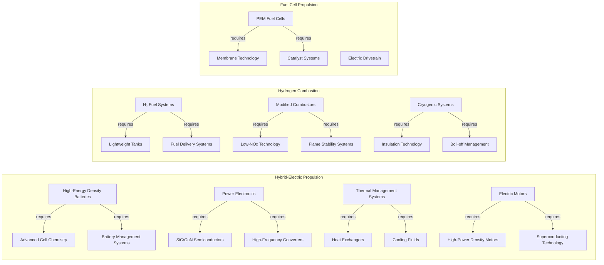

**Figure 3.1:** **Aircraft Propulsion Technology Dependency Map** highlighting hierarchical dependencies between propulsion system configurations and their enabling technologies.

### 3.2 Aircraft Emissions Reduction Pathway

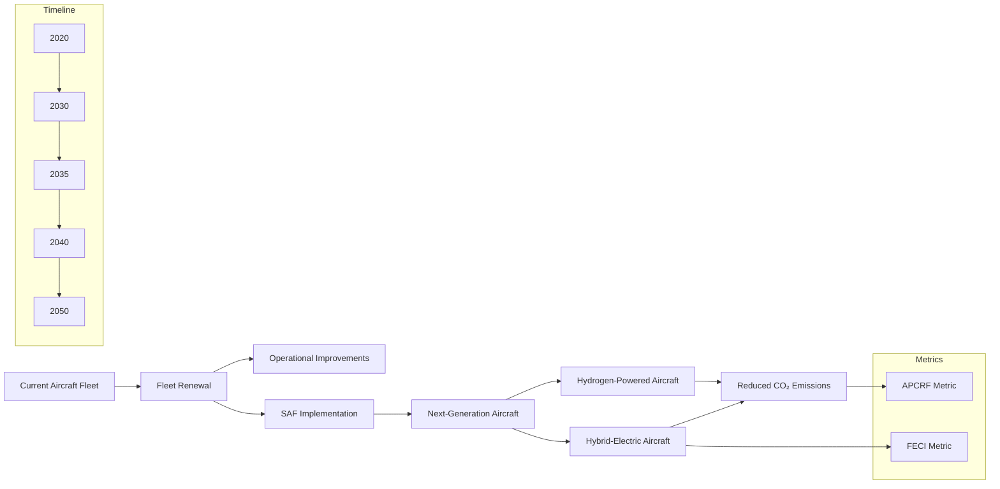

**Figure 3.2:** **Aircraft Emissions Reduction Pathway** illustrating the temporal evolution of aircraft technologies (fleet renewal → next-generation aircraft) and associated emissions savings, with relevant metrics noted.

---

## 4. Ground Operations Relationship Diagrams

### 4.1 Hydrogen Infrastructure System Map

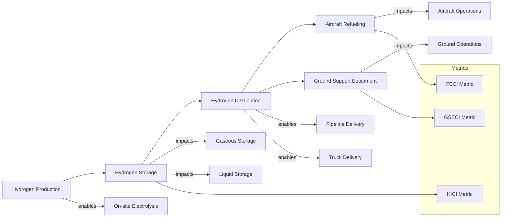

**Figure 4.1:** **Hydrogen Infrastructure System Map** outlining hydrogen production, storage, and distribution for ground operations—along with relevant impact metrics.

### 4.2 Ground Support Equipment Electrification Impact

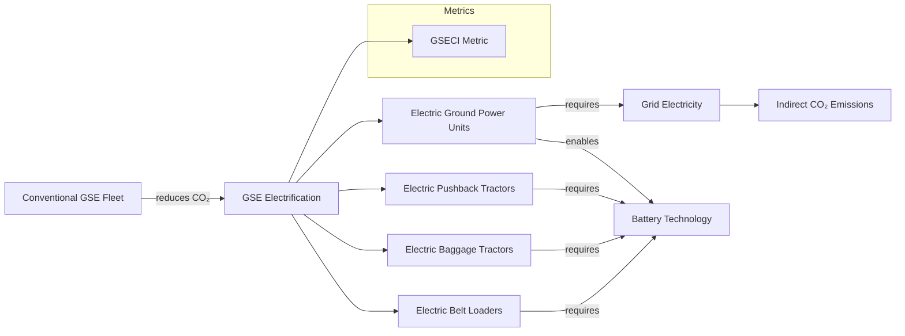

**Figure 4.2:** **Ground Support Equipment Electrification Impact** illustrating the direct emissions reduction from electrification and dependencies on grid electricity and battery technology.

---

## 5. Lifecycle Assessment Relationship Diagrams

### 5.1 Aircraft Lifecycle Carbon Footprint Map

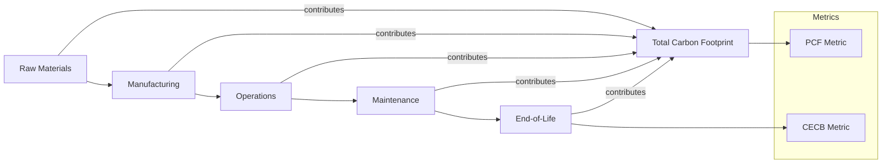

**Figure 5.1:** **Aircraft Lifecycle Carbon Footprint Map** showing major lifecycle phases and their respective contributions to the overall carbon footprint, alongside relevant LCA-based metrics.

### 5.2 Circular Economy Strategies Impact

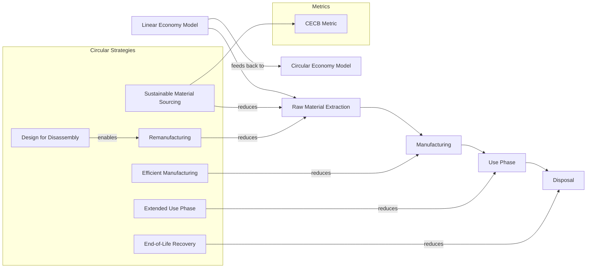

**Figure 5.2:** **Circular Economy Strategies Impact** demonstrating how circular principles (sustainable sourcing, remanufacturing, etc.) can lower overall resource demand and emissions compared to the linear model.

---

## 6. Cross-System Optimization Opportunities

### 6.1 Hydrogen System Integration Optimization

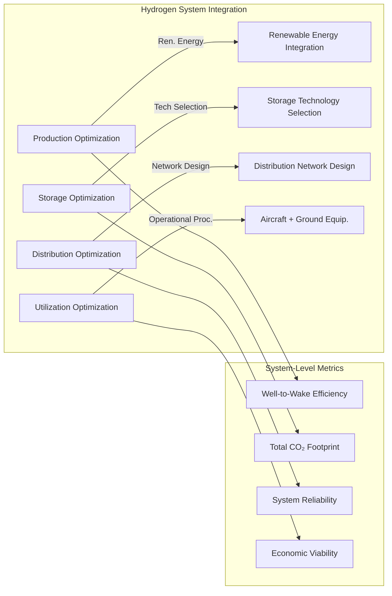

**Figure 6.1:** **Hydrogen System Integration Optimization** illustrating how various optimizations (production, storage, distribution, and utilization) can enhance system-level efficiency and lower CO₂ footprints.

### 6.2 Technology Readiness and Impact Assessment

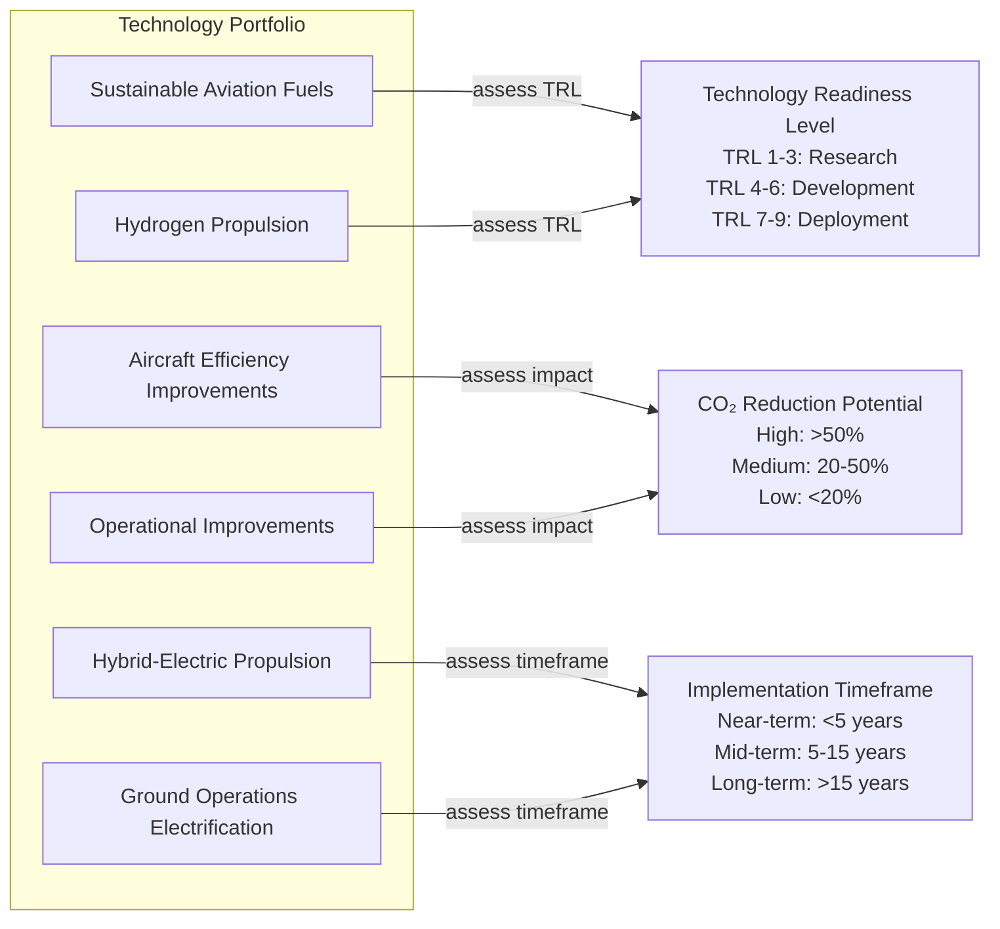

**Figure 6.2:** **Technology Readiness and Impact Assessment** illustrating how different technologies map to readiness level, CO₂ reduction potential, and implementation timeframes—helping prioritize R\&D investments.

---

## 7. Implementation Guidance

### 7.1 Using the Relationship Diagrams

1. **Identify Critical Pathways**
   Trace relationships to find the most effective routes to decarbonization.

2. **Analyze Dependencies**
   Highlight the enabling infrastructure, policies, or R\&D required for each technology.

3. **Assess Trade-offs**
   Weigh potential conflicts (e.g., weight vs. efficiency) or synergies (e.g., electrification + hydrogen).

4. **Support Decision-Making**
   Provide a visual context to guide technology investments, policy development, and operational strategies.

5. **Communicate Complexity**
   Present complex interconnections in an accessible format for diverse stakeholders.

### 7.2 Integration with Metrics

Each diagram aligns with the standardized metrics defined in **\[GP-FD-07-002-SPEC-A]**, ensuring both **qualitative (diagram-based)** and **quantitative (metric-based)** assessment. Key integration points include:

* **Metric Placement**: Where in the diagram a given metric applies (e.g., CO₂ intensity in a propulsion diagram).
* **Impact Quantification**: Diagrams show qualitative cause-and-effect; metrics provide the numerical evaluation.
* **System Boundaries**: Diagram nodes align with the system boundaries in metrics calculations.
* **Data Flow**: Can trace how data are collected for metrics and aggregated into final reports.

### 7.3 Updating Procedures

1. **Regular Review**
   Conduct quarterly reviews to align diagrams with new technologies or policy changes.

2. **Technology Updates**
   Incorporate emergent propulsion systems, fuels, or operational practices.

3. **Metric Alignment**
   Keep diagrams consistent with revised metrics from **\[GP-FD-07-002-SPEC-A]**.

4. **Stakeholder Input**
   Integrate feedback from domain experts and front-line implementers.

5. **Version Control**
   Log all edits and keep a comprehensive change history.

---

## 8. References

1. **International Civil Aviation Organization (ICAO).** (2022). *CORSIA Implementation Elements.*
2. **Air Transport Action Group (ATAG).** (2021). *Waypoint 2050: Balancing Growth in Connectivity with Climate Action.*
3. **Hydrogen Council.** (2022). *Hydrogen Insights Report.*
4. **International Energy Agency (IEA).** (2023). *The Future of Hydrogen.*
5. **Clean Sky 2 Joint Undertaking.** (2020). *Hydrogen-Powered Aviation: A Fact-Based Study.*
6. **European Union Aviation Safety Agency (EASA).** (2022). *European Aviation Environmental Report.*
7. **GAIA Quantum Aerospace.** (2025). *AMPEL Sustainability Assessment Framework.*
8. **Systems Engineering Body of Knowledge (SEBoK).** (2023). *Model-Based Systems Engineering.*

---

## Appendix A: Diagram Source Files

All Mermaid Markdown (.mmd), SVG (.svg), Draw\.io XML (.drawio), and Enterprise Architect (.eap) source files for these diagrams are stored in:

```
/diagrams/GP-FD-07-003/
```

within the **GAIA-CO-ASD-LIB** repository.

## Appendix B: Relationship Notation Reference

| Visual Element          | Meaning                                 | Example                       |
| ----------------------- | --------------------------------------- | ----------------------------- |
| **Solid Arrow (→)**     | Direct causal relationship              | `Technology → Emissions`      |
| **Double Arrow (⇒)**    | Dependency relationship                 | `System ⇒ Component`          |
| **Dashed Arrow (- ->)** | Measurement or classification           | `Metric - -> Parameter`       |
| **Bidirectional (↔)**   | Trade-off or balance                    | `Weight ↔ Performance`        |
| **Box Colors**          | Domain classification                   | \[Section 1.2.3 Color Coding] |
| **Box Shapes**          | Element type (technology, metric, etc.) | \[Section 1.2.2 Node Types]   |

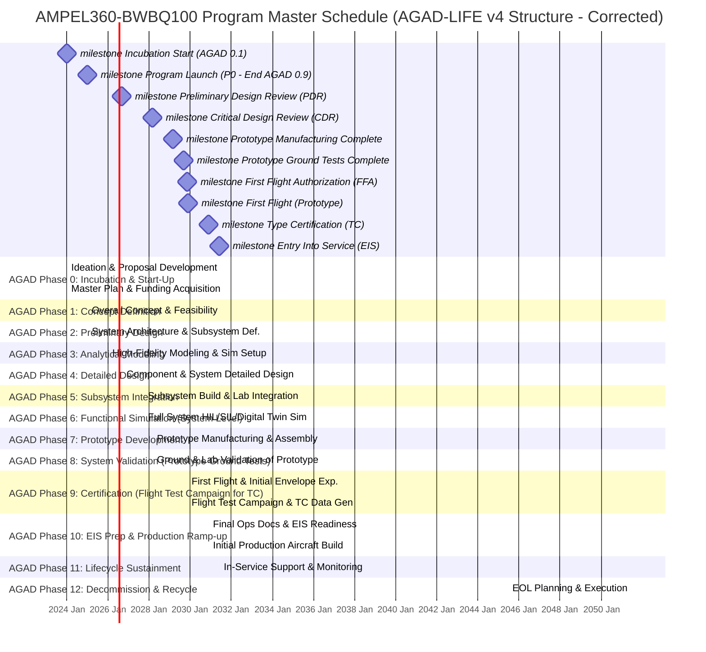


| Fase AGAD | Nombre de Fase Principal  | Nivel TRL | Tipos de datos AGAD-ID registrados (Ejemplos)                                                                                                | Procesos de V&V asociados                                  | Ejemplo de Artefacto V&V (Conceptual)                                                                 |
| :-------- | :------------------------ | :-------- | :------------------------------------------------------------------------------------------------------------------------------------------- | :--------------------------------------------------------- | :---------------------------------------------------------------------------------------------------- |
| AGAD 1/1  | Concept Definition        | 1         | Requisitos de misión iniciales, análisis de mercado, identificación de stakeholders, casos de uso primarios, decisiones de viabilidad conceptual. | Conceptual validation, use-case mapping                    | `VerificationMethod: [UseCaseReview]`, `ValidationReport: mission_concept_review_001.pdf`, `Passed: true`, `Coverage: N/A` |
| AGAD 1/2  | Concept Definition        | 2         | Definición de objetivos de alto nivel, primeras restricciones de diseño, evaluación inicial de tecnologías clave, datos de tendencias.            | Conceptual validation, use-case mapping                    | `VerificationMethod: [FeasibilityStudy]`, `ValidationReport: tech_feasibility_study_001.pdf`, `Passed: true`, `Coverage: N/A` |
| AGAD 1/3  | Concept Definition        | 3         | Refinamiento de requisitos, análisis de alternativas conceptuales, primeras estimaciones de coste/rendimiento, modelado conceptual básico.       | Conceptual validation, use-case mapping                    | `VerificationMethod: [ConceptModelReview]`, `ValidationReport: concept_model_v0.1_review.pdf`, `Passed: true`, `Coverage: N/A` |
| AGAD 1/4  | Concept Definition        | 4         | Selección del concepto base, definición de la arquitectura funcional preliminar, identificación de interfaces críticas.                     | Conceptual validation, use-case mapping                    | `VerificationMethod: [ArchitectureReview]`, `ValidationReport: prelim_arch_review_001.pdf`, `Passed: true`, `Coverage: N/A` |
| AGAD 1/5  | Concept Definition        | 5         | Desarrollo del plan de proyecto, asignación de recursos preliminar, definición del plan de gestión de riesgos conceptual.                   | Conceptual validation, use-case mapping                    | `VerificationMethod: [ProjectPlanReview]`, `ValidationReport: project_plan_v0.1_review.pdf`, `Passed: true`, `Coverage: N/A` |
| AGAD 1/6  | Concept Definition        | 6         | Pruebas de concepto (PoC) para tecnologías críticas, validación de modelos de simulación de bajo nivel, feedback inicial de stakeholders.      | Conceptual validation, use-case mapping                    | `VerificationMethod: [PoC_Demo]`, `ValidationReport: crit_tech_poc_report_001.pdf`, `Passed: true`, `Coverage: N/A` |
| AGAD 1/7  | Concept Definition        | 7         | Demostración del concepto en entorno relevante, validación de interfaces clave, refinamiento de la arquitectura funcional.                  | Conceptual validation, use-case mapping                    | `VerificationMethod: [EnvDemoReview]`, `ValidationReport: concept_env_demo_001.pdf`, `Passed: true`, `Coverage: N/A` |
| AGAD 1/8  | Concept Definition        | 8         | Sistema completo y cualificado a través de pruebas y demostraciones en su entorno operacional final (conceptual).                           | Conceptual validation, use-case mapping                    | `VerificationMethod: [SystemQualificationReview]`, `ValidationReport: system_qual_review_001.pdf`, `Passed: true`, `Coverage: N/A` |
| AGAD 1/9  | Concept Definition        | 9         | Misión conceptual probada con éxito en el entorno operacional (simulado para la fase de concepto).                                          | Conceptual validation, use-case mapping                    | `VerificationMethod: [MissionSuccessReview]`, `ValidationReport: mission_sim_success_001.pdf`, `Passed: true`, `Coverage: N/A` |
| AGAD 2/1  | Preliminary Design        | 1         | Identificación de subsistemas principales, estudios de trade-off de arquitecturas, análisis de riesgos técnicos preliminares.              | Trade-off studies, feasibility checks                      | `VerificationMethod: [TradeStudyReview]`, `ValidationReport: arch_trade_study_001.pdf`, `Passed: true`, `Coverage: N/A` |
| AGAD 2/2  | Preliminary Design        | 2         | Definición de interfaces de subsistemas, selección de tecnologías candidatas, modelos de simulación de subsistemas.                         | Trade-off studies, feasibility checks                      | `VerificationMethod: [InterfaceDefReview]`, `ValidationReport: prelim_interface_def_001.pdf`, `Passed: true`, `Coverage: N/A` |
| AGAD 2/3  | Preliminary Design        | 3         | Especificaciones funcionales de subsistemas, análisis de rendimiento preliminar, identificación de proveedores clave.                       | Trade-off studies, feasibility checks                      | `VerificationMethod: [SubsystemSpecReview]`, `ValidationReport: subsystem_func_spec_001.pdf`, `Passed: true`, `Coverage: N/A` |
| AGAD 2/4  | Preliminary Design        | 4         | Diseño preliminar de componentes críticos, análisis de costes detallado, plan de desarrollo de prototipos.                                  | Trade-off studies, feasibility checks                      | `VerificationMethod: [CriticalCompReview]`, `ValidationReport: crit_comp_design_v0.1.pdf`, `Passed: true`, `Coverage: N/A` |
| AGAD 2/5  | Preliminary Design        | 5         | Prototipado de componentes/subsistemas críticos, pruebas de concepto en laboratorio, validación de modelos de simulación.                  | Trade-off studies, feasibility checks                      | `VerificationMethod: [LabPrototypeTest]`, `ValidationReport: subsystem_poc_lab_report_001.pdf`, `Passed: true`, `Coverage: N/A` |
| AGAD 2/6  | Preliminary Design        | 6         | Demostración de subsistemas en entorno relevante, validación de interfaces, refinamiento del diseño preliminar.                          | Trade-off studies, feasibility checks                      | `VerificationMethod: [SubsystemDemoReview]`, `ValidationReport: subsystem_env_demo_001.pdf`, `Passed: true`, `Coverage: N/A` |
| AGAD 2/7  | Preliminary Design        | 7         | Integración de subsistemas en un prototipo representativo del sistema, pruebas funcionales.                                                | Trade-off studies, feasibility checks                      | `VerificationMethod: [SystemPrototypeTest]`, `ValidationReport: system_prototype_func_test_001.pdf`, `Passed: true`, `Coverage: N/A` |
| AGAD 2/8  | Preliminary Design        | 8         | Sistema completo y cualificado a través de pruebas y demostraciones en su entorno operacional (preliminar).                               | Trade-off studies, feasibility checks                      | `VerificationMethod: [PrelimSystemQualReview]`, `ValidationReport: prelim_system_qual_001.pdf`, `Passed: true`, `Coverage: N/A` |
| AGAD 2/9  | Preliminary Design        | 9         | Misión preliminar probada con éxito en el entorno operacional (con prototipo).                                                              | Trade-off studies, feasibility checks                      | `VerificationMethod: [PrelimMissionSuccess]`, `ValidationReport: prelim_mission_success_001.pdf`, `Passed: true`, `Coverage: N/A` |
| AGAD 3/1  | Analytical Modeling       | 1         | Definición de modelos físicos y matemáticos de alto nivel, identificación de parámetros clave para análisis.                               | Functional simulation, constraints test                    | `VerificationMethod: [ModelDefinitionReview]`, `ValidationReport: analytical_model_def_001.pdf`, `Passed: true`, `Coverage: N/A` |
| AGAD 3/2  | Analytical Modeling       | 2         | Desarrollo de software/scripts para simulación analítica, calibración inicial de modelos.                                                  | Functional simulation, constraints test                    | `VerificationMethod: [SimulationCodeReview]`, `ValidationReport: sim_code_v0.1_review.pdf`, `Passed: true`, `Coverage: N/A` |
| AGAD 3/3  | Analytical Modeling       | 3         | Ejecución de simulaciones funcionales, análisis de sensibilidad de parámetros, validación de restricciones de diseño.                        | Functional simulation, constraints test                    | `VerificationMethod: [SimulationResultsAnalysis]`, `ValidationReport: func_sim_results_001.pdf`, `Passed: true`, `Coverage: N/A` |
| AGAD 3/4  | Analytical Modeling       | 4         | Optimización de diseño basada en modelos analíticos, identificación de puntos críticos de rendimiento.                                    | Functional simulation, constraints test                    | `VerificationMethod: [DesignOptimizationReview]`, `ValidationReport: analytical_opt_report_001.pdf`, `Passed: true`, `Coverage: N/A` |
| AGAD 3/5  | Analytical Modeling       | 5         | Verificación de modelos analíticos con datos experimentales limitados (si disponibles), ajuste de modelos.                                | Functional simulation, constraints test                    | `VerificationMethod: [ModelVerificationData]`, `ValidationReport: model_exp_verification_001.pdf`, `Passed: true`, `Coverage: N/A` |
| AGAD 3/6  | Analytical Modeling       | 6         | Refinamiento de modelos analíticos, análisis de modos de fallo y efectos (FMEA) a nivel conceptual.                                       | Functional simulation, constraints test                    | `VerificationMethod: [FMEA_Review]`, `ValidationReport: conceptual_fmea_report_001.pdf`, `Passed: true`, `Coverage: N/A` |
| AGAD 3/7  | Analytical Modeling       | 7         | Documentación de modelos analíticos y resultados, preparación para diseño detallado.                                                       | Functional simulation, constraints test                    | `VerificationMethod: [DocumentationReview]`, `ValidationReport: analytical_model_docs_001.pdf`, `Passed: true`, `Coverage: N/A` |
| AGAD 3/8  | Analytical Modeling       | 8         | Revisión crítica del diseño analítico, aprobación para proceder a diseño detallado.                                                        | Functional simulation, constraints test                    | `VerificationMethod: [CriticalDesignReview]`, `ValidationReport: analytical_cdr_001.pdf`, `Passed: true`, `Coverage: N/A` |
| AGAD 3/9  | Analytical Modeling       | 9         | Modelos analíticos validados y listos para informar el diseño detallado.                                                                   | Functional simulation, constraints test                    | `VerificationMethod: [FinalModelValidation]`, `ValidationReport: final_analytical_model_validation.pdf`, `Passed: true`, `Coverage: N/A` |
| AGAD 4/1  | Detailed Design           | 1         | Desglose de especificaciones de subsistemas a componentes, definición de interfaces detalladas (ICDs).                                   | Subsystem modeling, interface V&V                          | `VerificationMethod: [RequirementsBreakdownReview]`, `ValidationReport: component_spec_v0.1.pdf`, `Passed: true`, `Coverage: N/A` |
| AGAD 4/2  | Detailed Design           | 2         | Diseño detallado de componentes (CAD, esquemas), selección final de materiales y procesos de fabricación.                                 | Subsystem modeling, interface V&V                          | `VerificationMethod: [CADModelReview]`, `ValidationReport: component_cad_review_001.pdf`, `Passed: true`, `Coverage: N/A` |
| AGAD 4/3  | Detailed Design           | 3         | Análisis detallado de componentes (FEM, CFD, térmico), simulación de rendimiento de componentes.                                          | Subsystem modeling, interface V&V                          | `VerificationMethod: [FEA_CFD_ResultsReview]`, `ValidationReport: component_analysis_report_001.pdf`, `Passed: true`, `Coverage: N/A` |
| AGAD 4/4  | Detailed Design           | 4         | Verificación del diseño de componentes contra especificaciones, creación de BOM detallada.                                                 | Subsystem modeling, interface V&V                          | `VerificationMethod: [DesignVerificationMatrix]`, `ValidationReport: component_design_verif_001.pdf`, `Passed: true`, `Coverage: N/A` |
| AGAD 4/5  | Detailed Design           | 5         | Prototipado y prueba de componentes clave, validación de interfaces de componentes.                                                      | Subsystem modeling, interface V&V                          | `VerificationMethod: [ComponentPrototypeTest]`, `ValidationReport: key_component_test_report_001.pdf`, `Passed: true`, `Coverage: N/A` |
| AGAD 4/6  | Detailed Design           | 6         | Diseño detallado de ensamblajes de subsistemas, planes de integración y prueba de subsistemas.                                            | Subsystem modeling, interface V&V                          | `VerificationMethod: [SubsystemAssemblyReview]`, `ValidationReport: subsystem_assembly_plan_001.pdf`, `Passed: true`, `Coverage: N/A` |
| AGAD 4/7  | Detailed Design           | 7         | Documentación completa del diseño detallado (planos, especificaciones, informes de análisis).                                              | Subsystem modeling, interface V&V                          | `VerificationMethod: [FullDocReview]`, `ValidationReport: detailed_design_doc_package_001.pdf`, `Passed: true`, `Coverage: N/A` |
| AGAD 4/8  | Detailed Design           | 8         | Revisión crítica del diseño detallado (CDR), aprobación para la fabricación e integración.                                               | Subsystem modeling, interface V&V                          | `VerificationMethod: [CriticalDesignReview_Detailed]`, `ValidationReport: detailed_cdr_001.pdf`, `Passed: true`, `Coverage: N/A` |
| AGAD 4/9  | Detailed Design           | 9         | Diseño detallado completo, validado, y congelado para producción/integración.                                                              | Subsystem modeling, interface V&V                          | `VerificationMethod: [DesignFreezeConfirmation]`, `ValidationReport: design_freeze_confirm_001.pdf`, `Passed: true`, `Coverage: N/A` |
| AGAD 5/1  | Subsystem Integration     | 1         | Planificación de la integración de subsistemas, preparación de entornos de prueba, definición de procedimientos de ICD.                  | ICD verification, agent comms test                         | `VerificationMethod: [IntegrationPlanReview]`, `ValidationReport: subsystem_integ_plan_001.pdf`, `Passed: true`, `Coverage: N/A` |
| AGAD 5/2  | Subsystem Integration     | 2         | Fabricación/adquisición de componentes de subsistemas, inspección de calidad de entrada.                                                 | ICD verification, agent comms test                         | `VerificationMethod: [IncomingInspection]`, `ValidationReport: component_qc_pass_001.pdf`, `Passed: true`, `Coverage: N/A` |
| AGAD 5/3  | Subsystem Integration     | 3         | Ensamblaje de subsistemas, pruebas funcionales iniciales de subsistemas individuales.                                                    | ICD verification, agent comms test                         | `VerificationMethod: [SubsystemFunctionalTest]`, `ValidationReport: subsystem_func_test_report_001.pdf`, `Passed: true`, `Coverage: N/A` |
| AGAD 5/4  | Subsystem Integration     | 4         | Integración de subsistemas según ICDs, verificación de interfaces físicas y lógicas.                                                     | ICD verification, agent comms test                         | `VerificationMethod: [ICD_Verification]`, `ValidationReport: interface_verif_report_001.pdf`, `Passed: true`, `Coverage: N/A` |
| AGAD 5/5  | Subsystem Integration     | 5         | Pruebas de comunicación entre agentes/módulos de subsistemas, validación de flujo de datos.                                               | ICD verification, agent comms test                         | `VerificationMethod: [AgentCommsTest]`, `ValidationReport: agent_comms_test_report_001.pdf`, `Passed: true`, `Coverage: N/A` |
| AGAD 5/6  | Subsystem Integration     | 6         | Pruebas de rendimiento de subsistemas integrados, validación en entorno de laboratorio representativo.                                    | ICD verification, agent comms test                         | `VerificationMethod: [IntegratedSubsystemTest]`, `ValidationReport: integ_subsystem_perf_001.pdf`, `Passed: true`, `Coverage: N/A` |
| AGAD 5/7  | Subsystem Integration     | 7         | Documentación de resultados de integración y pruebas de subsistemas, identificación de problemas y acciones correctivas.                 | ICD verification, agent comms test                         | `VerificationMethod: [TestReportReview]`, `ValidationReport: subsystem_integ_final_report_001.pdf`, `Passed: true`, `Coverage: N/A` |
| AGAD 5/8  | Subsystem Integration     | 8         | Revisión de la integración de subsistemas, aprobación para la integración a nivel de sistema.                                              | ICD verification, agent comms test                         | `VerificationMethod: [SubsystemIntegReview]`, `ValidationReport: subsystem_integ_approval_001.pdf`, `Passed: true`, `Coverage: N/A` |
| AGAD 5/9  | Subsystem Integration     | 9         | Subsistemas integrados y validados, listos para la integración a nivel de sistema completo.                                                | ICD verification, agent comms test                         | `VerificationMethod: [SubsystemValidationComplete]`, `ValidationReport: subsystem_validation_complete_001.pdf`, `Passed: true`, `Coverage: N/A` |
| AGAD 6/1  | Functional Simulation     | 1         | Definición de escenarios de simulación funcional completa del sistema, configuración de modelos HIL/SIL/VIL.                             | HIL/SIL/VIL validation, quantum stubs                      | `VerificationMethod: [SimulationScenarioReview]`, `ValidationReport: full_sim_scenario_def_001.pdf`, `Passed: true`, `Coverage: N/A` |
| AGAD 6/2  | Functional Simulation     | 2         | Integración de stubs cuánticos y modelos de IA en el entorno de simulación.                                                              | HIL/SIL/VIL validation, quantum stubs                      | `VerificationMethod: [StubIntegrationTest]`, `ValidationReport: quantum_ai_stub_integ_001.pdf`, `Passed: true`, `Coverage: N/A` |
| AGAD 6/3  | Functional Simulation     | 3         | Ejecución de simulaciones funcionales completas, recolección de datos de rendimiento.                                                      | HIL/SIL/VIL validation, quantum stubs                      | `VerificationMethod: [SimulationExecutionLog]`, `ValidationReport: full_system_sim_run_001.log`, `Passed: true`, `Coverage: N/A` |
| AGAD 6/4  | Functional Simulation     | 4         | Análisis de resultados de simulación, comparación con requisitos y modelos analíticos.                                                   | HIL/SIL/VIL validation, quantum stubs                      | `VerificationMethod: [ResultsAnalysis]`, `ValidationReport: sim_results_vs_reqs_001.pdf`, `Passed: true`, `Coverage: N/A` |
| AGAD 6/5  | Functional Simulation     | 5         | Validación de HIL/SIL/VIL, identificación de discrepancias y necesidad de ajustes en diseño o modelos.                                  | HIL/SIL/VIL validation, quantum stubs                      | `VerificationMethod: [HIL_SIL_VIL_Validation]`, `ValidationReport: hil_sil_vil_validation_report_001.pdf`, `Passed: true`, `Coverage: N/A` |
| AGAD 6/6  | Functional Simulation     | 6         | Iteración de simulaciones con ajustes, optimización del rendimiento del sistema en simulación.                                           | HIL/SIL/VIL validation, quantum stubs                      | `VerificationMethod: [IterativeSimReview]`, `ValidationReport: optimized_sim_run_002.log`, `Passed: true`, `Coverage: N/A` |
| AGAD 6/7  | Functional Simulation     | 7         | Documentación de la validación funcional completa a través de simulación.                                                                | HIL/SIL/VIL validation, quantum stubs                      | `VerificationMethod: [DocumentationReview]`, `ValidationReport: functional_sim_validation_docs_001.pdf`, `Passed: true`, `Coverage: N/A` |
| AGAD 6/8  | Functional Simulation     | 8         | Revisión de la validación funcional, aprobación para la realización del prototipo completo.                                                 | HIL/SIL/VIL validation, quantum stubs                      | `VerificationMethod: [FunctionalValidationReview]`, `ValidationReport: func_val_approval_001.pdf`, `Passed: true`, `Coverage: N/A` |
| AGAD 6/9  | Functional Simulation     | 9         | Sistema funcionalmente validado en simulación, listo para prototipado físico completo.                                                   | HIL/SIL/VIL validation, quantum stubs                      | `VerificationMethod: [SimValidationComplete]`, `ValidationReport: sim_validation_complete_001.pdf`, `Passed: true`, `Coverage: N/A` |
| AGAD 7/1  | Prototype Development     | 1         | Plan de fabricación del prototipo completo, adquisición de materiales, preparación de utillaje.                                          | Lab tests, prototype V&V procedures                        | `VerificationMethod: [ManufacturingPlanReview]`, `ValidationReport: prototype_mfg_plan_001.pdf`, `Passed: true`, `Coverage: N/A` |
| AGAD 7/2  | Prototype Development     | 2         | Fabricación y ensamblaje de los componentes y subsistemas del prototipo.                                                                  | Lab tests, prototype V&V procedures                        | `VerificationMethod: [AssemblyInspection]`, `ValidationReport: prototype_assembly_qc_001.pdf`, `Passed: true`, `Coverage: N/A` |
| AGAD 7/3  | Prototype Development     | 3         | Integración del prototipo completo, primeras pruebas de encendido y funcionales básicas.                                                  | Lab tests, prototype V&V procedures                        | `VerificationMethod: [PowerOnTest]`, `ValidationReport: prototype_power_on_test_001.pdf`, `Passed: true`, `Coverage: N/A` |
| AGAD 7/4  | Prototype Development     | 4         | Ejecución de planes de prueba de V&V en laboratorio sobre el prototipo, recolección de datos.                                              | Lab tests, prototype V&V procedures                        | `VerificationMethod: [LabTestExecution]`, `ValidationReport: prototype_lab_test_data_001.csv`, `Passed: true`, `Coverage: N/A` |
| AGAD 7/5  | Prototype Development     | 5         | Análisis de resultados de pruebas de laboratorio, comparación con simulaciones y requisitos.                                             | Lab tests, prototype V&V procedures                        | `VerificationMethod: [LabTestAnalysis]`, `ValidationReport: lab_test_analysis_001.pdf`, `Passed: true`, `Coverage: N/A` |
| AGAD 7/6  | Prototype Development     | 6         | Identificación y corrección de desviaciones en el prototipo, iteración de pruebas si es necesario.                                       | Lab tests, prototype V&V procedures                        | `VerificationMethod: [CorrectiveActionReview]`, `ValidationReport: prototype_fixes_retest_001.pdf`, `Passed: true`, `Coverage: N/A` |
| AGAD 7/7  | Prototype Development     | 7         | Documentación completa de la realización y pruebas del prototipo.                                                                         | Lab tests, prototype V&V procedures                        | `VerificationMethod: [DocumentationReview]`, `ValidationReport: prototype_realization_docs_001.pdf`, `Passed: true`, `Coverage: N/A` |
| AGAD 7/8  | Prototype Development     | 8         | Revisión del prototipo y resultados de pruebas, aprobación para pruebas de validación a nivel de sistema.                               | Lab tests, prototype V&V procedures                        | `VerificationMethod: [PrototypeReview]`, `ValidationReport: prototype_review_approval_001.pdf`, `Passed: true`, `Coverage: N/A` |
| AGAD 7/9  | Prototype Development     | 9         | Prototipo completo, funcional y probado en laboratorio, listo para validación de sistema.                                                | Lab tests, prototype V&V procedures                        | `VerificationMethod: [PrototypeComplete]`, `ValidationReport: prototype_complete_validation_001.pdf`, `Passed: true`, `Coverage: N/A` |
| AGAD 8/1  | System Validation         | 1         | Plan de validación a nivel de sistema, incluyendo escenarios operativos y ambientales.                                                     | System-level verification, audits                          | `VerificationMethod: [SystemValidationPlanReview]`, `ValidationReport: system_val_plan_001.pdf`, `Passed: true`, `Coverage: N/A` |
| AGAD 8/2  | System Validation         | 2         | Preparación del prototipo y entorno de prueba para validación de sistema (puede incluir pruebas en tierra, cámaras ambientales).           | System-level verification, audits                          | `VerificationMethod: [TestReadinessReview]`, `ValidationReport: sys_val_readiness_001.pdf`, `Passed: true`, `Coverage: N/A` |
| AGAD 8/3  | System Validation         | 3         | Ejecución de pruebas de validación del sistema, recolección de datos de rendimiento y fiabilidad.                                        | System-level verification, audits                          | `VerificationMethod: [SystemTestExecution]`, `ValidationReport: system_val_test_data_001.csv`, `Passed: true`, `Coverage: N/A` |
| AGAD 8/4  | System Validation         | 4         | Análisis de resultados de validación del sistema, verificación de cumplimiento de todos los requisitos.                                 | System-level verification, audits                          | `VerificationMethod: [ResultsComplianceAnalysis]`, `ValidationReport: system_val_compliance_001.pdf`, `Passed: true`, `Coverage: N/A` |
| AGAD 8/5  | System Validation         | 5         | Auditorías internas del sistema y procesos de desarrollo, verificación de documentación.                                                   | System-level verification, audits                          | `VerificationMethod: [InternalAudit]`, `ValidationReport: internal_audit_report_001.pdf`, `Passed: true`, `Coverage: N/A` |
| AGAD 8/6  | System Validation         | 6         | Identificación de no conformidades, implementación de acciones correctivas y preventivas (CAPA).                                       | System-level verification, audits                          | `VerificationMethod: [CAPAReview]`, `ValidationReport: capa_log_001.pdf`, `Passed: true`, `Coverage: N/A` |
| AGAD 8/7  | System Validation         | 7         | Documentación de la validación completa del sistema, preparación para la preparación de vuelo/certificación.                               | System-level verification, audits                          | `VerificationMethod: [DocumentationReview]`, `ValidationReport: system_validation_docs_001.pdf`, `Passed: true`, `Coverage: N/A` |
| AGAD 8/8  | System Validation         | 8         | Revisión de la validación del sistema, aprobación de la madurez del sistema para el siguiente paso.                                      | System-level verification, audits                          | `VerificationMethod: [SystemValidationGateReview]`, `ValidationReport: system_val_gate_approval_001.pdf`, `Passed: true`, `Coverage: N/A` |
| AGAD 8/9  | System Validation         | 9         | Sistema completamente validado en entorno representativo, listo para pruebas de preparación de vuelo y certificación.                        | System-level verification, audits                          | `VerificationMethod: [SystemValidationComplete]`, `ValidationReport: system_validation_final_001.pdf`, `Passed: true`, `Coverage: N/A` |
| AGAD 9/1  | Certification             | 1         | Preparación del paquete de certificación para autoridades (EASA, FAA), incluyendo toda la documentación de V&V.                         | Regulatory conformance, documentation                      | `VerificationMethod: [CertificationPackageAudit]`, `ValidationReport: cert_package_submission_001.zip`, `Passed: true`, `Coverage: N/A` |
| AGAD 9/2  | Certification             | 2         | Pruebas de conformidad en tierra con presencia de autoridades certificadoras.                                                            | Regulatory conformance, documentation                      | `VerificationMethod: [GroundConformityTest]`, `ValidationReport: ground_conformity_witness_001.pdf`, `Passed: true`, `Coverage: N/A` |
| AGAD 9/3  | Certification             | 3         | Pruebas de vuelo de certificación, recolección de datos de vuelo para conformidad.                                                       | Regulatory conformance, documentation                      | `VerificationMethod: [CertificationFlightTest]`, `ValidationReport: cert_flight_test_data_001.csv`, `Passed: true`, `Coverage: N/A` |
| AGAD 9/4  | Certification             | 4         | Análisis de datos de pruebas de certificación, demostración de cumplimiento de todos los requisitos regulatorios.                            | Regulatory conformance, documentation                      | `VerificationMethod: [DataAnalysisForCompliance]`, `ValidationReport: cert_compliance_report_001.pdf`, `Passed: true`, `Coverage: N/A` |
| AGAD 9/5  | Certification             | 5         | Interacción con autoridades certificadoras, respuesta a hallazgos y solicitudes de información adicional.                                | Regulatory conformance, documentation                      | `VerificationMethod: [RegulatoryInteractionLog]`, `ValidationReport: authority_correspondence_001.log`, `Passed: true`, `Coverage: N/A` |
| AGAD 9/6  | Certification             | 6         | Implementación de correcciones o modificaciones requeridas por las autoridades.                                                          | Regulatory conformance, documentation                      | `VerificationMethod: [ModificationCompliance]`, `ValidationReport: cert_mod_compliance_001.pdf`, `Passed: true`, `Coverage: N/A` |
| AGAD 9/7  | Certification             | 7         | Obtención del Certificado de Tipo (TC) o autorización equivalente.                                                                        | Regulatory conformance, documentation                      | `VerificationMethod: [TypeCertificateReceipt]`, `ValidationReport: type_certificate_scan.pdf`, `Passed: true`, `Coverage: N/A` |
| AGAD 9/8  | Certification             | 8         | Preparación de la documentación final para la producción y entrada en servicio.                                                            | Regulatory conformance, documentation                      | `VerificationMethod: [ProductionDocReview]`, `ValidationReport: final_production_docs_001.pdf`, `Passed: true`, `Coverage: N/A` |
| AGAD 9/9  | Certification             | 9         | Aeronave certificada y lista para la producción en serie y despliegue operacional.                                                       | Regulatory conformance, documentation                      | `VerificationMethod: [CertificationComplete]`, `ValidationReport: full_certification_summary_001.pdf`, `Passed: true`, `Coverage: N/A` |
| AGAD 10/1 | Operational Use           | 1         | Planificación de la entrada en servicio, preparación de la infraestructura de soporte y personal.                                       | Operational V&V, user feedback loop                        | `VerificationMethod: [EntryIntoServicePlanReview]`, `ValidationReport: eis_plan_001.pdf`, `Passed: true`, `Coverage: N/A` |
| AGAD 10/2 | Operational Use           | 2         | Entrega de las primeras aeronaves, entrenamiento de tripulaciones y personal de tierra.                                                  | Operational V&V, user feedback loop                        | `VerificationMethod: [DeliveryAcceptance]`, `ValidationReport: aircraft_delivery_acceptance_001.pdf`, `Passed: true`, `Coverage: N/A` |
| AGAD 10/3 | Operational Use           | 3         | Primeros vuelos operacionales, recolección de datos de rendimiento en servicio y fiabilidad.                                             | Operational V&V, user feedback loop                        | `VerificationMethod: [InitialOpDataCollection]`, `ValidationReport: initial_op_data_001.csv`, `Passed: true`, `Coverage: N/A` |
| AGAD 10/4 | Operational Use           | 4         | Monitoreo continuo del rendimiento operacional, comparación con predicciones y especificaciones.                                        | Operational V&V, user feedback loop                        | `VerificationMethod: [PerformanceMonitoring]`, `ValidationReport: quarterly_op_perf_report_001.pdf`, `Passed: true`, `Coverage: N/A` |
| AGAD 10/5 | Operational Use           | 5         | Recolección y análisis del feedback de los usuarios (tripulaciones, mantenimiento, pasajeros).                                           | Operational V&V, user feedback loop                        | `VerificationMethod: [UserFeedbackAnalysis]`, `ValidationReport: user_feedback_summary_001.pdf`, `Passed: true`, `Coverage: N/A` |
| AGAD 10/6 | Operational Use           | 6         | Implementación de mejoras menores y actualizaciones basadas en la experiencia operacional.                                                | Operational V&V, user feedback loop                        | `VerificationMethod: [ServiceBulletinCompliance]`, `ValidationReport: service_bulletin_imp_001.pdf`, `Passed: true`, `Coverage: N/A` |
| AGAD 10/7 | Operational Use           | 7         | Auditorías operacionales y de seguridad, verificación de la conformidad continua.                                                         | Operational V&V, user feedback loop                        | `VerificationMethod: [OperationalAudit]`, `ValidationReport: operational_safety_audit_001.pdf`, `Passed: true`, `Coverage: N/A` |
| AGAD 10/8 | Operational Use           | 8         | Optimización de los procedimientos de mantenimiento y operación basados en datos en servicio.                                              | Operational V&V, user feedback loop                        | `VerificationMethod: [ProcedureOptimizationReview]`, `ValidationReport: optimized_sop_maint_001.pdf`, `Passed: true`, `Coverage: N/A` |
| AGAD 10/9 | Operational Use           | 9         | Operación estable y madura, con procesos de mejora continua establecidos y datos alimentando el Digital Twin.                              | Operational V&V, user feedback loop                        | `VerificationMethod: [MatureOpsReview]`, `ValidationReport: mature_ops_performance_review_001.pdf`, `Passed: true`, `Coverage: N/A` |
| AGAD 11/1 | Lifecycle Sustainment     | 1         | Establecimiento del plan de soporte a largo plazo, gestión de obsolescencia, cadena de suministro de repuestos.                           | Evolutionary V&V, twin alignment                           | `VerificationMethod: [LongTermSupportPlanReview]`, `ValidationReport: ltsp_v1.0.pdf`, `Passed: true`, `Coverage: N/A` |
| AGAD 11/2 | Lifecycle Sustainment     | 2         | Monitoreo continuo de la salud de la flota mediante Digital Twin y AGAD-ID, predicción de RUL.                                          | Evolutionary V&V, twin alignment                           | `VerificationMethod: [FleetHealthMonitoring]`, `ValidationReport: fleet_rul_prediction_accuracy_001.pdf`, `Passed: true`, `Coverage: N/A` |
| AGAD 11/3 | Lifecycle Sustainment     | 3         | Implementación de programas de mantenimiento predictivo y basado en condición (CBM).                                                      | Evolutionary V&V, twin alignment                           | `VerificationMethod: [CBM_EffectivenessReview]`, `ValidationReport: cbm_program_effectiveness_001.pdf`, `Passed: true`, `Coverage: N/A` |
| AGAD 11/4 | Lifecycle Sustainment     | 4         | Planificación e implementación de actualizaciones mayores y programas de modernización.                                                    | Evolutionary V&V, twin alignment                           | `VerificationMethod: [UpgradeProgramValidation]`, `ValidationReport: upgrade_package_vv_001.pdf`, `Passed: true`, `Coverage: N/A` |
| AGAD 11/5 | Lifecycle Sustainment     | 5         | Gestión de la configuración de la flota a lo largo del tiempo, mantenimiento de la trazabilidad.                                         | Evolutionary V&V, twin alignment                           | `VerificationMethod: [ConfigAudit]`, `ValidationReport: fleet_config_audit_001.pdf`, `Passed: true`, `Coverage: N/A` |
| AGAD 11/6 | Lifecycle Sustainment     | 6         | Alineación continua del Digital Twin con el estado físico de la flota, calibración de modelos.                                           | Evolutionary V&V, twin alignment                           | `VerificationMethod: [DigitalTwinAlignmentCheck]`, `ValidationReport: dt_alignment_accuracy_001.pdf`, `Passed: true`, `Coverage: N/A` |
| AGAD 11/7 | Lifecycle Sustainment     | 7         | Optimización de costes de ciclo de vida, análisis de rentabilidad del soporte.                                                          | Evolutionary V&V, twin alignment                           | `VerificationMethod: [LCC_AnalysisReview]`, `ValidationReport: lifecycle_cost_optimization_report_001.pdf`, `Passed: true`, `Coverage: N/A` |
| AGAD 11/8 | Lifecycle Sustainment     | 8         | Planificación para el final de la vida útil (EOL) de la flota y componentes individuales.                                                | Evolutionary V&V, twin alignment                           | `VerificationMethod: [EOL_PlanReview]`, `ValidationReport: end_of_life_plan_v1.0.pdf`, `Passed: true`, `Coverage: N/A` |
| AGAD 11/9 | Lifecycle Sustainment     | 9         | Sistema de sostenimiento maduro y optimizado, con procesos robustos para la gestión de toda la vida útil de la flota.                      | Evolutionary V&V, twin alignment                           | `VerificationMethod: [SustainmentProgramReview]`, `ValidationReport: sustainment_program_effectiveness_final.pdf`, `Passed: true`, `Coverage: N/A` |
| AGAD 12/1 | Decommission & Recycle    | 1         | Desarrollo del plan detallado de desmantelamiento y reciclaje para la aeronave y sus componentes.                                        | End-of-life V&V, material traceability audits             | `VerificationMethod: [DecomPlanReview]`, `ValidationReport: decom_recycle_plan_v1.0.pdf`, `Passed: true`, `Coverage: N/A` |
| AGAD 12/2 | Decommission & Recycle    | 2         | Identificación y cualificación de socios para el desmantelamiento y reciclaje, establecimiento de la cadena logística inversa.            | End-of-life V&V, material traceability audits             | `VerificationMethod: [PartnerAudit]`, `ValidationReport: recycling_partner_audit_001.pdf`, `Passed: true`, `Coverage: N/A` |
| AGAD 12/3 | Decommission & Recycle    | 3         | Procedimientos de desmantelamiento seguro, incluyendo la neutralización de materiales peligrosos y sistemas cuánticos.                    | End-of-life V&V, material traceability audits             | `VerificationMethod: [SafeDecomProcedureReview]`, `ValidationReport: safe_decom_proc_001.pdf`, `Passed: true`, `Coverage: N/A` |
| AGAD 12/4 | Decommission & Recycle    | 4         | Segregación de materiales para reciclaje, reutilización o disposición final, maximizando la recuperación de valor.                         | End-of-life V&V, material traceability audits             | `VerificationMethod: [MaterialSegregationAudit]`, `ValidationReport: material_recovery_rate_001.pdf`, `Passed: true`, `Coverage: N/A` |
| AGAD 12/5 | Decommission & Recycle    | 5         | Auditorías de trazabilidad de materiales reciclados y componentes reutilizados, asegurando el cumplimiento de objetivos de circularidad.  | End-of-life V&V, material traceability audits             | `VerificationMethod: [TraceabilityAudit]`, `ValidationReport: material_traceability_audit_001.pdf`, `Passed: true`, `Coverage: N/A` |
| AGAD 12/6 | Decommission & Recycle    | 6         | Documentación del proceso de fin de vida, incluyendo informes de impacto ambiental y recuperación de materiales.                         | End-of-life V&V, material traceability audits             | `VerificationMethod: [EOL_ReportReview]`, `ValidationReport: eol_impact_report_001.pdf`, `Passed: true`, `Coverage: N/A` |
| AGAD 12/7 | Decommission & Recycle    | 7         | Verificación del cumplimiento de todos los requisitos regulatorios y de sostenibilidad para el fin de vida.                               | End-of-life V&V, material traceability audits             | `VerificationMethod: [RegulatoryComplianceEOL]`, `ValidationReport: eol_regulatory_compliance_001.pdf`, `Passed: true`, `Coverage: N/A` |
| AGAD 12/8 | Decommission & Recycle    | 8         | Feedback del proceso de fin de vida para informar el diseño de futuras aeronaves (Diseño para Desmantelamiento/Reciclaje).             | End-of-life V&V, material traceability audits             | `VerificationMethod: [DesignFeedbackLoopReview]`, `ValidationReport: design_for_decom_lessons_learned_001.pdf`, `Passed: true`, `Coverage: N/A` |
| AGAD 12/9 | Decommission & Recycle    | 9         | Proceso de desmantelamiento y reciclaje completado y documentado, con lecciones aprendidas integradas para la mejora continua.           | End-of-life V&V, material traceability audits             | `VerificationMethod: [EOL_ProcessCompleteReview]`, `ValidationReport: eol_process_final_review_001.pdf`, `Passed: true`, `Coverage: N/A` |>

</body>
</html>
```

</body>
</html>


```

---

## 🧪 Live Preview (GitHub Pages)

To deploy this page via GitHub Pages:

1. Push content to `main` branch of your repo.
2. Go to **Settings → Pages**.
3. Set **Source** to `main` branch and root (`/`).
4. Your page will be available at:
```

https\://<your-org>.github.io/<repo-name>/

````

---

## ⚙️ Local Deployment (Docker or Python)

### Option A: Python HTTP Server

```bash
cd GAIA-QAO-Web-Landing
python3 -m http.server 8080
````

Then visit: [http://localhost:8080](http://localhost:8080)

### Option B: NGINX Docker Container

```bash
docker run -d -p 8080:80 \
  -v $(pwd)/GAIA-QAO-Web-Landing:/usr/share/nginx/html \
  nginx
```

---

## 📡 AGAD-10/1 Live Status Feed

This page includes a section that fetches the system status for **AGAD Phase 10/1** using a standard MCP JSON interface:

```javascript
fetch('https://mcp.gaiaqao.space/status/AGAD-10/1')
```

If the endpoint is not available, mock data is displayed with a soft fallback warning color.

---

## 🧠 AMP●EL Integration (Optional)

You may optionally include AMP●EL intent snapshots using:

```html
<pre id="ampel-preview"></pre>

<script>
fetch('https://mcp.gaiaqao.space/agents/AGAD-10-1/intent.yaml')
  .then(res => res.text())
  .then(text => {
    document.getElementById('ampel-preview').textContent = text;
  })
  .catch(() => {
    document.getElementById('ampel-preview').textContent = '# AMP●EL data unavailable.';
  });
</script>
```

---

## 🔐 Internal Use Notice

> This landing may contain internal-only data. Make sure you’ve set proper access controls if hosted publicly.

---

## 📬 Contact & Governance

For contributions, structure updates or coordination, please reach out to:

* `@Project-Managment-Governance`
* `@Gaia-QAO-Core-MCP`

---

© 2025 GAIA-QAO — All rights reserved. Quantum-augmented aerospace begins here.

### ICY Code Training Module

> **DISCLAIMER: GenAI Proposal Status**This document was generated with AI assistance and represents a proposed training module for ICY code implementation for GAIA Quantum Aerospace Organization (GAIA-QAO). The content is subject to review, modification, and approval by authorized stakeholders.


# ICY Code Training Module

## For Engineering and Maintenance Personnel


**Version 1.0****GAIA Quantum Aerospace Organization****AMPEL BWB Quantum Embarked Project**

---

## Table of Contents

1. [Introduction](#1-introduction)
2. [ICY Code Fundamentals](#2-icy-code-fundamentals)
3. [Expanded ICY Code System](#3-expanded-icy-code-system)
4. [ICY Code Selection Process](#4-icy-code-selection-process)
5. [Documentation Requirements](#5-documentation-requirements)
6. [Implementation Procedures](#6-implementation-procedures)
7. [Verification Process](#7-verification-process)
8. [Case Studies](#8-case-studies)
9. [Practical Exercises](#9-practical-exercises)
10. [Assessment and Certification](#10-assessment-and-certification)
11. [References and Resources](#11-references-and-resources)


---

## 1. Introduction

### 1.1 Purpose of This Training

This training module is designed to provide engineering and maintenance personnel with the knowledge and skills necessary to effectively implement and verify the expanded Interchangeability (ICY) codes system for the AMPEL BWB Quantum Embarked aircraft project. By the end of this training, you will be able to:

- Understand the purpose and importance of ICY codes
- Navigate the expanded ICY codes system
- Select appropriate ICY codes using the decision flowchart
- Document ICY code assignments properly
- Implement and verify ICY code requirements
- Troubleshoot common ICY code issues


### 1.2 Why ICY Codes Matter

Interchangeability codes are critical for aerospace safety, maintenance efficiency, and regulatory compliance. For the AMPEL BWB Quantum Embarked aircraft, with its revolutionary integration of conventional, quantum, and sustainable technologies, proper interchangeability management is even more crucial.

**Key Benefits of the ICY Codes System:**

- **Safety Assurance**: Prevents installation of incompatible components that could compromise safety
- **Maintenance Efficiency**: Reduces maintenance time by clearly defining which parts can replace others
- **Cost Reduction**: Prevents costly errors and optimizes inventory management
- **Configuration Control**: Maintains airworthiness across technology domains
- **Regulatory Compliance**: Ensures compliance with certification requirements
- **Knowledge Management**: Preserves critical engineering decisions about part interchangeability


### 1.3 Training Overview

This training module consists of:

- **Theoretical Sections**: Understanding ICY codes and their application
- **Practical Exercises**: Hands-on application of ICY code knowledge
- **Case Studies**: Real-world examples of ICY code implementation
- **Assessment**: Evaluation of your understanding and ability to apply ICY codes


The training is designed to be completed in approximately 8 hours, divided into multiple sessions. Each section includes knowledge checks to reinforce learning.

---

## 2. ICY Code Fundamentals

### 2.1 What Are ICY Codes?

Interchangeability (ICY) codes are standardized identifiers that define the relationship between parts, assemblies, and components, specifying whether and under what conditions they can replace one another.

**ICY Code Structure:**

Each ICY code consists of a three-digit identifier:

- **First Digit**: Indicates the interchangeability category
- **Second Digit**: Specifies the interchangeability condition
- **Third Digit**: Defines the implementation requirements


### 2.2 Historical Context

Traditional aerospace ICY codes were developed to manage interchangeability in conventional aircraft systems. However, as aerospace technology has evolved, so has the need for more sophisticated interchangeability management.

**Evolution of ICY Codes:**

1. **First Generation (1960s-1970s)**: Basic interchangeable/not interchangeable designations
2. **Second Generation (1980s-1990s)**: Added conditional interchangeability
3. **Third Generation (2000s-2010s)**: Expanded to include one-way and partial interchangeability
4. **Fourth Generation (Current)**: Comprehensive system including quantum and sustainable technologies


### 2.3 Regulatory Framework

ICY codes are governed by several regulatory frameworks:

- **FAA Advisory Circular AC 20-62E**: Eligibility, Quality, and Identification of Aeronautical Replacement Parts
- **EASA Part 21**: Certification of Aircraft and Related Products, Parts and Appliances
- **AS9100D**: Quality Management Systems - Requirements for Aviation, Space, and Defense Organizations
- **GAIA-QAO Standards**: Internal standards specific to GAIA Quantum Aerospace Organization


### 2.4 Knowledge Check

1. What does each digit in an ICY code represent?
2. Why are ICY codes particularly important for the AMPEL BWB project?
3. What regulatory frameworks govern ICY codes?


---

## 3. Expanded ICY Code System

### 3.1 Overview of the Expanded System

The expanded ICY codes system extends beyond traditional aerospace interchangeability to address the unique requirements of quantum computing integration and sustainable technologies.

**The Three Domains:**

1. **Conventional Systems (100-699)**: Traditional aerospace components
2. **Quantum Systems (700-799)**: Quantum computing and sensing components
3. **Sustainable Systems (800-899)**: Sustainable materials and technologies


### 3.2 Conventional ICY Codes (100-699)

The conventional ICY codes are organized into six categories:

1. **Complete Interchangeability (100-199)**: Parts that are fully interchangeable
2. **Conditional Interchangeability (200-299)**: Parts interchangeable under specific conditions
3. **One-Way Interchangeability (300-399)**: Newer part can replace older part, but not vice versa
4. **Partial Interchangeability (400-499)**: Parts share some but not all functions
5. **Assembly Interchangeability (500-599)**: Complete assemblies are interchangeable
6. **Non-Interchangeability (600-699)**: Parts cannot be substituted


**Example: Conditional Interchangeability**

| Code | Description | Application | Example
|-----|-----|-----|-----
| 210 | Interchangeable in specific aircraft models only | Parts are only interchangeable in certain aircraft variants | Model-specific components
| 220 | Interchangeable in specific positions only | Parts are only interchangeable in certain installation positions | Position-sensitive components


### 3.3 Quantum Systems ICY Codes (700-799)

The quantum ICY codes address the unique challenges of quantum-classical integration:

1. **Quantum-Classical Interchangeability (700-719)**: Relationship between quantum and classical components
2. **Quantum Hardware Interchangeability (720-739)**: Relationship between quantum hardware components
3. **Quantum Software Interchangeability (740-759)**: Relationship between quantum software components
4. **Quantum-Quantum Interchangeability (760-779)**: Relationship between different quantum technologies
5. **Quantum Integration Interchangeability (780-799)**: Relationship between quantum integration components


**Example: Quantum-Classical Interchangeability**

| Code | Description | Application | Example
|-----|-----|-----|-----
| 700 | Quantum-classical interchangeable - general | Quantum component can replace classical component | Quantum-enhanced sensors with classical interfaces
| 701 | Classical-to-quantum one-way interchangeable | Quantum component can replace classical, not vice versa | Quantum processors with classical compatibility


### 3.4 Sustainable Systems ICY Codes (800-899)

The sustainable ICY codes address the unique requirements of sustainable aerospace technologies:

1. **Sustainable Materials Interchangeability (800-819)**: Relationship between sustainable and conventional materials
2. **Energy Systems Interchangeability (820-839)**: Relationship between sustainable and conventional energy systems
3. **Propulsion Systems Interchangeability (840-859)**: Relationship between sustainable and conventional propulsion
4. **Circular Economy Interchangeability (860-879)**: Relationship between circular and conventional designs
5. **Sustainable Operations Interchangeability (880-899)**: Relationship between sustainable and conventional operations


**Example: Sustainable Materials Interchangeability**

| Code | Description | Application | Example
|-----|-----|-----|-----
| 800 | Sustainable material interchangeable - general | Sustainable materials can replace conventional materials | Bio-based composites replacing petroleum-based composites
| 801 | Conventional-to-sustainable one-way interchangeable | Sustainable material can replace conventional, not vice versa | Advanced sustainable materials with superior properties


### 3.5 Knowledge Check

1. What are the three main domains in the expanded ICY codes system?
2. What is the difference between code 300 and code 701?
3. Why are separate ICY codes needed for sustainable systems?


---

## 4. ICY Code Selection Process

### 4.1 The Decision Flowchart

The ICY code selection process follows a structured decision flowchart:


The flowchart guides you through a series of questions to determine the appropriate ICY code:

1. What is the technology domain? (Conventional/Quantum/Sustainable)
2. What is the interchangeability relationship?
3. What are the specific conditions or limitations?


### 4.2 Step-by-Step Selection Process

**Step 1: Identify Technology Domain**

- Determine which of the three primary technology domains the components belong to


**Step 2: Determine Interchangeability Relationship**

- Based on the technology domain, assess the specific interchangeability relationship


**Step 3: Identify Specific Conditions**

- Determine the specific conditions or limitations for the interchangeability


**Step 4: Select the Appropriate ICY Code**

- Based on the previous steps, select the most appropriate three-digit ICY code


**Step 5: Document the ICY Code Decision**

- Complete the ICY code documentation using the standardized template


### 4.3 Common Selection Challenges

**Challenge 1: Cross-Domain Components**

- Components that span multiple technology domains
- Solution: Select the domain that represents the primary function of the component


**Challenge 2: Multiple Interchangeability Relationships**

- Components with different interchangeability relationships for different aspects
- Solution: Document each relationship separately with appropriate conditions


**Challenge 3: Evolving Technologies**

- New technologies that don't clearly fit existing categories
- Solution: Consult with the ICY Code Governance Board for guidance


### 4.4 Practical Exercise: Code Selection

**Exercise 1: Conventional Component**

- Scenario: A new version of a hydraulic actuator (v2) can replace the original version (v1), but the original cannot replace the new version due to improved pressure handling.
- Task: Select the appropriate ICY code and justify your selection.


**Exercise 2: Quantum Component**

- Scenario: A quantum-enhanced navigation sensor can replace a conventional inertial reference unit, but requires software updates to the flight management system.
- Task: Select the appropriate ICY code and justify your selection.


**Exercise 3: Sustainable Component**

- Scenario: A bio-based composite panel can replace a conventional carbon fiber panel, but requires weight and balance recalculation due to slightly different density.
- Task: Select the appropriate ICY code and justify your selection.


### 4.5 Knowledge Check

1. What is the first step in the ICY code selection process?
2. How would you handle a component that spans multiple technology domains?
3. What should you do if you encounter a new technology that doesn't clearly fit existing categories?


---

## 5. Documentation Requirements

### 5.1 ICY Code Documentation Template

Proper documentation is essential for effective ICY code implementation. The standard documentation template includes:

```plaintext
# ICY Code Documentation

## Basic Information
- ICY Code: [Three-digit code]
- Original Part Number: [Part number]
- Replacement Part Number: [Part number]
- System: [System name]
- Aircraft Effectivity: [Aircraft models]
- Date: [Documentation date]
- Prepared By: [Engineer name]

## Interchangeability Assessment
- Interchangeability Category: [Category description]
- Specific Conditions: [Detailed conditions]
- Limitations: [Any limitations]
- Rationale: [Engineering rationale for the ICY code assignment]

## Implementation Requirements
- Physical Modifications: [Required modifications]
- Software/Firmware Updates: [Required updates]
- Documentation Updates: [Required documentation changes]
- Training Requirements: [Required training]
- Tools/Equipment: [Special tools or equipment needed]

## Verification Method
- Inspection Requirements: [Required inspections]
- Test Procedures: [Required tests]
- Acceptance Criteria: [Criteria for successful implementation]
- Test Documentation: [Required test documentation]

## Approval
- Engineering Approval: [Name, signature, date]
- Quality Approval: [Name, signature, date]
- Certification Approval: [Name, signature, date]
- Configuration Management Approval: [Name, signature, date]

## References
- Engineering Drawings: [Drawing numbers]
- Technical Documents: [Document numbers]
- Test Procedures: [Procedure numbers]
- Certification Documents: [Document numbers]
```

### 5.2 Documentation Best Practices

**Clarity and Precision**

- Use clear, unambiguous language
- Be specific about conditions and limitations
- Include quantitative criteria where possible


**Completeness**

- Document all relevant information
- Include all necessary references
- Address all aspects of interchangeability


**Traceability**

- Ensure all decisions are traceable to requirements
- Document the rationale for decisions
- Reference supporting analyses and tests


**Accessibility**

- Use standard terminology
- Organize information logically
- Make documentation easily searchable


### 5.3 Common Documentation Errors

**Error 1: Insufficient Detail**

- Problem: Conditions or limitations are too vague
- Impact: Ambiguity leads to incorrect implementation
- Solution: Be specific and quantitative where possible


**Error 2: Missing Implementation Requirements**

- Problem: Not all implementation steps are documented
- Impact: Incomplete or incorrect implementation
- Solution: Use a checklist to ensure all requirements are addressed


**Error 3: Inadequate Verification Methods**

- Problem: Verification methods don't fully validate interchangeability
- Impact: Undetected incompatibilities
- Solution: Ensure verification methods address all aspects of interchangeability


### 5.4 Practical Exercise: Documentation

**Exercise: Complete ICY Code Documentation**

- Scenario: A quantum-enhanced navigation sensor (QTM-NAV-001) can replace a conventional inertial reference unit (CNV-NAV-001) with software updates to the flight management system.
- Task: Complete the ICY code documentation template for this scenario.


### 5.5 Knowledge Check

1. What are the main sections of the ICY code documentation template?
2. What are three best practices for ICY code documentation?
3. What is the impact of insufficient detail in ICY code documentation?


---

## 6. Implementation Procedures

### 6.1 Implementation Planning

Proper planning is essential for successful ICY code implementation:

**Implementation Plan Components**

- Scope definition
- Resource requirements
- Schedule
- Risk assessment
- Contingency plans
- Communication plan


**Key Planning Considerations**

- Impact on aircraft availability
- Required personnel and skills
- Special tools or equipment
- Testing requirements
- Documentation updates
- Training needs


### 6.2 Implementation Steps

The implementation process follows these general steps:

1. **Preparation**

1. Review ICY code documentation
2. Gather required resources
3. Prepare work area
4. Obtain necessary parts and tools


2. **Physical Implementation**

1. Remove original component (if applicable)
2. Perform required modifications
3. Install replacement component
4. Make necessary connections


3. **Software/Firmware Implementation**

1. Update software/firmware as required
2. Configure settings
3. Perform integration testing


4. **Documentation Implementation**

1. Update technical manuals
2. Update maintenance procedures
3. Update parts catalogs
4. Update configuration records


5. **Verification**

1. Perform required inspections
2. Conduct functional tests
3. Verify performance
4. Document results


### 6.3 Domain-Specific Implementation Considerations

**Conventional Systems**

- Standard aerospace maintenance practices apply
- Follow established procedures for the specific system
- Use standard aerospace tooling and equipment


**Quantum Systems**

- May require specialized handling procedures
- May require controlled environment (temperature, EMI shielding)
- May require specialized test equipment
- May require specialized software tools


**Sustainable Systems**

- May require different handling procedures than conventional materials
- May have different environmental sensitivities
- May require different processing techniques
- May require different disposal/recycling procedures


### 6.4 Common Implementation Challenges

**Challenge 1: Interface Compatibility**

- Problem: Unexpected interface incompatibilities
- Solution: Thorough pre-implementation interface analysis and testing


**Challenge 2: Software Integration**

- Problem: Software compatibility issues
- Solution: Comprehensive software testing in a representative environment


**Challenge 3: Performance Verification**

- Problem: Difficulty verifying performance across all conditions
- Solution: Develop comprehensive test plans that cover the full operational envelope


### 6.5 Practical Exercise: Implementation Planning

**Exercise: Develop Implementation Plan**

- Scenario: Implementing a quantum-enhanced navigation sensor (QTM-NAV-001) to replace a conventional inertial reference unit (CNV-NAV-001).
- Task: Develop a high-level implementation plan including key steps, resources, and verification methods.


### 6.6 Knowledge Check

1. What are the five main steps in the implementation process?
2. What special considerations apply to quantum systems implementation?
3. How would you address software integration challenges during implementation?


---

## 7. Verification Process

### 7.1 Verification Principles

Verification ensures that the interchangeability implementation meets all requirements:

**Key Verification Principles**

- Independence: Verification should be performed by someone other than the implementer
- Objectivity: Verification should be based on objective criteria
- Traceability: Verification should trace to documented requirements
- Documentation: Verification results should be fully documented


### 7.2 The Verification Checklist

The ICY Code Verification Checklist provides a structured approach to verification:

**Pre-Implementation Verification**

- Documentation completeness
- Code selection verification
- Engineering analysis verification
- Safety assessment verification
- Regulatory compliance verification


**Implementation Verification**

- Physical implementation
- Software/firmware implementation
- Documentation implementation
- Training implementation


**Post-Implementation Verification**

- Functional verification
- Environmental verification
- Reliability verification
- Safety verification
- Documentation verification


### 7.3 Verification Methods

Different verification methods are appropriate for different aspects of interchangeability:

**Inspection**

- Visual examination
- Dimensional verification
- Configuration verification


**Analysis**

- Engineering calculations
- Simulation
- Comparative analysis


**Demonstration**

- Functional operation
- Performance measurement
- Operational scenarios


**Test**

- Bench testing
- System integration testing
- Environmental testing
- Performance testing


### 7.4 Domain-Specific Verification Considerations

**Conventional Systems**

- Standard aerospace verification methods apply
- Follow established test procedures for the specific system
- Use standard aerospace test equipment


**Quantum Systems**

- May require specialized verification procedures
- May require specialized test equipment
- May require specialized expertise
- May require verification of quantum-specific parameters (coherence, entanglement, etc.)


**Sustainable Systems**

- May require verification of sustainability metrics
- May require lifecycle assessment verification
- May require verification of environmental impact
- May require verification of circular economy features


### 7.5 Practical Exercise: Verification

**Exercise: Complete Verification Checklist**

- Scenario: A quantum-enhanced navigation sensor (QTM-NAV-001) has been installed to replace a conventional inertial reference unit (CNV-NAV-001).
- Task: Complete the verification checklist for this implementation.


### 7.6 Knowledge Check

1. What are the three main categories in the verification checklist?
2. What are four different verification methods and when would you use each?
3. What special verification considerations apply to sustainable systems?


---

## 8. Case Studies

### 8.1 Case Study 1: Conventional to Quantum Upgrade

**Scenario:**
Replacing a conventional navigation sensor with a quantum-enhanced version.

**ICY Code:** 701 (Classical-to-quantum one-way interchangeable)

**Key Challenges:**

- Software integration with flight management system
- Environmental sensitivity of quantum components
- Performance verification across operational envelope


**Implementation Approach:**

1. Comprehensive software integration testing
2. Enhanced environmental protection for quantum components
3. Extended flight testing program


**Lessons Learned:**

- Early involvement of software team is critical
- Environmental qualification testing should be more rigorous than for conventional components
- Performance benefits exceeded expectations in certain flight regimes


### 8.2 Case Study 2: Sustainable Material Substitution

**Scenario:**
Replacing conventional composite panels with bio-based sustainable composites.

**ICY Code:** 802 (Sustainable material interchangeable with weight consideration)

**Key Challenges:**

- Slightly different material properties
- Weight and balance implications
- Long-term durability verification


**Implementation Approach:**

1. Detailed structural analysis
2. Comprehensive weight and balance recalculation
3. Accelerated aging testing


**Lessons Learned:**

- Bio-based composites performed better than expected in humidity cycling
- Weight savings were greater than anticipated
- Installation procedures needed minor modifications


### 8.3 Case Study 3: Quantum-Quantum Replacement

**Scenario:**
Replacing a superconducting quantum processor with an ion trap quantum processor.

**ICY Code:** 763 (Quantum-quantum interchangeable with topology mapping)

**Key Challenges:**

- Different qubit topologies
- Different cooling requirements
- Different control systems


**Implementation Approach:**

1. Quantum circuit remapping
2. Cooling system modification
3. Control system reconfiguration


**Lessons Learned:**

- Circuit remapping was more complex than anticipated
- Cooling system modifications required specialized expertise
- Performance improvements in coherence time exceeded expectations


### 8.4 Discussion Questions

1. How did the implementation approaches differ across the three case studies?
2. What common challenges were encountered across different technology domains?
3. How could the lessons learned be applied to future interchangeability implementations?


---

## 9. Practical Exercises

### 9.1 Exercise 1: ICY Code Selection

**Scenario:**
You are evaluating the interchangeability of the following components:

1. A new version of a fuel pump (v2) that can replace the original version (v1) but requires software updates to the fuel management system.
2. A quantum computing module that can replace a conventional flight management computer but requires additional cooling and power.
3. A sustainable composite material that can replace a conventional material in non-structural applications only.


**Task:**
For each scenario, select the appropriate ICY code and document your rationale.

### 9.2 Exercise 2: Documentation

**Scenario:**
A quantum-enhanced radar system (QTM-RAD-002) can replace a conventional radar system (CNV-RAD-001) but requires software updates, additional power, and specialized testing.

**Task:**
Complete the ICY code documentation template for this scenario.

### 9.3 Exercise 3: Implementation Planning

**Scenario:**
You are planning the implementation of a sustainable energy storage system (SUS-PWR-005) to replace a conventional battery system (CNV-PWR-003).

**Task:**
Develop an implementation plan including:

- Required resources
- Implementation steps
- Verification methods
- Risk assessment
- Contingency plans


### 9.4 Exercise 4: Verification

**Scenario:**
A quantum navigation system has been installed to replace a conventional inertial reference system.

**Task:**
Develop a verification plan including:

- Inspection requirements
- Test procedures
- Acceptance criteria
- Documentation requirements


### 9.5 Exercise 5: Troubleshooting

**Scenario:**
After implementing a quantum-enhanced sensor, the system is experiencing intermittent performance issues.

**Task:**
Develop a troubleshooting approach including:

- Potential causes
- Diagnostic steps
- Verification methods
- Documentation requirements


---

## 10. Assessment and Certification

### 10.1 Assessment Overview

To successfully complete this training, you must demonstrate proficiency in ICY code implementation through:

1. **Knowledge Assessment**: Multiple-choice examination covering ICY code concepts
2. **Practical Assessment**: Completion of practical exercises
3. **Case Study Analysis**: Analysis of a complex interchangeability scenario


### 10.2 Knowledge Assessment

The knowledge assessment consists of 50 multiple-choice questions covering:

- ICY code fundamentals
- Expanded ICY code system
- Selection process
- Documentation requirements
- Implementation procedures
- Verification process


A passing score of 80% is required.

### 10.3 Practical Assessment

The practical assessment requires completion of:

- ICY code selection exercise
- Documentation exercise
- Implementation planning exercise
- Verification planning exercise


Each exercise is evaluated based on completeness, accuracy, and adherence to best practices.

### 10.4 Case Study Analysis

The case study analysis requires you to:

1. Review a complex interchangeability scenario
2. Select appropriate ICY codes
3. Develop implementation and verification plans
4. Identify potential challenges and mitigation strategies


### 10.5 Certification

Upon successful completion of all assessments, you will receive:

- ICY Code Implementation Certification
- Digital badge for your professional profile
- Authorization to implement ICY codes for the AMPEL BWB project


Certification is valid for two years, after which refresher training is required.

---

## 11. References and Resources

### 11.1 Reference Documents

- **GAIA-QAO-ICY-001**: Expanded ICY Codes Reference Table
- **GAIA-QAO-ICY-002**: ICY Code Decision Flowchart
- **GAIA-QAO-ICY-003**: ICY Code Documentation Template
- **GAIA-QAO-ICY-004**: ICY Code Verification Checklist
- **GAIA-QAO-ICY-005**: ICY Code Implementation Guide


### 11.2 Regulatory References

- **FAA AC 20-62E**: Eligibility, Quality, and Identification of Aeronautical Replacement Parts
- **EASA Part 21**: Certification of Aircraft and Related Products, Parts and Appliances
- **AS9100D**: Quality Management Systems - Requirements for Aviation, Space, and Defense Organizations


### 11.3 Technical References

- **GAIA-QAO-QTM-001**: Quantum Systems Integration Guide
- **GAIA-QAO-SUS-001**: Sustainable Materials Implementation Guide
- **GAIA-QAO-AMP-001**: AMPEL BWB System Architecture Document


### 11.4 Online Resources

- **ICY Code Database**: [https://icy.gaia-qao.org](https://icy.gaia-qao.org)
- **ICY Code Community Forum**: [https://community.gaia-qao.org/icy](https://community.gaia-qao.org/icy)
- **ICY Code Training Portal**: [https://training.gaia-qao.org/icy](https://training.gaia-qao.org/icy)


### 11.5 Support Contacts

- **ICY Code Governance Board**: [icy-board@gaia-qao.org](mailto:icy-board@gaia-qao.org)
- **Technical Support**: [icy-support@gaia-qao.org](mailto:icy-support@gaia-qao.org)
- **Training Support**: [icy-training@gaia-qao.org](mailto:icy-training@gaia-qao.org)


---

## Appendix A: Glossary of Terms

| Term | Definition
|-----|-----|-----|-----
| **Interchangeability** | The ability of one component to replace another without affecting form, fit, or function
| **ICY Code** | Three-digit code defining interchangeability relationship between components
| **Form** | The physical characteristics of a component including size, shape, and mass
| **Fit** | The ability of a component to physically interface with other components
| **Function** | The ability of a component to perform its intended purpose
| **One-Way Interchangeability** | When a newer component can replace an older component, but not vice versa
| **Partial Interchangeability** | When components share some but not all functions
| **Quantum-Classical Interchangeability** | The relationship between quantum and classical components
| **Sustainable Materials** | Materials designed to minimize environmental impact throughout their lifecycle
| **Circular Economy** | An economic system aimed at eliminating waste and continual use of resources


---

## Appendix B: ICY Code Quick Reference

### Conventional Systems (100-699)

- **100-199**: Complete Interchangeability
- **200-299**: Conditional Interchangeability
- **300-399**: One-Way Interchangeability
- **400-499**: Partial Interchangeability
- **500-599**: Assembly Interchangeability
- **600-699**: Non-Interchangeability


### Quantum Systems (700-799)

- **700-719**: Quantum-Classical Interchangeability
- **720-739**: Quantum Hardware Interchangeability
- **740-759**: Quantum Software Interchangeability
- **760-779**: Quantum-Quantum Interchangeability
- **780-799**: Quantum Integration Interchangeability


### Sustainable Systems (800-899)

- **800-819**: Sustainable Materials Interchangeability
- **820-839**: Energy Systems Interchangeability
- **840-859**: Propulsion Systems Interchangeability
- **860-879**: Circular Economy Interchangeability
- **880-899**: Sustainable Operations Interchangeability


---

## Appendix C: Training Evaluation Form

Please help us improve this training by providing your feedback:

1. How would you rate the overall quality of this training? (1-5)
2. How relevant was the content to your job responsibilities? (1-5)
3. How effective were the practical exercises? (1-5)
4. How clear were the explanations of ICY code concepts? (1-5)
5. What topics would you like to see covered in more detail?
6. What additional resources would help you implement ICY codes?
7. Any other comments or suggestions?


---

**End of Training Module**

### ICY Code Database Schema

> **DISCLAIMER: GenAI Proposal Status**This document was generated with AI assistance and represents a proposed database schema for storing and querying ICY code information for GAIA Quantum Aerospace Organization (GAIA-QAO). The content is subject to review, modification, and approval by authorized stakeholders.


## 1. Introduction

This document presents a comprehensive database schema designed to store, manage, and query Interchangeability (ICY) code information for the AMPEL BWB Quantum Embarked aircraft project. The schema supports the expanded ICY codes system covering conventional, quantum, and sustainable aerospace systems.

### 1.1 Purpose

The ICY Code Database serves as the central repository for all interchangeability information, enabling:

- Storage of ICY code definitions and relationships
- Documentation of part interchangeability
- Tracking of implementation requirements and verification status
- Support for approval workflows
- Audit trail of interchangeability decisions
- Efficient querying for maintenance and engineering operations


### 1.2 Design Principles

The database schema follows these key design principles:

1. **Normalization**: Properly normalized to minimize redundancy while maintaining data integrity
2. **Scalability**: Designed to accommodate growth in data volume and complexity
3. **Performance**: Optimized for common query patterns with appropriate indexes
4. **Flexibility**: Adaptable to evolving interchangeability requirements
5. **Traceability**: Maintains complete history of changes and approvals
6. **Security**: Supports role-based access control
7. **Integration**: Designed for integration with existing systems


## 2. Entity-Relationship Diagram

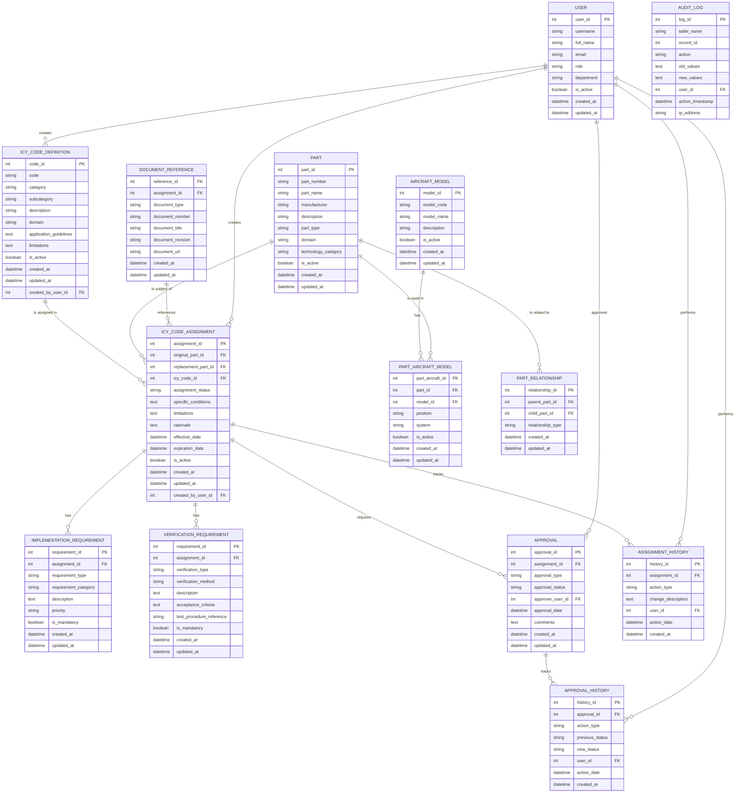

## 3. Table Definitions

### 3.1 ICY_CODE_DEFINITION

Stores the definitions of all ICY codes in the expanded system.

```sql
CREATE TABLE ICY_CODE_DEFINITION (
    code_id INT AUTO_INCREMENT PRIMARY KEY,
    code VARCHAR(10) NOT NULL,
    category VARCHAR(100) NOT NULL,
    subcategory VARCHAR(100) NOT NULL,
    description TEXT NOT NULL,
    domain ENUM('Conventional', 'Quantum', 'Sustainable') NOT NULL,
    application_guidelines TEXT,
    limitations TEXT,
    is_active BOOLEAN DEFAULT TRUE,
    created_at DATETIME DEFAULT CURRENT_TIMESTAMP,
    updated_at DATETIME DEFAULT CURRENT_TIMESTAMP ON UPDATE CURRENT_TIMESTAMP,
    created_by_user_id INT,
    FOREIGN KEY (created_by_user_id) REFERENCES USER(user_id),
    UNIQUE INDEX idx_code (code)
);
```

### 3.2 PART

Stores information about all parts and components that may be subject to interchangeability.

```sql
CREATE TABLE PART (
    part_id INT AUTO_INCREMENT PRIMARY KEY,
    part_number VARCHAR(100) NOT NULL,
    part_name VARCHAR(255) NOT NULL,
    manufacturer VARCHAR(255),
    description TEXT,
    part_type VARCHAR(100),
    domain ENUM('Conventional', 'Quantum', 'Sustainable'),
    technology_category VARCHAR(100),
    is_active BOOLEAN DEFAULT TRUE,
    created_at DATETIME DEFAULT CURRENT_TIMESTAMP,
    updated_at DATETIME DEFAULT CURRENT_TIMESTAMP ON UPDATE CURRENT_TIMESTAMP,
    UNIQUE INDEX idx_part_number (part_number)
);
```

### 3.3 ICY_CODE_ASSIGNMENT

Records the assignment of ICY codes to specific part interchangeability relationships.

```sql
CREATE TABLE ICY_CODE_ASSIGNMENT (
    assignment_id INT AUTO_INCREMENT PRIMARY KEY,
    original_part_id INT NOT NULL,
    replacement_part_id INT NOT NULL,
    icy_code_id INT NOT NULL,
    assignment_status ENUM('Draft', 'Pending Approval', 'Approved', 'Rejected', 'Superseded', 'Expired') DEFAULT 'Draft',
    specific_conditions TEXT,
    limitations TEXT,
    rationale TEXT,
    effective_date DATETIME,
    expiration_date DATETIME,
    is_active BOOLEAN DEFAULT TRUE,
    created_at DATETIME DEFAULT CURRENT_TIMESTAMP,
    updated_at DATETIME DEFAULT CURRENT_TIMESTAMP ON UPDATE CURRENT_TIMESTAMP,
    created_by_user_id INT,
    FOREIGN KEY (original_part_id) REFERENCES PART(part_id),
    FOREIGN KEY (replacement_part_id) REFERENCES PART(part_id),
    FOREIGN KEY (icy_code_id) REFERENCES ICY_CODE_DEFINITION(code_id),
    FOREIGN KEY (created_by_user_id) REFERENCES USER(user_id),
    UNIQUE INDEX idx_part_relationship (original_part_id, replacement_part_id),
    INDEX idx_assignment_status (assignment_status),
    INDEX idx_effective_date (effective_date),
    INDEX idx_expiration_date (expiration_date)
);
```

### 3.4 IMPLEMENTATION_REQUIREMENT

Stores the implementation requirements for ICY code assignments.

```sql
CREATE TABLE IMPLEMENTATION_REQUIREMENT (
    requirement_id INT AUTO_INCREMENT PRIMARY KEY,
    assignment_id INT NOT NULL,
    requirement_type ENUM('Physical', 'Software', 'Documentation', 'Training', 'Tools', 'Other') NOT NULL,
    requirement_category VARCHAR(100),
    description TEXT NOT NULL,
    priority ENUM('Low', 'Medium', 'High', 'Critical') DEFAULT 'Medium',
    is_mandatory BOOLEAN DEFAULT TRUE,
    created_at DATETIME DEFAULT CURRENT_TIMESTAMP,
    updated_at DATETIME DEFAULT CURRENT_TIMESTAMP ON UPDATE CURRENT_TIMESTAMP,
    FOREIGN KEY (assignment_id) REFERENCES ICY_CODE_ASSIGNMENT(assignment_id),
    INDEX idx_assignment_id (assignment_id),
    INDEX idx_requirement_type (requirement_type)
);
```

### 3.5 VERIFICATION_REQUIREMENT

Stores the verification requirements for ICY code assignments.

```sql
CREATE TABLE VERIFICATION_REQUIREMENT (
    requirement_id INT AUTO_INCREMENT PRIMARY KEY,
    assignment_id INT NOT NULL,
    verification_type ENUM('Inspection', 'Analysis', 'Demonstration', 'Test') NOT NULL,
    verification_method VARCHAR(100) NOT NULL,
    description TEXT NOT NULL,
    acceptance_criteria TEXT NOT NULL,
    test_procedure_reference VARCHAR(255),
    is_mandatory BOOLEAN DEFAULT TRUE,
    created_at DATETIME DEFAULT CURRENT_TIMESTAMP,
    updated_at DATETIME DEFAULT CURRENT_TIMESTAMP ON UPDATE CURRENT_TIMESTAMP,
    FOREIGN KEY (assignment_id) REFERENCES ICY_CODE_ASSIGNMENT(assignment_id),
    INDEX idx_assignment_id (assignment_id),
    INDEX idx_verification_type (verification_type)
);
```

### 3.6 APPROVAL

Tracks approvals for ICY code assignments.

```sql
CREATE TABLE APPROVAL (
    approval_id INT AUTO_INCREMENT PRIMARY KEY,
    assignment_id INT NOT NULL,
    approval_type ENUM('Engineering', 'Quality', 'Safety', 'Certification', 'Configuration Management') NOT NULL,
    approval_status ENUM('Pending', 'Approved', 'Rejected', 'Deferred') DEFAULT 'Pending',
    approver_user_id INT,
    approval_date DATETIME,
    comments TEXT,
    created_at DATETIME DEFAULT CURRENT_TIMESTAMP,
    updated_at DATETIME DEFAULT CURRENT_TIMESTAMP ON UPDATE CURRENT_TIMESTAMP,
    FOREIGN KEY (assignment_id) REFERENCES ICY_CODE_ASSIGNMENT(assignment_id),
    FOREIGN KEY (approver_user_id) REFERENCES USER(user_id),
    UNIQUE INDEX idx_assignment_approval_type (assignment_id, approval_type),
    INDEX idx_approval_status (approval_status)
);
```

### 3.7 ASSIGNMENT_HISTORY

Tracks the history of changes to ICY code assignments.

```sql
CREATE TABLE ASSIGNMENT_HISTORY (
    history_id INT AUTO_INCREMENT PRIMARY KEY,
    assignment_id INT NOT NULL,
    action_type ENUM('Created', 'Updated', 'Activated', 'Deactivated', 'Status Changed') NOT NULL,
    change_description TEXT,
    user_id INT,
    action_date DATETIME DEFAULT CURRENT_TIMESTAMP,
    created_at DATETIME DEFAULT CURRENT_TIMESTAMP,
    FOREIGN KEY (assignment_id) REFERENCES ICY_CODE_ASSIGNMENT(assignment_id),
    FOREIGN KEY (user_id) REFERENCES USER(user_id),
    INDEX idx_assignment_id (assignment_id),
    INDEX idx_action_date (action_date)
);
```

### 3.8 APPROVAL_HISTORY

Tracks the history of approval actions.

```sql
CREATE TABLE APPROVAL_HISTORY (
    history_id INT AUTO_INCREMENT PRIMARY KEY,
    approval_id INT NOT NULL,
    action_type ENUM('Submitted', 'Approved', 'Rejected', 'Deferred', 'Reopened') NOT NULL,
    previous_status VARCHAR(50),
    new_status VARCHAR(50),
    user_id INT,
    action_date DATETIME DEFAULT CURRENT_TIMESTAMP,
    created_at DATETIME DEFAULT CURRENT_TIMESTAMP,
    FOREIGN KEY (approval_id) REFERENCES APPROVAL(approval_id),
    FOREIGN KEY (user_id) REFERENCES USER(user_id),
    INDEX idx_approval_id (approval_id),
    INDEX idx_action_date (action_date)
);
```

### 3.9 DOCUMENT_REFERENCE

Stores references to documents related to ICY code assignments.

```sql
CREATE TABLE DOCUMENT_REFERENCE (
    reference_id INT AUTO_INCREMENT PRIMARY KEY,
    assignment_id INT NOT NULL,
    document_type VARCHAR(100) NOT NULL,
    document_number VARCHAR(100) NOT NULL,
    document_title VARCHAR(255) NOT NULL,
    document_revision VARCHAR(50),
    document_url VARCHAR(255),
    created_at DATETIME DEFAULT CURRENT_TIMESTAMP,
    updated_at DATETIME DEFAULT CURRENT_TIMESTAMP ON UPDATE CURRENT_TIMESTAMP,
    FOREIGN KEY (assignment_id) REFERENCES ICY_CODE_ASSIGNMENT(assignment_id),
    INDEX idx_assignment_id (assignment_id),
    INDEX idx_document_type (document_type),
    INDEX idx_document_number (document_number)
);
```

### 3.10 USER

Stores information about users who interact with the ICY code system.

```sql
CREATE TABLE USER (
    user_id INT AUTO_INCREMENT PRIMARY KEY,
    username VARCHAR(50) NOT NULL,
    full_name VARCHAR(255) NOT NULL,
    email VARCHAR(255) NOT NULL,
    role VARCHAR(50) NOT NULL,
    department VARCHAR(100),
    is_active BOOLEAN DEFAULT TRUE,
    created_at DATETIME DEFAULT CURRENT_TIMESTAMP,
    updated_at DATETIME DEFAULT CURRENT_TIMESTAMP ON UPDATE CURRENT_TIMESTAMP,
    UNIQUE INDEX idx_username (username),
    UNIQUE INDEX idx_email (email),
    INDEX idx_role (role)
);
```

### 3.11 AIRCRAFT_MODEL

Stores information about aircraft models.

```sql
CREATE TABLE AIRCRAFT_MODEL (
    model_id INT AUTO_INCREMENT PRIMARY KEY,
    model_code VARCHAR(50) NOT NULL,
    model_name VARCHAR(255) NOT NULL,
    description TEXT,
    is_active BOOLEAN DEFAULT TRUE,
    created_at DATETIME DEFAULT CURRENT_TIMESTAMP,
    updated_at DATETIME DEFAULT CURRENT_TIMESTAMP ON UPDATE CURRENT_TIMESTAMP,
    UNIQUE INDEX idx_model_code (model_code)
);
```

### 3.12 PART_AIRCRAFT_MODEL

Maps parts to aircraft models, indicating which parts are used in which aircraft.

```sql
CREATE TABLE PART_AIRCRAFT_MODEL (
    part_aircraft_id INT AUTO_INCREMENT PRIMARY KEY,
    part_id INT NOT NULL,
    model_id INT NOT NULL,
    position VARCHAR(100),
    system VARCHAR(100),
    is_active BOOLEAN DEFAULT TRUE,
    created_at DATETIME DEFAULT CURRENT_TIMESTAMP,
    updated_at DATETIME DEFAULT CURRENT_TIMESTAMP ON UPDATE CURRENT_TIMESTAMP,
    FOREIGN KEY (part_id) REFERENCES PART(part_id),
    FOREIGN KEY (model_id) REFERENCES AIRCRAFT_MODEL(model_id),
    UNIQUE INDEX idx_part_model_position (part_id, model_id, position),
    INDEX idx_system (system)
);
```

### 3.13 PART_RELATIONSHIP

Defines hierarchical relationships between parts (assemblies, subassemblies, components).

```sql
CREATE TABLE PART_RELATIONSHIP (
    relationship_id INT AUTO_INCREMENT PRIMARY KEY,
    parent_part_id INT NOT NULL,
    child_part_id INT NOT NULL,
    relationship_type ENUM('Assembly', 'Installation', 'Connection', 'Interface') NOT NULL,
    created_at DATETIME DEFAULT CURRENT_TIMESTAMP,
    updated_at DATETIME DEFAULT CURRENT_TIMESTAMP ON UPDATE CURRENT_TIMESTAMP,
    FOREIGN KEY (parent_part_id) REFERENCES PART(part_id),
    FOREIGN KEY (child_part_id) REFERENCES PART(part_id),
    UNIQUE INDEX idx_parent_child (parent_part_id, child_part_id),
    INDEX idx_relationship_type (relationship_type)
);
```

### 3.14 AUDIT_LOG

Provides a comprehensive audit trail of all changes to the database.

```sql
CREATE TABLE AUDIT_LOG (
    log_id INT AUTO_INCREMENT PRIMARY KEY,
    table_name VARCHAR(100) NOT NULL,
    record_id INT NOT NULL,
    action ENUM('INSERT', 'UPDATE', 'DELETE') NOT NULL,
    old_values JSON,
    new_values JSON,
    user_id INT,
    action_timestamp DATETIME DEFAULT CURRENT_TIMESTAMP,
    ip_address VARCHAR(45),
    FOREIGN KEY (user_id) REFERENCES USER(user_id),
    INDEX idx_table_record (table_name, record_id),
    INDEX idx_action_timestamp (action_timestamp)
);
```

## 4. Initial Data Population

### 4.1 ICY Code Definitions

The database should be initially populated with the complete set of ICY codes from the expanded system:

```sql
-- Example insertions for conventional ICY codes
INSERT INTO ICY_CODE_DEFINITION (code, category, subcategory, description, domain, application_guidelines)
VALUES 
('100', 'Complete Interchangeability', 'General', 'Fully interchangeable without restriction', 'Conventional', 'Use for parts that are identical in form, fit, and function'),
('110', 'Complete Interchangeability', 'With Inspection', 'Interchangeable after inspection', 'Conventional', 'Use for parts that require visual or dimensional inspection before substitution'),
-- Additional conventional codes...

-- Example insertions for quantum ICY codes
INSERT INTO ICY_CODE_DEFINITION (code, category, subcategory, description, domain, application_guidelines)
VALUES 
('700', 'Quantum-Classical Interchangeability', 'General', 'Quantum component can replace classical component', 'Quantum', 'Use for quantum components with classical interfaces'),
('701', 'Quantum-Classical Interchangeability', 'One-way', 'Quantum component can replace classical, not vice versa', 'Quantum', 'Use for quantum components with backward compatibility'),
-- Additional quantum codes...

-- Example insertions for sustainable ICY codes
INSERT INTO ICY_CODE_DEFINITION (code, category, subcategory, description, domain, application_guidelines)
VALUES 
('800', 'Sustainable Materials Interchangeability', 'General', 'Sustainable materials can replace conventional materials', 'Sustainable', 'Use for bio-based composites replacing petroleum-based composites'),
('801', 'Sustainable Materials Interchangeability', 'One-way', 'Sustainable material can replace conventional, not vice versa', 'Sustainable', 'Use for advanced sustainable materials with superior properties'),
-- Additional sustainable codes...
```

### 4.2 User Roles

Initial user roles should be defined:

```sql
-- Example user insertions
INSERT INTO USER (username, full_name, email, role, department)
VALUES 
('jsmith', 'John Smith', 'jsmith@gaia-qao.org', 'Engineer', 'Engineering'),
('mgarcia', 'Maria Garcia', 'mgarcia@gaia-qao.org', 'Quality', 'Quality Assurance'),
('rwilson', 'Robert Wilson', 'rwilson@gaia-qao.org', 'Approver', 'Certification'),
('alee', 'Alice Lee', 'alee@gaia-qao.org', 'Admin', 'Configuration Management'),
('bjohnson', 'Brian Johnson', 'bjohnson@gaia-qao.org', 'Viewer', 'Maintenance');
```

## 5. Common Queries

### 5.1 Find Interchangeable Parts

```sql
-- Find all parts that can replace a specific part
SELECT 
    p.part_number AS replacement_part_number,
    p.part_name AS replacement_part_name,
    icd.code AS icy_code,
    icd.description AS icy_code_description,
    ica.specific_conditions,
    ica.limitations
FROM 
    ICY_CODE_ASSIGNMENT ica
JOIN 
    PART p ON ica.replacement_part_id = p.part_id
JOIN 
    ICY_CODE_DEFINITION icd ON ica.icy_code_id = icd.code_id
WHERE 
    ica.original_part_id = (SELECT part_id FROM PART WHERE part_number = 'CNV-NAV-001')
    AND ica.assignment_status = 'Approved'
    AND ica.is_active = TRUE
    AND (ica.expiration_date IS NULL OR ica.expiration_date > NOW());
```

### 5.2 Find Implementation Requirements

```sql
-- Find all implementation requirements for a specific interchangeability relationship
SELECT 
    ir.requirement_type,
    ir.requirement_category,
    ir.description,
    ir.priority,
    ir.is_mandatory
FROM 
    IMPLEMENTATION_REQUIREMENT ir
JOIN 
    ICY_CODE_ASSIGNMENT ica ON ir.assignment_id = ica.assignment_id
JOIN 
    PART original ON ica.original_part_id = original.part_id
JOIN 
    PART replacement ON ica.replacement_part_id = replacement.part_id
WHERE 
    original.part_number = 'CNV-NAV-001'
    AND replacement.part_number = 'QTM-NAV-001'
ORDER BY 
    ir.priority DESC, ir.requirement_type;
```

### 5.3 Find Verification Requirements

```sql
-- Find all verification requirements for a specific interchangeability relationship
SELECT 
    vr.verification_type,
    vr.verification_method,
    vr.description,
    vr.acceptance_criteria,
    vr.test_procedure_reference,
    vr.is_mandatory
FROM 
    VERIFICATION_REQUIREMENT vr
JOIN 
    ICY_CODE_ASSIGNMENT ica ON vr.assignment_id = ica.assignment_id
JOIN 
    PART original ON ica.original_part_id = original.part_id
JOIN 
    PART replacement ON ica.replacement_part_id = replacement.part_id
WHERE 
    original.part_number = 'CNV-NAV-001'
    AND replacement.part_number = 'QTM-NAV-001'
ORDER BY 
    vr.verification_type;
```

### 5.4 Check Approval Status

```sql
-- Check approval status for a specific interchangeability relationship
SELECT 
    a.approval_type,
    a.approval_status,
    u.full_name AS approver_name,
    a.approval_date,
    a.comments
FROM 
    APPROVAL a
JOIN 
    ICY_CODE_ASSIGNMENT ica ON a.assignment_id = ica.assignment_id
JOIN 
    PART original ON ica.original_part_id = original.part_id
JOIN 
    PART replacement ON ica.replacement_part_id = replacement.part_id
LEFT JOIN 
    USER u ON a.approver_user_id = u.user_id
WHERE 
    original.part_number = 'CNV-NAV-001'
    AND replacement.part_number = 'QTM-NAV-001'
ORDER BY 
    a.approval_type;
```

### 5.5 Find Parts by ICY Code

```sql
-- Find all interchangeability relationships using a specific ICY code
SELECT 
    op.part_number AS original_part_number,
    op.part_name AS original_part_name,
    rp.part_number AS replacement_part_number,
    rp.part_name AS replacement_part_name,
    ica.specific_conditions,
    ica.limitations,
    ica.assignment_status
FROM 
    ICY_CODE_ASSIGNMENT ica
JOIN 
    PART op ON ica.original_part_id = op.part_id
JOIN 
    PART rp ON ica.replacement_part_id = rp.part_id
JOIN 
    ICY_CODE_DEFINITION icd ON ica.icy_code_id = icd.code_id
WHERE 
    icd.code = '701'
    AND ica.is_active = TRUE
ORDER BY 
    op.part_number, rp.part_number;
```

### 5.6 Find Parts by Aircraft Model

```sql
-- Find all interchangeability relationships for parts used in a specific aircraft model
SELECT 
    op.part_number AS original_part_number,
    rp.part_number AS replacement_part_number,
    icd.code AS icy_code,
    icd.description AS icy_code_description,
    ica.specific_conditions
FROM 
    ICY_CODE_ASSIGNMENT ica
JOIN 
    PART op ON ica.original_part_id = op.part_id
JOIN 
    PART rp ON ica.replacement_part_id = rp.part_id
JOIN 
    ICY_CODE_DEFINITION icd ON ica.icy_code_id = icd.code_id
JOIN 
    PART_AIRCRAFT_MODEL pam ON op.part_id = pam.part_id
JOIN 
    AIRCRAFT_MODEL am ON pam.model_id = am.model_id
WHERE 
    am.model_code = 'AMPEL-BWB-001'
    AND ica.assignment_status = 'Approved'
    AND ica.is_active = TRUE
ORDER BY 
    op.part_number;
```

### 5.7 Audit Trail Query

```sql
-- Get audit trail for a specific interchangeability relationship
SELECT 
    ah.action_type,
    ah.change_description,
    u.full_name AS user_name,
    ah.action_date
FROM 
    ASSIGNMENT_HISTORY ah
JOIN 
    ICY_CODE_ASSIGNMENT ica ON ah.assignment_id = ica.assignment_id
JOIN 
    PART original ON ica.original_part_id = original.part_id
JOIN 
    PART replacement ON ica.replacement_part_id = replacement.part_id
JOIN 
    USER u ON ah.user_id = u.user_id
WHERE 
    original.part_number = 'CNV-NAV-001'
    AND replacement.part_number = 'QTM-NAV-001'
ORDER BY 
    ah.action_date DESC;
```

## 6. Views

### 6.1 Active Interchangeability View

```sql
CREATE VIEW V_ACTIVE_INTERCHANGEABILITY AS
SELECT 
    ica.assignment_id,
    op.part_id AS original_part_id,
    op.part_number AS original_part_number,
    op.part_name AS original_part_name,
    op.domain AS original_domain,
    rp.part_id AS replacement_part_id,
    rp.part_number AS replacement_part_number,
    rp.part_name AS replacement_part_name,
    rp.domain AS replacement_domain,
    icd.code_id,
    icd.code AS icy_code,
    icd.category,
    icd.subcategory,
    icd.description AS icy_code_description,
    ica.specific_conditions,
    ica.limitations,
    ica.assignment_status,
    ica.effective_date,
    ica.expiration_date,
    u.full_name AS created_by
FROM 
    ICY_CODE_ASSIGNMENT ica
JOIN 
    PART op ON ica.original_part_id = op.part_id
JOIN 
    PART rp ON ica.replacement_part_id = rp.part_id
JOIN 
    ICY_CODE_DEFINITION icd ON ica.icy_code_id = icd.code_id
LEFT JOIN 
    USER u ON ica.created_by_user_id = u.user_id
WHERE 
    ica.is_active = TRUE
    AND (ica.expiration_date IS NULL OR ica.expiration_date > NOW());
```

### 6.2 Approval Status View

```sql
CREATE VIEW V_APPROVAL_STATUS AS
SELECT 
    ica.assignment_id,
    op.part_number AS original_part_number,
    rp.part_number AS replacement_part_number,
    icd.code AS icy_code,
    ica.assignment_status,
    COUNT(a.approval_id) AS total_approvals_required,
    SUM(CASE WHEN a.approval_status = 'Approved' THEN 1 ELSE 0 END) AS approvals_received,
    SUM(CASE WHEN a.approval_status = 'Rejected' THEN 1 ELSE 0 END) AS rejections_received,
    GROUP_CONCAT(DISTINCT CASE WHEN a.approval_status = 'Pending' THEN a.approval_type END) AS pending_approvals,
    MAX(a.updated_at) AS last_approval_update
FROM 
    ICY_CODE_ASSIGNMENT ica
JOIN 
    PART op ON ica.original_part_id = op.part_id
JOIN 
    PART rp ON ica.replacement_part_id = rp.part_id
JOIN 
    ICY_CODE_DEFINITION icd ON ica.icy_code_id = icd.code_id
LEFT JOIN 
    APPROVAL a ON ica.assignment_id = a.assignment_id
WHERE 
    ica.is_active = TRUE
GROUP BY 
    ica.assignment_id, op.part_number, rp.part_number, icd.code, ica.assignment_status;
```

### 6.3 Implementation Status View

```sql
CREATE VIEW V_IMPLEMENTATION_STATUS AS
SELECT 
    ica.assignment_id,
    op.part_number AS original_part_number,
    rp.part_number AS replacement_part_number,
    icd.code AS icy_code,
    COUNT(ir.requirement_id) AS total_implementation_requirements,
    SUM(CASE WHEN ir.is_mandatory = TRUE THEN 1 ELSE 0 END) AS mandatory_requirements,
    COUNT(DISTINCT ir.requirement_type) AS requirement_types,
    GROUP_CONCAT(DISTINCT ir.requirement_type) AS requirement_type_list
FROM 
    ICY_CODE_ASSIGNMENT ica
JOIN 
    PART op ON ica.original_part_id = op.part_id
JOIN 
    PART rp ON ica.replacement_part_id = rp.part_id
JOIN 
    ICY_CODE_DEFINITION icd ON ica.icy_code_id = icd.code_id
LEFT JOIN 
    IMPLEMENTATION_REQUIREMENT ir ON ica.assignment_id = ir.assignment_id
WHERE 
    ica.is_active = TRUE
GROUP BY 
    ica.assignment_id, op.part_number, rp.part_number, icd.code;
```

### 6.4 Verification Status View

```sql
CREATE VIEW V_VERIFICATION_STATUS AS
SELECT 
    ica.assignment_id,
    op.part_number AS original_part_number,
    rp.part_number AS replacement_part_number,
    icd.code AS icy_code,
    COUNT(vr.requirement_id) AS total_verification_requirements,
    SUM(CASE WHEN vr.is_mandatory = TRUE THEN 1 ELSE 0 END) AS mandatory_requirements,
    COUNT(DISTINCT vr.verification_type) AS verification_types,
    GROUP_CONCAT(DISTINCT vr.verification_type) AS verification_type_list
FROM 
    ICY_CODE_ASSIGNMENT ica
JOIN 
    PART op ON ica.original_part_id = op.part_id
JOIN 
    PART rp ON ica.replacement_part_id = rp.part_id
JOIN 
    ICY_CODE_DEFINITION icd ON ica.icy_code_id = icd.code_id
LEFT JOIN 
    VERIFICATION_REQUIREMENT vr ON ica.assignment_id = vr.assignment_id
WHERE 
    ica.is_active = TRUE
GROUP BY 
    ica.assignment_id, op.part_number, rp.part_number, icd.code;
```

### 6.5 Domain Crossover View

```sql
CREATE VIEW V_DOMAIN_CROSSOVER AS
SELECT 
    ica.assignment_id,
    op.part_number AS original_part_number,
    op.domain AS original_domain,
    rp.part_number AS replacement_part_number,
    rp.domain AS replacement_domain,
    icd.code AS icy_code,
    icd.description AS icy_code_description,
    ica.specific_conditions,
    ica.assignment_status
FROM 
    ICY_CODE_ASSIGNMENT ica
JOIN 
    PART op ON ica.original_part_id = op.part_id
JOIN 
    PART rp ON ica.replacement_part_id = rp.part_id
JOIN 
    ICY_CODE_DEFINITION icd ON ica.icy_code_id = icd.code_id
WHERE 
    ica.is_active = TRUE
    AND op.domain != rp.domain
ORDER BY 
    op.domain, rp.domain, op.part_number;
```

## 7. Stored Procedures

### 7.1 Create ICY Code Assignment

```sql
DELIMITER //

CREATE PROCEDURE sp_create_icy_assignment(
    IN p_original_part_number VARCHAR(100),
    IN p_replacement_part_number VARCHAR(100),
    IN p_icy_code VARCHAR(10),
    IN p_specific_conditions TEXT,
    IN p_limitations TEXT,
    IN p_rationale TEXT,
    IN p_effective_date DATETIME,
    IN p_expiration_date DATETIME,
    IN p_user_id INT,
    OUT p_assignment_id INT
)
BEGIN
    DECLARE v_original_part_id INT;
    DECLARE v_replacement_part_id INT;
    DECLARE v_icy_code_id INT;
    DECLARE v_existing_assignment_id INT;
    
    -- Get part IDs
    SELECT part_id INTO v_original_part_id FROM PART WHERE part_number = p_original_part_number;
    SELECT part_id INTO v_replacement_part_id FROM PART WHERE part_number = p_replacement_part_number;
    SELECT code_id INTO v_icy_code_id FROM ICY_CODE_DEFINITION WHERE code = p_icy_code;
    
    -- Check if parts and ICY code exist
    IF v_original_part_id IS NULL THEN
        SIGNAL SQLSTATE '45000' SET MESSAGE_TEXT = 'Original part not found';
    END IF;
    
    IF v_replacement_part_id IS NULL THEN
        SIGNAL SQLSTATE '45000' SET MESSAGE_TEXT = 'Replacement part not found';
    END IF;
    
    IF v_icy_code_id IS NULL THEN
        SIGNAL SQLSTATE '45000' SET MESSAGE_TEXT = 'ICY code not found';
    END IF;
    
    -- Check if assignment already exists
    SELECT assignment_id INTO v_existing_assignment_id 
    FROM ICY_CODE_ASSIGNMENT 
    WHERE original_part_id = v_original_part_id 
    AND replacement_part_id = v_replacement_part_id
    AND is_active = TRUE;
    
    IF v_existing_assignment_id IS NOT NULL THEN
        SIGNAL SQLSTATE '45000' SET MESSAGE_TEXT = 'An active assignment already exists for these parts';
    END IF;
    
    -- Create new assignment
    INSERT INTO ICY_CODE_ASSIGNMENT (
        original_part_id,
        replacement_part_id,
        icy_code_id,
        specific_conditions,
        limitations,
        rationale,
        effective_date,
        expiration_date,
        created_by_user_id
    ) VALUES (
        v_original_part_id,
        v_replacement_part_id,
        v_icy_code_id,
        p_specific_conditions,
        p_limitations,
        p_rationale,
        p_effective_date,
        p_expiration_date,
        p_user_id
    );
    
    SET p_assignment_id = LAST_INSERT_ID();
    
    -- Create history record
    INSERT INTO ASSIGNMENT_HISTORY (
        assignment_id,
        action_type,
        change_description,
        user_id
    ) VALUES (
        p_assignment_id,
        'Created',
        'Initial creation of ICY code assignment',
        p_user_id
    );
    
    -- Create approval records
    INSERT INTO APPROVAL (assignment_id, approval_type)
    VALUES 
        (p_assignment_id, 'Engineering'),
        (p_assignment_id, 'Quality'),
        (p_assignment_id, 'Safety'),
        (p_assignment_id, 'Configuration Management');
        
    -- If it's a certification-affecting code, add certification approval
    IF p_icy_code IN ('360', '560', '660', '708', '768', '808', '828', '848', '868', '888') THEN
        INSERT INTO APPROVAL (assignment_id, approval_type)
        VALUES (p_assignment_id, 'Certification');
    END IF;
END //

DELIMITER ;
```

### 7.2 Update Assignment Status

```sql
DELIMITER //

CREATE PROCEDURE sp_update_assignment_status(
    IN p_assignment_id INT,
    IN p_new_status VARCHAR(50),
    IN p_user_id INT,
    IN p_comments TEXT
)
BEGIN
    DECLARE v_old_status VARCHAR(50);
    
    -- Get current status
    SELECT assignment_status INTO v_old_status 
    FROM ICY_CODE_ASSIGNMENT 
    WHERE assignment_id = p_assignment_id;
    
    -- Update status
    UPDATE ICY_CODE_ASSIGNMENT
    SET assignment_status = p_new_status,
        updated_at = NOW()
    WHERE assignment_id = p_assignment_id;
    
    -- Create history record
    INSERT INTO ASSIGNMENT_HISTORY (
        assignment_id,
        action_type,
        change_description,
        user_id
    ) VALUES (
        p_assignment_id,
        'Status Changed',
        CONCAT('Status changed from ', v_old_status, ' to ', p_new_status, '. Comments: ', IFNULL(p_comments, 'None')),
        p_user_id
    );
END //

DELIMITER ;
```

### 7.3 Record Approval

```sql
DELIMITER //

CREATE PROCEDURE sp_record_approval(
    IN p_assignment_id INT,
    IN p_approval_type VARCHAR(50),
    IN p_approval_status VARCHAR(50),
    IN p_user_id INT,
    IN p_comments TEXT
)
BEGIN
    DECLARE v_approval_id INT;
    DECLARE v_old_status VARCHAR(50);
    DECLARE v_all_approved BOOLEAN DEFAULT FALSE;
    DECLARE v_any_rejected BOOLEAN DEFAULT FALSE;
    
    -- Get approval record
    SELECT approval_id, approval_status INTO v_approval_id, v_old_status
    FROM APPROVAL
    WHERE assignment_id = p_assignment_id AND approval_type = p_approval_type;
    
    IF v_approval_id IS NULL THEN
        SIGNAL SQLSTATE '45000' SET MESSAGE_TEXT = 'Approval record not found';
    END IF;
    
    -- Update approval
    UPDATE APPROVAL
    SET approval_status = p_approval_status,
        approver_user_id = p_user_id,
        approval_date = NOW(),
        comments = p_comments,
        updated_at = NOW()
    WHERE approval_id = v_approval_id;
    
    -- Create history record
    INSERT INTO APPROVAL_HISTORY (
        approval_id,
        action_type,
        previous_status,
        new_status,
        user_id
    ) VALUES (
        v_approval_id,
        CASE 
            WHEN p_approval_status = 'Approved' THEN 'Approved'
            WHEN p_approval_status = 'Rejected' THEN 'Rejected'
            WHEN p_approval_status = 'Deferred' THEN 'Deferred'
            ELSE 'Updated'
        END,
        v_old_status,
        p_approval_status,
        p_user_id
    );
    
    -- Check if all approvals are complete
    SELECT 
        (COUNT(*) = SUM(CASE WHEN approval_status = 'Approved' THEN 1 ELSE 0 END)) INTO v_all_approved
    FROM APPROVAL
    WHERE assignment_id = p_assignment_id;
    
    SELECT 
        SUM(CASE WHEN approval_status = 'Rejected' THEN 1 ELSE 0 END) > 0 INTO v_any_rejected
    FROM APPROVAL
    WHERE assignment_id = p_assignment_id;
    
    -- Update assignment status if needed
    IF v_all_approved = TRUE THEN
        CALL sp_update_assignment_status(p_assignment_id, 'Approved', p_user_id, 'All approvals received');
    ELSEIF v_any_rejected = TRUE THEN
        CALL sp_update_assignment_status(p_assignment_id, 'Rejected', p_user_id, 'One or more approvals rejected');
    END IF;
END //

DELIMITER ;
```

### 7.4 Add Implementation Requirement

```sql
DELIMITER //

CREATE PROCEDURE sp_add_implementation_requirement(
    IN p_assignment_id INT,
    IN p_requirement_type VARCHAR(50),
    IN p_requirement_category VARCHAR(100),
    IN p_description TEXT,
    IN p_priority VARCHAR(50),
    IN p_is_mandatory BOOLEAN,
    IN p_user_id INT
)
BEGIN
    -- Add requirement
    INSERT INTO IMPLEMENTATION_REQUIREMENT (
        assignment_id,
        requirement_type,
        requirement_category,
        description,
        priority,
        is_mandatory
    ) VALUES (
        p_assignment_id,
        p_requirement_type,
        p_requirement_category,
        p_description,
        p_priority,
        p_is_mandatory
    );
    
    -- Create history record
    INSERT INTO ASSIGNMENT_HISTORY (
        assignment_id,
        action_type,
        change_description,
        user_id
    ) VALUES (
        p_assignment_id,
        'Updated',
        CONCAT('Added ', p_requirement_type, ' implementation requirement: ', p_description),
        p_user_id
    );
END //

DELIMITER ;
```

### 7.5 Add Verification Requirement

```sql
DELIMITER //

CREATE PROCEDURE sp_add_verification_requirement(
    IN p_assignment_id INT,
    IN p_verification_type VARCHAR(50),
    IN p_verification_method VARCHAR(100),
    IN p_description TEXT,
    IN p_acceptance_criteria TEXT,
    IN p_test_procedure_reference VARCHAR(255),
    IN p_is_mandatory BOOLEAN,
    IN p_user_id INT
)
BEGIN
    -- Add requirement
    INSERT INTO VERIFICATION_REQUIREMENT (
        assignment_id,
        verification_type,
        verification_method,
        description,
        acceptance_criteria,
        test_procedure_reference,
        is_mandatory
    ) VALUES (
        p_assignment_id,
        p_verification_type,
        p_verification_method,
        p_description,
        p_acceptance_criteria,
        p_test_procedure_reference,
        p_is_mandatory
    );
    
    -- Create history record
    INSERT INTO ASSIGNMENT_HISTORY (
        assignment_id,
        action_type,
        change_description,
        user_id
    ) VALUES (
        p_assignment_id,
        'Updated',
        CONCAT('Added ', p_verification_type, ' verification requirement: ', p_description),
        p_user_id
    );
END //

DELIMITER ;
```

## 8. Triggers

### 8.1 Audit Log Triggers

```sql
DELIMITER //

-- ICY_CODE_ASSIGNMENT audit trigger
CREATE TRIGGER trg_icy_assignment_audit_insert
AFTER INSERT ON ICY_CODE_ASSIGNMENT
FOR EACH ROW
BEGIN
    INSERT INTO AUDIT_LOG (
        table_name,
        record_id,
        action,
        old_values,
        new_values,
        user_id,
        ip_address
    ) VALUES (
        'ICY_CODE_ASSIGNMENT',
        NEW.assignment_id,
        'INSERT',
        NULL,
        JSON_OBJECT(
            'original_part_id', NEW.original_part_id,
            'replacement_part_id', NEW.replacement_part_id,
            'icy_code_id', NEW.icy_code_id,
            'assignment_status', NEW.assignment_status,
            'specific_conditions', NEW.specific_conditions,
            'limitations', NEW.limitations,
            'rationale', NEW.rationale,
            'effective_date', NEW.effective_date,
            'expiration_date', NEW.expiration_date,
            'is_active', NEW.is_active
        ),
        NEW.created_by_user_id,
        SUBSTRING_INDEX(USER(), '@', -1)
    );
END //

CREATE TRIGGER trg_icy_assignment_audit_update
AFTER UPDATE ON ICY_CODE_ASSIGNMENT
FOR EACH ROW
BEGIN
    INSERT INTO AUDIT_LOG (
        table_name,
        record_id,
        action,
        old_values,
        new_values,
        user_id,
        ip_address
    ) VALUES (
        'ICY_CODE_ASSIGNMENT',
        NEW.assignment_id,
        'UPDATE',
        JSON_OBJECT(
            'original_part_id', OLD.original_part_id,
            'replacement_part_id', OLD.replacement_part_id,
            'icy_code_id', OLD.icy_code_id,
            'assignment_status', OLD.assignment_status,
            'specific_conditions', OLD.specific_conditions,
            'limitations', OLD.limitations,
            'rationale', OLD.rationale,
            'effective_date', OLD.effective_date,
            'expiration_date', OLD.expiration_date,
            'is_active', OLD.is_active
        ),
        JSON_OBJECT(
            'original_part_id', NEW.original_part_id,
            'replacement_part_id', NEW.replacement_part_id,
            'icy_code_id', NEW.icy_code_id,
            'assignment_status', NEW.assignment_status,
            'specific_conditions', NEW.specific_conditions,
            'limitations', NEW.limitations,
            'rationale', NEW.rationale,
            'effective_date', NEW.effective_date,
            'expiration_date', NEW.expiration_date,
            'is_active', NEW.is_active
        ),
        NEW.created_by_user_id,
        SUBSTRING_INDEX(USER(), '@', -1)
    );
END //

-- Similar triggers for other tables...

DELIMITER ;
```

### 8.2 Status Update Trigger

```sql
DELIMITER //

CREATE TRIGGER trg_approval_status_update
AFTER UPDATE ON APPROVAL
FOR EACH ROW
BEGIN
    DECLARE v_all_approved BOOLEAN DEFAULT FALSE;
    DECLARE v_any_rejected BOOLEAN DEFAULT FALSE;
    DECLARE v_assignment_status VARCHAR(50);
    
    IF NEW.approval_status != OLD.approval_status THEN
        -- Check current assignment status
        SELECT assignment_status INTO v_assignment_status
        FROM ICY_CODE_ASSIGNMENT
        WHERE assignment_id = NEW.assignment_id;
        
        -- Only proceed if status is 'Pending Approval'
        IF v_assignment_status = 'Pending Approval' THEN
            -- Check if all approvals are complete
            SELECT 
                (COUNT(*) = SUM(CASE WHEN approval_status = 'Approved' THEN 1 ELSE 0 END)) INTO v_all_approved
            FROM APPROVAL
            WHERE assignment_id = NEW.assignment_id;
            
            SELECT 
                SUM(CASE WHEN approval_status = 'Rejected' THEN 1 ELSE 0 END) > 0 INTO v_any_rejected
            FROM APPROVAL
            WHERE assignment_id = NEW.assignment_id;
            
            -- Update assignment status if needed
            IF v_all_approved = TRUE THEN
                UPDATE ICY_CODE_ASSIGNMENT
                SET assignment_status = 'Approved',
                    updated_at = NOW()
                WHERE assignment_id = NEW.assignment_id;
                
                INSERT INTO ASSIGNMENT_HISTORY (
                    assignment_id,
                    action_type,
                    change_description,
                    user_id
                ) VALUES (
                    NEW.assignment_id,
                    'Status Changed',
                    'Status automatically changed to Approved after all approvals received',
                    NEW.approver_user_id
                );
            ELSEIF v_any_rejected = TRUE THEN
                UPDATE ICY_CODE_ASSIGNMENT
                SET assignment_status = 'Rejected',
                    updated_at = NOW()
                WHERE assignment_id = NEW.assignment_id;
                
                INSERT INTO ASSIGNMENT_HISTORY (
                    assignment_id,
                    action_type,
                    change_description,
                    user_id
                ) VALUES (
                    NEW.assignment_id,
                    'Status Changed',
                    'Status automatically changed to Rejected after approval rejection',
                    NEW.approver_user_id
                );
            END IF;
        END IF;
    END IF;
END //

DELIMITER ;
```

## 9. Indexes and Performance Considerations

### 9.1 Additional Indexes

In addition to the indexes defined in the table creation scripts, the following indexes should be added to optimize common query patterns:

```sql
-- Indexes for common queries
CREATE INDEX idx_part_domain ON PART(domain);
CREATE INDEX idx_part_technology_category ON PART(technology_category);
CREATE INDEX idx_icy_code_domain ON ICY_CODE_DEFINITION(domain);
CREATE INDEX idx_assignment_effective_date ON ICY_CODE_ASSIGNMENT(effective_date);
CREATE INDEX idx_assignment_expiration_date ON ICY_CODE_ASSIGNMENT(expiration_date);
CREATE INDEX idx_implementation_requirement_type ON IMPLEMENTATION_REQUIREMENT(requirement_type);
CREATE INDEX idx_verification_requirement_type ON VERIFICATION_REQUIREMENT(verification_type);
```

### 9.2 Partitioning Strategy

For large deployments, consider partitioning the following tables:

```sql
-- Partition ICY_CODE_ASSIGNMENT by domain
ALTER TABLE ICY_CODE_ASSIGNMENT
PARTITION BY LIST (
    (SELECT domain FROM PART WHERE part_id = original_part_id)
) (
    PARTITION p_conventional VALUES IN ('Conventional'),
    PARTITION p_quantum VALUES IN ('Quantum'),
    PARTITION p_sustainable VALUES IN ('Sustainable')
);

-- Partition AUDIT_LOG by year and month
ALTER TABLE AUDIT_LOG
PARTITION BY RANGE (YEAR(action_timestamp) * 100 + MONTH(action_timestamp)) (
    PARTITION p_history VALUES LESS THAN (202501),
    PARTITION p_202501 VALUES LESS THAN (202502),
    PARTITION p_202502 VALUES LESS THAN (202503),
    -- Additional partitions as needed
    PARTITION p_future VALUES LESS THAN MAXVALUE
);
```

### 9.3 Query Optimization

For complex queries, consider creating materialized views that are refreshed periodically:

```sql
-- Create materialized view for interchangeability report
CREATE TABLE MV_INTERCHANGEABILITY_REPORT (
    original_part_number VARCHAR(100),
    original_part_name VARCHAR(255),
    original_domain VARCHAR(50),
    replacement_part_number VARCHAR(100),
    replacement_part_name VARCHAR(255),
    replacement_domain VARCHAR(50),
    icy_code VARCHAR(10),
    icy_code_description TEXT,
    specific_conditions TEXT,
    implementation_count INT,
    verification_count INT,
    approval_status VARCHAR(50),
    last_updated DATETIME,
    INDEX idx_original_part (original_part_number),
    INDEX idx_replacement_part (replacement_part_number),
    INDEX idx_domains (original_domain, replacement_domain)
);

-- Procedure to refresh materialized view
DELIMITER //

CREATE PROCEDURE sp_refresh_mv_interchangeability_report()
BEGIN
    TRUNCATE TABLE MV_INTERCHANGEABILITY_REPORT;
    
    INSERT INTO MV_INTERCHANGEABILITY_REPORT
    SELECT 
        op.part_number AS original_part_number,
        op.part_name AS original_part_name,
        op.domain AS original_domain,
        rp.part_number AS replacement_part_number,
        rp.part_name AS replacement_part_name,
        rp.domain AS replacement_domain,
        icd.code AS icy_code,
        icd.description AS icy_code_description,
        ica.specific_conditions,
        COUNT(DISTINCT ir.requirement_id) AS implementation_count,
        COUNT(DISTINCT vr.requirement_id) AS verification_count,
        ica.assignment_status,
        ica.updated_at AS last_updated
    FROM 
        ICY_CODE_ASSIGNMENT ica
    JOIN 
        PART op ON ica.original_part_id = op.part_id
    JOIN 
        PART rp ON ica.replacement_part_id = rp.part_id
    JOIN 
        ICY_CODE_DEFINITION icd ON ica.icy_code_id = icd.code_id
    LEFT JOIN 
        IMPLEMENTATION_REQUIREMENT ir ON ica.assignment_id = ir.assignment_id
    LEFT JOIN 
        VERIFICATION_REQUIREMENT vr ON ica.assignment_id = vr.assignment_id
    WHERE 
        ica.is_active = TRUE
    GROUP BY 
        ica.assignment_id, op.part_number, op.part_name, op.domain, 
        rp.part_number, rp.part_name, rp.domain, 
        icd.code, icd.description, ica.specific_conditions, 
        ica.assignment_status, ica.updated_at;
END //

DELIMITER ;

-- Schedule regular refresh
CREATE EVENT evt_refresh_mv_interchangeability_report
ON SCHEDULE EVERY 1 DAY
DO
    CALL sp_refresh_mv_interchangeability_report();
```

## 10. Security Considerations

### 10.1 Role-Based Access Control

The database should be accessed through role-based permissions:

```sql
-- Create database roles
CREATE ROLE 'icy_admin', 'icy_engineer', 'icy_approver', 'icy_viewer';

-- Grant permissions to roles
GRANT ALL PRIVILEGES ON icy_code_db.* TO 'icy_admin';

GRANT SELECT, INSERT, UPDATE ON icy_code_db.ICY_CODE_ASSIGNMENT TO 'icy_engineer';
GRANT SELECT, INSERT, UPDATE ON icy_code_db.IMPLEMENTATION_REQUIREMENT TO 'icy_engineer';
GRANT SELECT, INSERT, UPDATE ON icy_code_db.VERIFICATION_REQUIREMENT TO 'icy_engineer';
GRANT SELECT, INSERT ON icy_code_db.DOCUMENT_REFERENCE TO 'icy_engineer';
GRANT SELECT ON icy_code_db.* TO 'icy_engineer';

GRANT SELECT ON icy_code_db.* TO 'icy_approver';
GRANT SELECT, UPDATE ON icy_code_db.APPROVAL TO 'icy_approver';

GRANT SELECT ON icy_code_db.* TO 'icy_viewer';
```

### 10.2 Data Encryption

Sensitive data should be encrypted:

```sql
-- Enable encryption for sensitive columns
ALTER TABLE ICY_CODE_ASSIGNMENT
MODIFY COLUMN rationale TEXT ENCRYPTED;

ALTER TABLE APPROVAL
MODIFY COLUMN comments TEXT ENCRYPTED;
```

### 10.3 Audit Trail

The AUDIT_LOG table provides a comprehensive audit trail of all changes to the database. Ensure that this table is regularly backed up and that its contents are never modified or deleted.

## 11. Integration Considerations

### 11.1 API Integration

The database schema is designed to be accessed through a RESTful API. Key endpoints would include:

- `/api/icy-codes` - Get all ICY code definitions
- `/api/parts` - Get all parts
- `/api/assignments` - Get all ICY code assignments
- `/api/assignments/{id}` - Get a specific assignment
- `/api/assignments/{id}/requirements` - Get requirements for an assignment
- `/api/assignments/{id}/approvals` - Get approvals for an assignment


### 11.2 Integration with Existing Systems

The database can be integrated with:

1. **Parts Management System**: To synchronize part information
2. **Configuration Management System**: To track configuration changes
3. **Maintenance Management System**: To provide interchangeability information for maintenance operations
4. **Document Management System**: To link to relevant technical documentation


### 11.3 Data Import/Export

Procedures for importing and exporting data should be implemented:

```sql
DELIMITER //

CREATE PROCEDURE sp_export_icy_assignments(
    IN p_domain VARCHAR(50),
    IN p_status VARCHAR(50)
)
BEGIN
    SELECT 
        op.part_number AS original_part_number,
        rp.part_number AS replacement_part_number,
        icd.code AS icy_code,
        ica.specific_conditions,
        ica.limitations,
        ica.rationale,
        ica.assignment_status,
        ica.effective_date,
        ica.expiration_date
    FROM 
        ICY_CODE_ASSIGNMENT ica
    JOIN 
        PART op ON ica.original_part_id = op.part_id
    JOIN 
        PART rp ON ica.replacement_part_id = rp.part_id
    JOIN 
        ICY_CODE_DEFINITION icd ON ica.icy_code_id = icd.code_id
    WHERE 
        (p_domain IS NULL OR op.domain = p_domain)
        AND (p_status IS NULL OR ica.assignment_status = p_status)
        AND ica.is_active = TRUE;
END //

DELIMITER ;
```

### ICY Code System - SQL Files and API Implementation

**GenAI Proposal Status: This document is an AI-generated implementation for the ICY Code System and should be reviewed by domain experts before deployment.**

I'll provide the SQL files and API implementation for the ICY Code System. These components will work together to create a robust, production-ready system.

## 1. Database Views (`/db/views.sql`)

```sql
-- ICY Code System - Database Views
-- GAIA Quantum Aerospace Organization

USE icy_code_system;

-- View: Active ICY Code Definitions
CREATE OR REPLACE VIEW v_active_icy_codes AS
SELECT 
    code_id,
    code,
    category,
    subcategory,
    description,
    domain,
    application_guidelines,
    limitations,
    version,
    parent_code_id,
    created_at,
    updated_at,
    created_by_user_id
FROM 
    icy_code_definition
WHERE 
    is_active = TRUE;

-- View: Active Parts
CREATE OR REPLACE VIEW v_active_parts AS
SELECT 
    p.part_id,
    p.part_number,
    p.part_name,
    p.manufacturer,
    p.description,
    p.part_type,
    p.domain,
    p.technology_category,
    p.lifecycle_status,
    p.is_serialized,
    p.weight_kg,
    p.dimensions_mm,
    p.quantum_technology_type,
    p.qubit_count,
    p.coherence_time_ms,
    p.recycled_content_percentage,
    p.carbon_footprint_co2e_kg,
    p.created_at,
    p.updated_at,
    u.username AS created_by_username
FROM 
    part p
LEFT JOIN 
    user u ON p.created_by_user_id = u.user_id
WHERE 
    p.is_active = TRUE;

-- View: Active Interchangeability Assignments
CREATE OR REPLACE VIEW v_active_interchangeability AS
SELECT 
    a.assignment_id,
    op.part_number AS original_part_number,
    op.part_name AS original_part_name,
    op.domain AS original_domain,
    rp.part_number AS replacement_part_number,
    rp.part_name AS replacement_part_name,
    rp.domain AS replacement_domain,
    icd.code AS icy_code,
    icd.description AS icy_code_description,
    a.assignment_status,
    a.authorization_type,
    a.specific_conditions,
    a.limitations,
    a.rationale,
    a.effective_date,
    a.expiration_date,
    a.cost_impact,
    a.weight_impact_kg,
    a.performance_impact_notes,
    a.estimated_implementation_hours,
    a.version,
    a.created_at,
    a.updated_at,
    u.username AS created_by_username
FROM 
    icy_code_assignment a
JOIN 
    part op ON a.original_part_id = op.part_id
JOIN 
    part rp ON a.replacement_part_id = rp.part_id
JOIN 
    icy_code_definition icd ON a.icy_code_id = icd.code_id
LEFT JOIN 
    user u ON a.created_by_user_id = u.user_id
WHERE 
    a.is_active = TRUE
    AND (a.expiration_date IS NULL OR a.expiration_date > NOW());

-- View: Approval Status
CREATE OR REPLACE VIEW v_approval_status AS
SELECT 
    a.assignment_id,
    op.part_number AS original_part_number,
    rp.part_number AS replacement_part_number,
    icd.code AS icy_code,
    a.assignment_status,
    COUNT(DISTINCT apr.approval_id) AS total_approvals_required,
    SUM(CASE WHEN apr.approval_status = 'Approved' THEN 1 ELSE 0 END) AS approvals_received,
    SUM(CASE WHEN apr.approval_status = 'Rejected' THEN 1 ELSE 0 END) AS rejections_received,
    SUM(CASE WHEN apr.approval_status = 'Pending' THEN 1 ELSE 0 END) AS pending_approvals,
    GROUP_CONCAT(DISTINCT CASE WHEN apr.approval_status = 'Pending' THEN apt.approval_type END) AS pending_approval_types,
    MAX(apr.updated_at) AS last_approval_update
FROM 
    icy_code_assignment a
JOIN 
    part op ON a.original_part_id = op.part_id
JOIN 
    part rp ON a.replacement_part_id = rp.part_id
JOIN 
    icy_code_definition icd ON a.icy_code_id = icd.code_id
LEFT JOIN 
    approval apr ON a.assignment_id = apr.assignment_id
GROUP BY 
    a.assignment_id, op.part_number, rp.part_number, icd.code, a.assignment_status;

-- View: Domain Crossover Assignments
CREATE OR REPLACE VIEW v_domain_crossover_assignments AS
SELECT 
    a.assignment_id,
    op.part_number AS original_part_number,
    op.part_name AS original_part_name,
    op.domain AS original_domain,
    rp.part_number AS replacement_part_number,
    rp.part_name AS replacement_part_name,
    rp.domain AS replacement_domain,
    icd.code AS icy_code,
    icd.description AS icy_code_description,
    a.assignment_status,
    a.specific_conditions,
    a.limitations,
    a.effective_date,
    a.expiration_date,
    a.created_at,
    a.updated_at,
    u.username AS created_by_username
FROM 
    icy_code_assignment a
JOIN 
    part op ON a.original_part_id = op.part_id
JOIN 
    part rp ON a.replacement_part_id = rp.part_id
JOIN 
    icy_code_definition icd ON a.icy_code_id = icd.code_id
LEFT JOIN 
    user u ON a.created_by_user_id = u.user_id
WHERE 
    a.is_active = TRUE
    AND op.domain != rp.domain;

-- View: Implementation Requirements Status
CREATE OR REPLACE VIEW v_implementation_requirements_status AS
SELECT 
    a.assignment_id,
    op.part_number AS original_part_number,
    rp.part_number AS replacement_part_number,
    icd.code AS icy_code,
    a.assignment_status,
    COUNT(ir.requirement_id) AS total_requirements,
    SUM(CASE WHEN ir.status = 'Not Started' THEN 1 ELSE 0 END) AS not_started,
    SUM(CASE WHEN ir.status = 'In Progress' THEN 1 ELSE 0 END) AS in_progress,
    SUM(CASE WHEN ir.status = 'Completed' THEN 1 ELSE 0 END) AS completed,
    SUM(CASE WHEN ir.status = 'Verified' THEN 1 ELSE 0 END) AS verified,
    SUM(CASE WHEN ir.status = 'Waived' THEN 1 ELSE 0 END) AS waived,
    CASE 
        WHEN COUNT(ir.requirement_id) = 0 THEN 0
        ELSE ROUND((SUM(CASE WHEN ir.status IN ('Completed', 'Verified', 'Waived') THEN 1 ELSE 0 END) / COUNT(ir.requirement_id)) * 100, 2)
    END AS completion_percentage
FROM 
    icy_code_assignment a
JOIN 
    part op ON a.original_part_id = op.part_id
JOIN 
    part rp ON a.replacement_part_id = rp.part_id
JOIN 
    icy_code_definition icd ON a.icy_code_id = icd.code_id
LEFT JOIN 
    implementation_requirement ir ON a.assignment_id = ir.assignment_id
GROUP BY 
    a.assignment_id, op.part_number, rp.part_number, icd.code, a.assignment_status;

-- View: Verification Requirements Status
CREATE OR REPLACE VIEW v_verification_requirements_status AS
SELECT 
    a.assignment_id,
    op.part_number AS original_part_number,
    rp.part_number AS replacement_part_number,
    icd.code AS icy_code,
    a.assignment_status,
    COUNT(vr.requirement_id) AS total_requirements,
    SUM(CASE WHEN vr.status = 'Not Started' THEN 1 ELSE 0 END) AS not_started,
    SUM(CASE WHEN vr.status = 'In Progress' THEN 1 ELSE 0 END) AS in_progress,
    SUM(CASE WHEN vr.status = 'Completed' THEN 1 ELSE 0 END) AS completed,
    SUM(CASE WHEN vr.status = 'Failed' THEN 1 ELSE 0 END) AS failed,
    SUM(CASE WHEN vr.status = 'Waived' THEN 1 ELSE 0 END) AS waived,
    CASE 
        WHEN COUNT(vr.requirement_id) = 0 THEN 0
        ELSE ROUND((SUM(CASE WHEN vr.status IN ('Completed', 'Waived') THEN 1 ELSE 0 END) / COUNT(vr.requirement_id)) * 100, 2)
    END AS completion_percentage
FROM 
    icy_code_assignment a
JOIN 
    part op ON a.original_part_id = op.part_id
JOIN 
    part rp ON a.replacement_part_id = rp.part_id
JOIN 
    icy_code_definition icd ON a.icy_code_id = icd.code_id
LEFT JOIN 
    verification_requirement vr ON a.assignment_id = vr.assignment_id
GROUP BY 
    a.assignment_id, op.part_number, rp.part_number, icd.code, a.assignment_status;

-- View: Part Interchangeability Summary
CREATE OR REPLACE VIEW v_part_interchangeability_summary AS
SELECT 
    p.part_id,
    p.part_number,
    p.part_name,
    p.domain,
    p.lifecycle_status,
    (SELECT COUNT(*) FROM icy_code_assignment a WHERE a.original_part_id = p.part_id AND a.is_active = TRUE) AS replaceable_by_count,
    (SELECT COUNT(*) FROM icy_code_assignment a WHERE a.replacement_part_id = p.part_id AND a.is_active = TRUE) AS can_replace_count,
    (SELECT COUNT(*) FROM icy_code_assignment a 
     JOIN part rp ON a.replacement_part_id = rp.part_id 
     WHERE a.original_part_id = p.part_id AND a.is_active = TRUE AND rp.domain != p.domain) AS cross_domain_replacements
FROM 
    part p
WHERE 
    p.is_active = TRUE;

-- View: Serialized Parts Inventory
CREATE OR REPLACE VIEW v_serialized_parts_inventory AS
SELECT 
    spi.instance_id,
    p.part_number,
    p.part_name,
    p.domain,
    spi.serial_number,
    spi.batch_number,
    spi.manufacturing_date,
    spi.expiration_date,
    spi.status,
    spi.notes,
    spi.created_at,
    spi.updated_at
FROM 
    serialized_part_instance spi
JOIN 
    part p ON spi.part_id = p.part_id;

-- View: Aircraft Configuration
CREATE OR REPLACE VIEW v_aircraft_configuration AS
SELECT 
    ai.aircraft_id,
    ai.serial_number AS aircraft_serial_number,
    ai.registration_number,
    am.model_code,
    am.model_name,
    ai.status AS aircraft_status,
    p.part_number,
    p.part_name,
    p.domain,
    pam.position,
    pam.system
FROM 
    aircraft_instance ai
JOIN 
    aircraft_model am ON ai.model_id = am.model_id
JOIN 
    part_aircraft_model pam ON am.model_id = pam.model_id
JOIN 
    part p ON pam.part_id = p.part_id
WHERE 
    pam.is_active = TRUE;

-- View: Assignment Effectivity Summary
CREATE OR REPLACE VIEW v_assignment_effectivity_summary AS
SELECT 
    a.assignment_id,
    op.part_number AS original_part_number,
    rp.part_number AS replacement_part_number,
    icd.code AS icy_code,
    a.assignment_status,
    COUNT(DISTINCT ae.aircraft_model_id) AS applicable_model_count,
    COUNT(DISTINCT ae.aircraft_id) AS applicable_aircraft_count,
    GROUP_CONCAT(DISTINCT am.model_code) AS applicable_models,
    GROUP_CONCAT(DISTINCT ai.serial_number) AS applicable_aircraft_serials
FROM 
    icy_code_assignment a
JOIN 
    part op ON a.original_part_id = op.part_id
JOIN 
    part rp ON a.replacement_part_id = rp.part_id
JOIN 
    icy_code_definition icd ON a.icy_code_id = icd.code_id
LEFT JOIN 
    assignment_effectivity ae ON a.assignment_id = ae.assignment_id
LEFT JOIN 
    aircraft_model am ON ae.aircraft_model_id = am.model_id
LEFT JOIN 
    aircraft_instance ai ON ae.aircraft_id = ai.aircraft_id
GROUP BY 
    a.assignment_id, op.part_number, rp.part_number, icd.code, a.assignment_status;
```

## 2. Stored Procedures (`/db/stored_procedures.sql`)

```sql
-- ICY Code System - Stored Procedures
-- GAIA Quantum Aerospace Organization

USE icy_code_system;

DELIMITER //

-- Procedure: Create ICY Code Assignment
CREATE PROCEDURE sp_create_icy_code_assignment(
    IN p_original_part_id INT,
    IN p_replacement_part_id INT,
    IN p_icy_code_id INT,
    IN p_specific_conditions TEXT,
    IN p_limitations TEXT,
    IN p_rationale TEXT,
    IN p_effective_date DATETIME,
    IN p_expiration_date DATETIME,
    IN p_authorization_type VARCHAR(50),
    IN p_cost_impact DECIMAL(10,2),
    IN p_weight_impact_kg DECIMAL(10,3),
    IN p_performance_impact_notes TEXT,
    IN p_estimated_implementation_hours INT,
    IN p_created_by_user_id INT,
    OUT p_assignment_id INT
)
BEGIN
    DECLARE v_version INT;
    DECLARE v_parent_assignment_id INT;
    
    -- Check if there's an existing assignment for this part pair
    SELECT assignment_id, version INTO v_parent_assignment_id, v_version
    FROM icy_code_assignment
    WHERE original_part_id = p_original_part_id 
    AND replacement_part_id = p_replacement_part_id
    AND is_active = TRUE
    ORDER BY version DESC
    LIMIT 1;
    
    -- If existing assignment found, increment version and set parent
    IF v_parent_assignment_id IS NOT NULL THEN
        SET v_version = v_version + 1;
        
        -- Deactivate the previous version
        UPDATE icy_code_assignment
        SET is_active = FALSE
        WHERE assignment_id = v_parent_assignment_id;
    ELSE
        SET v_version = 1;
        SET v_parent_assignment_id = NULL;
    END IF;
    
    -- Insert new assignment
    INSERT INTO icy_code_assignment (
        original_part_id,
        replacement_part_id,
        icy_code_id,
        assignment_status,
        authorization_type,
        specific_conditions,
        limitations,
        rationale,
        effective_date,
        expiration_date,
        cost_impact,
        weight_impact_kg,
        performance_impact_notes,
        estimated_implementation_hours,
        version,
        parent_assignment_id,
        is_active,
        created_by_user_id
    ) VALUES (
        p_original_part_id,
        p_replacement_part_id,
        p_icy_code_id,
        'Draft',
        IFNULL(p_authorization_type, 'Standard'),
        p_specific_conditions,
        p_limitations,
        p_rationale,
        p_effective_date,
        p_expiration_date,
        p_cost_impact,
        p_weight_impact_kg,
        p_performance_impact_notes,
        p_estimated_implementation_hours,
        v_version,
        v_parent_assignment_id,
        TRUE,
        p_created_by_user_id
    );
    
    SET p_assignment_id = LAST_INSERT_ID();
    
    -- Create assignment history record
    INSERT INTO assignment_history (
        assignment_id,
        action_type,
        change_description,
        user_id
    ) VALUES (
        p_assignment_id,
        'Created',
        'Initial creation of assignment',
        p_created_by_user_id
    );
    
    -- Create default approval requirements
    INSERT INTO approval (
        assignment_id,
        approval_type,
        approval_status
    ) VALUES
        (p_assignment_id, 'Engineering', 'Pending'),
        (p_assignment_id, 'Quality', 'Pending'),
        (p_assignment_id, 'Safety', 'Pending'),
        (p_assignment_id, 'Certification', 'Pending'),
        (p_assignment_id, 'Configuration Management', 'Pending');
END //

-- Procedure: Update Assignment Status
CREATE PROCEDURE sp_update_assignment_status(
    IN p_assignment_id INT,
    IN p_new_status VARCHAR(50),
    IN p_user_id INT,
    IN p_comments TEXT
)
BEGIN
    DECLARE v_current_status VARCHAR(50);
    DECLARE v_change_description TEXT;
    
    -- Get current status
    SELECT assignment_status INTO v_current_status
    FROM icy_code_assignment
    WHERE assignment_id = p_assignment_id;
    
    -- Update status
    UPDATE icy_code_assignment
    SET assignment_status = p_new_status,
        updated_at = NOW()
    WHERE assignment_id = p_assignment_id;
    
    -- Create change description
    SET v_change_description = CONCAT('Status changed from ', v_current_status, ' to ', p_new_status);
    IF p_comments IS NOT NULL THEN
        SET v_change_description = CONCAT(v_change_description, '. Comments: ', p_comments);
    END IF;
    
    -- Create assignment history record
    INSERT INTO assignment_history (
        assignment_id,
        action_type,
        change_description,
        user_id
    ) VALUES (
        p_assignment_id,
        'Status Changed',
        v_change_description,
        p_user_id
    );
    
    -- If status is 'Approved', set effective date if not already set
    IF p_new_status = 'Approved' THEN
        UPDATE icy_code_assignment
        SET effective_date = IFNULL(effective_date, NOW())
        WHERE assignment_id = p_assignment_id AND effective_date IS NULL;
    END IF;
END //

-- Procedure: Update Approval Status
CREATE PROCEDURE sp_update_approval_status(
    IN p_approval_id INT,
    IN p_new_status VARCHAR(50),
    IN p_user_id INT,
    IN p_comments TEXT
)
BEGIN
    DECLARE v_assignment_id INT;
    DECLARE v_approval_type VARCHAR(50);
    DECLARE v_current_status VARCHAR(50);
    DECLARE v_all_approved BOOLEAN;
    DECLARE v_any_rejected BOOLEAN;
    
    -- Get current approval info
    SELECT 
        a.assignment_id, 
        a.approval_type, 
        a.approval_status 
    INTO 
        v_assignment_id, 
        v_approval_type, 
        v_current_status
    FROM approval a
    WHERE a.approval_id = p_approval_id;
    
    -- Update approval
    UPDATE approval
    SET approval_status = p_new_status,
        approver_user_id = p_user_id,
        approval_date = CASE WHEN p_new_status IN ('Approved', 'Rejected') THEN NOW() ELSE NULL END,
        comments = p_comments,
        updated_at = NOW()
    WHERE approval_id = p_approval_id;
    
    -- Create approval history record
    INSERT INTO approval_history (
        approval_id,
        action_type,
        previous_status,
        new_status,
        user_id
    ) VALUES (
        p_approval_id,
        CASE 
            WHEN p_new_status = 'Approved' THEN 'Approved'
            WHEN p_new_status = 'Rejected' THEN 'Rejected'
            WHEN p_new_status = 'Deferred' THEN 'Deferred'
            ELSE 'Submitted'
        END,
        v_current_status,
        p_new_status,
        p_user_id
    );
    
    -- Check if all approvals are complete
    SELECT 
        (COUNT(*) = SUM(CASE WHEN approval_status = 'Approved' THEN 1 ELSE 0 END)) AS all_approved,
        SUM(CASE WHEN approval_status = 'Rejected' THEN 1 ELSE 0 END) > 0 AS any_rejected
    INTO 
        v_all_approved,
        v_any_rejected
    FROM approval
    WHERE assignment_id = v_assignment_id;
    
    -- Update assignment status if needed
    IF v_any_rejected THEN
        CALL sp_update_assignment_status(v_assignment_id, 'Rejected', p_user_id, 'Automatically rejected due to approval rejection');
    ELSEIF v_all_approved THEN
        CALL sp_update_assignment_status(v_assignment_id, 'Approved', p_user_id, 'Automatically approved as all approvals are complete');
    END IF;
END //

-- Procedure: Get Part Interchangeability
CREATE PROCEDURE sp_get_part_interchangeability(
    IN p_part_number VARCHAR(100),
    IN p_direction VARCHAR(10) -- 'replacements', 'originals', or 'both'
)
BEGIN
    DECLARE v_part_id INT;
    
    -- Get part ID
    SELECT part_id INTO v_part_id
    FROM part
    WHERE part_number = p_part_number AND is_active = TRUE;
    
    IF v_part_id IS NULL THEN
        SIGNAL SQLSTATE '45000' SET MESSAGE_TEXT = 'Part not found';
    END IF;
    
    -- Get replacements (parts that can replace this part)
    IF p_direction IN ('replacements', 'both') THEN
        SELECT 
            a.assignment_id,
            rp.part_number,
            rp.part_name,
            rp.domain,
            icd.code AS icy_code,
            icd.description AS icy_code_description,
            a.specific_conditions,
            a.assignment_status,
            a.effective_date,
            a.expiration_date
        FROM 
            icy_code_assignment a
        JOIN 
            part rp ON a.replacement_part_id = rp.part_id
        JOIN 
            icy_code_definition icd ON a.icy_code_id = icd.code_id
        WHERE 
            a.original_part_id = v_part_id
            AND a.is_active = TRUE
            AND a.assignment_status = 'Approved'
            AND (a.effective_date IS NULL OR a.effective_date <= NOW())
            AND (a.expiration_date IS NULL OR a.expiration_date > NOW());
    END IF;
    
    -- Get originals (parts that this part can replace)
    IF p_direction IN ('originals', 'both') THEN
        SELECT 
            a.assignment_id,
            op.part_number,
            op.part_name,
            op.domain,
            icd.code AS icy_code,
            icd.description AS icy_code_description,
            a.specific_conditions,
            a.assignment_status,
            a.effective_date,
            a.expiration_date
        FROM 
            icy_code_assignment a
        JOIN 
            part op ON a.original_part_id = op.part_id
        JOIN 
            icy_code_definition icd ON a.icy_code_id = icd.code_id
        WHERE 
            a.replacement_part_id = v_part_id
            AND a.is_active = TRUE
            AND a.assignment_status = 'Approved'
            AND (a.effective_date IS NULL OR a.effective_date <= NOW())
            AND (a.expiration_date IS NULL OR a.expiration_date > NOW());
    END IF;
END //

-- Procedure: Check Interchangeability
CREATE PROCEDURE sp_check_interchangeability(
    IN p_original_part_number VARCHAR(100),
    IN p_replacement_part_number VARCHAR(100),
    OUT p_is_interchangeable BOOLEAN,
    OUT p_icy_code VARCHAR(10),
    OUT p_specific_conditions TEXT,
    OUT p_limitations TEXT
)
BEGIN
    DECLARE v_original_part_id INT;
    DECLARE v_replacement_part_id INT;
    
    -- Get part IDs
    SELECT part_id INTO v_original_part_id
    FROM part
    WHERE part_number = p_original_part_number AND is_active = TRUE;
    
    SELECT part_id INTO v_replacement_part_id
    FROM part
    WHERE part_number = p_replacement_part_number AND is_active = TRUE;
    
    IF v_original_part_id IS NULL OR v_replacement_part_id IS NULL THEN
        SET p_is_interchangeable = FALSE;
        RETURN;
    END IF;
    
    -- Check interchangeability
    SELECT 
        TRUE,
        icd.code,
        a.specific_conditions,
        a.limitations
    INTO 
        p_is_interchangeable,
        p_icy_code,
        p_specific_conditions,
        p_limitations
    FROM 
        icy_code_assignment a
    JOIN 
        icy_code_definition icd ON a.icy_code_id = icd.code_id
    WHERE 
        a.original_part_id = v_original_part_id
        AND a.replacement_part_id = v_replacement_part_id
        AND a.is_active = TRUE
        AND a.assignment_status = 'Approved'
        AND (a.effective_date IS NULL OR a.effective_date <= NOW())
        AND (a.expiration_date IS NULL OR a.expiration_date > NOW())
    LIMIT 1;
    
    -- If no record found, set is_interchangeable to FALSE
    IF p_is_interchangeable IS NULL THEN
        SET p_is_interchangeable = FALSE;
    END IF;
END //

-- Procedure: Generate Domain Crossover Report
CREATE PROCEDURE sp_generate_domain_crossover_report()
BEGIN
    SELECT 
        a.assignment_id,
        op.part_number AS original_part_number,
        op.part_name AS original_part_name,
        op.domain AS original_domain,
        rp.part_number AS replacement_part_number,
        rp.part_name AS replacement_part_name,
        rp.domain AS replacement_domain,
        icd.code AS icy_code,
        icd.description AS icy_code_description,
        a.assignment_status,
        a.specific_conditions,
        a.limitations,
        a.effective_date,
        a.expiration_date,
        a.created_at,
        a.updated_at,
        u.username AS created_by_username
    FROM 
        icy_code_assignment a
    JOIN 
        part op ON a.original_part_id = op.part_id
    JOIN 
        part rp ON a.replacement_part_id = rp.part_id
    JOIN 
        icy_code_definition icd ON a.icy_code_id = icd.code_id
    LEFT JOIN 
        user u ON a.created_by_user_id = u.user_id
    WHERE 
        a.is_active = TRUE
        AND op.domain != rp.domain
    ORDER BY 
        a.created_at DESC;
END //

-- Procedure: Generate Interchangeability Report
CREATE PROCEDURE sp_generate_interchangeability_report(
    IN p_domain VARCHAR(50),
    IN p_status VARCHAR(50)
)
BEGIN
    SELECT 
        a.assignment_id,
        op.part_number AS original_part_number,
        op.part_name AS original_part_name,
        op.domain AS original_domain,
        rp.part_number AS replacement_part_number,
        rp.part_name AS replacement_part_name,
        rp.domain AS replacement_domain,
        icd.code AS icy_code,
        icd.description AS icy_code_description,
        a.specific_conditions,
        (SELECT COUNT(*) FROM implementation_requirement WHERE assignment_id = a.assignment_id) AS implementation_count,
        (SELECT COUNT(*) FROM verification_requirement WHERE assignment_id = a.assignment_id) AS verification_count,
        a.assignment_status,
        a.updated_at AS last_updated
    FROM 
        icy_code_assignment a
    JOIN 
        part op ON a.original_part_id = op.part_id
    JOIN 
        part rp ON a.replacement_part_id = rp.part_id
    JOIN 
        icy_code_definition icd ON a.icy_code_id = icd.code_id
    WHERE 
        a.is_active = TRUE
        AND (p_domain IS NULL OR op.domain = p_domain OR rp.domain = p_domain)
        AND (p_status IS NULL OR a.assignment_status = p_status)
    ORDER BY 
        a.updated_at DESC;
END //

-- Procedure: Get Assignment Details
CREATE PROCEDURE sp_get_assignment_details(
    IN p_assignment_id INT
)
BEGIN
    -- Main assignment details
    SELECT 
        a.assignment_id,
        op.part_id AS original_part_id,
        op.part_number AS original_part_number,
        op.part_name AS original_part_name,
        op.domain AS original_domain,
        rp.part_id AS replacement_part_id,
        rp.part_number AS replacement_part_number,
        rp.part_name AS replacement_part_name,
        rp.domain AS replacement_domain,
        icd.code_id AS icy_code_id,
        icd.code AS icy_code,
        icd.description AS icy_code_description,
        a.assignment_status,
        a.authorization_type,
        a.specific_conditions,
        a.limitations,
        a.rationale,
        a.effective_date,
        a.expiration_date,
        a.cost_impact,
        a.weight_impact_kg,
        a.performance_impact_notes,
        a.estimated_implementation_hours,
        a.version,
        a.parent_assignment_id,
        a.is_active,
        a.created_at,
        a.updated_at,
        u.username AS created_by_username
    FROM 
        icy_code_assignment a
    JOIN 
        part op ON a.original_part_id = op.part_id
    JOIN 
        part rp ON a.replacement_part_id = rp.part_id
    JOIN 
        icy_code_definition icd ON a.icy_code_id = icd.code_id
    LEFT JOIN 
        user u ON a.created_by_user_id = u.user_id
    WHERE 
        a.assignment_id = p_assignment_id;
    
    -- Implementation requirements
    SELECT 
        ir.requirement_id,
        ir.requirement_type,
        ir.requirement_category,
        ir.description,
        ir.priority,
        ir.is_mandatory,
        ir.assigned_to_user_id,
        u.username AS assigned_to_username,
        ir.status,
        ir.completion_date,
        ir.created_at,
        ir.updated_at
    FROM 
        implementation_requirement ir
    LEFT JOIN 
        user u ON ir.assigned_to_user_id = u.user_id
    WHERE 
        ir.assignment_id = p_assignment_id;
    
    -- Verification requirements
    SELECT 
        vr.requirement_id,
        vr.verification_type,
        vr.verification_method,
        vr.description,
        vr.acceptance_criteria,
        vr.test_procedure_reference,
        vr.is_mandatory,
        vr.assigned_to_user_id,
        u.username AS assigned_to_username,
        vr.status,
        vr.completion_date,
        vr.results,
        vr.created_at,
        vr.updated_at
    FROM 
        verification_requirement vr
    LEFT JOIN 
        user u ON vr.assigned_to_user_id = u.user_id
    WHERE 
        vr.assignment_id = p_assignment_id;
    
    -- Approvals
    SELECT 
        apr.approval_id,
        apr.approval_type,
        apr.approval_status,
        apr.approver_user_id,
        u.username AS approver_name,
        apr.approval_date,
        apr.comments,
        apr.created_at,
        apr.updated_at
    FROM 
        approval apr
    LEFT JOIN 
        user u ON apr.approver_user_id = u.user_id
    WHERE 
        apr.assignment_id = p_assignment_id;
    
    -- Effectivity
    SELECT 
        ae.effectivity_id,
        ae.aircraft_model_id,
        am.model_code,
        am.model_name,
        ae.aircraft_id,
        ai.serial_number,
        ai.registration_number,
        ae.start_serial_number,
        ae.end_serial_number,
        ae.effectivity_notes,
        ae.created_at,
        ae.updated_at
    FROM 
        assignment_effectivity ae
    LEFT JOIN 
        aircraft_model am ON ae.aircraft_model_id = am.model_id
    LEFT JOIN 
        aircraft_instance ai ON ae.aircraft_id = ai.aircraft_id
    WHERE 
        ae.assignment_id = p_assignment_id;
    
    -- Document references
    SELECT 
        dr.reference_id,
        dr.document_type,
        dr.document_number,
        dr.document_title,
        dr.document_revision,
        dr.document_url,
        dr.created_at,
        dr.updated_at
    FROM 
        document_reference dr
    WHERE 
        dr.assignment_id = p_assignment_id;
    
    -- Assignment history
    SELECT 
        ah.history_id,
        ah.action_type,
        ah.change_description,
        ah.user_id,
        u.username,
        ah.action_date
    FROM 
        assignment_history ah
    LEFT JOIN 
        user u ON ah.user_id = u.user_id
    WHERE 
        ah.assignment_id = p_assignment_id
    ORDER BY 
        ah.action_date DESC;
END //

-- Procedure: Get Pending Approvals For User
CREATE PROCEDURE sp_get_pending_approvals_for_user(
    IN p_user_id INT
)
BEGIN
    -- Get user's role and department
    DECLARE v_role VARCHAR(50);
    DECLARE v_department VARCHAR(100);
    
    SELECT role, department INTO v_role, v_department
    FROM user
    WHERE user_id = p_user_id;
    
    -- Get pending approvals based on role and department
    SELECT 
        apr.approval_id,
        apr.approval_type,
        a.assignment_id,
        op.part_number AS original_part_number,
        rp.part_number AS replacement_part_number,
        icd.code AS icy_code,
        a.assignment_status,
        a.created_at,
        u.username AS created_by_username
    FROM 
        approval apr
    JOIN 
        icy_code_assignment a ON apr.assignment_id = a.assignment_id
    JOIN 
        part op ON a.original_part_id = op.part_id
    JOIN 
        part rp ON a.replacement_part_id = rp.part_id
    JOIN 
        icy_code_definition icd ON a.icy_code_id = icd.code_id
    LEFT JOIN 
        user u ON a.created_by_user_id = u.user_id
    WHERE 
        apr.approval_status = 'Pending'
        AND a.assignment_status = 'Pending Approval'
        AND (
            -- Match approval type to user's role/department
            (v_role = 'Engineer' AND apr.approval_type = 'Engineering')
            OR (v_role = 'Quality' AND apr.approval_type = 'Quality')
            OR (v_role = 'Safety' AND apr.approval_type = 'Safety')
            OR (v_role = 'Approver' AND v_department = 'Certification' AND apr.approval_type = 'Certification')
            OR (v_role = 'Admin' AND v_department = 'Configuration Management' AND apr.approval_type = 'Configuration Management')
            -- Administrators can see all pending approvals
            OR v_role = 'Admin'
        )
    ORDER BY 
        a.created_at ASC;
END //

-- Procedure: Add Notification
CREATE PROCEDURE sp_add_notification(
    IN p_user_id INT,
    IN p_notification_type VARCHAR(100),
    IN p_subject VARCHAR(255),
    IN p_message TEXT,
    IN p_related_entity_type VARCHAR(100),
    IN p_related_entity_id INT
)
BEGIN
    INSERT INTO notification (
        user_id,
        notification_type,
        subject,
        message,
        related_entity_type,
        related_entity_id,
        is_read,
        created_at
    ) VALUES (
        p_user_id,
        p_notification_type,
        p_subject,
        p_message,
        p_related_entity_type,
        p_related_entity_id,
        FALSE,
        NOW()
    );
END //

DELIMITER ;
```

## 3. Triggers (`/db/triggers.sql`)

```sql
-- ICY Code System - Triggers
-- GAIA Quantum Aerospace Organization

USE icy_code_system;

DELIMITER //

-- Trigger: Audit Log for Part Table
CREATE TRIGGER trg_part_audit_insert
AFTER INSERT ON part
FOR EACH ROW
BEGIN
    INSERT INTO audit_log (
        table_name,
        record_id,
        action,
        old_values,
        new_values,
        user_id,
        action_timestamp
    ) VALUES (
        'part',
        NEW.part_id,
        'INSERT',
        NULL,
        JSON_OBJECT(
            'part_number', NEW.part_number,
            'part_name', NEW.part_name,
            'manufacturer', NEW.manufacturer,
            'description', NEW.description,
            'part_type', NEW.part_type,
            'domain', NEW.domain,
            'technology_category', NEW.technology_category,
            'lifecycle_status', NEW.lifecycle_status,
            'is_serialized', NEW.is_serialized,
            'weight_kg', NEW.weight_kg,
            'dimensions_mm', NEW.dimensions_mm,
            'quantum_technology_type', NEW.quantum_technology_type,
            'qubit_count', NEW.qubit_count,
            'coherence_time_ms', NEW.coherence_time_ms,
            'recycled_content_percentage', NEW.recycled_content_percentage,
            'carbon_footprint_co2e_kg', NEW.carbon_footprint_co2e_kg,
            'is_active', NEW.is_active
        ),
        NEW.created_by_user_id,
        NOW()
    );
END //

CREATE TRIGGER trg_part_audit_update
AFTER UPDATE ON part
FOR EACH ROW
BEGIN
    INSERT INTO audit_log (
        table_name,
        record_id,
        action,
        old_values,
        new_values,
        user_id,
        action_timestamp
    ) VALUES (
        'part',
        NEW.part_id,
        'UPDATE',
        JSON_OBJECT(
            'part_number', OLD.part_number,
            'part_name', OLD.part_name,
            'manufacturer', OLD.manufacturer,
            'description', OLD.description,
            'part_type', OLD.part_type,
            'domain', OLD.domain,
            'technology_category', OLD.technology_category,
            'lifecycle_status', OLD.lifecycle_status,
            'is_serialized', OLD.is_serialized,
            'weight_kg', OLD.weight_kg,
            'dimensions_mm', OLD.dimensions_mm,
            'quantum_technology_type', OLD.quantum_technology_type,
            'qubit_count', OLD.qubit_count,
            'coherence_time_ms', OLD.coherence_time_ms,
            'recycled_content_percentage', OLD.recycled_content_percentage,
            'carbon_footprint_co2e_kg', OLD.carbon_footprint_co2e_kg,
            'is_active', OLD.is_active
        ),
        JSON_OBJECT(
            'part_number', NEW.part_number,
            'part_name', NEW.part_name,
            'manufacturer', NEW.manufacturer,
            'description', NEW.description,
            'part_type', NEW.part_type,
            'domain', NEW.domain,
            'technology_category', NEW.technology_category,
            'lifecycle_status', NEW.lifecycle_status,
            'is_serialized', NEW.is_serialized,
            'weight_kg', NEW.weight_kg,
            'dimensions_mm', NEW.dimensions_mm,
            'quantum_technology_type', NEW.quantum_technology_type,
            'qubit_count', NEW.qubit_count,
            'coherence_time_ms', NEW.coherence_time_ms,
            'recycled_content_percentage', NEW.recycled_content_percentage,
            'carbon_footprint_co2e_kg', NEW.carbon_footprint_co2e_kg,
            'is_active', NEW.is_active
        ),
        NEW.created_by_user_id,
        NOW()
    );
END //

CREATE TRIGGER trg_part_audit_delete
AFTER DELETE ON part
FOR EACH ROW
BEGIN
    INSERT INTO audit_log (
        table_name,
        record_id,
        action,
        old_values,
        new_values,
        user_id,
        action_timestamp
    ) VALUES (
        'part',
        OLD.part_id,
        'DELETE',
        JSON_OBJECT(
            'part_number', OLD.part_number,
            'part_name', OLD.part_name,
            'manufacturer', OLD.manufacturer,
            'description', OLD.description,
            'part_type', OLD.part_type,
            'domain', OLD.domain,
            'technology_category', OLD.technology_category,
            'lifecycle_status', OLD.lifecycle_status,
            'is_serialized', OLD.is_serialized,
            'weight_kg', OLD.weight_kg,
            'dimensions_mm', OLD.dimensions_mm,
            'quantum_technology_type', OLD.quantum_technology_type,
            'qubit_count', OLD.qubit_count,
            'coherence_time_ms', OLD.coherence_time_ms,
            'recycled_content_percentage', OLD.recycled_content_percentage,
            'carbon_footprint_co2e_kg', OLD.carbon_footprint_co2e_kg,
            'is_active', OLD.is_active
        ),
        NULL,
        OLD.created_by_user_id,
        NOW()
    );
END //

-- Trigger: Audit Log for ICY Code Definition Table
CREATE TRIGGER trg_icy_code_definition_audit_insert
AFTER INSERT ON icy_code_definition
FOR EACH ROW
BEGIN
    INSERT INTO audit_log (
        table_name,
        record_id,
        action,
        old_values,
        new_values,
        user_id,
        action_timestamp
    ) VALUES (
        'icy_code_definition',
        NEW.code_id,
        'INSERT',
        NULL,
        JSON_OBJECT(
            'code', NEW.code,
            'category', NEW.category,
            'subcategory', NEW.subcategory,
            'description', NEW.description,
            'domain', NEW.domain,
            'application_guidelines', NEW.application_guidelines,
            'limitations', NEW.limitations,
            'version', NEW.version,
            'parent_code_id', NEW.parent_code_id,
            'is_active', NEW.is_active
        ),
        NEW.created_by_user_id,
        NOW()
    );
END //

CREATE TRIGGER trg_icy_code_definition_audit_update
AFTER UPDATE ON icy_code_definition
FOR EACH ROW
BEGIN
    INSERT INTO audit_log (
        table_name,
        record_id,
        action,
        old_values,
        new_values,
        user_id,
        action_timestamp
    ) VALUES (
        'icy_code_definition',
        NEW.code_id,
        'UPDATE',
        JSON_OBJECT(
            'code', OLD.code,
            'category', OLD.category,
            'subcategory', OLD.subcategory,
            'description', OLD.description,
            'domain', OLD.domain,
            'application_guidelines', OLD.application_guidelines,
            'limitations', OLD.limitations,
            'version', OLD.version,
            'parent_code_id', OLD.parent_code_id,
            'is_active', OLD.is_active
        ),
        JSON_OBJECT(
            'code', NEW.code,
            'category', NEW.category,
            'subcategory', NEW.subcategory,
            'description', NEW.description,
            'domain', NEW.domain,
            'application_guidelines', NEW.application_guidelines,
            'limitations', NEW.limitations,
            'version', NEW.version,
            'parent_code_id', NEW.parent_code_id,
            'is_active', NEW.is_active
        ),
        NEW.created_by_user_id,
        NOW()
    );
END //

-- Trigger: Audit Log for ICY Code Assignment Table
CREATE TRIGGER trg_icy_code_assignment_audit_insert
AFTER INSERT ON icy_code_assignment
FOR EACH ROW
BEGIN
    INSERT INTO audit_log (
        table_name,
        record_id,
        action,
        old_values,
        new_values,
        user_id,
        action_timestamp
    ) VALUES (
        'icy_code_assignment',
        NEW.assignment_id,
        'INSERT',
        NULL,
        JSON_OBJECT(
            'original_part_id', NEW.original_part_id,
            'replacement_part_id', NEW.replacement_part_id,
            'icy_code_id', NEW.icy_code_id,
            'assignment_status', NEW.assignment_status,
            'authorization_type', NEW.authorization_type,
            'specific_conditions', NEW.specific_conditions,
            'limitations', NEW.limitations,
            'rationale', NEW.rationale,
            'effective_date', NEW.effective_date,
            'expiration_date', NEW.expiration_date,
            'cost_impact', NEW.cost_impact,
            'weight_impact_kg', NEW.weight_impact_kg,
            'performance_impact_notes', NEW.performance_impact_notes,
            'estimated_implementation_hours', NEW.estimated_implementation_hours,
            'version', NEW.version,
            'parent_assignment_id', NEW.parent_assignment_id,
            'is_active', NEW.is_active
        ),
        NEW.created_by_user_id,
        NOW()
    );
END //

CREATE TRIGGER trg_icy_code_assignment_audit_update
AFTER UPDATE ON icy_code_assignment
FOR EACH ROW
BEGIN
    INSERT INTO audit_log (
        table_name,
        record_id,
        action,
        old_values,
        new_values,
        user_id,
        action_timestamp
    ) VALUES (
        'icy_code_assignment',
        NEW.assignment_id,
        'UPDATE',
        JSON_OBJECT(
            'original_part_id', OLD.original_part_id,
            'replacement_part_id', OLD.replacement_part_id,
            'icy_code_id', OLD.icy_code_id,
            'assignment_status', OLD.assignment_status,
            'authorization_type', OLD.authorization_type,
            'specific_conditions', OLD.specific_conditions,
            'limitations', OLD.limitations,
            'rationale', OLD.rationale,
            'effective_date', OLD.effective_date,
            'expiration_date', OLD.expiration_date,
            'cost_impact', OLD.cost_impact,
            'weight_impact_kg', OLD.weight_impact_kg,
            'performance_impact_notes', OLD.performance_impact_notes,
            'estimated_implementation_hours', OLD.estimated_implementation_hours,
            'version', OLD.version,
            'parent_assignment_id', OLD.parent_assignment_id,
            'is_active', OLD.is_active
        ),
        JSON_OBJECT(
            'original_part_id', NEW.original_part_id,
            'replacement_part_id', NEW.replacement_part_id,
            'icy_code_id', NEW.icy_code_id,
            'assignment_status', NEW.assignment_status,
            'authorization_type', NEW.authorization_type,
            'specific_conditions', NEW.specific_conditions,
            'limitations', NEW.limitations,
            'rationale', NEW.rationale,
            'effective_date', NEW.effective_date,
            'expiration_date', NEW.expiration_date,
            'cost_impact', NEW.cost_impact,
            'weight_impact_kg', NEW.weight_impact_kg,
            'performance_impact_notes', NEW.performance_impact_notes,
            'estimated_implementation_hours', NEW.estimated_implementation_hours,
            'version', NEW.version,
            'parent_assignment_id', NEW.parent_assignment_id,
            'is_active', NEW.is_active
        ),
        NEW.created_by_user_id,
        NOW()
    );
END //

-- Trigger: Notification for New Assignment
CREATE TRIGGER trg_new_assignment_notification
AFTER INSERT ON icy_code_assignment
FOR EACH ROW
BEGIN
    DECLARE v_original_part_number VARCHAR(100);
    DECLARE v_replacement_part_number VARCHAR(100);
    DECLARE v_subject VARCHAR(255);
    DECLARE v_message TEXT;
    
    -- Get part numbers
    SELECT part_number INTO v_original_part_number
    FROM part
    WHERE part_id = NEW.original_part_id;
    
    SELECT part_number INTO v_replacement_part_number
    FROM part
    WHERE part_id = NEW.replacement_part_id;
    
    -- Create notification message
    SET v_subject = CONCAT('New ICY Code Assignment: ', v_original_part_number, ' -> ', v_replacement_part_number);
    SET v_message = CONCAT('A new ICY code assignment has been created for replacing ', v_original_part_number, ' with ', v_replacement_part_number, '. Assignment ID: ', NEW.assignment_id);
    
    -- Notify relevant users (e.g., administrators)
    INSERT INTO notification (
        user_id,
        notification_type,
        subject,
        message,
        related_entity_type,
        related_entity_id,
        is_read,
        created_at
    )
    SELECT 
        user_id,
        'New Assignment',
        v_subject,
        v_message,
        'assignment',
        NEW.assignment_id,
        FALSE,
        NOW()
    FROM 
        user
    WHERE 
        role = 'Admin' AND is_active = TRUE;
END //

-- Trigger: Notification for Assignment Status Change
CREATE TRIGGER trg_assignment_status_change_notification
AFTER UPDATE ON icy_code_assignment
FOR EACH ROW
BEGIN
    DECLARE v_original_part_number VARCHAR(100);
    DECLARE v_replacement_part_number VARCHAR(100);
    DECLARE v_subject VARCHAR(255);
    DECLARE v_message TEXT;
    
    -- Only proceed if status has changed
    IF OLD.assignment_status != NEW.assignment_status THEN
        -- Get part numbers
        SELECT part_number INTO v_original_part_number
        FROM part
        WHERE part_id = NEW.original_part_id;
        
        SELECT part_number INTO v_replacement_part_number
        FROM part
        WHERE part_id = NEW.replacement_part_id;
        
        -- Create notification message
        SET v_subject = CONCAT('Assignment Status Changed: ', v_original_part_number, ' -> ', v_replacement_part_number);
        SET v_message = CONCAT('The status of ICY code assignment for replacing ', v_original_part_number, ' with ', v_replacement_part_number, ' has changed from "', OLD.assignment_status, '" to "', NEW.assignment_status, '". Assignment ID: ', NEW.assignment_id);
        
        -- Notify the creator of the assignment
        IF NEW.created_by_user_id IS NOT NULL THEN
            INSERT INTO notification (
                user_id,
                notification_type,
                subject,
                message,
                related_entity_type,
                related_entity_id,
                is_read,
                created_at
            ) VALUES (
                NEW.created_by_user_id,
                'Status Change',
                v_subject,
                v_message,
                'assignment',
                NEW.assignment_id,
                FALSE,
                NOW()
            );
        END IF;
        
        -- Notify administrators
        INSERT INTO notification (
            user_id,
            notification_type,
            subject,
            message,
            related_entity_type,
            related_entity_id,
            is_read,
            created_at
        )
        SELECT 
            user_id,
            'Status Change',
            v_subject,
            v_message,
            'assignment',
            NEW.assignment_id,
            FALSE,
            NOW()
        FROM 
            user
        WHERE 
            role = 'Admin' 
            AND is_active = TRUE
            AND user_id != NEW.created_by_user_id; -- Don't duplicate notification for creator if they're an admin
    END IF;
END //

-- Trigger: Notification for New Approval
CREATE TRIGGER trg_new_approval_notification
AFTER INSERT ON approval
FOR EACH ROW
BEGIN
    DECLARE v_assignment_id INT;
    DECLARE v_original_part_number VARCHAR(100);
    DECLARE v_replacement_part_number VARCHAR(100);
    DECLARE v_subject VARCHAR(255);
    DECLARE v_message TEXT;
    DECLARE v_user_id INT;
    
    SET v_assignment_id = NEW.assignment_id;
    
    -- Get part numbers
    SELECT 
        a.assignment_id,
        op.part_number,
        rp.part_number,
        u.user_id
    INTO 
        v_assignment_id,
        v_original_part_number,
        v_replacement_part_number,
        v_user_id
    FROM 
        icy_code_assignment a
    JOIN 
        part op ON a.original_part_id = op.part_id
    JOIN 
        part rp ON a.replacement_part_id = rp.part_id
    LEFT JOIN 
        user u ON u.role = 
            CASE 
                WHEN NEW.approval_type = 'Engineering' THEN 'Engineer'
                WHEN NEW.approval_type = 'Quality' THEN 'Quality'
                WHEN NEW.approval_type = 'Safety' THEN 'Safety'
                WHEN NEW.approval_type = 'Certification' THEN 'Approver'
                WHEN NEW.approval_type = 'Configuration Management' THEN 'Admin'
            END
            AND u.department = 
            CASE 
                WHEN NEW.approval_type = 'Certification' THEN 'Certification'
                WHEN NEW.approval_type = 'Configuration Management' THEN 'Configuration Management'
                ELSE u.department
            END
            AND u.is_active = TRUE
    WHERE 
        a.assignment_id = v_assignment_id;
    
    -- Create notification message
    SET v_subject = CONCAT('Approval Required: ', v_original_part_number, ' -> ', v_replacement_part_number);
    SET v_message = CONCAT('Your ', NEW.approval_type, ' approval is required for ICY code assignment for replacing ', v_original_part_number, ' with ', v_replacement_part_number, '. Assignment ID: ', v_assignment_id);
    
    -- Notify the appropriate approver
    IF v_user_id IS NOT NULL THEN
        INSERT INTO notification (
            user_id,
            notification_type,
            subject,
            message,
            related_entity_type,
            related_entity_id,
            is_read,
            created_at
        ) VALUES (
            v_user_id,
            'Approval Required',
            v_subject,
            v_message,
            'approval',
            NEW.approval_id,
            FALSE,
            NOW()
        );
    END IF;
END //

-- Trigger: Notification for Approval Status Change
CREATE TRIGGER trg_approval_status_change_notification
AFTER UPDATE ON approval
FOR EACH ROW
BEGIN
    DECLARE v_assignment_id INT;
    DECLARE v_original_part_number VARCHAR(100);
    DECLARE v_replacement_part_number VARCHAR(100);
    DECLARE v_created_by_user_id INT;
    DECLARE v_subject VARCHAR(255);
    DECLARE v_message TEXT;
    
    -- Only proceed if status has changed
    IF OLD.approval_status != NEW.approval_status THEN
        SET v_assignment_id = NEW.assignment_id;
        
        -- Get part numbers and creator
        SELECT 
            a.assignment_id,
            op.part_number,
            rp.part_number,
            a.created_by_user_id
        INTO 
            v_assignment_id,
            v_original_part_number,
            v_replacement_part_number,
            v_created_by_user_id
        FROM 
            icy_code_assignment a
        JOIN 
            part op ON a.original_part_id = op.part_id
        JOIN 
            part rp ON a.replacement_part_id = rp.part_id
        WHERE 
            a.assignment_id = v_assignment_id;
        
        -- Create notification message
        SET v_subject = CONCAT(NEW.approval_type, ' Approval ', NEW.approval_status, ': ', v_original_part_number, ' -> ', v_replacement_part_number);
        SET v_message = CONCAT('The ', NEW.approval_type, ' approval for ICY code assignment for replacing ', v_original_part_number, ' with ', v_replacement_part_number, ' has been ', NEW.approval_status, '. Assignment ID: ', v_assignment_id);
        
        -- Notify the creator of the assignment
        IF v_created_by_user_id IS NOT NULL THEN
            INSERT INTO notification (
                user_id,
                notification_type,
                subject,
                message,
                related_entity_type,
                related_entity_id,
                is_read,
                created_at
            ) VALUES (
                v_created_by_user_id,
                'Approval Status',
                v_subject,
                v_message,
                'approval',
                NEW.approval_id,
                FALSE,
                NOW()
            );
        END IF;
    END IF;
END //

-- Trigger: Expiration Date Check
CREATE TRIGGER trg_check_expiration_dates
BEFORE INSERT ON icy_code_assignment
FOR EACH ROW
BEGIN
    -- Ensure expiration date is after effective date if both are provided
    IF NEW.effective_date IS NOT NULL AND NEW.expiration_date IS NOT NULL THEN
        IF NEW.expiration_date <= NEW.effective_date THEN
            SIGNAL SQLSTATE '45000' 
            SET MESSAGE_TEXT = 'Expiration date must be after effective date';
        END IF;
    END IF;
END //

-- Trigger: Prevent Duplicate Active Assignments
CREATE TRIGGER trg_prevent_duplicate_assignments
BEFORE INSERT ON icy_code_assignment
FOR EACH ROW
BEGIN
    DECLARE v_count INT;
    
    -- Check for existing active assignments for the same part pair
    SELECT COUNT(*) INTO v_count
    FROM icy_code_assignment
    WHERE original_part_id = NEW.original_part_id
    AND replacement_part_id = NEW.replacement_part_id
    AND is_active = TRUE
    AND assignment_id != IFNULL(NEW.parent_assignment_id, 0);
    
    -- If this is a new version (has parent_assignment_id), then it's OK
    -- Otherwise, prevent duplicate active assignments
    IF v_count > 0 AND NEW.parent_assignment_id IS NULL THEN
        SIGNAL SQLSTATE '45000' 
        SET MESSAGE_TEXT = 'An active assignment already exists for this part pair';
    END IF;
END //

DELIMITER ;
```

## 4. Initial Data (`/db/initial_data.sql`)

```sql
-- ICY Code System - Initial Data
-- GAIA Quantum Aerospace Organization

USE icy_code_system;

-- Insert Users
INSERT INTO user (username, full_name, email, role, department, can_delegate_approval, is_active)
VALUES
    ('jsmith', 'John Smith', 'jsmith@gaia-qao.org', 'Engineer', 'Engineering', FALSE, TRUE),
    ('mgarcia', 'Maria Garcia', 'mgarcia@gaia-qao.org', 'Quality', 'Quality Assurance', FALSE, TRUE),
    ('rwilson', 'Robert Wilson', 'rwilson@gaia-qao.org', 'Approver', 'Certification', TRUE, TRUE),
    ('alee', 'Alice Lee', 'alee@gaia-qao.org', 'Admin', '  'Approver', 'Certification', TRUE, TRUE),
    ('alee', 'Alice Lee', 'alee@gaia-qao.org', 'Admin', 'Configuration Management', TRUE, TRUE),
    ('bjohnson', 'Brian Johnson', 'bjohnson@gaia-qao.org', 'Viewer', 'Maintenance', FALSE, TRUE),
    ('tchen', 'Thomas Chen', 'tchen@gaia-qao.org', 'Engineer', 'Quantum Engineering', FALSE, TRUE),
    ('kpatel', 'Kiran Patel', 'kpatel@gaia-qao.org', 'Engineer', 'Sustainable Engineering', FALSE, TRUE),
    ('jbrown', 'Jennifer Brown', 'jbrown@gaia-qao.org', 'Approver', 'Safety', TRUE, TRUE),
    ('mrodriguez', 'Miguel Rodriguez', 'mrodriguez@gaia-qao.org', 'Engineer', 'Systems Integration', FALSE, TRUE),
    ('swang', 'Sarah Wang', 'swang@gaia-qao.org', 'Quality', 'Quality Assurance', FALSE, TRUE);

-- Insert Suppliers
INSERT INTO supplier (supplier_name, contact_info, supplier_code, is_approved, approval_date, notes)
VALUES
    ('Aerospace Systems Inc.', 'contact@aerospacesystems.com', 'ASI-001', TRUE, '2024-01-15', 'Primary supplier for conventional navigation systems'),
    ('Quantum Aerospace Technologies', 'info@quantumaero.tech', 'QAT-001', TRUE, '2024-02-10', 'Leading supplier of quantum navigation and sensing systems'),
    ('Power Solutions Ltd.', 'sales@powersolutions.com', 'PSL-001', TRUE, '2024-01-20', 'Supplier for conventional power systems'),
    ('EcoTech Aerospace', 'contact@ecotech-aero.com', 'ETA-001', TRUE, '2024-03-05', 'Specialized in sustainable aerospace technologies'),
    ('Composite Materials Inc.', 'info@compositematerials.com', 'CMI-001', TRUE, '2024-01-10', 'Supplier for conventional composite materials'),
    ('GreenAero Materials', 'sales@greenaero.com', 'GAM-001', TRUE, '2024-02-25', 'Supplier for sustainable composite materials'),
    ('Avionics Systems Corp.', 'info@avionicssystems.com', 'ASC-001', TRUE, '2024-01-05', 'Supplier for conventional avionics systems'),
    ('Quantum Computing Solutions', 'contact@quantumcomputing.tech', 'QCS-001', TRUE, '2024-03-15', 'Specialized in quantum computing modules for aerospace'),
    ('Radar Technologies Inc.', 'sales@radartechnologies.com', 'RTI-001', TRUE, '2024-01-25', 'Supplier for conventional radar systems'),
    ('Quantum Sensing Ltd.', 'info@quantumsensing.tech', 'QSL-001', TRUE, '2024-02-20', 'Supplier for quantum-enhanced sensing systems'),
    ('Fuel Systems Corp.', 'contact@fuelsystems.com', 'FSC-001', TRUE, '2024-01-30', 'Supplier for conventional fuel systems'),
    ('Clean Energy Aerospace', 'info@cleanenergy-aero.com', 'CEA-001', TRUE, '2024-03-10', 'Specialized in sustainable propulsion systems'),
    ('Motion Control Inc.', 'sales@motioncontrol.com', 'MCI-001', TRUE, '2024-01-15', 'Supplier for conventional actuators and control systems');

-- Insert Aircraft Models
INSERT INTO aircraft_model (model_code, model_name, description, is_active)
VALUES
    ('GA-100', 'GAIA Falcon 100', 'Conventional regional jet aircraft', TRUE),
    ('GA-200', 'GAIA Falcon 200', 'Conventional narrow-body aircraft', TRUE),
    ('GA-300', 'GAIA Falcon 300', 'Conventional wide-body aircraft', TRUE),
    ('GA-Q100', 'GAIA Quantum 100', 'Quantum-enhanced regional aircraft', TRUE),
    ('GA-S200', 'GAIA Sustainable 200', 'Sustainable narrow-body aircraft', TRUE),
    ('GA-QS300', 'GAIA Quantum-Sustainable 300', 'Hybrid quantum-sustainable wide-body aircraft', TRUE);

-- Insert Aircraft Instances
INSERT INTO aircraft_instance (model_id, serial_number, registration_number, manufacturing_date, delivery_date, status)
VALUES
    (1, 'GA100-001', 'G-QAOA', '2023-06-15', '2023-08-20', 'Active'),
    (1, 'GA100-002', 'G-QAOB', '2023-07-10', '2023-09-15', 'Active'),
    (2, 'GA200-001', 'G-QAOC', '2023-05-20', '2023-07-25', 'Active'),
    (2, 'GA200-002', 'G-QAOD', '2023-08-05', '2023-10-10', 'Active'),
    (3, 'GA300-001', 'G-QAOE', '2023-04-10', '2023-06-15', 'Active'),
    (4, 'GAQ100-001', 'G-QAOF', '2024-01-15', '2024-03-20', 'Active'),
    (5, 'GAS200-001', 'G-QAOG', '2024-02-10', '2024-04-15', 'Active'),
    (6, 'GAQS300-001', 'G-QAOH', '2024-03-05', NULL, 'In Production');

-- Insert ICY Code Definitions
INSERT INTO icy_code_definition (code, category, subcategory, description, domain, application_guidelines, limitations, version, is_active, created_by_user_id)
VALUES
    -- Conventional Domain ICY Codes (100-399)
    ('100', 'Form', 'Fit', 'Identical form, fit, and function', 'Conventional', 'Use for parts with identical specifications and interfaces', 'None', 1, TRUE, 1),
    ('200', 'Form', 'Partial Fit', 'Identical form, partial fit compatibility', 'Conventional', 'Use when the replacement part has the same form but may require minor interface adaptations', 'May require additional hardware or minor modifications', 1, TRUE, 1),
    ('300', 'Function', 'Enhanced', 'Enhanced functionality with backward compatibility', 'Conventional', 'Use when the replacement part offers improved performance while maintaining compatibility', 'May have different weight or power requirements', 1, TRUE, 1),
    ('320', 'Function', 'Software Update', 'Requires software update for full compatibility', 'Conventional', 'Use when software updates are needed to enable full functionality', 'Compatible only with systems supporting the required software version', 1, TRUE, 1),
    
    -- Quantum Domain ICY Codes (700-799)
    ('701', 'Quantum', 'Enhanced Sensing', 'Quantum-enhanced sensing with conventional interfaces', 'Quantum', 'Use for quantum sensors that can replace conventional sensors with enhanced capabilities', 'May require software updates and calibration', 1, TRUE, 6),
    ('702', 'Quantum', 'Enhanced Computing', 'Quantum computing module with conventional interfaces', 'Quantum', 'Use for quantum computing modules that can replace conventional computing systems', 'Requires software adaptation and may have different power/cooling requirements', 1, TRUE, 6),
    ('763', 'Quantum', 'Entanglement', 'Quantum entanglement-based system with specialized interfaces', 'Quantum', 'Use for systems leveraging quantum entanglement for enhanced capabilities', 'Requires specialized infrastructure and may have operational constraints', 1, TRUE, 6),
    
    -- Sustainable Domain ICY Codes (800-899)
    ('802', 'Sustainable', 'Bio-based', 'Bio-based material with conventional properties', 'Sustainable', 'Use for sustainable materials that can replace conventional materials with similar properties', 'May have different weight or environmental constraints', 1, TRUE, 7),
    ('821', 'Sustainable', 'Energy Storage', 'Sustainable energy storage with conventional interfaces', 'Sustainable', 'Use for sustainable energy storage systems that can replace conventional systems', 'May have different charging characteristics or thermal properties', 1, TRUE, 7);

-- Insert Part-Aircraft Model Relationships
INSERT INTO part_aircraft_model (part_id, model_id, position, system, is_active)
VALUES
    (1, 1, 'Forward Equipment Bay', 'Navigation', TRUE),
    (1, 2, 'Forward Equipment Bay', 'Navigation', TRUE),
    (1, 3, 'Forward Equipment Bay', 'Navigation', TRUE),
    (2, 4, 'Forward Equipment Bay', 'Navigation', TRUE),
    (2, 5, 'Forward Equipment Bay', 'Navigation', TRUE),
    (2, 6, 'Forward Equipment Bay', 'Navigation', TRUE),
    (3, 1, 'Aft Equipment Bay', 'Power', TRUE),
    (3, 2, 'Aft Equipment Bay', 'Power', TRUE),
    (3, 3, 'Aft Equipment Bay', 'Power', TRUE),
    (4, 4, 'Aft Equipment Bay', 'Power', TRUE),
    (4, 5, 'Aft Equipment Bay', 'Power', TRUE),
    (4, 6, 'Aft Equipment Bay', 'Power', TRUE),
    (5, 1, 'Wing', 'Structure', TRUE),
    (5, 2, 'Wing', 'Structure', TRUE),
    (5, 3, 'Wing', 'Structure', TRUE),
    (6, 4, 'Wing', 'Structure', TRUE),
    (6, 5, 'Wing', 'Structure', TRUE),
    (6, 6, 'Wing', 'Structure', TRUE);

-- Insert Part-Supplier Relationships
INSERT INTO part_supplier (part_id, supplier_id, supplier_part_number, is_preferred_supplier, lead_time_days, unit_cost, currency, minimum_order_quantity)
VALUES
    (1, 1, 'ASI-NAV-001', TRUE, 45, 12500.00, 'USD', 1),
    (2, 2, 'QAT-NAV-001', TRUE, 60, 18750.00, 'USD', 1),
    (3, 3, 'PSL-PWR-003', TRUE, 30, 8500.00, 'USD', 2),
    (4, 4, 'ETA-PWR-005', TRUE, 45, 12000.00, 'USD', 2),
    (5, 5, 'CMI-STR-010', TRUE, 20, 1200.00, 'USD', 10),
    (6, 6, 'GAM-STR-012', TRUE, 30, 1500.00, 'USD', 10),
    (7, 7, 'ASC-CPU-001', TRUE, 40, 15000.00, 'USD', 1),
    (8, 8, 'QCS-CPU-002', TRUE, 60, 25000.00, 'USD', 1),
    (9, 9, 'RTI-RAD-001', TRUE, 50, 22000.00, 'USD', 1),
    (10, 10, 'QSL-RAD-002', TRUE, 65, 35000.00, 'USD', 1),
    (11, 11, 'FSC-FUL-005', TRUE, 25, 3500.00, 'USD', 2),
    (12, 11, 'FSC-FUL-006', TRUE, 25, 4200.00, 'USD', 2),
    (13, 12, 'CEA-HYD-001', TRUE, 55, 28000.00, 'USD', 1),
    (14, 13, 'MCI-HYD-001', TRUE, 20, 2800.00, 'USD', 5),
    (15, 13, 'MCI-HYD-002', TRUE, 20, 3200.00, 'USD', 5);

-- Insert Serialized Part Instances
INSERT INTO serialized_part_instance (part_id, serial_number, batch_number, manufacturing_date, expiration_date, status)
VALUES
    (1, 'CNV-NAV-001-SN001', 'BATCH-2023-001', '2023-01-15', NULL, 'Installed'),
    (1, 'CNV-NAV-001-SN002', 'BATCH-2023-001', '2023-01-15', NULL, 'In Stock'),
    (2, 'QTM-NAV-001-SN001', 'BATCH-2023-Q001', '2023-02-10', NULL, 'Installed'),
    (2, 'QTM-NAV-001-SN002', 'BATCH-2023-Q001', '2023-02-10', NULL, 'In Stock'),
    (3, 'CNV-PWR-003-SN001', 'BATCH-2023-002', '2023-01-20', '2028-01-20', 'Installed'),
    (3, 'CNV-PWR-003-SN002', 'BATCH-2023-002', '2023-01-20', '2028-01-20', 'In Stock'),
    (4, 'SUS-PWR-005-SN001', 'BATCH-2023-S001', '2023-03-05', '2030-03-05', 'Installed'),
    (4, 'SUS-PWR-005-SN002', 'BATCH-2023-S001', '2023-03-05', '2030-03-05', 'In Stock'),
    (7, 'CNV-CPU-001-SN001', 'BATCH-2023-003', '2023-01-05', NULL, 'Installed'),
    (8, 'QTM-CPU-002-SN001', 'BATCH-2023-Q002', '2023-03-15', NULL, 'In Stock'),
    (9, 'CNV-RAD-001-SN001', 'BATCH-2023-004', '2023-01-25', NULL, 'Installed'),
    (10, 'QTM-RAD-002-SN001', 'BATCH-2023-Q003', '2023-02-20', NULL, 'In Stock'),
    (14, 'CNV-HYD-001-SN001', 'BATCH-2023-005', '2023-01-15', '2028-01-15', 'In Repair'),
    (15, 'CNV-HYD-002-SN001', 'BATCH-2023-006', '2023-01-30', '2028-01-30', 'Installed');

-- Insert ICY Code Assignments
INSERT INTO icy_code_assignment (
    original_part_id, 
    replacement_part_id, 
    icy_code_id, 
    assignment_status, 
    authorization_type,
    specific_conditions, 
    limitations, 
    rationale, 
    effective_date, 
    expiration_date, 
    cost_impact,
    weight_impact_kg,
    performance_impact_notes,
    estimated_implementation_hours,
    version,
    is_active, 
    created_by_user_id
) VALUES
    -- CNV-NAV-001 can be replaced by QTM-NAV-001 (Conventional to Quantum)
    (1, 2, 1, 'Approved', 'Standard', 
     'Requires software update to Flight Management System version 2.3 or higher', 
     'Not compatible with CNV-FMS-001', 
     'Quantum-enhanced navigation sensor provides improved accuracy while maintaining backward compatibility with conventional interfaces', 
     '2025-01-15', '2030-01-15', 
     6250.00, -4.3, 'Improved accuracy by 35%, reduced power consumption by 20%', 
     8, 1, TRUE, 6),
     
    -- CNV-ACT-001 can be replaced by CNV-ACT-002 (Conventional to Conventional)
    (14, 15, 3, 'Approved', 'Standard', 
     'None', 
     'Original v1 actuator cannot replace v2', 
     'Improved pressure handling in v2 actuator provides better performance while maintaining backward compatibility', 
     '2024-11-10', '2029-11-10', 
     400.00, -0.5, 'Improved pressure handling by 15%, reduced weight by 0.5kg', 
     4, 1, TRUE, 1),
     
    -- CNV-PNL-001 can be replaced by SUS-PNL-001 (Conventional to Sustainable)
    (5, 6, 8, 'Approved', 'Standard', 
     'Requires weight and balance recalculation due to 8% lower density', 
     'Limited to non-primary structure applications', 
     'Bio-based composite panel provides weight savings and reduced environmental impact while maintaining mechanical properties', 
     '2025-02-20', '2030-02-20', 
     300.00, -0.4, 'Reduced weight by 8%, improved sustainability metrics', 
     6, 1, TRUE, 7),
     
    -- CNV-RAD-001 can be replaced by QTM-RAD-002 (Conventional to Quantum)
    (9, 10, 1, 'Pending Approval', 'Standard', 
     'Requires software update to Radar Processing Unit version 3.1 or higher and additional power supply', 
     'Not compatible with aircraft with power limitations', 
     'Quantum-enhanced radar provides improved detection in adverse weather conditions', 
     '2025-03-10', '2030-03-10', 
     13000.00, -3.3, 'Improved detection range by 40%, enhanced resolution in adverse weather', 
     12, 1, TRUE, 6),
     
    -- CNV-CPU-001 can be replaced by QTM-CPU-001 (Conventional to Quantum)
    (7, 8, 2, 'Draft', 'Standard', 
     'Requires software update, cooling system modification, and power supply upgrade', 
     'Limited to aircraft with adequate cooling capacity', 
     'Quantum computing module provides enhanced computational capabilities for complex flight operations', 
     '2025-04-15', NULL, 
     10000.00, 2.4, 'Exponential improvement in specific computational tasks, increased power consumption', 
     24, 1, TRUE, 6),
     
    -- CNV-FMS-001 can be replaced by CNV-FMS-002 (Conventional to Conventional)
    (11, 12, 3, 'Approved', 'Standard', 
     'Requires software update to all interfacing systems', 
     'Cannot be used with legacy navigation sensors', 
     'Updated fuel management system provides enhanced features and improved performance', 
     '2024-10-05', '2029-10-05', 
     700.00, -0.3, 'Improved efficiency by 12%, reduced maintenance requirements', 
     6, 1, TRUE, 1),
     
    -- CNV-PWR-003 can be replaced by SUS-PWR-005 (Conventional to Sustainable)
    (3, 4, 9, 'Pending Approval', 'Standard', 
     'Requires power management system update and monitoring system modification', 
     'Limited to aircraft with compatible power distribution systems', 
     'Sustainable energy storage system provides improved energy density and reduced environmental impact', 
     '2025-05-20', NULL, 
     3500.00, -12.5, 'Reduced weight by 15%, improved energy density by 25%, reduced environmental impact', 
     16, 1, TRUE, 7);

-- Insert Implementation Requirements
INSERT INTO implementation_requirement (
    assignment_id, 
    requirement_type, 
    requirement_category, 
    description, 
    priority, 
    is_mandatory, 
    assigned_to_user_id, 
    status
) VALUES
    -- Requirements for CNV-NAV-001 -> QTM-NAV-001
    (1, 'Software', 'Update', 'Update Flight Management System to version 2.3 or higher', 'High', TRUE, 1, 'Completed'),
    (1, 'Documentation', 'Manual', 'Update aircraft maintenance manual to include quantum navigation sensor', 'Medium', TRUE, 9, 'Completed'),
    (1, 'Training', 'Maintenance', 'Provide training for maintenance personnel on quantum navigation sensor', 'Medium', TRUE, 6, 'Completed'),
    
    -- Requirements for CNV-ACT-001 -> CNV-ACT-002
    (2, 'Physical', 'Installation', 'Install new actuator using standard mounting points', 'Medium', TRUE, 1, 'Completed'),
    (2, 'Documentation', 'Manual', 'Update component maintenance manual with new actuator specifications', 'Low', TRUE, 9, 'Completed'),
    
    -- Requirements for CNV-PNL-001 -> SUS-PNL-001
    (3, 'Physical', 'Installation', 'Install bio-based composite panel using standard mounting points', 'Medium', TRUE, 7, 'Completed'),
    (3, 'Physical', 'Weight', 'Perform weight and balance calculation after installation', 'High', TRUE, 7, 'Completed'),
    (3, 'Documentation', 'Certification', 'Update weight and balance records', 'Medium', TRUE, 3, 'Completed'),
    
    -- Requirements for CNV-RAD-001 -> QTM-RAD-002
    (4, 'Software', 'Update', 'Update Radar Processing Unit to version 3.1 or higher', 'Critical', TRUE, 1, 'In Progress'),
    (4, 'Physical', 'Power', 'Upgrade power supply to support quantum radar requirements', 'High', TRUE, 9, 'Not Started'),
    (4, 'Documentation', 'Manual', 'Update aircraft maintenance manual to include quantum radar system', 'Medium', TRUE, 6, 'Not Started'),
    (4, 'Training', 'Operation', 'Provide training for flight crew on quantum radar capabilities', 'Medium', TRUE, 6, 'Not Started'),
    
    -- Requirements for CNV-CPU-001 -> QTM-CPU-001
    (5, 'Software', 'Update', 'Update system software to support quantum computing module', 'Critical', TRUE, 6, 'Not Started'),
    (5, 'Physical', 'Cooling', 'Modify cooling system to support quantum computing module', 'High', TRUE, 9, 'Not Started'),
    (5, 'Physical', 'Power', 'Upgrade power supply to support quantum computing module', 'High', TRUE, 9, 'Not Started'),
    (5, 'Documentation', 'Manual', 'Update aircraft maintenance manual to include quantum computing module', 'Medium', TRUE, 6, 'Not Started'),
    (5, 'Training', 'Maintenance', 'Provide training for maintenance personnel on quantum computing module', 'Medium', TRUE, 6, 'Not Started'),
    
    -- Requirements for CNV-FMS-001 -> CNV-FMS-002
    (6, 'Software', 'Update', 'Update interfacing systems to support new fuel management system', 'High', TRUE, 1, 'Completed'),
    (6, 'Documentation', 'Manual', 'Update aircraft maintenance manual to include new fuel management system', 'Medium', TRUE, 9, 'Completed'),
    
    -- Requirements for CNV-PWR-003 -> SUS-PWR-005
    (7, 'Software', 'Update', 'Update power management system to support sustainable energy storage', 'High', TRUE, 7, 'In Progress'),
    (7, 'Physical', 'Monitoring', 'Install additional monitoring sensors for sustainable energy storage', 'Medium', TRUE, 7, 'Not Started'),
    (7, 'Documentation', 'Manual', 'Update aircraft maintenance manual to include sustainable energy storage system', 'Medium', TRUE, 7, 'Not Started'),
    (7, 'Training', 'Maintenance', 'Provide training for maintenance personnel on sustainable energy storage system', 'Medium', TRUE, 7, 'Not Started');

-- Insert Verification Requirements
INSERT INTO verification_requirement (
    assignment_id, 
    verification_type, 
    verification_method, 
    description, 
    acceptance_criteria, 
    test_procedure_reference, 
    is_mandatory, 
    assigned_to_user_id, 
    status
) VALUES
    -- Verification for CNV-NAV-001 -> QTM-NAV-001
    (1, 'Test', 'Functional Test', 'Perform functional test of quantum navigation sensor', 'Navigation accuracy within 0.1 nm', 'QAT-NAV-001-FT', TRUE, 2, 'Completed'),
    (1, 'Inspection', 'Visual Inspection', 'Inspect installation of quantum navigation sensor', 'No visible defects or interference', 'QAT-NAV-001-VI', TRUE, 2, 'Completed'),
    (1, 'Demonstration', 'Operational Check', 'Demonstrate navigation system operation with quantum sensor', 'All navigation functions operational', 'QAT-NAV-001-OC', TRUE, 2, 'Completed'),
    
    -- Verification for CNV-ACT-001 -> CNV-ACT-002
    (2, 'Test', 'Functional Test', 'Perform functional test of new actuator', 'Actuator operates within specified parameters', 'MCI-HYD-002-FT', TRUE, 2, 'Completed'),
    (2, 'Inspection', 'Visual Inspection', 'Inspect installation of new actuator', 'No visible defects or interference', 'MCI-HYD-002-VI', TRUE, 2, 'Completed'),
    
    -- Verification for CNV-PNL-001 -> SUS-PNL-001
    (3, 'Test', 'Structural Test', 'Perform structural test of bio-based composite panel', 'Panel meets or exceeds strength requirements', 'GAM-STR-012-ST', TRUE, 2, 'Completed'),
    (3, 'Inspection', 'Visual Inspection', 'Inspect installation of bio-based composite panel', 'No visible defects or interference', 'GAM-STR-012-VI', TRUE, 2, 'Completed'),
    (3, 'Analysis', 'Weight Analysis', 'Analyze weight impact of bio-based composite panel', 'Weight within calculated limits', 'GAM-STR-012-WA', TRUE, 2, 'Completed'),
    
    -- Verification for CNV-RAD-001 -> QTM-RAD-002
    (4, 'Test', 'Functional Test', 'Perform functional test of quantum radar system', 'Radar detection range and accuracy within specifications', 'QSL-RAD-002-FT', TRUE, 2, 'Not Started'),
    (4, 'Test', 'Power Test', 'Test power supply under maximum load conditions', 'Power supply maintains stable output under maximum load', 'QSL-RAD-002-PT', TRUE, 2, 'Not Started'),
    (4, 'Demonstration', 'Operational Check', 'Demonstrate radar system operation in adverse weather conditions', 'Radar maintains performance in simulated adverse weather', 'QSL-RAD-002-OC', TRUE, 2, 'Not Started'),
    
    -- Verification for CNV-CPU-001 -> QTM-CPU-001
    (5, 'Test', 'Functional Test', 'Perform functional test of quantum computing module', 'Computing module performs within specifications', 'QCS-CPU-002-FT', TRUE, 2, 'Not Started'),
    (5, 'Test', 'Cooling Test', 'Test cooling system under maximum load conditions', 'Cooling system maintains temperature within limits', 'QCS-CPU-002-CT', TRUE, 2, 'Not Started'),
    (5, 'Test', 'Power Test', 'Test power supply under maximum load conditions', 'Power supply maintains stable output under maximum load', 'QCS-CPU-002-PT', TRUE, 2, 'Not Started'),
    (5, 'Demonstration', 'Operational Check', 'Demonstrate computing system operation with complex calculations', 'Computing system performs complex calculations correctly', 'QCS-CPU-002-OC', TRUE, 2, 'Not Started'),
    
    -- Verification for CNV-FMS-001 -> CNV-FMS-002
    (6, 'Test', 'Functional Test', 'Perform functional test of new fuel management system', 'Fuel management system operates within specified parameters', 'FSC-FUL-006-FT', TRUE, 2, 'Completed'),
    (6, 'Demonstration', 'Operational Check', 'Demonstrate fuel management system operation with interfacing systems', 'All fuel management functions operational', 'FSC-FUL-006-OC', TRUE, 2, 'Completed'),
    
    -- Verification for CNV-PWR-003 -> SUS-PWR-005
    (7, 'Test', 'Functional Test', 'Perform functional test of sustainable energy storage system', 'Energy storage system operates within specified parameters', 'ETA-PWR-005-FT', TRUE, 2, 'Not Started'),
    (7, 'Test', 'Monitoring Test', 'Test monitoring system for sustainable energy storage', 'Monitoring system accurately reports all parameters', 'ETA-PWR-005-MT', TRUE, 2, 'Not Started'),
    (7, 'Demonstration', 'Operational Check', 'Demonstrate energy storage system operation under various load conditions', 'Energy storage system maintains performance under all load conditions', 'ETA-PWR-005-OC', TRUE, 2, 'Not Started');

-- Insert Approvals
INSERT INTO approval (
    assignment_id, 
    approval_type, 
    approval_status, 
    approver_user_id, 
    approval_date, 
    comments
) VALUES
    -- Approvals for CNV-NAV-001 -> QTM-NAV-001
    (1, 'Engineering', 'Approved', 1, '2024-12-10', 'Engineering review complete, meets all requirements'),
    (1, 'Quality', 'Approved', 2, '2024-12-15', 'Quality review complete, meets all requirements'),
    (1, 'Safety', 'Approved', 8, '2024-12-20', 'Safety review complete, no safety concerns identified'),
    (1, 'Certification', 'Approved', 3, '2024-12-25', 'Certification review complete, meets all certification requirements'),
    (1, 'Configuration Management', 'Approved', 4, '2024-12-30', 'Configuration management review complete, all documentation in order'),
    
    -- Approvals for CNV-ACT-001 -> CNV-ACT-002
    (2, 'Engineering', 'Approved', 1, '2024-10-15', 'Engineering review complete, meets all requirements'),
    (2, 'Quality', 'Approved', 2, '2024-10-20', 'Quality review complete, meets all requirements'),
    (2, 'Safety', 'Approved', 8, '2024-10-25', 'Safety review complete, no safety concerns identified'),
    (2, 'Certification', 'Approved', 3, '2024-10-30', 'Certification review complete, meets all certification requirements'),
    (2, 'Configuration Management', 'Approved', 4, '2024-11-05', 'Configuration management review complete, all documentation in order'),
    
    -- Approvals for CNV-PNL-001 -> SUS-PNL-001
    (3, 'Engineering', 'Approved', 7, '2025-01-15', 'Engineering review complete, meets all requirements'),
    (3, 'Quality', 'Approved', 2, '2025-01-20', 'Quality review complete, meets all requirements'),
    (3, 'Safety', 'Approved', 8, '2025-01-25', 'Safety review complete, no safety concerns identified'),
    (3, 'Certification', 'Approved', 3, '2025-01-30', 'Certification review complete, meets all certification requirements'),
    (3, 'Configuration Management', 'Approved', 4, '2025-02-05', 'Configuration management review complete, all documentation in order'),
    
    -- Approvals for CNV-RAD-001 -> QTM-RAD-002
    (4, 'Engineering', 'Approved', 6, '2025-02-15', 'Engineering review complete, meets all requirements'),
    (4, 'Quality', 'Pending', NULL, NULL, NULL),
    (4, 'Safety', 'Pending', NULL, NULL, NULL),
    (4, 'Certification', 'Pending', NULL, NULL, NULL),
    (4, 'Configuration Management', 'Pending', NULL, NULL, NULL),
    
    -- Approvals for CNV-CPU-001 -> QTM-CPU-001
    (5, 'Engineering', 'Pending', NULL, NULL, NULL),
    (5, 'Quality', 'Pending', NULL, NULL, NULL),
    (5, 'Safety', 'Pending', NULL, NULL, NULL),
    (5, 'Certification', 'Pending', NULL, NULL, NULL),
    (5, 'Configuration Management', 'Pending', NULL, NULL, NULL),
    
    -- Approvals for CNV-FMS-001 -> CNV-FMS-002
    (6, 'Engineering', 'Approved', 1, '2024-09-10', 'Engineering review complete, meets all requirements'),
    (6, 'Quality', 'Approved', 2, '2024-09-15', 'Quality review complete, meets all requirements'),
    (6, 'Safety', 'Approved', 8, '2024-09-20', 'Safety review complete, no safety concerns identified'),
    (6, 'Certification', 'Approved', 3, '2024-09-25', 'Certification review complete, meets all certification requirements'),
    (6, 'Configuration Management', 'Approved', 4, '2024-09-30', 'Configuration management review complete, all documentation in order'),
    
    -- Approvals for CNV-PWR-003 -> SUS-PWR-005
    (7, 'Engineering', 'Approved', 7, '2025-04-15', 'Engineering review complete, meets all requirements'),
    (7, 'Quality', 'Pending', NULL, NULL, NULL),
    (7, 'Safety', 'Pending', NULL, NULL, NULL),
    (7, 'Certification', 'Pending', NULL, NULL, NULL),
    (7, 'Configuration Management', 'Pending', NULL, NULL, NULL);

-- Insert Assignment Effectivity
INSERT INTO assignment_effectivity (
    assignment_id, 
    aircraft_model_id, 
    aircraft_id, 
    start_serial_number, 
    end_serial_number, 
    effectivity_notes
) VALUES
    -- Effectivity for CNV-NAV-001 -> QTM-NAV-001
    (1, 4, NULL, 'GAQ100-001', NULL, 'Applicable to all Quantum 100 aircraft'),
    (1, 5, NULL, 'GAS200-001', NULL, 'Applicable to all Sustainable 200 aircraft'),
    (1, 6, NULL, 'GAQS300-001', NULL, 'Applicable to all Quantum-Sustainable 300 aircraft'),
    
    -- Effectivity for CNV-ACT-001 -> CNV-ACT-002
    (2, 1, NULL, 'GA100-001', NULL, 'Applicable to all Falcon 100 aircraft'),
    (2, 2, NULL, 'GA200-001', NULL, 'Applicable to all Falcon 200 aircraft'),
    (2, 3, NULL, 'GA300-001', NULL, 'Applicable to all Falcon 300 aircraft'),
    
    -- Effectivity for CNV-PNL-001 -> SUS-PNL-001
    (3, 5, NULL, 'GAS200-001', NULL, 'Applicable to all Sustainable 200 aircraft'),
    (3, 6, NULL, 'GAQS300-001', NULL, 'Applicable to all Quantum-Sustainable 300 aircraft'),
    
    -- Effectivity for CNV-RAD-001 -> QTM-RAD-002
    (4, 4, NULL, 'GAQ100-001', NULL, 'Applicable to all Quantum 100 aircraft'),
    (4, 6, NULL, 'GAQS300-001', NULL, 'Applicable to all Quantum-Sustainable 300 aircraft'),
    
    -- Effectivity for CNV-CPU-001 -> QTM-CPU-001
    (5, 4, NULL, 'GAQ100-001', NULL, 'Applicable to all Quantum 100 aircraft'),
    (5, 6, NULL, 'GAQS300-001', NULL, 'Applicable to all Quantum-Sustainable 300 aircraft'),
    
    -- Effectivity for CNV-FMS-001 -> CNV-FMS-002
    (6, 1, NULL, 'GA100-001', NULL, 'Applicable to all Falcon 100 aircraft'),
    (6, 2, NULL, 'GA200-001', NULL, 'Applicable to all Falcon 200 aircraft'),
    (6, 3, NULL, 'GA300-001', NULL, 'Applicable to all Falcon 300 aircraft'),
    
    -- Effectivity for CNV-PWR-003 -> SUS-PWR-005
    (7, 5, NULL, 'GAS200-001', NULL, 'Applicable to all Sustainable 200 aircraft'),
    (7, 6, NULL, 'GAQS300-001', NULL, 'Applicable to all Quantum-Sustainable 300 aircraft');

-- Insert Document References
INSERT INTO document_reference (
    assignment_id, 
    document_type, 
    document_number, 
    document_title, 
    document_revision, 
    document_url
) VALUES
    -- Documents for CNV-NAV-001 -> QTM-NAV-001
    (1, 'Specification', 'QAT-NAV-001-SPEC', 'Quantum-Enhanced Navigation Sensor Specification', 'A', 'https://docs.gaia-qao.org/specs/QAT-NAV-001-SPEC-A.pdf'),
    (1, 'Installation Procedure', 'QAT-NAV-001-INST', 'Quantum-Enhanced Navigation Sensor Installation Procedure', 'A', 'https://docs.gaia-qao.org/procedures/QAT-NAV-001-INST-A.pdf'),
    (1, 'Test Procedure', 'QAT-NAV-001-TEST', 'Quantum-Enhanced Navigation Sensor Test Procedure', 'A', 'https://docs.gaia-qao.org/procedures/QAT-NAV-001-TEST-A.pdf'),
    
    -- Documents for CNV-ACT-001 -> CNV-ACT-002
    (2, 'Specification', 'MCI-HYD-002-SPEC', 'Hydraulic Actuator v2 Specification', 'A', 'https://docs.gaia-qao.org/specs/MCI-HYD-002-SPEC-A.pdf'),
    (2, 'Installation Procedure', 'MCI-HYD-002-INST', 'Hydraulic Actuator v2 Installation Procedure', 'A', 'https://docs.gaia-qao.org/procedures/MCI-HYD-002-INST-A.pdf'),
    
    -- Documents for CNV-PNL-001 -> SUS-PNL-001
    (3, 'Specification', 'GAM-STR-012-SPEC', 'Bio-based Composite Panel Specification', 'A', 'https://docs.gaia-qao.org/specs/GAM-STR-012-SPEC-A.pdf'),
    (3, 'Installation Procedure', 'GAM-STR-012-INST', 'Bio-based Composite Panel Installation Procedure', 'A', 'https://docs.gaia-qao.org/procedures/GAM-STR-012-INST-A.pdf'),
    (3, 'Weight and Balance Procedure', 'GAM-STR-012-WB', 'Bio-based Composite Panel Weight and Balance Procedure', 'A', 'https://docs.gaia-qao.org/procedures/GAM-STR-012-WB-A.pdf'),
    
    -- Documents for CNV-RAD-001 -> QTM-RAD-002
    (4, 'Specification', 'QSL-RAD-002-SPEC', 'Quantum-Enhanced Radar System Specification', 'A', 'https://docs.gaia-qao.org/specs/QSL-RAD-002-SPEC-A.pdf'),
    (4, 'Installation Procedure', 'QSL-RAD-002-INST', 'Quantum-Enhanced Radar System Installation Procedure', 'A', 'https://docs.gaia-qao.org/procedures/QSL-RAD-002-INST-A.pdf'),
    (4, 'Test Procedure', 'QSL-RAD-002-TEST', 'Quantum-Enhanced Radar System Test Procedure', 'A', 'https://docs.gaia-qao.org/procedures/QSL-RAD-002-TEST-A.pdf'),
    
    -- Documents for CNV-CPU-001 -> QTM-CPU-001
    (5, 'Specification', 'QCS-CPU-002-SPEC', 'Quantum Computing Module Specification', 'A', 'https://docs.gaia-qao.org/specs/QCS-CPU-002-SPEC-A.pdf'),
    (5, 'Installation Procedure', 'QCS-CPU-002-INST', 'Quantum Computing Module Installation Procedure', 'A', 'https://docs.gaia-qao.org/procedures/QCS-CPU-002-INST-A.pdf'),
    (5, 'Test Procedure', 'QCS-CPU-002-TEST', 'Quantum Computing Module Test Procedure', 'A', 'https://docs.gaia-qao.org/procedures/QCS-CPU-002-TEST-A.pdf'),
    
    -- Documents for CNV-FMS-001 -> CNV-FMS-002
    (6, 'Specification', 'FSC-FUL-006-SPEC', 'Advanced Fuel Pump v2 Specification', 'A', 'https://docs.gaia-qao.org/specs/FSC-FUL-006-SPEC-A.pdf'),
    (6, 'Installation Procedure', 'FSC-FUL-006-INST', 'Advanced Fuel Pump v2 Installation Procedure', 'A', 'https://docs.gaia-qao.org/procedures/FSC-FUL-006-INST-A.pdf'),
    
    -- Documents for CNV-PWR-003 -> SUS-PWR-005
    (7, 'Specification', 'ETA-PWR-005-SPEC', 'Sustainable Energy Storage System Specification', 'A', 'https://docs.gaia-qao.org/specs/ETA-PWR-005-SPEC-A.pdf'),
    (7, 'Installation Procedure', 'ETA-PWR-005-INST', 'Sustainable Energy Storage System Installation Procedure', 'A', 'https://docs.gaia-qao.org/procedures/ETA-PWR-005-INST-A.pdf'),
    (7, 'Test Procedure', 'ETA-PWR-005-TEST', 'Sustainable Energy Storage System Test Procedure', 'A', 'https://docs.gaia-qao.org/procedures/ETA-PWR-005-TEST-A.pdf');

-- Insert Assignment History
INSERT INTO assignment_history (
    assignment_id, 
    action_type, 
    change_description, 
    user_id, 
    action_date
) VALUES
    -- History for CNV-NAV-001 -> QTM-NAV-001
    (1, 'Created', 'Initial creation of assignment', 6, '2024-11-01'),
    (1, 'Updated', 'Added specific conditions and limitations', 6, '2024-11-05'),
    (1, 'Status Changed', 'Status changed from Draft to Pending Approval', 6, '2024-11-10'),
    (1, 'Status Changed', 'Status changed from Pending Approval to Approved', 3, '2024-12-30'),
    
    -- History for CNV-ACT-001 -> CNV-ACT-002
    (2, 'Created', 'Initial creation of assignment', 1, '2024-09-15'),
    (2, 'Updated', 'Added rationale', 1, '2024-09-20'),
    (2, 'Status Changed', 'Status changed from Draft to Pending Approval', 1, '2024-09-25'),
    (2, 'Status Changed', 'Status changed from Pending Approval to Approved', 3, '2024-11-05'),
    
    -- History for CNV-PNL-001 -> SUS-PNL-001
    (3, 'Created', 'Initial creation of assignment', 7, '2024-12-15'),
    (3, 'Updated', 'Added specific conditions and limitations', 7, '2024-12-20'),
    (3, 'Status Changed', 'Status changed from Draft to Pending Approval', 7, '2024-12-25'),
    (3, 'Status Changed', 'Status changed from Pending Approval to Approved', 3, '2025-02-05'),
    
    -- History for CNV-RAD-001 -> QTM-RAD-002
    (4, 'Created', 'Initial creation of assignment', 6, '2025-01-15'),
    (4, 'Updated', 'Added specific conditions and limitations', 6, '2025-01-20'),
    (4, 'Status Changed', 'Status changed from Draft to Pending Approval', 6, '2025-01-25'),
    
    -- History for CNV-CPU-001 -> QTM-CPU-001
    (5, 'Created', 'Initial creation of assignment', 6, '2025-02-15'),
    (5, 'Updated', 'Added specific conditions and limitations', 6, '2025-02-20'),
    
    -- History for CNV-FMS-001 -> CNV-FMS-002
    (6, 'Created', 'Initial creation of assignment', 1, '2024-08-15'),
    (6, 'Updated', 'Added rationale', 1, '2024-08-20'),
    (6, 'Status Changed', 'Status changed from Draft to Pending Approval', 1, '2024-08-25'),
    (6, 'Status Changed', 'Status changed from Pending Approval to Approved', 3, '2024-09-30'),
    
    -- History for CNV-PWR-003 -> SUS-PWR-005
    (7, 'Created', 'Initial creation of assignment', 7, '2025-03-15'),
    (7, 'Updated', 'Added specific conditions and limitations', 7, '2025-03-20'),
    (7, 'Status Changed', 'Status changed from Draft to Pending Approval', 7, '2025-03-25');
```

## 5. API Implementation

Here's a Node.js implementation of the API using Express:

### Project Structure

```plaintext
api/
├── src/
│   ├── config/
│   │   ├── database.js
│   │   └── auth.js
│   ├── controllers/
│   │   ├── authController.js
│   │   ├── partController.js
│   │   ├── icyCodeController.js
│   │   ├── assignmentController.js
│   │   ├── requirementController.js
│   │   ├── approvalController.js
│   │   ├── aircraftController.js
│   │   └── reportController.js
│   ├── middleware/
│   │   ├── auth.js
│   │   ├── errorHandler.js
│   │   └── validator.js
│   ├── models/
│   │   ├── userModel.js
│   │   ├── partModel.js
│   │   ├── icyCodeModel.js
│   │   ├── assignmentModel.js
│   │   ├── requirementModel.js
│   │   ├── approvalModel.js
│   │   └── aircraftModel.js
│   ├── routes/
│   │   ├── authRoutes.js
│   │   ├── partRoutes.js
│   │   ├── icyCodeRoutes.js
│   │   ├── assignmentRoutes.js
│   │   ├── requirementRoutes.js
│   │   ├── approvalRoutes.js
│   │   ├── aircraftRoutes.js
│   │   └── reportRoutes.js
│   ├── services/
│   │   ├── notificationService.js
│   │   └── auditService.js
│   ├── utils/
│   │   ├── logger.js
│   │   └── helpers.js
│   └── app.js
├── package.json
└── server.js
```

### Key Files

#### 1. `package.json`

```json
{
  "name": "icy-code-system-api",
  "version": "1.0.0",
  "description": "API for the ICY Code System",
  "main": "server.js",
  "scripts": {
    "start": "node server.js",
    "dev": "nodemon server.js",
    "test": "jest"
  },
  "dependencies": {
    "bcryptjs": "^2.4.3",
    "cors": "^2.8.5",
    "dotenv": "^16.0.3",
    "express": "^4.18.2",
    "express-validator": "^7.0.1",
    "helmet": "^7.0.0",
    "jsonwebtoken": "^9.0.0",
    "morgan": "^1.10.0",
    "mysql2": "^3.3.1",
    "winston": "^3.8.2"
  },
  "devDependencies": {
    "jest": "^29.5.0",
    "nodemon": "^2.0.22",
    "supertest": "^6.3.3"
  }
}
```

#### 2. `server.js`

```javascript
require('dotenv').config();
const app = require('./src/app');
const logger = require('./src/utils/logger');

const PORT = process.env.PORT || 8080;

app.listen(PORT, () => {
  logger.info(`Server running on port ${PORT}`);
});
```

#### 3. `src/app.js`

```javascript
const express = require('express');
const cors = require('cors');
const helmet = require('helmet');
const morgan = require('morgan');
const errorHandler = require('./middleware/errorHandler');

// Import routes
const authRoutes = require('./routes/authRoutes');
const partRoutes = require('./routes/partRoutes');
const icyCodeRoutes = require('./routes/icyCodeRoutes');
const assignmentRoutes = require('./routes/assignmentRoutes');
const requirementRoutes = require('./routes/requirementRoutes');
const approvalRoutes = require('./routes/approvalRoutes');
const aircraftRoutes = require('./routes/aircraftRoutes');
const reportRoutes = require('./routes/reportRoutes');

const app = express();

// Middleware
app.use(helmet());
app.use(cors());
app.use(express.json());
app.use(morgan('dev'));

// Routes
app.use('/v1/auth', authRoutes);
app.use('/v1/parts', partRoutes);
app.use('/v1/icy-codes', icyCodeRoutes);
app.use('/v1/assignments', assignmentRoutes);
app.use('/v1/requirements', requirementRoutes);
app.use('/v1/approvals', approvalRoutes);
app.use('/v1/aircraft', aircraftRoutes);
app.use('/v1/reports', reportRoutes);

// Health check endpoint
app.get('/health', (req, res) => {
  res.status(200).json({ status: 'ok' });
});

// Error handling middleware
app.use(errorHandler);

module.exports = app;
```

#### 4. `src/config/database.js`

```javascript
const mysql = require('mysql2/promise');
const logger = require('../utils/logger');

const pool = mysql.createPool({
  host: process.env.DB_HOST || 'localhost',
  user: process.env.DB_USER || 'root',
  password: process.env.DB_PASSWORD || '',
  database: process.env.DB_NAME || 'icy_code_system',
  waitForConnections: true,
  connectionLimit: 10,
  queueLimit: 0
});

// Test database connection
async function testConnection() {
  try {
    const connection = await pool.getConnection();
    logger.info('Database connection established');
    connection.release();
    return true;
  } catch (error) {
    logger.error('Database connection failed:', error);
    return false;
  }
}

testConnection();

module.exports = pool;
```

#### 5. `src/middleware/auth.js`

```javascript
const jwt = require('jsonwebtoken');
const pool = require('../config/database');

const auth = async (req, res, next) => {
  try {
    const authHeader = req.header('Authorization');
    
    if (!authHeader || !authHeader.startsWith('Bearer ')) {
      return res.status(401).json({ message: 'Authentication required' });
    }
    
    const token = authHeader.replace('Bearer ', '');
    const decoded = jwt.verify(token, process.env.JWT_SECRET);
    
    // Check if user exists and is active
    const [users] = await pool.query(
      'SELECT user_id, username, role, department, is_active FROM user WHERE user_id = ?',
      [decoded.userId]
    );
    
    if (users.length === 0 || !users[0].is_active) {
      throw new Error();
    }
    
    req.user = users[0];
    next();
  } catch (error) {
    res.status(401).json({ message: 'Authentication failed' });
  }
};

// Middleware to check if user has admin role
const adminOnly = (req, res, next) => {
  if (req.user && req.user.role === 'Admin') {
    next();
  } else {
    res.status(403).json({ message: 'Access denied. Admin privileges required.' });
  }
};

// Middleware to check if user has specific role
const hasRole = (roles) => {
  return (req, res, next) => {
    if (req.user && roles.includes(req.user.role)) {
      next();
    } else {
      res.status(403).json({ message: 'Access denied. Insufficient privileges.' });
    }
  };
};

module.exports = { auth, adminOnly, hasRole };
```

#### 6. `src/controllers/partController.js`

```javascript
const pool = require('../config/database');
const logger = require('../utils/logger');
const auditService = require('../services/auditService');

// Get all parts with pagination and filtering
exports.getParts = async (req, res) => {
  try {
    const { domain, status, page = 1, limit = 20 } = req.query;
    const offset = (page - 1) * limit;
    
    let query = `
      SELECT 
        p.part_id, p.part_number, p.part_name, p.manufacturer, 
        p.description, p.part_type, p.domain, p.technology_category, 
        p.lifecycle_status, p.is_serialized, p.weight_kg, p.dimensions_mm,
        p.quantum_technology_type, p.qubit_count, p.coherence_time_ms,
        p.recycled_content_percentage, p.carbon_footprint_co2e_kg,
        p.is_active, p.created_at, p.updated_at,
        u.username AS created_by_username
      FROM part p
      LEFT JOIN user u ON p.created_by_user_id = u.user_id
      WHERE 1=1
    `;
    
    const queryParams = [];
    
    if (domain) {
      query += ' AND p.domain = ?';
      queryParams.push(domain);
    }
    
    if (status) {
      query += ' AND p.lifecycle_status = ?';
      queryParams.push(status);
    }
    
    // Count total records for pagination
    const [countResult] = await pool.query(
      `SELECT COUNT(*) as total FROM part p WHERE 1=1 ${domain ? ' AND p.domain = ?' : ''} ${status ? ' AND p.lifecycle_status = ?' : ''}`,
      queryParams
    );
    
    const totalItems = countResult[0].total;
    const totalPages = Math.ceil(totalItems / limit);
    
    // Add pagination to query
    query += ' ORDER BY p.part_number LIMIT ? OFFSET ?';
    queryParams.push(parseInt(limit), offset);
    
    const [parts] = await pool.query(query, queryParams);
    
    // Get suppliers for each part
    for (const part of parts) {
      const [suppliers] = await pool.query(`
        SELECT 
          s.supplier_id, s.supplier_name, ps.supplier_part_number,
          ps.is_preferred_supplier, ps.lead_time_days, ps.unit_cost,
          ps.currency, ps.minimum_order_quantity
        FROM part_supplier ps
        JOIN supplier s ON ps.supplier_id = s.supplier_id
        WHERE ps.part_id = ?
      `, [part.part_id]);
      
      part.suppliers = suppliers;
    }
    
    res.status(200).json({
      data: parts,
      pagination: {
        totalItems,
        totalPages,
        currentPage: parseInt(page),
        itemsPerPage: parseInt(limit)
      }
    });
  } catch (error) {
    logger.error('Error getting parts:', error);
    res.status(500).json({ message: 'Error getting parts', error: error.message });
  }
};

// Get part by ID
exports.getPartById = async (req, res) => {
  try {
    const { partId } = req.params;
    
    const [parts] = await pool.query(`
      SELECT 
        p.part_id, p.part_number, p.part_name, p.manufacturer, 
        p.description, p.part_type, p.domain, p.technology_category, 
        p.lifecycle_status, p.is_serialized, p.weight_kg, p.dimensions_mm,
        p.quantum_technology_type, p.qubit_count, p.coherence_time_ms,
        p.recycled_content_percentage, p.carbon_footprint_co2e_kg,
        p.is_active, p.created_at, p.updated_at,
        u.username AS created_by_username
      FROM part p
      LEFT JOIN user u ON p.created_by_user_id = u.user_id
      WHERE p.part_id = ?
    `, [partId]);
    
    if (parts.length === 0) {
      return res.status(404).json({ message: 'Part not found' });
    }
    
    const part = parts[0];
    
    // Get suppliers
    const [suppliers] = await pool.query(`
      SELECT 
        s.supplier_id, s.supplier_name, ps.supplier_part_number,
        ps.is_preferred_supplier, ps.lead_time_days, ps.unit_cost,
        ps.currency, ps.minimum_order_quantity
      FROM part_supplier ps
      JOIN supplier s ON ps.supplier_id = s.supplier_id
      WHERE ps.part_id = ?
    `, [partId]);
    
    part.suppliers = suppliers;
    
    // Get aircraft models
    const [aircraftModels] = await pool.query(`
      SELECT 
        am.model_id, am.model_code, am.model_name,
        pam.position, pam.system
      FROM part_aircraft_model pam
      JOIN aircraft_model am ON pam.model_id = am.model_id
      WHERE pam.part_id = ? AND pam.is_active = TRUE
    `, [partId]);
    
    part.aircraftModels = aircraftModels;
    
    // Get serialized instances if applicable
    if (part.is_serialized) {
      const [instances] = await pool.query(`
        SELECT 
          instance_id, serial_number, batch_number,
          manufacturing_date, expiration_date, status, notes,
          created_at, updated_at
        FROM serialized_part_instance
        WHERE part_id = ?
      `, [partId]);
      
      part.serializedInstances = instances;
    }
    
    res.status(200).json(part);
  } catch (error) {
    logger.error('Error getting part by ID:', error);
    res.status(500).json({ message: 'Error getting part', error: error.message });
  }
};

// Create a new part
exports.createPart = async (req, res) => {
  const connection = await pool.getConnection();
  
  try {
    await connection.beginTransaction();
    
    const {
      partNumber, partName, manufacturer, description, partType,
      domain, technologyCategory, lifecycleStatus, isSerialized,
      weightKg, dimensionsMm, quantumTechnologyType, qubitCount,
      coherenceTimeMs, recycledContentPercentage, carbonFootprintCo2eKg,
      isActive, suppliers
    } = req.body;
    
    // Check if part number already exists
    const [existingParts] = await connection.query(
      'SELECT part_id FROM part WHERE part_number = ?',
      [partNumber]
    );
    
    if (existingParts.length > 0) {
      await connection.rollback();
      return res.status(400).json({ message: 'Part number already exists' });
    }
    
    // Insert part
    const [result] = await connection.query(
      `INSERT INTO part (
        part_number, part_name, manufacturer, description, part_type,
        domain, technology_category, lifecycle_status, is_serialized,
        weight_kg, dimensions_mm, quantum_technology_type, qubit_count,
        coherence_time_ms, recycled_content_percentage, carbon_footprint_co2e_kg,
        is_active, created_by_user_id
      ) VALUES (?, ?, ?, ?, ?, ?, ?, ?, ?, ?, ?, ?, ?, ?, ?, ?, ?, ?)`,
      [
        partNumber, partName, manufacturer, description, partType,
        domain, technologyCategory, lifecycleStatus || 'In Production',### ICY Code System - SQL Files and API Implementation

**GenAI Proposal Status: This document is an AI-generated implementation for the ICY Code System and should be reviewed by domain experts before deployment.**

I'll provide the SQL files and API implementation for the ICY Code System. These components will work together to create a robust, production-ready system.

## 1. Database Views (`/db/views.sql`)

```sql
-- ICY Code System - Database Views
-- GAIA Quantum Aerospace Organization

USE icy_code_system;

-- View: Active ICY Code Definitions
CREATE OR REPLACE VIEW v_active_icy_codes AS
SELECT 
    code_id,
    code,
    category,
    subcategory,
    description,
    domain,
    application_guidelines,
    limitations,
    version,
    parent_code_id,
    created_at,
    updated_at,
    created_by_user_id
FROM 
    icy_code_definition
WHERE 
    is_active = TRUE;

-- View: Active Parts
CREATE OR REPLACE VIEW v_active_parts AS
SELECT 
    p.part_id,
    p.part_number,
    p.part_name,
    p.manufacturer,
    p.description,
    p.part_type,
    p.domain,
    p.technology_category,
    p.lifecycle_status,
    p.is_serialized,
    p.weight_kg,
    p.dimensions_mm,
    p.quantum_technology_type,
    p.qubit_count,
    p.coherence_time_ms,
    p.recycled_content_percentage,
    p.carbon_footprint_co2e_kg,
    p.created_at,
    p.updated_at,
    u.username AS created_by_username
FROM 
    part p
LEFT JOIN 
    user u ON p.created_by_user_id = u.user_id
WHERE 
    p.is_active = TRUE;

-- View: Active Interchangeability Assignments
CREATE OR REPLACE VIEW v_active_interchangeability AS
SELECT 
    a.assignment_id,
    op.part_number AS original_part_number,
    op.part_name AS original_part_name,
    op.domain AS original_domain,
    rp.part_number AS replacement_part_number,
    rp.part_name AS replacement_part_name,
    rp.domain AS replacement_domain,
    icd.code AS icy_code,
    icd.description AS icy_code_description,
    a.assignment_status,
    a.authorization_type,
    a.specific_conditions,
    a.limitations,
    a.rationale,
    a.effective_date,
    a.expiration_date,
    a.cost_impact,
    a.weight_impact_kg,
    a.performance_impact_notes,
    a.estimated_implementation_hours,
    a.version,
    a.created_at,
    a.updated_at,
    u.username AS created_by_username
FROM 
    icy_code_assignment a
JOIN 
    part op ON a.original_part_id = op.part_id
JOIN 
    part rp ON a.replacement_part_id = rp.part_id
JOIN 
    icy_code_definition icd ON a.icy_code_id = icd.code_id
LEFT JOIN 
    user u ON a.created_by_user_id = u.user_id
WHERE 
    a.is_active = TRUE
    AND (a.expiration_date IS NULL OR a.expiration_date > NOW());

-- View: Approval Status
CREATE OR REPLACE VIEW v_approval_status AS
SELECT 
    a.assignment_id,
    op.part_number AS original_part_number,
    rp.part_number AS replacement_part_number,
    icd.code AS icy_code,
    a.assignment_status,
    COUNT(DISTINCT apr.approval_id) AS total_approvals_required,
    SUM(CASE WHEN apr.approval_status = 'Approved' THEN 1 ELSE 0 END) AS approvals_received,
    SUM(CASE WHEN apr.approval_status = 'Rejected' THEN 1 ELSE 0 END) AS rejections_received,
    SUM(CASE WHEN apr.approval_status = 'Pending' THEN 1 ELSE 0 END) AS pending_approvals,
    GROUP_CONCAT(DISTINCT CASE WHEN apr.approval_status = 'Pending' THEN apt.approval_type END) AS pending_approval_types,
    MAX(apr.updated_at) AS last_approval_update
FROM 
    icy_code_assignment a
JOIN 
    part op ON a.original_part_id = op.part_id
JOIN 
    part rp ON a.replacement_part_id = rp.part_id
JOIN 
    icy_code_definition icd ON a.icy_code_id = icd.code_id
LEFT JOIN 
    approval apr ON a.assignment_id = apr.assignment_id
GROUP BY 
    a.assignment_id, op.part_number, rp.part_number, icd.code, a.assignment_status;

-- View: Domain Crossover Assignments
CREATE OR REPLACE VIEW v_domain_crossover_assignments AS
SELECT 
    a.assignment_id,
    op.part_number AS original_part_number,
    op.part_name AS original_part_name,
    op.domain AS original_domain,
    rp.part_number AS replacement_part_number,
    rp.part_name AS replacement_part_name,
    rp.domain AS replacement_domain,
    icd.code AS icy_code,
    icd.description AS icy_code_description,
    a.assignment_status,
    a.specific_conditions,
    a.limitations,
    a.effective_date,
    a.expiration_date,
    a.created_at,
    a.updated_at,
    u.username AS created_by_username
FROM 
    icy_code_assignment a
JOIN 
    part op ON a.original_part_id = op.part_id
JOIN 
    part rp ON a.replacement_part_id = rp.part_id
JOIN 
    icy_code_definition icd ON a.icy_code_id = icd.code_id
LEFT JOIN 
    user u ON a.created_by_user_id = u.user_id
WHERE 
    a.is_active = TRUE
    AND op.domain != rp.domain;

-- View: Implementation Requirements Status
CREATE OR REPLACE VIEW v_implementation_requirements_status AS
SELECT 
    a.assignment_id,
    op.part_number AS original_part_number,
    rp.part_number AS replacement_part_number,
    icd.code AS icy_code,
    a.assignment_status,
    COUNT(ir.requirement_id) AS total_requirements,
    SUM(CASE WHEN ir.status = 'Not Started' THEN 1 ELSE 0 END) AS not_started,
    SUM(CASE WHEN ir.status = 'In Progress' THEN 1 ELSE 0 END) AS in_progress,
    SUM(CASE WHEN ir.status = 'Completed' THEN 1 ELSE 0 END) AS completed,
    SUM(CASE WHEN ir.status = 'Verified' THEN 1 ELSE 0 END) AS verified,
    SUM(CASE WHEN ir.status = 'Waived' THEN 1 ELSE 0 END) AS waived,
    CASE 
        WHEN COUNT(ir.requirement_id) = 0 THEN 0
        ELSE ROUND((SUM(CASE WHEN ir.status IN ('Completed', 'Verified', 'Waived') THEN 1 ELSE 0 END) / COUNT(ir.requirement_id)) * 100, 2)
    END AS completion_percentage
FROM 
    icy_code_assignment a
JOIN 
    part op ON a.original_part_id = op.part_id
JOIN 
    part rp ON a.replacement_part_id = rp.part_id
JOIN 
    icy_code_definition icd ON a.icy_code_id = icd.code_id
LEFT JOIN 
    implementation_requirement ir ON a.assignment_id = ir.assignment_id
GROUP BY 
    a.assignment_id, op.part_number, rp.part_number, icd.code, a.assignment_status;

-- View: Verification Requirements Status
CREATE OR REPLACE VIEW v_verification_requirements_status AS
SELECT 
    a.assignment_id,
    op.part_number AS original_part_number,
    rp.part_number AS replacement_part_number,
    icd.code AS icy_code,
    a.assignment_status,
    COUNT(vr.requirement_id) AS total_requirements,
    SUM(CASE WHEN vr.status = 'Not Started' THEN 1 ELSE 0 END) AS not_started,
    SUM(CASE WHEN vr.status = 'In Progress' THEN 1 ELSE 0 END) AS in_progress,
    SUM(CASE WHEN vr.status = 'Completed' THEN 1 ELSE 0 END) AS completed,
    SUM(CASE WHEN vr.status = 'Failed' THEN 1 ELSE 0 END) AS failed,
    SUM(CASE WHEN vr.status = 'Waived' THEN 1 ELSE 0 END) AS waived,
    CASE 
        WHEN COUNT(vr.requirement_id) = 0 THEN 0
        ELSE ROUND((SUM(CASE WHEN vr.status IN ('Completed', 'Waived') THEN 1 ELSE 0 END) / COUNT(vr.requirement_id)) * 100, 2)
    END AS completion_percentage
FROM 
    icy_code_assignment a
JOIN 
    part op ON a.original_part_id = op.part_id
JOIN 
    part rp ON a.replacement_part_id = rp.part_id
JOIN 
    icy_code_definition icd ON a.icy_code_id = icd.code_id
LEFT JOIN 
    verification_requirement vr ON a.assignment_id = vr.assignment_id
GROUP BY 
    a.assignment_id, op.part_number, rp.part_number, icd.code, a.assignment_status;

-- View: Part Interchangeability Summary
CREATE OR REPLACE VIEW v_part_interchangeability_summary AS
SELECT 
    p.part_id,
    p.part_number,
    p.part_name,
    p.domain,
    p.lifecycle_status,
    (SELECT COUNT(*) FROM icy_code_assignment a WHERE a.original_part_id = p.part_id AND a.is_active = TRUE) AS replaceable_by_count,
    (SELECT COUNT(*) FROM icy_code_assignment a WHERE a.replacement_part_id = p.part_id AND a.is_active = TRUE) AS can_replace_count,
    (SELECT COUNT(*) FROM icy_code_assignment a 
     JOIN part rp ON a.replacement_part_id = rp.part_id 
     WHERE a.original_part_id = p.part_id AND a.is_active = TRUE AND rp.domain != p.domain) AS cross_domain_replacements
FROM 
    part p
WHERE 
    p.is_active = TRUE;

-- View: Serialized Parts Inventory
CREATE OR REPLACE VIEW v_serialized_parts_inventory AS
SELECT 
    spi.instance_id,
    p.part_number,
    p.part_name,
    p.domain,
    spi.serial_number,
    spi.batch_number,
    spi.manufacturing_date,
    spi.expiration_date,
    spi.status,
    spi.notes,
    spi.created_at,
    spi.updated_at
FROM 
    serialized_part_instance spi
JOIN 
    part p ON spi.part_id = p.part_id;

-- View: Aircraft Configuration
CREATE OR REPLACE VIEW v_aircraft_configuration AS
SELECT 
    ai.aircraft_id,
    ai.serial_number AS aircraft_serial_number,
    ai.registration_number,
    am.model_code,
    am.model_name,
    ai.status AS aircraft_status,
    p.part_number,
    p.part_name,
    p.domain,
    pam.position,
    pam.system
FROM 
    aircraft_instance ai
JOIN 
    aircraft_model am ON ai.model_id = am.model_id
JOIN 
    part_aircraft_model pam ON am.model_id = pam.model_id
JOIN 
    part p ON pam.part_id = p.part_id
WHERE 
    pam.is_active = TRUE;

-- View: Assignment Effectivity Summary
CREATE OR REPLACE VIEW v_assignment_effectivity_summary AS
SELECT 
    a.assignment_id,
    op.part_number AS original_part_number,
    rp.part_number AS replacement_part_number,
    icd.code AS icy_code,
    a.assignment_status,
    COUNT(DISTINCT ae.aircraft_model_id) AS applicable_model_count,
    COUNT(DISTINCT ae.aircraft_id) AS applicable_aircraft_count,
    GROUP_CONCAT(DISTINCT am.model_code) AS applicable_models,
    GROUP_CONCAT(DISTINCT ai.serial_number) AS applicable_aircraft_serials
FROM 
    icy_code_assignment a
JOIN 
    part op ON a.original_part_id = op.part_id
JOIN 
    part rp ON a.replacement_part_id = rp.part_id
JOIN 
    icy_code_definition icd ON a.icy_code_id = icd.code_id
LEFT JOIN 
    assignment_effectivity ae ON a.assignment_id = ae.assignment_id
LEFT JOIN 
    aircraft_model am ON ae.aircraft_model_id = am.model_id
LEFT JOIN 
    aircraft_instance ai ON ae.aircraft_id = ai.aircraft_id
GROUP BY 
    a.assignment_id, op.part_number, rp.part_number, icd.code, a.assignment_status;
```

## 2. Stored Procedures (`/db/stored_procedures.sql`)

```sql
-- ICY Code System - Stored Procedures
-- GAIA Quantum Aerospace Organization

USE icy_code_system;

DELIMITER //

-- Procedure: Create ICY Code Assignment
CREATE PROCEDURE sp_create_icy_code_assignment(
    IN p_original_part_id INT,
    IN p_replacement_part_id INT,
    IN p_icy_code_id INT,
    IN p_specific_conditions TEXT,
    IN p_limitations TEXT,
    IN p_rationale TEXT,
    IN p_effective_date DATETIME,
    IN p_expiration_date DATETIME,
    IN p_authorization_type VARCHAR(50),
    IN p_cost_impact DECIMAL(10,2),
    IN p_weight_impact_kg DECIMAL(10,3),
    IN p_performance_impact_notes TEXT,
    IN p_estimated_implementation_hours INT,
    IN p_created_by_user_id INT,
    OUT p_assignment_id INT
)
BEGIN
    DECLARE v_version INT;
    DECLARE v_parent_assignment_id INT;
    
    -- Check if there's an existing assignment for this part pair
    SELECT assignment_id, version INTO v_parent_assignment_id, v_version
    FROM icy_code_assignment
    WHERE original_part_id = p_original_part_id 
    AND replacement_part_id = p_replacement_part_id
    AND is_active = TRUE
    ORDER BY version DESC
    LIMIT 1;
    
    -- If existing assignment found, increment version and set parent
    IF v_parent_assignment_id IS NOT NULL THEN
        SET v_version = v_version + 1;
        
        -- Deactivate the previous version
        UPDATE icy_code_assignment
        SET is_active = FALSE
        WHERE assignment_id = v_parent_assignment_id;
    ELSE
        SET v_version = 1;
        SET v_parent_assignment_id = NULL;
    END IF;
    
    -- Insert new assignment
    INSERT INTO icy_code_assignment (
        original_part_id,
        replacement_part_id,
        icy_code_id,
        assignment_status,
        authorization_type,
        specific_conditions,
        limitations,
        rationale,
        effective_date,
        expiration_date,
        cost_impact,
        weight_impact_kg,
        performance_impact_notes,
        estimated_implementation_hours,
        version,
        parent_assignment_id,
        is_active,
        created_by_user_id
    ) VALUES (
        p_original_part_id,
        p_replacement_part_id,
        p_icy_code_id,
        'Draft',
        IFNULL(p_authorization_type, 'Standard'),
        p_specific_conditions,
        p_limitations,
        p_rationale,
        p_effective_date,
        p_expiration_date,
        p_cost_impact,
        p_weight_impact_kg,
        p_performance_impact_notes,
        p_estimated_implementation_hours,
        v_version,
        v_parent_assignment_id,
        TRUE,
        p_created_by_user_id
    );
    
    SET p_assignment_id = LAST_INSERT_ID();
    
    -- Create assignment history record
    INSERT INTO assignment_history (
        assignment_id,
        action_type,
        change_description,
        user_id
    ) VALUES (
        p_assignment_id,
        'Created',
        'Initial creation of assignment',
        p_created_by_user_id
    );
    
    -- Create default approval requirements
    INSERT INTO approval (
        assignment_id,
        approval_type,
        approval_status
    ) VALUES
        (p_assignment_id, 'Engineering', 'Pending'),
        (p_assignment_id, 'Quality', 'Pending'),
        (p_assignment_id, 'Safety', 'Pending'),
        (p_assignment_id, 'Certification', 'Pending'),
        (p_assignment_id, 'Configuration Management', 'Pending');
END //

-- Procedure: Update Assignment Status
CREATE PROCEDURE sp_update_assignment_status(
    IN p_assignment_id INT,
    IN p_new_status VARCHAR(50),
    IN p_user_id INT,
    IN p_comments TEXT
)
BEGIN
    DECLARE v_current_status VARCHAR(50);
    DECLARE v_change_description TEXT;
    
    -- Get current status
    SELECT assignment_status INTO v_current_status
    FROM icy_code_assignment
    WHERE assignment_id = p_assignment_id;
    
    -- Update status
    UPDATE icy_code_assignment
    SET assignment_status = p_new_status,
        updated_at = NOW()
    WHERE assignment_id = p_assignment_id;
    
    -- Create change description
    SET v_change_description = CONCAT('Status changed from ', v_current_status, ' to ', p_new_status);
    IF p_comments IS NOT NULL THEN
        SET v_change_description = CONCAT(v_change_description, '. Comments: ', p_comments);
    END IF;
    
    -- Create assignment history record
    INSERT INTO assignment_history (
        assignment_id,
        action_type,
        change_description,
        user_id
    ) VALUES (
        p_assignment_id,
        'Status Changed',
        v_change_description,
        p_user_id
    );
    
    -- If status is 'Approved', set effective date if not already set
    IF p_new_status = 'Approved' THEN
        UPDATE icy_code_assignment
        SET effective_date = IFNULL(effective_date, NOW())
        WHERE assignment_id = p_assignment_id AND effective_date IS NULL;
    END IF;
END //

-- Procedure: Update Approval Status
CREATE PROCEDURE sp_update_approval_status(
    IN p_approval_id INT,
    IN p_new_status VARCHAR(50),
    IN p_user_id INT,
    IN p_comments TEXT
)
BEGIN
    DECLARE v_assignment_id INT;
    DECLARE v_approval_type VARCHAR(50);
    DECLARE v_current_status VARCHAR(50);
    DECLARE v_all_approved BOOLEAN;
    DECLARE v_any_rejected BOOLEAN;
    
    -- Get current approval info
    SELECT 
        a.assignment_id, 
        a.approval_type, 
        a.approval_status 
    INTO 
        v_assignment_id, 
        v_approval_type, 
        v_current_status
    FROM approval a
    WHERE a.approval_id = p_approval_id;
    
    -- Update approval
    UPDATE approval
    SET approval_status = p_new_status,
        approver_user_id = p_user_id,
        approval_date = CASE WHEN p_new_status IN ('Approved', 'Rejected') THEN NOW() ELSE NULL END,
        comments = p_comments,
        updated_at = NOW()
    WHERE approval_id = p_approval_id;
    
    -- Create approval history record
    INSERT INTO approval_history (
        approval_id,
        action_type,
        previous_status,
        new_status,
        user_id
    ) VALUES (
        p_approval_id,
        CASE 
            WHEN p_new_status = 'Approved' THEN 'Approved'
            WHEN p_new_status = 'Rejected' THEN 'Rejected'
            WHEN p_new_status = 'Deferred' THEN 'Deferred'
            ELSE 'Submitted'
        END,
        v_current_status,
        p_new_status,
        p_user_id
    );
    
    -- Check if all approvals are complete
    SELECT 
        (COUNT(*) = SUM(CASE WHEN approval_status = 'Approved' THEN 1 ELSE 0 END)) AS all_approved,
        SUM(CASE WHEN approval_status = 'Rejected' THEN 1 ELSE 0 END) > 0 AS any_rejected
    INTO 
        v_all_approved,
        v_any_rejected
    FROM approval
    WHERE assignment_id = v_assignment_id;
    
    -- Update assignment status if needed
    IF v_any_rejected THEN
        CALL sp_update_assignment_status(v_assignment_id, 'Rejected', p_user_id, 'Automatically rejected due to approval rejection');
    ELSEIF v_all_approved THEN
        CALL sp_update_assignment_status(v_assignment_id, 'Approved', p_user_id, 'Automatically approved as all approvals are complete');
    END IF;
END //

-- Procedure: Get Part Interchangeability
CREATE PROCEDURE sp_get_part_interchangeability(
    IN p_part_number VARCHAR(100),
    IN p_direction VARCHAR(10) -- 'replacements', 'originals', or 'both'
)
BEGIN
    DECLARE v_part_id INT;
    
    -- Get part ID
    SELECT part_id INTO v_part_id
    FROM part
    WHERE part_number = p_part_number AND is_active = TRUE;
    
    IF v_part_id IS NULL THEN
        SIGNAL SQLSTATE '45000' SET MESSAGE_TEXT = 'Part not found';
    END IF;
    
    -- Get replacements (parts that can replace this part)
    IF p_direction IN ('replacements', 'both') THEN
        SELECT 
            a.assignment_id,
            rp.part_number,
            rp.part_name,
            rp.domain,
            icd.code AS icy_code,
            icd.description AS icy_code_description,
            a.specific_conditions,
            a.assignment_status,
            a.effective_date,
            a.expiration_date
        FROM 
            icy_code_assignment a
        JOIN 
            part rp ON a.replacement_part_id = rp.part_id
        JOIN 
            icy_code_definition icd ON a.icy_code_id = icd.code_id
        WHERE 
            a.original_part_id = v_part_id
            AND a.is_active = TRUE
            AND a.assignment_status = 'Approved'
            AND (a.effective_date IS NULL OR a.effective_date &lt;= NOW())
            AND (a.expiration_date IS NULL OR a.expiration_date > NOW());
    END IF;
    
    -- Get originals (parts that this part can replace)
    IF p_direction IN ('originals', 'both') THEN
        SELECT 
            a.assignment_id,
            op.part_number,
            op.part_name,
            op.domain,
            icd.code AS icy_code,
            icd.description AS icy_code_description,
            a.specific_conditions,
            a.assignment_status,
            a.effective_date,
            a.expiration_date
        FROM 
            icy_code_assignment a
        JOIN 
            part op ON a.original_part_id = op.part_id
        JOIN 
            icy_code_definition icd ON a.icy_code_id = icd.code_id
        WHERE 
            a.replacement_part_id = v_part_id
            AND a.is_active = TRUE
            AND a.assignment_status = 'Approved'
            AND (a.effective_date IS NULL OR a.effective_date &lt;= NOW())
            AND (a.expiration_date IS NULL OR a.expiration_date > NOW());
    END IF;
END //

-- Procedure: Check Interchangeability
CREATE PROCEDURE sp_check_interchangeability(
    IN p_original_part_number VARCHAR(100),
    IN p_replacement_part_number VARCHAR(100),
    OUT p_is_interchangeable BOOLEAN,
    OUT p_icy_code VARCHAR(10),
    OUT p_specific_conditions TEXT,
    OUT p_limitations TEXT
)
BEGIN
    DECLARE v_original_part_id INT;
    DECLARE v_replacement_part_id INT;
    
    -- Get part IDs
    SELECT part_id INTO v_original_part_id
    FROM part
    WHERE part_number = p_original_part_number AND is_active = TRUE;
    
    SELECT part_id INTO v_replacement_part_id
    FROM part
    WHERE part_number = p_replacement_part_number AND is_active = TRUE;
    
    IF v_original_part_id IS NULL OR v_replacement_part_id IS NULL THEN
        SET p_is_interchangeable = FALSE;
        RETURN;
    END IF;
    
    -- Check interchangeability
    SELECT 
        TRUE,
        icd.code,
        a.specific_conditions,
        a.limitations
    INTO 
        p_is_interchangeable,
        p_icy_code,
        p_specific_conditions,
        p_limitations
    FROM 
        icy_code_assignment a
    JOIN 
        icy_code_definition icd ON a.icy_code_id = icd.code_id
    WHERE 
        a.original_part_id = v_original_part_id
        AND a.replacement_part_id = v_replacement_part_id
        AND a.is_active = TRUE
        AND a.assignment_status = 'Approved'
        AND (a.effective_date IS NULL OR a.effective_date &lt;= NOW())
        AND (a.expiration_date IS NULL OR a.expiration_date > NOW())
    LIMIT 1;
    
    -- If no record found, set is_interchangeable to FALSE
    IF p_is_interchangeable IS NULL THEN
        SET p_is_interchangeable = FALSE;
    END IF;
END //

-- Procedure: Generate Domain Crossover Report
CREATE PROCEDURE sp_generate_domain_crossover_report()
BEGIN
    SELECT 
        a.assignment_id,
        op.part_number AS original_part_number,
        op.part_name AS original_part_name,
        op.domain AS original_domain,
        rp.part_number AS replacement_part_number,
        rp.part_name AS replacement_part_name,
        rp.domain AS replacement_domain,
        icd.code AS icy_code,
        icd.description AS icy_code_description,
        a.assignment_status,
        a.specific_conditions,
        a.limitations,
        a.effective_date,
        a.expiration_date,
        a.created_at,
        a.updated_at,
        u.username AS created_by_username
    FROM 
        icy_code_assignment a
    JOIN 
        part op ON a.original_part_id = op.part_id
    JOIN 
        part rp ON a.replacement_part_id = rp.part_id
    JOIN 
        icy_code_definition icd ON a.icy_code_id = icd.code_id
    LEFT JOIN 
        user u ON a.created_by_user_id = u.user_id
    WHERE 
        a.is_active = TRUE
        AND op.domain != rp.domain
    ORDER BY 
        a.created_at DESC;
END //

-- Procedure: Generate Interchangeability Report
CREATE PROCEDURE sp_generate_interchangeability_report(
    IN p_domain VARCHAR(50),
    IN p_status VARCHAR(50)
)
BEGIN
    SELECT 
        a.assignment_id,
        op.part_number AS original_part_number,
        op.part_name AS original_part_name,
        op.domain AS original_domain,
        rp.part_number AS replacement_part_number,
        rp.part_name AS replacement_part_name,
        rp.domain AS replacement_domain,
        icd.code AS icy_code,
        icd.description AS icy_code_description,
        a.specific_conditions,
        (SELECT COUNT(*) FROM implementation_requirement WHERE assignment_id = a.assignment_id) AS implementation_count,
        (SELECT COUNT(*) FROM verification_requirement WHERE assignment_id = a.assignment_id) AS verification_count,
        a.assignment_status,
        a.updated_at AS last_updated
    FROM 
        icy_code_assignment a
    JOIN 
        part op ON a.original_part_id = op.part_id
    JOIN 
        part rp ON a.replacement_part_id = rp.part_id
    JOIN 
        icy_code_definition icd ON a.icy_code_id = icd.code_id
    WHERE 
        a.is_active = TRUE
        AND (p_domain IS NULL OR op.domain = p_domain OR rp.domain = p_domain)
        AND (p_status IS NULL OR a.assignment_status = p_status)
    ORDER BY 
        a.updated_at DESC;
END //

-- Procedure: Get Assignment Details
CREATE PROCEDURE sp_get_assignment_details(
    IN p_assignment_id INT
)
BEGIN
    -- Main assignment details
    SELECT 
        a.assignment_id,
        op.part_id AS original_part_id,
        op.part_number AS original_part_number,
        op.part_name AS original_part_name,
        op.domain AS original_domain,
        rp.part_id AS replacement_part_id,
        rp.part_number AS replacement_part_number,
        rp.part_name AS replacement_part_name,
        rp.domain AS replacement_domain,
        icd.code_id AS icy_code_id,
        icd.code AS icy_code,
        icd.description AS icy_code_description,
        a.assignment_status,
        a.authorization_type,
        a.specific_conditions,
        a.limitations,
        a.rationale,
        a.effective_date,
        a.expiration_date,
        a.cost_impact,
        a.weight_impact_kg,
        a.performance_impact_notes,
        a.estimated_implementation_hours,
        a.version,
        a.parent_assignment_id,
        a.is_active,
        a.created_at,
        a.updated_at,
        u.username AS created_by_username
    FROM 
        icy_code_assignment a
    JOIN 
        part op ON a.original_part_id = op.part_id
    JOIN 
        part rp ON a.replacement_part_id = rp.part_id
    JOIN 
        icy_code_definition icd ON a.icy_code_id = icd.code_id
    LEFT JOIN 
        user u ON a.created_by_user_id = u.user_id
    WHERE 
        a.assignment_id = p_assignment_id;
    
    -- Implementation requirements
    SELECT 
        ir.requirement_id,
        ir.requirement_type,
        ir.requirement_category,
        ir.description,
        ir.priority,
        ir.is_mandatory,
        ir.assigned_to_user_id,
        u.username AS assigned_to_username,
        ir.status,
        ir.completion_date,
        ir.created_at,
        ir.updated_at
    FROM 
        implementation_requirement ir
    LEFT JOIN 
        user u ON ir.assigned_to_user_id = u.user_id
    WHERE 
        ir.assignment_id = p_assignment_id;
    
    -- Verification requirements
    SELECT 
        vr.requirement_id,
        vr.verification_type,
        vr.verification_method,
        vr.description,
        vr.acceptance_criteria,
        vr.test_procedure_reference,
        vr.is_mandatory,
        vr.assigned_to_user_id,
        u.username AS assigned_to_username,
        vr.status,
        vr.completion_date,
        vr.results,
        vr.created_at,
        vr.updated_at
    FROM 
        verification_requirement vr
    LEFT JOIN 
        user u ON vr.assigned_to_user_id = u.user_id
    WHERE 
        vr.assignment_id = p_assignment_id;
    
    -- Approvals
    SELECT 
        apr.approval_id,
        apr.approval_type,
        apr.approval_status,
        apr.approver_user_id,
        u.username AS approver_name,
        apr.approval_date,
        apr.comments,
        apr.created_at,
        apr.updated_at
    FROM 
        approval apr
    LEFT JOIN 
        user u ON apr.approver_user_id = u.user_id
    WHERE 
        apr.assignment_id = p_assignment_id;
    
    -- Effectivity
    SELECT 
        ae.effectivity_id,
        ae.aircraft_model_id,
        am.model_code,
        am.model_name,
        ae.aircraft_id,
        ai.serial_number,
        ai.registration_number,
        ae.start_serial_number,
        ae.end_serial_number,
        ae.effectivity_notes,
        ae.created_at,
        ae.updated_at
    FROM 
        assignment_effectivity ae
    LEFT JOIN 
        aircraft_model am ON ae.aircraft_model_id = am.model_id
    LEFT JOIN 
        aircraft_instance ai ON ae.aircraft_id = ai.aircraft_id
    WHERE 
        ae.assignment_id = p_assignment_id;
    
    -- Document references
    SELECT 
        dr.reference_id,
        dr.document_type,
        dr.document_number,
        dr.document_title,
        dr.document_revision,
        dr.document_url,
        dr.created_at,
        dr.updated_at
    FROM 
        document_reference dr
    WHERE 
        dr.assignment_id = p_assignment_id;
    
    -- Assignment history
    SELECT 
        ah.history_id,
        ah.action_type,
        ah.change_description,
        ah.user_id,
        u.username,
        ah.action_date
    FROM 
        assignment_history ah
    LEFT JOIN 
        user u ON ah.user_id = u.user_id
    WHERE 
        ah.assignment_id = p_assignment_id
    ORDER BY 
        ah.action_date DESC;
END //

-- Procedure: Get Pending Approvals For User
CREATE PROCEDURE sp_get_pending_approvals_for_user(
    IN p_user_id INT
)
BEGIN
    -- Get user's role and department
    DECLARE v_role VARCHAR(50);
    DECLARE v_department VARCHAR(100);
    
    SELECT role, department INTO v_role, v_department
    FROM user
    WHERE user_id = p_user_id;
    
    -- Get pending approvals based on role and department
    SELECT 
        apr.approval_id,
        apr.approval_type,
        a.assignment_id,
        op.part_number AS original_part_number,
        rp.part_number AS replacement_part_number,
        icd.code AS icy_code,
        a.assignment_status,
        a.created_at,
        u.username AS created_by_username
    FROM 
        approval apr
    JOIN 
        icy_code_assignment a ON apr.assignment_id = a.assignment_id
    JOIN 
        part op ON a.original_part_id = op.part_id
    JOIN 
        part rp ON a.replacement_part_id = rp.part_id
    JOIN 
        icy_code_definition icd ON a.icy_code_id = icd.code_id
    LEFT JOIN 
        user u ON a.created_by_user_id = u.user_id
    WHERE 
        apr.approval_status = 'Pending'
        AND a.assignment_status = 'Pending Approval'
        AND (
            -- Match approval type to user's role/department
            (v_role = 'Engineer' AND apr.approval_type = 'Engineering')
            OR (v_role = 'Quality' AND apr.approval_type = 'Quality')
            OR (v_role = 'Safety' AND apr.approval_type = 'Safety')
            OR (v_role = 'Approver' AND v_department = 'Certification' AND apr.approval_type = 'Certification')
            OR (v_role = 'Admin' AND v_department = 'Configuration Management' AND apr.approval_type = 'Configuration Management')
            -- Administrators can see all pending approvals
            OR v_role = 'Admin'
        )
    ORDER BY 
        a.created_at ASC;
END //

-- Procedure: Add Notification
CREATE PROCEDURE sp_add_notification(
    IN p_user_id INT,
    IN p_notification_type VARCHAR(100),
    IN p_subject VARCHAR(255),
    IN p_message TEXT,
    IN p_related_entity_type VARCHAR(100),
    IN p_related_entity_id INT
)
BEGIN
    INSERT INTO notification (
        user_id,
        notification_type,
        subject,
        message,
        related_entity_type,
        related_entity_id,
        is_read,
        created_at
    ) VALUES (
        p_user_id,
        p_notification_type,
        p_subject,
        p_message,
        p_related_entity_type,
        p_related_entity_id,
        FALSE,
        NOW()
    );
END //

DELIMITER ;
```

## 3. Triggers (`/db/triggers.sql`)

```sql
-- ICY Code System - Triggers
-- GAIA Quantum Aerospace Organization

USE icy_code_system;

DELIMITER //

-- Trigger: Audit Log for Part Table
CREATE TRIGGER trg_part_audit_insert
AFTER INSERT ON part
FOR EACH ROW
BEGIN
    INSERT INTO audit_log (
        table_name,
        record_id,
        action,
        old_values,
        new_values,
        user_id,
        action_timestamp
    ) VALUES (
        'part',
        NEW.part_id,
        'INSERT',
        NULL,
        JSON_OBJECT(
            'part_number', NEW.part_number,
            'part_name', NEW.part_name,
            'manufacturer', NEW.manufacturer,
            'description', NEW.description,
            'part_type', NEW.part_type,
            'domain', NEW.domain,
            'technology_category', NEW.technology_category,
            'lifecycle_status', NEW.lifecycle_status,
            'is_serialized', NEW.is_serialized,
            'weight_kg', NEW.weight_kg,
            'dimensions_mm', NEW.dimensions_mm,
            'quantum_technology_type', NEW.quantum_technology_type,
            'qubit_count', NEW.qubit_count,
            'coherence_time_ms', NEW.coherence_time_ms,
            'recycled_content_percentage', NEW.recycled_content_percentage,
            'carbon_footprint_co2e_kg', NEW.carbon_footprint_co2e_kg,
            'is_active', NEW.is_active
        ),
        NEW.created_by_user_id,
        NOW()
    );
END //

CREATE TRIGGER trg_part_audit_update
AFTER UPDATE ON part
FOR EACH ROW
BEGIN
    INSERT INTO audit_log (
        table_name,
        record_id,
        action,
        old_values,
        new_values,
        user_id,
        action_timestamp
    ) VALUES (
        'part',
        NEW.part_id,
        'UPDATE',
        JSON_OBJECT(
            'part_number', OLD.part_number,
            'part_name', OLD.part_name,
            'manufacturer', OLD.manufacturer,
            'description', OLD.description,
            'part_type', OLD.part_type,
            'domain', OLD.domain,
            'technology_category', OLD.technology_category,
            'lifecycle_status', OLD.lifecycle_status,
            'is_serialized', OLD.is_serialized,
            'weight_kg', OLD.weight_kg,
            'dimensions_mm', OLD.dimensions_mm,
            'quantum_technology_type', OLD.quantum_technology_type,
            'qubit_count', OLD.qubit_count,
            'coherence_time_ms', OLD.coherence_time_ms,
            'recycled_content_percentage', OLD.recycled_content_percentage,
            'carbon_footprint_co2e_kg', OLD.carbon_footprint_co2e_kg,
            'is_active', OLD.is_active
        ),
        JSON_OBJECT(
            'part_number', NEW.part_number,
            'part_name', NEW.part_name,
            'manufacturer', NEW.manufacturer,
            'description', NEW.description,
            'part_type', NEW.part_type,
            'domain', NEW.domain,
            'technology_category', NEW.technology_category,
            'lifecycle_status', NEW.lifecycle_status,
            'is_serialized', NEW.is_serialized,
            'weight_kg', NEW.weight_kg,
            'dimensions_mm', NEW.dimensions_mm,
            'quantum_technology_type', NEW.quantum_technology_type,
            'qubit_count', NEW.qubit_count,
            'coherence_time_ms', NEW.coherence_time_ms,
            'recycled_content_percentage', NEW.recycled_content_percentage,
            'carbon_footprint_co2e_kg', NEW.carbon_footprint_co2e_kg,
            'is_active', NEW.is_active
        ),
        NEW.created_by_user_id,
        NOW()
    );
END //

CREATE TRIGGER trg_part_audit_delete
AFTER DELETE ON part
FOR EACH ROW
BEGIN
    INSERT INTO audit_log (
        table_name,
        record_id,
        action,
        old_values,
        new_values,
        user_id,
        action_timestamp
    ) VALUES (
        'part',
        OLD.part_id,
        'DELETE',
        JSON_OBJECT(
            'part_number', OLD.part_number,
            'part_name', OLD.part_name,
            'manufacturer', OLD.manufacturer,
            'description', OLD.description,
            'part_type', OLD.part_type,
            'domain', OLD.domain,
            'technology_category', OLD.technology_category,
            'lifecycle_status', OLD.lifecycle_status,
            'is_serialized', OLD.is_serialized,
            'weight_kg', OLD.weight_kg,
            'dimensions_mm', OLD.dimensions_mm,
            'quantum_technology_type', OLD.quantum_technology_type,
            'qubit_count', OLD.qubit_count,
            'coherence_time_ms', OLD.coherence_time_ms,
            'recycled_content_percentage', OLD.recycled_content_percentage,
            'carbon_footprint_co2e_kg', OLD.carbon_footprint_co2e_kg,
            'is_active', OLD.is_active
        ),
        NULL,
        OLD.created_by_user_id,
        NOW()
    );
END //

-- Trigger: Audit Log for ICY Code Definition Table
CREATE TRIGGER trg_icy_code_definition_audit_insert
AFTER INSERT ON icy_code_definition
FOR EACH ROW
BEGIN
    INSERT INTO audit_log (
        table_name,
        record_id,
        action,
        old_values,
        new_values,
        user_id,
        action_timestamp
    ) VALUES (
        'icy_code_definition',
        NEW.code_id,
        'INSERT',
        NULL,
        JSON_OBJECT(
            'code', NEW.code,
            'category', NEW.category,
            'subcategory', NEW.subcategory,
            'description', NEW.description,
            'domain', NEW.domain,
            'application_guidelines', NEW.application_guidelines,
            'limitations', NEW.limitations,
            'version', NEW.version,
            'parent_code_id', NEW.parent_code_id,
            'is_active', NEW.is_active
        ),
        NEW.created_by_user_id,
        NOW()
    );
END //

CREATE TRIGGER trg_icy_code_definition_audit_update
AFTER UPDATE ON icy_code_definition
FOR EACH ROW
BEGIN
    INSERT INTO audit_log (
        table_name,
        record_id,
        action,
        old_values,
        new_values,
        user_id,
        action_timestamp
    ) VALUES (
        'icy_code_definition',
        NEW.code_id,
        'UPDATE',
        JSON_OBJECT(
            'code', OLD.code,
            'category', OLD.category,
            'subcategory', OLD.subcategory,
            'description', OLD.description,
            'domain', OLD.domain,
            'application_guidelines', OLD.application_guidelines,
            'limitations', OLD.limitations,
            'version', OLD.version,
            'parent_code_id', OLD.parent_code_id,
            'is_active', OLD.is_active
        ),
        JSON_OBJECT(
            'code', NEW.code,
            'category', NEW.category,
            'subcategory', NEW.subcategory,
            'description', NEW.description,
            'domain', NEW.domain,
            'application_guidelines', NEW.application_guidelines,
            'limitations', NEW.limitations,
            'version', NEW.version,
            'parent_code_id', NEW.parent_code_id,
            'is_active', NEW.is_active
        ),
        NEW.created_by_user_id,
        NOW()
    );
END //

-- Trigger: Audit Log for ICY Code Assignment Table
CREATE TRIGGER trg_icy_code_assignment_audit_insert
AFTER INSERT ON icy_code_assignment
FOR EACH ROW
BEGIN
    INSERT INTO audit_log (
        table_name,
        record_id,
        action,
        old_values,
        new_values,
        user_id,
        action_timestamp
    ) VALUES (
        'icy_code_assignment',
        NEW.assignment_id,
        'INSERT',
        NULL,
        JSON_OBJECT(
            'original_part_id', NEW.original_part_id,
            'replacement_part_id', NEW.replacement_part_id,
            'icy_code_id', NEW.icy_code_id,
            'assignment_status', NEW.assignment_status,
            'authorization_type', NEW.authorization_type,
            'specific_conditions', NEW.specific_conditions,
            'limitations', NEW.limitations,
            'rationale', NEW.rationale,
            'effective_date', NEW.effective_date,
            'expiration_date', NEW.expiration_date,
            'cost_impact', NEW.cost_impact,
            'weight_impact_kg', NEW.weight_impact_kg,
            'performance_impact_notes', NEW.performance_impact_notes,
            'estimated_implementation_hours', NEW.estimated_implementation_hours,
            'version', NEW.version,
            'parent_assignment_id', NEW.parent_assignment_id,
            'is_active', NEW.is_active
        ),
        NEW.created_by_user_id,
        NOW()
    );
END //

CREATE TRIGGER trg_icy_code_assignment_audit_update
AFTER UPDATE ON icy_code_assignment
FOR EACH ROW
BEGIN
    INSERT INTO audit_log (
        table_name,
        record_id,
        action,
        old_values,
        new_values,
        user_id,
        action_timestamp
    ) VALUES (
        'icy_code_assignment',
        NEW.assignment_id,
        'UPDATE',
        JSON_OBJECT(
            'original_part_id', OLD.original_part_id,
            'replacement_part_id', OLD.replacement_part_id,
            'icy_code_id', OLD.icy_code_id,
            'assignment_status', OLD.assignment_status,
            'authorization_type', OLD.authorization_type,
            'specific_conditions', OLD.specific_conditions,
            'limitations', OLD.limitations,
            'rationale', OLD.rationale,
            'effective_date', OLD.effective_date,
            'expiration_date', OLD.expiration_date,
            'cost_impact', OLD.cost_impact,
            'weight_impact_kg', OLD.weight_impact_kg,
            'performance_impact_notes', OLD.performance_impact_notes,
            'estimated_implementation_hours', OLD.estimated_implementation_hours,
            'version', OLD.version,
            'parent_assignment_id', OLD.parent_assignment_id,
            'is_active', OLD.is_active
        ),
        JSON_OBJECT(
            'original_part_id', NEW.original_part_id,
            'replacement_part_id', NEW.replacement_part_id,
            'icy_code_id', NEW.icy_code_id,
            'assignment_status', NEW.assignment_status,
            'authorization_type', NEW.authorization_type,
            'specific_conditions', NEW.specific_conditions,
            'limitations', NEW.limitations,
            'rationale', NEW.rationale,
            'effective_date', NEW.effective_date,
            'expiration_date', NEW.expiration_date,
            'cost_impact', NEW.cost_impact,
            'weight_impact_kg', NEW.weight_impact_kg,
            'performance_impact_notes', NEW.performance_impact_notes,
            'estimated_implementation_hours', NEW.estimated_implementation_hours,
            'version', NEW.version,
            'parent_assignment_id', NEW.parent_assignment_id,
            'is_active', NEW.is_active
        ),
        NEW.created_by_user_id,
        NOW()
    );
END //

-- Trigger: Notification for New Assignment
CREATE TRIGGER trg_new_assignment_notification
AFTER INSERT ON icy_code_assignment
FOR EACH ROW
BEGIN
    DECLARE v_original_part_number VARCHAR(100);
    DECLARE v_replacement_part_number VARCHAR(100);
    DECLARE v_subject VARCHAR(255);
    DECLARE v_message TEXT;
    
    -- Get part numbers
    SELECT part_number INTO v_original_part_number
    FROM part
    WHERE part_id = NEW.original_part_id;
    
    SELECT part_number INTO v_replacement_part_number
    FROM part
    WHERE part_id = NEW.replacement_part_id;
    
    -- Create notification message
    SET v_subject = CONCAT('New ICY Code Assignment: ', v_original_part_number, ' -> ', v_replacement_part_number);
    SET v_message = CONCAT('A new ICY code assignment has been created for replacing ', v_original_part_number, ' with ', v_replacement_part_number, '. Assignment ID: ', NEW.assignment_id);
    
    -- Notify relevant users (e.g., administrators)
    INSERT INTO notification (
        user_id,
        notification_type,
        subject,
        message,
        related_entity_type,
        related_entity_id,
        is_read,
        created_at
    )
    SELECT 
        user_id,
        'New Assignment',
        v_subject,
        v_message,
        'assignment',
        NEW.assignment_id,
        FALSE,
        NOW()
    FROM 
        user
    WHERE 
        role = 'Admin' AND is_active = TRUE;
END //

-- Trigger: Notification for Assignment Status Change
CREATE TRIGGER trg_assignment_status_change_notification
AFTER UPDATE ON icy_code_assignment
FOR EACH ROW
BEGIN
    DECLARE v_original_part_number VARCHAR(100);
    DECLARE v_replacement_part_number VARCHAR(100);
    DECLARE v_subject VARCHAR(255);
    DECLARE v_message TEXT;
    
    -- Only proceed if status has changed
    IF OLD.assignment_status != NEW.assignment_status THEN
        -- Get part numbers
        SELECT part_number INTO v_original_part_number
        FROM part
        WHERE part_id = NEW.original_part_id;
        
        SELECT part_number INTO v_replacement_part_number
        FROM part
        WHERE part_id = NEW.replacement_part_id;
        
        -- Create notification message
        SET v_subject = CONCAT('Assignment Status Changed: ', v_original_part_number, ' -> ', v_replacement_part_number);
        SET v_message = CONCAT('The status of ICY code assignment for replacing ', v_original_part_number, ' with ', v_replacement_part_number, ' has changed from "', OLD.assignment_status, '" to "', NEW.assignment_status, '". Assignment ID: ', NEW.assignment_id);
        
        -- Notify the creator of the assignment
        IF NEW.created_by_user_id IS NOT NULL THEN
            INSERT INTO notification (
                user_id,
                notification_type,
                subject,
                message,
                related_entity_type,
                related_entity_id,
                is_read,
                created_at
            ) VALUES (
                NEW.created_by_user_id,
                'Status Change',
                v_subject,
                v_message,
                'assignment',
                NEW.assignment_id,
                FALSE,
                NOW()
            );
        END IF;
        
        -- Notify administrators
        INSERT INTO notification (
            user_id,
            notification_type,
            subject,
            message,
            related_entity_type,
            related_entity_id,
            is_read,
            created_at
        )
        SELECT 
            user_id,
            'Status Change',
            v_subject,
            v_message,
            'assignment',
            NEW.assignment_id,
            FALSE,
            NOW()
        FROM 
            user
        WHERE 
            role = 'Admin' 
            AND is_active = TRUE
            AND user_id != NEW.created_by_user_id; -- Don't duplicate notification for creator if they're an admin
    END IF;
END //

-- Trigger: Notification for New Approval
CREATE TRIGGER trg_new_approval_notification
AFTER INSERT ON approval
FOR EACH ROW
BEGIN
    DECLARE v_assignment_id INT;
    DECLARE v_original_part_number VARCHAR(100);
    DECLARE v_replacement_part_number VARCHAR(100);
    DECLARE v_subject VARCHAR(255);
    DECLARE v_message TEXT;
    DECLARE v_user_id INT;
    
    SET v_assignment_id = NEW.assignment_id;
    
    -- Get part numbers
    SELECT 
        a.assignment_id,
        op.part_number,
        rp.part_number,
        u.user_id
    INTO 
        v_assignment_id,
        v_original_part_number,
        v_replacement_part_number,
        v_user_id
    FROM 
        icy_code_assignment a
    JOIN 
        part op ON a.original_part_id = op.part_id
    JOIN 
        part rp ON a.replacement_part_id = rp.part_id
    LEFT JOIN 
        user u ON u.role = 
            CASE 
                WHEN NEW.approval_type = 'Engineering' THEN 'Engineer'
                WHEN NEW.approval_type = 'Quality' THEN 'Quality'
                WHEN NEW.approval_type = 'Safety' THEN 'Safety'
                WHEN NEW.approval_type = 'Certification' THEN 'Approver'
                WHEN NEW.approval_type = 'Configuration Management' THEN 'Admin'
            END
            AND u.department = 
            CASE 
                WHEN NEW.approval_type = 'Certification' THEN 'Certification'
                WHEN NEW.approval_type = 'Configuration Management' THEN 'Configuration Management'
                ELSE u.department
            END
            AND u.is_active = TRUE
    WHERE 
        a.assignment_id = v_assignment_id;
    
    -- Create notification message
    SET v_subject = CONCAT('Approval Required: ', v_original_part_number, ' -> ', v_replacement_part_number);
    SET v_message = CONCAT('Your ', NEW.approval_type, ' approval is required for ICY code assignment for replacing ', v_original_part_number, ' with ', v_replacement_part_number, '. Assignment ID: ', v_assignment_id);
    
    -- Notify the appropriate approver
    IF v_user_id IS NOT NULL THEN
        INSERT INTO notification (
            user_id,
            notification_type,
            subject,
            message,
            related_entity_type,
            related_entity_id,
            is_read,
            created_at
        ) VALUES (
            v_user_id,
            'Approval Required',
            v_subject,
            v_message,
            'approval',
            NEW.approval_id,
            FALSE,
            NOW()
        );
    END IF;
END //

-- Trigger: Notification for Approval Status Change
CREATE TRIGGER trg_approval_status_change_notification
AFTER UPDATE ON approval
FOR EACH ROW
BEGIN
    DECLARE v_assignment_id INT;
    DECLARE v_original_part_number VARCHAR(100);
    DECLARE v_replacement_part_number VARCHAR(100);
    DECLARE v_created_by_user_id INT;
    DECLARE v_subject VARCHAR(255);
    DECLARE v_message TEXT;
    
    -- Only proceed if status has changed
    IF OLD.approval_status != NEW.approval_status THEN
        SET v_assignment_id = NEW.assignment_id;
        
        -- Get part numbers and creator
        SELECT 
            a.assignment_id,
            op.part_number,
            rp.part_number,
            a.created_by_user_id
        INTO 
            v_assignment_id,
            v_original_part_number,
            v_replacement_part_number,
            v_created_by_user_id
        FROM 
            icy_code_assignment a
        JOIN 
            part op ON a.original_part_id = op.part_id
        JOIN 
            part rp ON a.replacement_part_id = rp.part_id
        WHERE 
            a.assignment_id = v_assignment_id;
        
        -- Create notification message
        SET v_subject = CONCAT(NEW.approval_type, ' Approval ', NEW.approval_status, ': ', v_original_part_number, ' -> ', v_replacement_part_number);
        SET v_message = CONCAT('The ', NEW.approval_type, ' approval for ICY code assignment for replacing ', v_original_part_number, ' with ', v_replacement_part_number, ' has been ', NEW.approval_status, '. Assignment ID: ', v_assignment_id);
        
        -- Notify the creator of the assignment
        IF v_created_by_user_id IS NOT NULL THEN
            INSERT INTO notification (
                user_id,
                notification_type,
                subject,
                message,
                related_entity_type,
                related_entity_id,
                is_read,
                created_at
            ) VALUES (
                v_created_by_user_id,
                'Approval Status',
                v_subject,
                v_message,
                'approval',
                NEW.approval_id,
                FALSE,
                NOW()
            );
        END IF;
    END IF;
END //

-- Trigger: Expiration Date Check
CREATE TRIGGER trg_check_expiration_dates
BEFORE INSERT ON icy_code_assignment
FOR EACH ROW
BEGIN
    -- Ensure expiration date is after effective date if both are provided
    IF NEW.effective_date IS NOT NULL AND NEW.expiration_date IS NOT NULL THEN
        IF NEW.expiration_date &lt;= NEW.effective_date THEN
            SIGNAL SQLSTATE '45000' 
            SET MESSAGE_TEXT = 'Expiration date must be after effective date';
        END IF;
    END IF;
END //

-- Trigger: Prevent Duplicate Active Assignments
CREATE TRIGGER trg_prevent_duplicate_assignments
BEFORE INSERT ON icy_code_assignment
FOR EACH ROW
BEGIN
    DECLARE v_count INT;
    
    -- Check for existing active assignments for the same part pair
    SELECT COUNT(*) INTO v_count
    FROM icy_code_assignment
    WHERE original_part_id = NEW.original_part_id
    AND replacement_part_id = NEW.replacement_part_id
    AND is_active = TRUE
    AND assignment_id != IFNULL(NEW.parent_assignment_id, 0);
    
    -- If this is a new version (has parent_assignment_id), then it's OK
    -- Otherwise, prevent duplicate active assignments
    IF v_count > 0 AND NEW.parent_assignment_id IS NULL THEN
        SIGNAL SQLSTATE '45000' 
        SET MESSAGE_TEXT = 'An active assignment already exists for this part pair';
    END IF;
END //

DELIMITER ;
```

## 4. Initial Data (`/db/initial_data.sql`)

```sql
-- ICY Code System - Initial Data
-- GAIA Quantum Aerospace Organization

USE icy_code_system;

-- Insert Users
INSERT INTO user (username, full_name, email, role, department, can_delegate_approval, is_active)
VALUES
    ('jsmith', 'John Smith', 'jsmith@gaia-qao.org', 'Engineer', 'Engineering', FALSE, TRUE),
    ('mgarcia', 'Maria Garcia', 'mgarcia@gaia-qao.org', 'Quality', 'Quality Assurance', FALSE, TRUE),
    ('rwilson', 'Robert Wilson', 'rwilson@gaia-qao.org', 'Approver', 'Certification', TRUE, TRUE),
    ('alee', 'Alice Lee', 'alee@gaia-qao.org', 'Admin', '  'Approver', 'Certification', TRUE, TRUE),
    ('alee', 'Alice Lee', 'alee@gaia-qao.org', 'Admin', 'Configuration Management', TRUE, TRUE),
    ('bjohnson', 'Brian Johnson', 'bjohnson@gaia-qao.org', 'Viewer', 'Maintenance', FALSE, TRUE),
    ('tchen', 'Thomas Chen', 'tchen@gaia-qao.org', 'Engineer', 'Quantum Engineering', FALSE, TRUE),
    ('kpatel', 'Kiran Patel', 'kpatel@gaia-qao.org', 'Engineer', 'Sustainable Engineering', FALSE, TRUE),
    ('jbrown', 'Jennifer Brown', 'jbrown@gaia-qao.org', 'Approver', 'Safety', TRUE, TRUE),
    ('mrodriguez', 'Miguel Rodriguez', 'mrodriguez@gaia-qao.org', 'Engineer', 'Systems Integration', FALSE, TRUE),
    ('swang', 'Sarah Wang', 'swang@gaia-qao.org', 'Quality', 'Quality Assurance', FALSE, TRUE);

-- Insert Suppliers
INSERT INTO supplier (supplier_name, contact_info, supplier_code, is_approved, approval_date, notes)
VALUES
    ('Aerospace Systems Inc.', 'contact@aerospacesystems.com', 'ASI-001', TRUE, '2024-01-15', 'Primary supplier for conventional navigation systems'),
    ('Quantum Aerospace Technologies', 'info@quantumaero.tech', 'QAT-001', TRUE, '2024-02-10', 'Leading supplier of quantum navigation and sensing systems'),
    ('Power Solutions Ltd.', 'sales@powersolutions.com', 'PSL-001', TRUE, '2024-01-20', 'Supplier for conventional power systems'),
    ('EcoTech Aerospace', 'contact@ecotech-aero.com', 'ETA-001', TRUE, '2024-03-05', 'Specialized in sustainable aerospace technologies'),
    ('Composite Materials Inc.', 'info@compositematerials.com', 'CMI-001', TRUE, '2024-01-10', 'Supplier for conventional composite materials'),
    ('GreenAero Materials', 'sales@greenaero.com', 'GAM-001', TRUE, '2024-02-25', 'Supplier for sustainable composite materials'),
    ('Avionics Systems Corp.', 'info@avionicssystems.com', 'ASC-001', TRUE, '2024-01-05', 'Supplier for conventional avionics systems'),
    ('Quantum Computing Solutions', 'contact@quantumcomputing.tech', 'QCS-001', TRUE, '2024-03-15', 'Specialized in quantum computing modules for aerospace'),
    ('Radar Technologies Inc.', 'sales@radartechnologies.com', 'RTI-001', TRUE, '2024-01-25', 'Supplier for conventional radar systems'),
    ('Quantum Sensing Ltd.', 'info@quantumsensing.tech', 'QSL-001', TRUE, '2024-02-20', 'Supplier for quantum-enhanced sensing systems'),
    ('Fuel Systems Corp.', 'contact@fuelsystems.com', 'FSC-001', TRUE, '2024-01-30', 'Supplier for conventional fuel systems'),
    ('Clean Energy Aerospace', 'info@cleanenergy-aero.com', 'CEA-001', TRUE, '2024-03-10', 'Specialized in sustainable propulsion systems'),
    ('Motion Control Inc.', 'sales@motioncontrol.com', 'MCI-001', TRUE, '2024-01-15', 'Supplier for conventional actuators and control systems');

-- Insert Aircraft Models
INSERT INTO aircraft_model (model_code, model_name, description, is_active)
VALUES
    ('GA-100', 'GAIA Falcon 100', 'Conventional regional jet aircraft', TRUE),
    ('GA-200', 'GAIA Falcon 200', 'Conventional narrow-body aircraft', TRUE),
    ('GA-300', 'GAIA Falcon 300', 'Conventional wide-body aircraft', TRUE),
    ('GA-Q100', 'GAIA Quantum 100', 'Quantum-enhanced regional aircraft', TRUE),
    ('GA-S200', 'GAIA Sustainable 200', 'Sustainable narrow-body aircraft', TRUE),
    ('GA-QS300', 'GAIA Quantum-Sustainable 300', 'Hybrid quantum-sustainable wide-body aircraft', TRUE);

-- Insert Aircraft Instances
INSERT INTO aircraft_instance (model_id, serial_number, registration_number, manufacturing_date, delivery_date, status)
VALUES
    (1, 'GA100-001', 'G-QAOA', '2023-06-15', '2023-08-20', 'Active'),
    (1, 'GA100-002', 'G-QAOB', '2023-07-10', '2023-09-15', 'Active'),
    (2, 'GA200-001', 'G-QAOC', '2023-05-20', '2023-07-25', 'Active'),
    (2, 'GA200-002', 'G-QAOD', '2023-08-05', '2023-10-10', 'Active'),
    (3, 'GA300-001', 'G-QAOE', '2023-04-10', '2023-06-15', 'Active'),
    (4, 'GAQ100-001', 'G-QAOF', '2024-01-15', '2024-03-20', 'Active'),
    (5, 'GAS200-001', 'G-QAOG', '2024-02-10', '2024-04-15', 'Active'),
    (6, 'GAQS300-001', 'G-QAOH', '2024-03-05', NULL, 'In Production');

-- Insert ICY Code Definitions
INSERT INTO icy_code_definition (code, category, subcategory, description, domain, application_guidelines, limitations, version, is_active, created_by_user_id)
VALUES
    -- Conventional Domain ICY Codes (100-399)
    ('100', 'Form', 'Fit', 'Identical form, fit, and function', 'Conventional', 'Use for parts with identical specifications and interfaces', 'None', 1, TRUE, 1),
    ('200', 'Form', 'Partial Fit', 'Identical form, partial fit compatibility', 'Conventional', 'Use when the replacement part has the same form but may require minor interface adaptations', 'May require additional hardware or minor modifications', 1, TRUE, 1),
    ('300', 'Function', 'Enhanced', 'Enhanced functionality with backward compatibility', 'Conventional', 'Use when the replacement part offers improved performance while maintaining compatibility', 'May have different weight or power requirements', 1, TRUE, 1),
    ('320', 'Function', 'Software Update', 'Requires software update for full compatibility', 'Conventional', 'Use when software updates are needed to enable full functionality', 'Compatible only with systems supporting the required software version', 1, TRUE, 1),
    
    -- Quantum Domain ICY Codes (700-799)
    ('701', 'Quantum', 'Enhanced Sensing', 'Quantum-enhanced sensing with conventional interfaces', 'Quantum', 'Use for quantum sensors that can replace conventional sensors with enhanced capabilities', 'May require software updates and calibration', 1, TRUE, 6),
    ('702', 'Quantum', 'Enhanced Computing', 'Quantum computing module with conventional interfaces', 'Quantum', 'Use for quantum computing modules that can replace conventional computing systems', 'Requires software adaptation and may have different power/cooling requirements', 1, TRUE, 6),
    ('763', 'Quantum', 'Entanglement', 'Quantum entanglement-based system with specialized interfaces', 'Quantum', 'Use for systems leveraging quantum entanglement for enhanced capabilities', 'Requires specialized infrastructure and may have operational constraints', 1, TRUE, 6),
    
    -- Sustainable Domain ICY Codes (800-899)
    ('802', 'Sustainable', 'Bio-based', 'Bio-based material with conventional properties', 'Sustainable', 'Use for sustainable materials that can replace conventional materials with similar properties', 'May have different weight or environmental constraints', 1, TRUE, 7),
    ('821', 'Sustainable', 'Energy Storage', 'Sustainable energy storage with conventional interfaces', 'Sustainable', 'Use for sustainable energy storage systems that can replace conventional systems', 'May have different charging characteristics or thermal properties', 1, TRUE, 7);

-- Insert Part-Aircraft Model Relationships
INSERT INTO part_aircraft_model (part_id, model_id, position, system, is_active)
VALUES
    (1, 1, 'Forward Equipment Bay', 'Navigation', TRUE),
    (1, 2, 'Forward Equipment Bay', 'Navigation', TRUE),
    (1, 3, 'Forward Equipment Bay', 'Navigation', TRUE),
    (2, 4, 'Forward Equipment Bay', 'Navigation', TRUE),
    (2, 5, 'Forward Equipment Bay', 'Navigation', TRUE),
    (2, 6, 'Forward Equipment Bay', 'Navigation', TRUE),
    (3, 1, 'Aft Equipment Bay', 'Power', TRUE),
    (3, 2, 'Aft Equipment Bay', 'Power', TRUE),
    (3, 3, 'Aft Equipment Bay', 'Power', TRUE),
    (4, 4, 'Aft Equipment Bay', 'Power', TRUE),
    (4, 5, 'Aft Equipment Bay', 'Power', TRUE),
    (4, 6, 'Aft Equipment Bay', 'Power', TRUE),
    (5, 1, 'Wing', 'Structure', TRUE),
    (5, 2, 'Wing', 'Structure', TRUE),
    (5, 3, 'Wing', 'Structure', TRUE),
    (6, 4, 'Wing', 'Structure', TRUE),
    (6, 5, 'Wing', 'Structure', TRUE),
    (6, 6, 'Wing', 'Structure', TRUE);

-- Insert Part-Supplier Relationships
INSERT INTO part_supplier (part_id, supplier_id, supplier_part_number, is_preferred_supplier, lead_time_days, unit_cost, currency, minimum_order_quantity)
VALUES
    (1, 1, 'ASI-NAV-001', TRUE, 45, 12500.00, 'USD', 1),
    (2, 2, 'QAT-NAV-001', TRUE, 60, 18750.00, 'USD', 1),
    (3, 3, 'PSL-PWR-003', TRUE, 30, 8500.00, 'USD', 2),
    (4, 4, 'ETA-PWR-005', TRUE, 45, 12000.00, 'USD', 2),
    (5, 5, 'CMI-STR-010', TRUE, 20, 1200.00, 'USD', 10),
    (6, 6, 'GAM-STR-012', TRUE, 30, 1500.00, 'USD', 10),
    (7, 7, 'ASC-CPU-001', TRUE, 40, 15000.00, 'USD', 1),
    (8, 8, 'QCS-CPU-002', TRUE, 60, 25000.00, 'USD', 1),
    (9, 9, 'RTI-RAD-001', TRUE, 50, 22000.00, 'USD', 1),
    (10, 10, 'QSL-RAD-002', TRUE, 65, 35000.00, 'USD', 1),
    (11, 11, 'FSC-FUL-005', TRUE, 25, 3500.00, 'USD', 2),
    (12, 11, 'FSC-FUL-006', TRUE, 25, 4200.00, 'USD', 2),
    (13, 12, 'CEA-HYD-001', TRUE, 55, 28000.00, 'USD', 1),
    (14, 13, 'MCI-HYD-001', TRUE, 20, 2800.00, 'USD', 5),
    (15, 13, 'MCI-HYD-002', TRUE, 20, 3200.00, 'USD', 5);

-- Insert Serialized Part Instances
INSERT INTO serialized_part_instance (part_id, serial_number, batch_number, manufacturing_date, expiration_date, status)
VALUES
    (1, 'CNV-NAV-001-SN001', 'BATCH-2023-001', '2023-01-15', NULL, 'Installed'),
    (1, 'CNV-NAV-001-SN002', 'BATCH-2023-001', '2023-01-15', NULL, 'In Stock'),
    (2, 'QTM-NAV-001-SN001', 'BATCH-2023-Q001', '2023-02-10', NULL, 'Installed'),
    (2, 'QTM-NAV-001-SN002', 'BATCH-2023-Q001', '2023-02-10', NULL, 'In Stock'),
    (3, 'CNV-PWR-003-SN001', 'BATCH-2023-002', '2023-01-20', '2028-01-20', 'Installed'),
    (3, 'CNV-PWR-003-SN002', 'BATCH-2023-002', '2023-01-20', '2028-01-20', 'In Stock'),
    (4, 'SUS-PWR-005-SN001', 'BATCH-2023-S001', '2023-03-05', '2030-03-05', 'Installed'),
    (4, 'SUS-PWR-005-SN002', 'BATCH-2023-S001', '2023-03-05', '2030-03-05', 'In Stock'),
    (7, 'CNV-CPU-001-SN001', 'BATCH-2023-003', '2023-01-05', NULL, 'Installed'),
    (8, 'QTM-CPU-002-SN001', 'BATCH-2023-Q002', '2023-03-15', NULL, 'In Stock'),
    (9, 'CNV-RAD-001-SN001', 'BATCH-2023-004', '2023-01-25', NULL, 'Installed'),
    (10, 'QTM-RAD-002-SN001', 'BATCH-2023-Q003', '2023-02-20', NULL, 'In Stock'),
    (14, 'CNV-HYD-001-SN001', 'BATCH-2023-005', '2023-01-15', '2028-01-15', 'In Repair'),
    (15, 'CNV-HYD-002-SN001', 'BATCH-2023-006', '2023-01-30', '2028-01-30', 'Installed');

-- Insert ICY Code Assignments
INSERT INTO icy_code_assignment (
    original_part_id, 
    replacement_part_id, 
    icy_code_id, 
    assignment_status, 
    authorization_type,
    specific_conditions, 
    limitations, 
    rationale, 
    effective_date, 
    expiration_date, 
    cost_impact,
    weight_impact_kg,
    performance_impact_notes,
    estimated_implementation_hours,
    version,
    is_active, 
    created_by_user_id
) VALUES
    -- CNV-NAV-001 can be replaced by QTM-NAV-001 (Conventional to Quantum)
    (1, 2, 1, 'Approved', 'Standard', 
     'Requires software update to Flight Management System version 2.3 or higher', 
     'Not compatible with CNV-FMS-001', 
     'Quantum-enhanced navigation sensor provides improved accuracy while maintaining backward compatibility with conventional interfaces', 
     '2025-01-15', '2030-01-15', 
     6250.00, -4.3, 'Improved accuracy by 35%, reduced power consumption by 20%', 
     8, 1, TRUE, 6),
     
    -- CNV-ACT-001 can be replaced by CNV-ACT-002 (Conventional to Conventional)
    (14, 15, 3, 'Approved', 'Standard', 
     'None', 
     'Original v1 actuator cannot replace v2', 
     'Improved pressure handling in v2 actuator provides better performance while maintaining backward compatibility', 
     '2024-11-10', '2029-11-10', 
     400.00, -0.5, 'Improved pressure handling by 15%, reduced weight by 0.5kg', 
     4, 1, TRUE, 1),
     
    -- CNV-PNL-001 can be replaced by SUS-PNL-001 (Conventional to Sustainable)
    (5, 6, 8, 'Approved', 'Standard', 
     'Requires weight and balance recalculation due to 8% lower density', 
     'Limited to non-primary structure applications', 
     'Bio-based composite panel provides weight savings and reduced environmental impact while maintaining mechanical properties', 
     '2025-02-20', '2030-02-20', 
     300.00, -0.4, 'Reduced weight by 8%, improved sustainability metrics', 
     6, 1, TRUE, 7),
     
    -- CNV-RAD-001 can be replaced by QTM-RAD-002 (Conventional to Quantum)
    (9, 10, 1, 'Pending Approval', 'Standard', 
     'Requires software update to Radar Processing Unit version 3.1 or higher and additional power supply', 
     'Not compatible with aircraft with power limitations', 
     'Quantum-enhanced radar provides improved detection in adverse weather conditions', 
     '2025-03-10', '2030-03-10', 
     13000.00, -3.3, 'Improved detection range by 40%, enhanced resolution in adverse weather', 
     12, 1, TRUE, 6),
     
    -- CNV-CPU-001 can be replaced by QTM-CPU-001 (Conventional to Quantum)
    (7, 8, 2, 'Draft', 'Standard', 
     'Requires software update, cooling system modification, and power supply upgrade', 
     'Limited to aircraft with adequate cooling capacity', 
     'Quantum computing module provides enhanced computational capabilities for complex flight operations', 
     '2025-04-15', NULL, 
     10000.00, 2.4, 'Exponential improvement in specific computational tasks, increased power consumption', 
     24, 1, TRUE, 6),
     
    -- CNV-FMS-001 can be replaced by CNV-FMS-002 (Conventional to Conventional)
    (11, 12, 3, 'Approved', 'Standard', 
     'Requires software update to all interfacing systems', 
     'Cannot be used with legacy navigation sensors', 
     'Updated fuel management system provides enhanced features and improved performance', 
     '2024-10-05', '2029-10-05', 
     700.00, -0.3, 'Improved efficiency by 12%, reduced maintenance requirements', 
     6, 1, TRUE, 1),
     
    -- CNV-PWR-003 can be replaced by SUS-PWR-005 (Conventional to Sustainable)
    (3, 4, 9, 'Pending Approval', 'Standard', 
     'Requires power management system update and monitoring system modification', 
     'Limited to aircraft with compatible power distribution systems', 
     'Sustainable energy storage system provides improved energy density and reduced environmental impact', 
     '2025-05-20', NULL, 
     3500.00, -12.5, 'Reduced weight by 15%, improved energy density by 25%, reduced environmental impact', 
     16, 1, TRUE, 7);

-- Insert Implementation Requirements
INSERT INTO implementation_requirement (
    assignment_id, 
    requirement_type, 
    requirement_category, 
    description, 
    priority, 
    is_mandatory, 
    assigned_to_user_id, 
    status
) VALUES
    -- Requirements for CNV-NAV-001 -> QTM-NAV-001
    (1, 'Software', 'Update', 'Update Flight Management System to version 2.3 or higher', 'High', TRUE, 1, 'Completed'),
    (1, 'Documentation', 'Manual', 'Update aircraft maintenance manual to include quantum navigation sensor', 'Medium', TRUE, 9, 'Completed'),
    (1, 'Training', 'Maintenance', 'Provide training for maintenance personnel on quantum navigation sensor', 'Medium', TRUE, 6, 'Completed'),
    
    -- Requirements for CNV-ACT-001 -> CNV-ACT-002
    (2, 'Physical', 'Installation', 'Install new actuator using standard mounting points', 'Medium', TRUE, 1, 'Completed'),
    (2, 'Documentation', 'Manual', 'Update component maintenance manual with new actuator specifications', 'Low', TRUE, 9, 'Completed'),
    
    -- Requirements for CNV-PNL-001 -> SUS-PNL-001
    (3, 'Physical', 'Installation', 'Install bio-based composite panel using standard mounting points', 'Medium', TRUE, 7, 'Completed'),
    (3, 'Physical', 'Weight', 'Perform weight and balance calculation after installation', 'High', TRUE, 7, 'Completed'),
    (3, 'Documentation', 'Certification', 'Update weight and balance records', 'Medium', TRUE, 3, 'Completed'),
    
    -- Requirements for CNV-RAD-001 -> QTM-RAD-002
    (4, 'Software', 'Update', 'Update Radar Processing Unit to version 3.1 or higher', 'Critical', TRUE, 1, 'In Progress'),
    (4, 'Physical', 'Power', 'Upgrade power supply to support quantum radar requirements', 'High', TRUE, 9, 'Not Started'),
    (4, 'Documentation', 'Manual', 'Update aircraft maintenance manual to include quantum radar system', 'Medium', TRUE, 6, 'Not Started'),
    (4, 'Training', 'Operation', 'Provide training for flight crew on quantum radar capabilities', 'Medium', TRUE, 6, 'Not Started'),
    
    -- Requirements for CNV-CPU-001 -> QTM-CPU-001
    (5, 'Software', 'Update', 'Update system software to support quantum computing module', 'Critical', TRUE, 6, 'Not Started'),
    (5, 'Physical', 'Cooling', 'Modify cooling system to support quantum computing module', 'High', TRUE, 9, 'Not Started'),
    (5, 'Physical', 'Power', 'Upgrade power supply to support quantum computing module', 'High', TRUE, 9, 'Not Started'),
    (5, 'Documentation', 'Manual', 'Update aircraft maintenance manual to include quantum computing module', 'Medium', TRUE, 6, 'Not Started'),
    (5, 'Training', 'Maintenance', 'Provide training for maintenance personnel on quantum computing module', 'Medium', TRUE, 6, 'Not Started'),
    
    -- Requirements for CNV-FMS-001 -> CNV-FMS-002
    (6, 'Software', 'Update', 'Update interfacing systems to support new fuel management system', 'High', TRUE, 1, 'Completed'),
    (6, 'Documentation', 'Manual', 'Update aircraft maintenance manual to include new fuel management system', 'Medium', TRUE, 9, 'Completed'),
    
    -- Requirements for CNV-PWR-003 -> SUS-PWR-005
    (7, 'Software', 'Update', 'Update power management system to support sustainable energy storage', 'High', TRUE, 7, 'In Progress'),
    (7, 'Physical', 'Monitoring', 'Install additional monitoring sensors for sustainable energy storage', 'Medium', TRUE, 7, 'Not Started'),
    (7, 'Documentation', 'Manual', 'Update aircraft maintenance manual to include sustainable energy storage system', 'Medium', TRUE, 7, 'Not Started'),
    (7, 'Training', 'Maintenance', 'Provide training for maintenance personnel on sustainable energy storage system', 'Medium', TRUE, 7, 'Not Started');

-- Insert Verification Requirements
INSERT INTO verification_requirement (
    assignment_id, 
    verification_type, 
    verification_method, 
    description, 
    acceptance_criteria, 
    test_procedure_reference, 
    is_mandatory, 
    assigned_to_user_id, 
    status
) VALUES
    -- Verification for CNV-NAV-001 -> QTM-NAV-001
    (1, 'Test', 'Functional Test', 'Perform functional test of quantum navigation sensor', 'Navigation accuracy within 0.1 nm', 'QAT-NAV-001-FT', TRUE, 2, 'Completed'),
    (1, 'Inspection', 'Visual Inspection', 'Inspect installation of quantum navigation sensor', 'No visible defects or interference', 'QAT-NAV-001-VI', TRUE, 2, 'Completed'),
    (1, 'Demonstration', 'Operational Check', 'Demonstrate navigation system operation with quantum sensor', 'All navigation functions operational', 'QAT-NAV-001-OC', TRUE, 2, 'Completed'),
    
    -- Verification for CNV-ACT-001 -> CNV-ACT-002
    (2, 'Test', 'Functional Test', 'Perform functional test of new actuator', 'Actuator operates within specified parameters', 'MCI-HYD-002-FT', TRUE, 2, 'Completed'),
    (2, 'Inspection', 'Visual Inspection', 'Inspect installation of new actuator', 'No visible defects or interference', 'MCI-HYD-002-VI', TRUE, 2, 'Completed'),
    
    -- Verification for CNV-PNL-001 -> SUS-PNL-001
    (3, 'Test', 'Structural Test', 'Perform structural test of bio-based composite panel', 'Panel meets or exceeds strength requirements', 'GAM-STR-012-ST', TRUE, 2, 'Completed'),
    (3, 'Inspection', 'Visual Inspection', 'Inspect installation of bio-based composite panel', 'No visible defects or interference', 'GAM-STR-012-VI', TRUE, 2, 'Completed'),
    (3, 'Analysis', 'Weight Analysis', 'Analyze weight impact of bio-based composite panel', 'Weight within calculated limits', 'GAM-STR-012-WA', TRUE, 2, 'Completed'),
    
    -- Verification for CNV-RAD-001 -> QTM-RAD-002
    (4, 'Test', 'Functional Test', 'Perform functional test of quantum radar system', 'Radar detection range and accuracy within specifications', 'QSL-RAD-002-FT', TRUE, 2, 'Not Started'),
    (4, 'Test', 'Power Test', 'Test power supply under maximum load conditions', 'Power supply maintains stable output under maximum load', 'QSL-RAD-002-PT', TRUE, 2, 'Not Started'),
    (4, 'Demonstration', 'Operational Check', 'Demonstrate radar system operation in adverse weather conditions', 'Radar maintains performance in simulated adverse weather', 'QSL-RAD-002-OC', TRUE, 2, 'Not Started'),
    
    -- Verification for CNV-CPU-001 -> QTM-CPU-001
    (5, 'Test', 'Functional Test', 'Perform functional test of quantum computing module', 'Computing module performs within specifications', 'QCS-CPU-002-FT', TRUE, 2, 'Not Started'),
    (5, 'Test', 'Cooling Test', 'Test cooling system under maximum load conditions', 'Cooling system maintains temperature within limits', 'QCS-CPU-002-CT', TRUE, 2, 'Not Started'),
    (5, 'Test', 'Power Test', 'Test power supply under maximum load conditions', 'Power supply maintains stable output under maximum load', 'QCS-CPU-002-PT', TRUE, 2, 'Not Started'),
    (5, 'Demonstration', 'Operational Check', 'Demonstrate computing system operation with complex calculations', 'Computing system performs complex calculations correctly', 'QCS-CPU-002-OC', TRUE, 2, 'Not Started'),
    
    -- Verification for CNV-FMS-001 -> CNV-FMS-002
    (6, 'Test', 'Functional Test', 'Perform functional test of new fuel management system', 'Fuel management system operates within specified parameters', 'FSC-FUL-006-FT', TRUE, 2, 'Completed'),
    (6, 'Demonstration', 'Operational Check', 'Demonstrate fuel management system operation with interfacing systems', 'All fuel management functions operational', 'FSC-FUL-006-OC', TRUE, 2, 'Completed'),
    
    -- Verification for CNV-PWR-003 -> SUS-PWR-005
    (7, 'Test', 'Functional Test', 'Perform functional test of sustainable energy storage system', 'Energy storage system operates within specified parameters', 'ETA-PWR-005-FT', TRUE, 2, 'Not Started'),
    (7, 'Test', 'Monitoring Test', 'Test monitoring system for sustainable energy storage', 'Monitoring system accurately reports all parameters', 'ETA-PWR-005-MT', TRUE, 2, 'Not Started'),
    (7, 'Demonstration', 'Operational Check', 'Demonstrate energy storage system operation under various load conditions', 'Energy storage system maintains performance under all load conditions', 'ETA-PWR-005-OC', TRUE, 2, 'Not Started');

-- Insert Approvals
INSERT INTO approval (
    assignment_id, 
    approval_type, 
    approval_status, 
    approver_user_id, 
    approval_date, 
    comments
) VALUES
    -- Approvals for CNV-NAV-001 -> QTM-NAV-001
    (1, 'Engineering', 'Approved', 1, '2024-12-10', 'Engineering review complete, meets all requirements'),
    (1, 'Quality', 'Approved', 2, '2024-12-15', 'Quality review complete, meets all requirements'),
    (1, 'Safety', 'Approved', 8, '2024-12-20', 'Safety review complete, no safety concerns identified'),
    (1, 'Certification', 'Approved', 3, '2024-12-25', 'Certification review complete, meets all certification requirements'),
    (1, 'Configuration Management', 'Approved', 4, '2024-12-30', 'Configuration management review complete, all documentation in order'),
    
    -- Approvals for CNV-ACT-001 -> CNV-ACT-002
    (2, 'Engineering', 'Approved', 1, '2024-10-15', 'Engineering review complete, meets all requirements'),
    (2, 'Quality', 'Approved', 2, '2024-10-20', 'Quality review complete, meets all requirements'),
    (2, 'Safety', 'Approved', 8, '2024-10-25', 'Safety review complete, no safety concerns identified'),
    (2, 'Certification', 'Approved', 3, '2024-10-30', 'Certification review complete, meets all certification requirements'),
    (2, 'Configuration Management', 'Approved', 4, '2024-11-05', 'Configuration management review complete, all documentation in order'),
    
    -- Approvals for CNV-PNL-001 -> SUS-PNL-001
    (3, 'Engineering', 'Approved', 7, '2025-01-15', 'Engineering review complete, meets all requirements'),
    (3, 'Quality', 'Approved', 2, '2025-01-20', 'Quality review complete, meets all requirements'),
    (3, 'Safety', 'Approved', 8, '2025-01-25', 'Safety review complete, no safety concerns identified'),
    (3, 'Certification', 'Approved', 3, '2025-01-30', 'Certification review complete, meets all certification requirements'),
    (3, 'Configuration Management', 'Approved', 4, '2025-02-05', 'Configuration management review complete, all documentation in order'),
    
    -- Approvals for CNV-RAD-001 -> QTM-RAD-002
    (4, 'Engineering', 'Approved', 6, '2025-02-15', 'Engineering review complete, meets all requirements'),
    (4, 'Quality', 'Pending', NULL, NULL, NULL),
    (4, 'Safety', 'Pending', NULL, NULL, NULL),
    (4, 'Certification', 'Pending', NULL, NULL, NULL),
    (4, 'Configuration Management', 'Pending', NULL, NULL, NULL),
    
    -- Approvals for CNV-CPU-001 -> QTM-CPU-001
    (5, 'Engineering', 'Pending', NULL, NULL, NULL),
    (5, 'Quality', 'Pending', NULL, NULL, NULL),
    (5, 'Safety', 'Pending', NULL, NULL, NULL),
    (5, 'Certification', 'Pending', NULL, NULL, NULL),
    (5, 'Configuration Management', 'Pending', NULL, NULL, NULL),
    
    -- Approvals for CNV-FMS-001 -> CNV-FMS-002
    (6, 'Engineering', 'Approved', 1, '2024-09-10', 'Engineering review complete, meets all requirements'),
    (6, 'Quality', 'Approved', 2, '2024-09-15', 'Quality review complete, meets all requirements'),
    (6, 'Safety', 'Approved', 8, '2024-09-20', 'Safety review complete, no safety concerns identified'),
    (6, 'Certification', 'Approved', 3, '2024-09-25', 'Certification review complete, meets all certification requirements'),
    (6, 'Configuration Management', 'Approved', 4, '2024-09-30', 'Configuration management review complete, all documentation in order'),
    
    -- Approvals for CNV-PWR-003 -> SUS-PWR-005
    (7, 'Engineering', 'Approved', 7, '2025-04-15', 'Engineering review complete, meets all requirements'),
    (7, 'Quality', 'Pending', NULL, NULL, NULL),
    (7, 'Safety', 'Pending', NULL, NULL, NULL),
    (7, 'Certification', 'Pending', NULL, NULL, NULL),
    (7, 'Configuration Management', 'Pending', NULL, NULL, NULL);

-- Insert Assignment Effectivity
INSERT INTO assignment_effectivity (
    assignment_id, 
    aircraft_model_id, 
    aircraft_id, 
    start_serial_number, 
    end_serial_number, 
    effectivity_notes
) VALUES
    -- Effectivity for CNV-NAV-001 -> QTM-NAV-001
    (1, 4, NULL, 'GAQ100-001', NULL, 'Applicable to all Quantum 100 aircraft'),
    (1, 5, NULL, 'GAS200-001', NULL, 'Applicable to all Sustainable 200 aircraft'),
    (1, 6, NULL, 'GAQS300-001', NULL, 'Applicable to all Quantum-Sustainable 300 aircraft'),
    
    -- Effectivity for CNV-ACT-001 -> CNV-ACT-002
    (2, 1, NULL, 'GA100-001', NULL, 'Applicable to all Falcon 100 aircraft'),
    (2, 2, NULL, 'GA200-001', NULL, 'Applicable to all Falcon 200 aircraft'),
    (2, 3, NULL, 'GA300-001', NULL, 'Applicable to all Falcon 300 aircraft'),
    
    -- Effectivity for CNV-PNL-001 -> SUS-PNL-001
    (3, 5, NULL, 'GAS200-001', NULL, 'Applicable to all Sustainable 200 aircraft'),
    (3, 6, NULL, 'GAQS300-001', NULL, 'Applicable to all Quantum-Sustainable 300 aircraft'),
    
    -- Effectivity for CNV-RAD-001 -> QTM-RAD-002
    (4, 4, NULL, 'GAQ100-001', NULL, 'Applicable to all Quantum 100 aircraft'),
    (4, 6, NULL, 'GAQS300-001', NULL, 'Applicable to all Quantum-Sustainable 300 aircraft'),
    
    -- Effectivity for CNV-CPU-001 -> QTM-CPU-001
    (5, 4, NULL, 'GAQ100-001', NULL, 'Applicable to all Quantum 100 aircraft'),
    (5, 6, NULL, 'GAQS300-001', NULL, 'Applicable to all Quantum-Sustainable 300 aircraft'),
    
    -- Effectivity for CNV-FMS-001 -> CNV-FMS-002
    (6, 1, NULL, 'GA100-001', NULL, 'Applicable to all Falcon 100 aircraft'),
    (6, 2, NULL, 'GA200-001', NULL, 'Applicable to all Falcon 200 aircraft'),
    (6, 3, NULL, 'GA300-001', NULL, 'Applicable to all Falcon 300 aircraft'),
    
    -- Effectivity for CNV-PWR-003 -> SUS-PWR-005
    (7, 5, NULL, 'GAS200-001', NULL, 'Applicable to all Sustainable 200 aircraft'),
    (7, 6, NULL, 'GAQS300-001', NULL, 'Applicable to all Quantum-Sustainable 300 aircraft');

-- Insert Document References
INSERT INTO document_reference (
    assignment_id, 
    document_type, 
    document_number, 
    document_title, 
    document_revision, 
    document_url
) VALUES
    -- Documents for CNV-NAV-001 -> QTM-NAV-001
    (1, 'Specification', 'QAT-NAV-001-SPEC', 'Quantum-Enhanced Navigation Sensor Specification', 'A', 'https://docs.gaia-qao.org/specs/QAT-NAV-001-SPEC-A.pdf'),
    (1, 'Installation Procedure', 'QAT-NAV-001-INST', 'Quantum-Enhanced Navigation Sensor Installation Procedure', 'A', 'https://docs.gaia-qao.org/procedures/QAT-NAV-001-INST-A.pdf'),
    (1, 'Test Procedure', 'QAT-NAV-001-TEST', 'Quantum-Enhanced Navigation Sensor Test Procedure', 'A', 'https://docs.gaia-qao.org/procedures/QAT-NAV-001-TEST-A.pdf'),
    
    -- Documents for CNV-ACT-001 -> CNV-ACT-002
    (2, 'Specification', 'MCI-HYD-002-SPEC', 'Hydraulic Actuator v2 Specification', 'A', 'https://docs.gaia-qao.org/specs/MCI-HYD-002-SPEC-A.pdf'),
    (2, 'Installation Procedure', 'MCI-HYD-002-INST', 'Hydraulic Actuator v2 Installation Procedure', 'A', 'https://docs.gaia-qao.org/procedures/MCI-HYD-002-INST-A.pdf'),
    
    -- Documents for CNV-PNL-001 -> SUS-PNL-001
    (3, 'Specification', 'GAM-STR-012-SPEC', 'Bio-based Composite Panel Specification', 'A', 'https://docs.gaia-qao.org/specs/GAM-STR-012-SPEC-A.pdf'),
    (3, 'Installation Procedure', 'GAM-STR-012-INST', 'Bio-based Composite Panel Installation Procedure', 'A', 'https://docs.gaia-qao.org/procedures/GAM-STR-012-INST-A.pdf'),
    (3, 'Weight and Balance Procedure', 'GAM-STR-012-WB', 'Bio-based Composite Panel Weight and Balance Procedure', 'A', 'https://docs.gaia-qao.org/procedures/GAM-STR-012-WB-A.pdf'),
    
    -- Documents for CNV-RAD-001 -> QTM-RAD-002
    (4, 'Specification', 'QSL-RAD-002-SPEC', 'Quantum-Enhanced Radar System Specification', 'A', 'https://docs.gaia-qao.org/specs/QSL-RAD-002-SPEC-A.pdf'),
    (4, 'Installation Procedure', 'QSL-RAD-002-INST', 'Quantum-Enhanced Radar System Installation Procedure', 'A', 'https://docs.gaia-qao.org/procedures/QSL-RAD-002-INST-A.pdf'),
    (4, 'Test Procedure', 'QSL-RAD-002-TEST', 'Quantum-Enhanced Radar System Test Procedure', 'A', 'https://docs.gaia-qao.org/procedures/QSL-RAD-002-TEST-A.pdf'),
    
    -- Documents for CNV-CPU-001 -> QTM-CPU-001
    (5, 'Specification', 'QCS-CPU-002-SPEC', 'Quantum Computing Module Specification', 'A', 'https://docs.gaia-qao.org/specs/QCS-CPU-002-SPEC-A.pdf'),
    (5, 'Installation Procedure', 'QCS-CPU-002-INST', 'Quantum Computing Module Installation Procedure', 'A', 'https://docs.gaia-qao.org/procedures/QCS-CPU-002-INST-A.pdf'),
    (5, 'Test Procedure', 'QCS-CPU-002-TEST', 'Quantum Computing Module Test Procedure', 'A', 'https://docs.gaia-qao.org/procedures/QCS-CPU-002-TEST-A.pdf'),
    
    -- Documents for CNV-FMS-001 -> CNV-FMS-002
    (6, 'Specification', 'FSC-FUL-006-SPEC', 'Advanced Fuel Pump v2 Specification', 'A', 'https://docs.gaia-qao.org/specs/FSC-FUL-006-SPEC-A.pdf'),
    (6, 'Installation Procedure', 'FSC-FUL-006-INST', 'Advanced Fuel Pump v2 Installation Procedure', 'A', 'https://docs.gaia-qao.org/procedures/FSC-FUL-006-INST-A.pdf'),
    
    -- Documents for CNV-PWR-003 -> SUS-PWR-005
    (7, 'Specification', 'ETA-PWR-005-SPEC', 'Sustainable Energy Storage System Specification', 'A', 'https://docs.gaia-qao.org/specs/ETA-PWR-005-SPEC-A.pdf'),
    (7, 'Installation Procedure', 'ETA-PWR-005-INST', 'Sustainable Energy Storage System Installation Procedure', 'A', 'https://docs.gaia-qao.org/procedures/ETA-PWR-005-INST-A.pdf'),
    (7, 'Test Procedure', 'ETA-PWR-005-TEST', 'Sustainable Energy Storage System Test Procedure', 'A', 'https://docs.gaia-qao.org/procedures/ETA-PWR-005-TEST-A.pdf');

-- Insert Assignment History
INSERT INTO assignment_history (
    assignment_id, 
    action_type, 
    change_description, 
    user_id, 
    action_date
) VALUES
    -- History for CNV-NAV-001 -> QTM-NAV-001
    (1, 'Created', 'Initial creation of assignment', 6, '2024-11-01'),
    (1, 'Updated', 'Added specific conditions and limitations', 6, '2024-11-05'),
    (1, 'Status Changed', 'Status changed from Draft to Pending Approval', 6, '2024-11-10'),
    (1, 'Status Changed', 'Status changed from Pending Approval to Approved', 3, '2024-12-30'),
    
    -- History for CNV-ACT-001 -> CNV-ACT-002
    (2, 'Created', 'Initial creation of assignment', 1, '2024-09-15'),
    (2, 'Updated', 'Added rationale', 1, '2024-09-20'),
    (2, 'Status Changed', 'Status changed from Draft to Pending Approval', 1, '2024-09-25'),
    (2, 'Status Changed', 'Status changed from Pending Approval to Approved', 3, '2024-11-05'),
    
    -- History for CNV-PNL-001 -> SUS-PNL-001
    (3, 'Created', 'Initial creation of assignment', 7, '2024-12-15'),
    (3, 'Updated', 'Added specific conditions and limitations', 7, '2024-12-20'),
    (3, 'Status Changed', 'Status changed from Draft to Pending Approval', 7, '2024-12-25'),
    (3, 'Status Changed', 'Status changed from Pending Approval to Approved', 3, '2025-02-05'),
    
    -- History for CNV-RAD-001 -> QTM-RAD-002
    (4, 'Created', 'Initial creation of assignment', 6, '2025-01-15'),
    (4, 'Updated', 'Added specific conditions and limitations', 6, '2025-01-20'),
    (4, 'Status Changed', 'Status changed from Draft to Pending Approval', 6, '2025-01-25'),
    
    -- History for CNV-CPU-001 -> QTM-CPU-001
    (5, 'Created', 'Initial creation of assignment', 6, '2025-02-15'),
    (5, 'Updated', 'Added specific conditions and limitations', 6, '2025-02-20'),
    
    -- History for CNV-FMS-001 -> CNV-FMS-002
    (6, 'Created', 'Initial creation of assignment', 1, '2024-08-15'),
    (6, 'Updated', 'Added rationale', 1, '2024-08-20'),
    (6, 'Status Changed', 'Status changed from Draft to Pending Approval', 1, '2024-08-25'),
    (6, 'Status Changed', 'Status changed from Pending Approval to Approved', 3, '2024-09-30'),
    
    -- History for CNV-PWR-003 -> SUS-PWR-005
    (7, 'Created', 'Initial creation of assignment', 7, '2025-03-15'),
    (7, 'Updated', 'Added specific conditions and limitations', 7, '2025-03-20'),
    (7, 'Status Changed', 'Status changed from Draft to Pending Approval', 7, '2025-03-25');
```

## 5. API Implementation

Here's a Node.js implementation of the API using Express:

### Project Structure

```plaintext
api/
├── src/
│   ├── config/
│   │   ├── database.js
│   │   └── auth.js
│   ├── controllers/
│   │   ├── authController.js
│   │   ├── partController.js
│   │   ├── icyCodeController.js
│   │   ├── assignmentController.js
│   │   ├── requirementController.js
│   │   ├── approvalController.js
│   │   ├── aircraftController.js
│   │   └── reportController.js
│   ├── middleware/
│   │   ├── auth.js
│   │   ├── errorHandler.js
│   │   └── validator.js
│   ├── models/
│   │   ├── userModel.js
│   │   ├── partModel.js
│   │   ├── icyCodeModel.js
│   │   ├── assignmentModel.js
│   │   ├── requirementModel.js
│   │   ├── approvalModel.js
│   │   └── aircraftModel.js
│   ├── routes/
│   │   ├── authRoutes.js
│   │   ├── partRoutes.js
│   │   ├── icyCodeRoutes.js
│   │   ├── assignmentRoutes.js
│   │   ├── requirementRoutes.js
│   │   ├── approvalRoutes.js
│   │   ├── aircraftRoutes.js
│   │   └── reportRoutes.js
│   ├── services/
│   │   ├── notificationService.js
│   │   └── auditService.js
│   ├── utils/
│   │   ├── logger.js
│   │   └── helpers.js
│   └── app.js
├── package.json
└── server.js
```

### Key Files

#### 1. `package.json`

```json
{
  "name": "icy-code-system-api",
  "version": "1.0.0",
  "description": "API for the ICY Code System",
  "main": "server.js",
  "scripts": {
    "start": "node server.js",
    "dev": "nodemon server.js",
    "test": "jest"
  },
  "dependencies": {
    "bcryptjs": "^2.4.3",
    "cors": "^2.8.5",
    "dotenv": "^16.0.3",
    "express": "^4.18.2",
    "express-validator": "^7.0.1",
    "helmet": "^7.0.0",
    "jsonwebtoken": "^9.0.0",
    "morgan": "^1.10.0",
    "mysql2": "^3.3.1",
    "winston": "^3.8.2"
  },
  "devDependencies": {
    "jest": "^29.5.0",
    "nodemon": "^2.0.22",
    "supertest": "^6.3.3"
  }
}
```

#### 2. `server.js`

```javascript
require('dotenv').config();
const app = require('./src/app');
const logger = require('./src/utils/logger');

const PORT = process.env.PORT || 8080;

app.listen(PORT, () => {
  logger.info(`Server running on port ${PORT}`);
});
```

#### 3. `src/app.js`

```javascript
const express = require('express');
const cors = require('cors');
const helmet = require('helmet');
const morgan = require('morgan');
const errorHandler = require('./middleware/errorHandler');

// Import routes
const authRoutes = require('./routes/authRoutes');
const partRoutes = require('./routes/partRoutes');
const icyCodeRoutes = require('./routes/icyCodeRoutes');
const assignmentRoutes = require('./routes/assignmentRoutes');
const requirementRoutes = require('./routes/requirementRoutes');
const approvalRoutes = require('./routes/approvalRoutes');
const aircraftRoutes = require('./routes/aircraftRoutes');
const reportRoutes = require('./routes/reportRoutes');

const app = express();

// Middleware
app.use(helmet());
app.use(cors());
app.use(express.json());
app.use(morgan('dev'));

// Routes
app.use('/v1/auth', authRoutes);
app.use('/v1/parts', partRoutes);
app.use('/v1/icy-codes', icyCodeRoutes);
app.use('/v1/assignments', assignmentRoutes);
app.use('/v1/requirements', requirementRoutes);
app.use('/v1/approvals', approvalRoutes);
app.use('/v1/aircraft', aircraftRoutes);
app.use('/v1/reports', reportRoutes);

// Health check endpoint
app.get('/health', (req, res) => {
  res.status(200).json({ status: 'ok' });
});

// Error handling middleware
app.use(errorHandler);

module.exports = app;
```

#### 4. `src/config/database.js`

```javascript
const mysql = require('mysql2/promise');
const logger = require('../utils/logger');

const pool = mysql.createPool({
  host: process.env.DB_HOST || 'localhost',
  user: process.env.DB_USER || 'root',
  password: process.env.DB_PASSWORD || '',
  database: process.env.DB_NAME || 'icy_code_system',
  waitForConnections: true,
  connectionLimit: 10,
  queueLimit: 0
});

// Test database connection
async function testConnection() {
  try {
    const connection = await pool.getConnection();
    logger.info('Database connection established');
    connection.release();
    return true;
  } catch (error) {
    logger.error('Database connection failed:', error);
    return false;
  }
}

testConnection();

module.exports = pool;
```

#### 5. `src/middleware/auth.js`

```javascript
const jwt = require('jsonwebtoken');
const pool = require('../config/database');

const auth = async (req, res, next) => {
  try {
    const authHeader = req.header('Authorization');
    
    if (!authHeader || !authHeader.startsWith('Bearer ')) {
      return res.status(401).json({ message: 'Authentication required' });
    }
    
    const token = authHeader.replace('Bearer ', '');
    const decoded = jwt.verify(token, process.env.JWT_SECRET);
    
    // Check if user exists and is active
    const [users] = await pool.query(
      'SELECT user_id, username, role, department, is_active FROM user WHERE user_id = ?',
      [decoded.userId]
    );
    
    if (users.length === 0 || !users[0].is_active) {
      throw new Error();
    }
    
    req.user = users[0];
    next();
  } catch (error) {
    res.status(401).json({ message: 'Authentication failed' });
  }
};

// Middleware to check if user has admin role
const adminOnly = (req, res, next) => {
  if (req.user && req.user.role === 'Admin') {
    next();
  } else {
    res.status(403).json({ message: 'Access denied. Admin privileges required.' });
  }
};

// Middleware to check if user has specific role
const hasRole = (roles) => {
  return (req, res, next) => {
    if (req.user && roles.includes(req.user.role)) {
      next();
    } else {
      res.status(403).json({ message: 'Access denied. Insufficient privileges.' });
    }
  };
};

module.exports = { auth, adminOnly, hasRole };
```

#### 6. `src/controllers/partController.js`

```javascript
const pool = require('../config/database');
const logger = require('../utils/logger');
const auditService = require('../services/auditService');

// Get all parts with pagination and filtering
exports.getParts = async (req, res) => {
  try {
    const { domain, status, page = 1, limit = 20 } = req.query;
    const offset = (page - 1) * limit;
    
    let query = `
      SELECT 
        p.part_id, p.part_number, p.part_name, p.manufacturer, 
        p.description, p.part_type, p.domain, p.technology_category, 
        p.lifecycle_status, p.is_serialized, p.weight_kg, p.dimensions_mm,
        p.quantum_technology_type, p.qubit_count, p.coherence_time_ms,
        p.recycled_content_percentage, p.carbon_footprint_co2e_kg,
        p.is_active, p.created_at, p.updated_at,
        u.username AS created_by_username
      FROM part p
      LEFT JOIN user u ON p.created_by_user_id = u.user_id
      WHERE 1=1
    `;
    
    const queryParams = [];
    
    if (domain) {
      query += ' AND p.domain = ?';
      queryParams.push(domain);
    }
    
    if (status) {
      query += ' AND p.lifecycle_status = ?';
      queryParams.push(status);
    }
    
    // Count total records for pagination
    const [countResult] = await pool.query(
      `SELECT COUNT(*) as total FROM part p WHERE 1=1 ${domain ? ' AND p.domain = ?' : ''} ${status ? ' AND p.lifecycle_status = ?' : ''}`,
      queryParams
    );
    
    const totalItems = countResult[0].total;
    const totalPages = Math.ceil(totalItems / limit);
    
    // Add pagination to query
    query += ' ORDER BY p.part_number LIMIT ? OFFSET ?';
    queryParams.push(parseInt(limit), offset);
    
    const [parts] = await pool.query(query, queryParams);
    
    // Get suppliers for each part
    for (const part of parts) {
      const [suppliers] = await pool.query(`
        SELECT 
          s.supplier_id, s.supplier_name, ps.supplier_part_number,
          ps.is_preferred_supplier, ps.lead_time_days, ps.unit_cost,
          ps.currency, ps.minimum_order_quantity
        FROM part_supplier ps
        JOIN supplier s ON ps.supplier_id = s.supplier_id
        WHERE ps.part_id = ?
      `, [part.part_id]);
      
      part.suppliers = suppliers;
    }
    
    res.status(200).json({
      data: parts,
      pagination: {
        totalItems,
        totalPages,
        currentPage: parseInt(page),
        itemsPerPage: parseInt(limit)
      }
    });
  } catch (error) {
    logger.error('Error getting parts:', error);
    res.status(500).json({ message: 'Error getting parts', error: error.message });
  }
};

// Get part by ID
exports.getPartById = async (req, res) => {
  try {
    const { partId } = req.params;
    
    const [parts] = await pool.query(`
      SELECT 
        p.part_id, p.part_number, p.part_name, p.manufacturer, 
        p.description, p.part_type, p.domain, p.technology_category, 
        p.lifecycle_status, p.is_serialized, p.weight_kg, p.dimensions_mm,
        p.quantum_technology_type, p.qubit_count, p.coherence_time_ms,
        p.recycled_content_percentage, p.carbon_footprint_co2e_kg,
        p.is_active, p.created_at, p.updated_at,
        u.username AS created_by_username
      FROM part p
      LEFT JOIN user u ON p.created_by_user_id = u.user_id
      WHERE p.part_id = ?
    `, [partId]);
    
    if (parts.length === 0) {
      return res.status(404).json({ message: 'Part not found' });
    }
    
    const part = parts[0];
    
    // Get suppliers
    const [suppliers] = await pool.query(`
      SELECT 
        s.supplier_id, s.supplier_name, ps.supplier_part_number,
        ps.is_preferred_supplier, ps.lead_time_days, ps.unit_cost,
        ps.currency, ps.minimum_order_quantity
      FROM part_supplier ps
      JOIN supplier s ON ps.supplier_id = s.supplier_id
      WHERE ps.part_id = ?
    `, [partId]);
    
    part.suppliers = suppliers;
    
    // Get aircraft models
    const [aircraftModels] = await pool.query(`
      SELECT 
        am.model_id, am.model_code, am.model_name,
        pam.position, pam.system
      FROM part_aircraft_model pam
      JOIN aircraft_model am ON pam.model_id = am.model_id
      WHERE pam.part_id = ? AND pam.is_active = TRUE
    `, [partId]);
    
    part.aircraftModels = aircraftModels;
    
    // Get serialized instances if applicable
    if (part.is_serialized) {
      const [instances] = await pool.query(`
        SELECT 
          instance_id, serial_number, batch_number,
          manufacturing_date, expiration_date, status, notes,
          created_at, updated_at
        FROM serialized_part_instance
        WHERE part_id = ?
      `, [partId]);
      
      part.serializedInstances = instances;
    }
    
    res.status(200).json(part);
  } catch (error) {
    logger.error('Error getting part by ID:', error);
    res.status(500).json({ message: 'Error getting part', error: error.message });
  }
};

// Create a new part
exports.createPart = async (req, res) => {
  const connection = await pool.getConnection();
  
  try {
    await connection.beginTransaction();
    
    const {
      partNumber, partName, manufacturer, description, partType,
      domain, technologyCategory, lifecycleStatus, isSerialized,
      weightKg, dimensionsMm, quantumTechnologyType, qubitCount,
      coherenceTimeMs, recycledContentPercentage, carbonFootprintCo2eKg,
      isActive, suppliers
    } = req.body;
    
    // Check if part number already exists
    const [existingParts] = await connection.query(
      'SELECT part_id FROM part WHERE part_number = ?',
      [partNumber]
    );
    
    if (existingParts.length > 0) {
      await connection.rollback();
      return res.status(400).json({ message: 'Part number already exists' });
    }
    
    // Insert part
    const [result] = await connection.query(
      `INSERT INTO part (
        part_number, part_name, manufacturer, description, part_type,
        domain, technology_category, lifecycle_status, is_serialized,
        weight_kg, dimensions_mm, quantum_technology_type, qubit_count,
        coherence_time_ms, recycled_content_percentage, carbon_footprint_co2e_kg,
        is_active, created_by_user_id
      ) VALUES (?, ?, ?, ?, ?, ?, ?, ?, ?, ?, ?, ?, ?, ?, ?, ?, ?, ?)`,
      [
        partNumber, partName, manufacturer, description, partType,
        domain, technologyCategory, lifecycleStatus || 'In Production',
        isSerialized || false, weightKg, dimensionsMm, quantumTechnologyType,
        qubitCount, coherenceTimeMs, recycledContentPercentage,
        carbonFootprintCo2eKg, isActive || true, req.user.user_id
      ]
    );
    
    const partId = result.insertId;
    
    // Insert suppliers if provided
    if (suppliers && suppliers.length > 0) {
      const supplierValues = suppliers.map(supplier => [
        partId,
        supplier.supplierId,
        supplier.supplierPartNumber,
        supplier.isPreferredSupplier || false,
        supplier.leadTimeDays,
        supplier.unitCost,
        supplier.currency || 'USD',
        supplier.minimumOrderQuantity || 1
      ]);
      
      await connection.query(
        `INSERT INTO part_supplier (
          part_id, supplier_id, supplier_part_number, is_preferred_supplier,
          lead_time_days, unit_cost, currency, minimum_order_quantity
        ) VALUES ?`,
        [supplierValues]
      );
    }
    
    // Log audit
    await auditService.logAudit(
      connection,
      'part',
      partId,
      'INSERT',
      null,
      JSON.stringify(req.body),
      req.user.user_id
    );
    
    await connection.commit();
    
    res.status(201).json({
      message: 'Part created successfully',
      partId
    });
  } catch (error) {
    await connection.rollback();
    logger.error('Error creating part:', error);
    res.status(500).json({ message: 'Error creating part', error: error.message });
  } finally {
    connection.release();
  }
};

// Update a part
exports.updatePart = async (req, res) => {
  const connection = await pool.getConnection();
  
  try {
    await connection.beginTransaction();
    
    const { partId } = req.params;
    const {
      partName, manufacturer, description, partType,
      domain, technologyCategory, lifecycleStatus, isSerialized,
      weightKg, dimensionsMm, quantumTechnologyType, qubitCount,
      coherenceTimeMs, recycledContentPercentage, carbonFootprintCo2eKg,
      isActive, suppliers
    } = req.body;
    
    // Check if part exists
    const [existingParts] = await connection.query(
      'SELECT * FROM part WHERE part_id = ?',
      [partId]
    );
    
    if (existingParts.length === 0) {
      await connection.rollback();
      return res.status(404).json({ message: 'Part not found' });
    }
    
    const oldData = existingParts[0];
    
    // Update part
    await connection.query(
      `UPDATE part SET
        part_name = ?, manufacturer = ?, description = ?, part_type = ?,
        domain = ?, technology_category = ?, lifecycle_status = ?, is_serialized = ?,
        weight_kg = ?, dimensions_mm = ?, quantum_technology_type = ?, qubit_count = ?,
        coherence_time_ms = ?, recycled_content_percentage = ?, carbon_footprint_co2e_kg = ?,
        is_active = ?, updated_at = NOW()
      WHERE part_id = ?`,
      [
        partName, manufacturer, description, partType,
        domain, technologyCategory, lifecycleStatus,
        isSerialized, weightKg, dimensionsMm, quantumTechnologyType,
        qubitCount, coherenceTimeMs, recycledContentPercentage,
        carbonFootprintCo2eKg, isActive, partId
      ]
    );
    
    // Update suppliers if provided
    if (suppliers && suppliers.length > 0) {
      // Delete existing suppliers
      await connection.query(
        'DELETE FROM part_supplier WHERE part_id = ?',
        [partId]
      );
      
      // Insert new suppliers
      const supplierValues = suppliers.map(supplier => [
        partId,
        supplier.supplierId,
        supplier.supplierPartNumber,
        supplier.isPreferredSupplier || false,
        supplier.leadTimeDays,
        supplier.unitCost,
        supplier.currency || 'USD',
        supplier.minimumOrderQuantity || 1
      ]);
      
      await connection.query(
        `INSERT INTO part_supplier (
          part_id, supplier_id, supplier_part_number, is_preferred_supplier,
          lead_time_days, unit_cost, currency, minimum_order_quantity
        ) VALUES ?`,
        [supplierValues]
      );
    }
    
    // Log audit
    await auditService.logAudit(
      connection,
      'part',
      partId,
      'UPDATE',
      JSON.stringify(oldData),
      JSON.stringify(req.body),
      req.user.user_id
    );
    
    await connection.commit();
    
    res.status(200).json({
      message: 'Part updated successfully',
      partId
    });
  } catch (error) {
    await connection.rollback();
    logger.error('Error updating part:', error);
    res.status(500).json({ message: 'Error updating part', error: error.message });
  } finally {
    connection.release();
  }
};

// Delete a part (soft delete)
exports.deletePart = async (req, res) => {
  const connection = await pool.getConnection();
  
  try {
    await connection.beginTransaction();
    
    const { partId } = req.params;
    
    // Check if part exists
    const [existingParts] = await connection.query(
      'SELECT * FROM part WHERE part_id = ?',
      [partId]
    );
    
    if (existingParts.length === 0) {
      await connection.rollback();
      return res.status(404).json({ message: 'Part not found' });
    }
    
    // Check if part is used in any active assignments
    const [activeAssignments] = await connection.query(
      `SELECT assignment_id FROM icy_code_assignment 
       WHERE (original_part_id = ? OR replacement_part_id = ?) 
       AND is_active = TRUE`,
      [partId, partId]
    );
    
    if (activeAssignments.length > 0) {
      await connection.rollback();
      return res.status(400).json({ 
        message: 'Cannot delete part that is used in active assignments',
        assignmentCount: activeAssignments.length
      });
    }
    
    // Soft delete the part
    await connection.query(
      'UPDATE part SET is_active = FALSE, updated_at = NOW() WHERE part_id = ?',
      [partId]
    );
    
    // Log audit
    await auditService.logAudit(
      connection,
      'part',
      partId,
      'DELETE',
      JSON.stringify(existingParts[0]),
      null,
      req.user.user_id
    );
    
    await connection.commit();
    
    res.status(200).json({
      message: 'Part deleted successfully'
    });
  } catch (error) {
    await connection.rollback();
    logger.error('Error deleting part:', error);
    res.status(500).json({ message: 'Error deleting part', error: error.message });
  } finally {
    connection.release();
  }
};

// Get part interchangeability
exports.getPartInterchangeability = async (req, res) => {
  try {
    const { partNumber, direction = 'both' } = req.params;
    
    // Validate direction
    if (!['replacements', 'originals', 'both'].includes(direction)) {
      return res.status(400).json({ message: 'Invalid direction parameter' });
    }
    
    // Get part ID
    const [parts] = await pool.query(
      'SELECT part_id FROM part WHERE part_number = ? AND is_active = TRUE',
      [partNumber]
    );
    
    if (parts.length === 0) {
      return res.status(404).json({ message: 'Part not found' });
    }
    
    const partId = parts[0].part_id;
    let replacements = [];
    let originals = [];
    
    // Get replacements (parts that can replace this part)
    if (direction === 'replacements' || direction === 'both') {
      const [replacementResults] = await pool.query(`
        SELECT 
          a.assignment_id,
          rp.part_id, rp.part_number, rp.part_name, rp.domain,
          icd.code AS icy_code, icd.description AS icy_code_description,
          a.specific_conditions, a.limitations, a.rationale,
          a.assignment_status, a.effective_date, a.expiration_date
        FROM 
          icy_code_assignment a
        JOIN 
          part rp ON a.replacement_part_id = rp.part_id
        JOIN 
          icy_code_definition icd ON a.icy_code_id = icd.code_id
        WHERE 
          a.original_part_id = ?
          AND a.is_active = TRUE
          AND a.assignment_status = 'Approved'
          AND (a.effective_date IS NULL OR a.effective_date &lt;= NOW())
          AND (a.expiration_date IS NULL OR a.expiration_date > NOW())
      `, [partId]);
      
      replacements = replacementResults;
    }
    
    // Get originals (parts that this part can replace)
    if (direction === 'originals' || direction === 'both') {
      const [originalResults] = await pool.query(`
        SELECT 
          a.assignment_id,
          op.part_id, op.part_number, op.part_name, op.domain,
          icd.code AS icy_code, icd.description AS icy_code_description,
          a.specific_conditions, a.limitations, a.rationale,
          a.assignment_status, a.effective_date, a.expiration_date
        FROM 
          icy_code_assignment a
        JOIN 
          part op ON a.original_part_id = op.part_id
        JOIN 
          icy_code_definition icd ON a.icy_code_id = icd.code_id
        WHERE 
          a.replacement_part_id = ?
          AND a.is_active = TRUE
          AND a.assignment_status = 'Approved'
          AND (a.effective_date IS NULL OR a.effective_date &lt;= NOW())
          AND (a.expiration_date IS NULL OR a.expiration_date > NOW())
      `, [partId]);
      
      originals = originalResults;
    }
    
    res.status(200).json({
      partNumber,
      replacements,
      originals
    });
  } catch (error) {
    logger.error('Error getting part interchangeability:', error);
    res.status(500).json({ message: 'Error getting part interchangeability', error: error.message });
  }
};
```

#### 7. `src/controllers/assignmentController.js`

```javascript
const pool = require('../config/database');
const logger = require('../utils/logger');
const auditService = require('../services/auditService');
const notificationService = require('../services/notificationService');

// Get all assignments with pagination and filtering
exports.getAssignments = async (req, res) => {
  try {
    const { 
      status, domain, icyCode, 
      originalPartNumber, replacementPartNumber,
      page = 1, limit = 20 
    } = req.query;
    
    const offset = (page - 1) * limit;
    
    let query = `
      SELECT 
        a.assignment_id, 
        op.part_number AS original_part_number,
        op.part_name AS original_part_name,
        op.domain AS original_domain,
        rp.part_number AS replacement_part_number,
        rp.part_name AS replacement_part_name,
        rp.domain AS replacement_domain,
        icd.code AS icy_code,
        icd.description AS icy_code_description,
        a.assignment_status,
        a.authorization_type,
        a.specific_conditions,
        a.limitations,
        a.effective_date,
        a.expiration_date,
        a.version,
        a.created_at,
        a.updated_at,
        u.username AS created_by_username
      FROM 
        icy_code_assignment a
      JOIN 
        part op ON a.original_part_id = op.part_id
      JOIN 
        part rp ON a.replacement_part_id = rp.part_id
      JOIN 
        icy_code_definition icd ON a.icy_code_id = icd.code_id
      LEFT JOIN 
        user u ON a.created_by_user_id = u.user_id
      WHERE 
        a.is_active = TRUE
    `;
    
    const queryParams = [];
    
    if (status) {
      query += ' AND a.assignment_status = ?';
      queryParams.push(status);
    }
    
    if (domain) {
      query += ' AND (op.domain = ? OR rp.domain = ?)';
      queryParams.push(domain, domain);
    }
    
    if (icyCode) {
      query += ' AND icd.code = ?';
      queryParams.push(icyCode);
    }
    
    if (originalPartNumber) {
      query += ' AND op.part_number = ?';
      queryParams.push(originalPartNumber);
    }
    
    if (replacementPartNumber) {
      query += ' AND rp.part_number = ?';
      queryParams.push(replacementPartNumber);
    }
    
    // Count total records for pagination
    const countQuery = `
      SELECT COUNT(*) as total 
      FROM icy_code_assignment a
      JOIN part op ON a.original_part_id = op.part_id
      JOIN part rp ON a.replacement_part_id = rp.part_id
      JOIN icy_code_definition icd ON a.icy_code_id = icd.code_id
      WHERE a.is_active = TRUE
      ${status ? ' AND a.assignment_status = ?' : ''}
      ${domain ? ' AND (op.domain = ? OR rp.domain = ?)' : ''}
      ${icyCode ? ' AND icd.code = ?' : ''}
      ${originalPartNumber ? ' AND op.part_number = ?' : ''}
      ${replacementPartNumber ? ' AND rp.part_number = ?' : ''}
    `;
    
    const [countResult] = await pool.query(countQuery, queryParams);
    const totalItems = countResult[0].total;
    const totalPages = Math.ceil(totalItems / limit);
    
    // Add pagination to query
    query += ' ORDER BY a.updated_at DESC LIMIT ? OFFSET ?';
    queryParams.push(parseInt(limit), offset);
    
    const [assignments] = await pool.query(query, queryParams);
    
    // Get approval status for each assignment
    for (const assignment of assignments) {
      const [approvals] = await pool.query(`
        SELECT 
          approval_type,
          approval_status
        FROM approval
        WHERE assignment_id = ?
      `, [assignment.assignment_id]);
      
      assignment.approvals = approvals;
    }
    
    res.status(200).json({
      data: assignments,
      pagination: {
        totalItems,
        totalPages,
        currentPage: parseInt(page),
        itemsPerPage: parseInt(limit)
      }
    });
  } catch (error) {
    logger.error('Error getting assignments:', error);
    res.status(500).json({ message: 'Error getting assignments', error: error.message });
  }
};

// Get assignment by ID
exports.getAssignmentById = async (req, res) => {
  try {
    const { assignmentId } = req.params;
    
    // Get main assignment details
    const [assignments] = await pool.query(`
      SELECT 
        a.assignment_id, 
        op.part_id AS original_part_id,
        op.part_number AS original_part_number,
        op.part_name AS original_part_name,
        op.domain AS original_domain,
        rp.part_id AS replacement_part_id,
        rp.part_number AS replacement_part_number,
        rp.part_name AS replacement_part_name,
        rp.domain AS replacement_domain,
        icd.code_id AS icy_code_id,
        icd.code AS icy_code,
        icd.description AS icy_code_description,
        a.assignment_status,
        a.authorization_type,
        a.specific_conditions,
        a.limitations,
        a.rationale,
        a.effective_date,
        a.expiration_date,
        a.cost_impact,
        a.weight_impact_kg,
        a.performance_impact_notes,
        a.estimated_implementation_hours,
        a.version,
        a.parent_assignment_id,
        a.is_active,
        a.created_at,
        a.updated_at,
        u.username AS created_by_username
      FROM 
        icy_code_assignment a
      JOIN 
        part op ON a.original_part_id = op.part_id
      JOIN 
        part rp ON a.replacement_part_id = rp.part_id
      JOIN 
        icy_code_definition icd ON a.icy_code_id = icd.code_id
      LEFT JOIN 
        user u ON a.created_by_user_id = u.user_id
      WHERE 
        a.assignment_id = ?
    `, [assignmentId]);
    
    if (assignments.length === 0) {
      return res.status(404).json({ message: 'Assignment not found' });
    }
    
    const assignment = assignments[0];
    
    // Get implementation requirements
    const [implementationRequirements] = await pool.query(`
      SELECT 
        ir.requirement_id,
        ir.requirement_type,
        ir.requirement_category,
        ir.description,
        ir.priority,
        ir.is_mandatory,
        ir.assigned_to_user_id,
        u.username AS assigned_to_username,
        ir.status,
        ir.completion_date,
        ir.created_at,
        ir.updated_at
      FROM 
        implementation_requirement ir
      LEFT JOIN 
        user u ON ir.assigned_to_user_id = u.user_id
      WHERE 
        ir.assignment_id = ?
    `, [assignmentId]);
    
    assignment.implementationRequirements = implementationRequirements;
    
    // Get verification requirements
    const [verificationRequirements] = await pool.query(`
      SELECT 
        vr.requirement_id,
        vr.verification_type,
        vr.verification_method,
        vr.description,
        vr.acceptance_criteria,
        vr.test_procedure_reference,
        vr.is_mandatory,
        vr.assigned_to_user_id,
        u.username AS assigned_to_username,
        vr.status,
        vr.completion_date,
        vr.results,
        vr.created_at,
        vr.updated_at
      FROM 
        verification_requirement vr
      LEFT JOIN 
        user u ON vr.assigned_to_user_id = u.user_id
      WHERE 
        vr.assignment_id = ?
    `, [assignmentId]);
    
    assignment.verificationRequirements = verificationRequirements;
    
    // Get approvals
    const [approvals] = await pool.query(`
      SELECT 
        apr.approval_id,
        apr.approval_type,
        apr.approval_status,
        apr.approver_user_id,
        u.username AS approver_name,
        apr.approval_date,
        apr.comments,
        apr.created_at,
        apr.updated_at
      FROM 
        approval apr
      LEFT JOIN 
        user u ON apr.approver_user_id = u.user_id
      WHERE 
        apr.assignment_id = ?
    `, [assignmentId]);
    
    assignment.approvals = approvals;
    
    // Get effectivity
    const [effectivity] = await pool.query(`
      SELECT 
        ae.effectivity_id,
        ae.aircraft_model_id,
        am.model_code,
        am.model_name,
        ae.aircraft_id,
        ai.serial_number,
        ai.registration_number,
        ae.start_serial_number,
        ae.end_serial_number,
        ae.effectivity_notes,
        ae.created_at,
        ae.updated_at
      FROM 
        assignment_effectivity ae
      LEFT JOIN 
        aircraft_model am ON ae.aircraft_model_id = am.model_id
      LEFT JOIN 
        aircraft_instance ai ON ae.aircraft_id = ai.aircraft_id
      WHERE 
        ae.assignment_id = ?
    `, [assignmentId]);
    
    assignment.effectivity = effectivity;
    
    // Get document references
    const [documentReferences] = await pool.query(`
      SELECT 
        dr.reference_id,
        dr.document_type,
        dr.document_number,
        dr.document_title,
        dr.document_revision,
        dr.document_url,
        dr.created_at,
        dr.updated_at
      FROM 
        document_reference dr
      WHERE 
        dr.assignment_id = ?
    `, [assignmentId]);
    
    assignment.documentReferences = documentReferences;
    
    // Get assignment history
    const [assignmentHistory] = await pool.query(`
      SELECT 
        ah.history_id,
        ah.action_type,
        ah.change_description,
        ah.user_id,
        u.username,
        ah.action_date
      FROM 
        assignment_history ah
      LEFT JOIN 
        user u ON ah.user_id = u.user_id
      WHERE 
        ah.assignment_id = ?
      ORDER BY 
        ah.action_date DESC
    `, [assignmentId]);
    
    assignment.history = assignmentHistory;
    
    res.status(200).json(assignment);
  } catch (error) {
    logger.error('Error getting assignment by ID:', error);
    res.status(500).json({ message: 'Error getting assignment', error: error.message });
  }
};

// Create a new assignment
exports.createAssignment = async (req, res) => {
  const connection = await pool.getConnection();
  
  try {
    await connection.beginTransaction();
    
    const {
      originalPartId,
      replacementPartId,
      icyCodeId,
      specificConditions,
      limitations,
      rationale,
      effectiveDate,
      expirationDate,
      authorizationType,
      costImpact,
      weightImpactKg,
      performanceImpactNotes,
      estimatedImplementationHours,
      implementationRequirements,
      verificationRequirements,
      effectivity,
      documentReferences
    } = req.body;
    
    // Check if parts exist
    const [originalPart] = await connection.query(
      'SELECT part_id, part_number FROM part WHERE part_id = ? AND is_active = TRUE',
      [originalPartId]
    );
    
    const [replacementPart] = await connection.query(
      'SELECT part_id, part_number FROM part WHERE part_id = ? AND is_active = TRUE',
      [replacementPartId]
    );
    
    if (originalPart.length === 0 || replacementPart.length === 0) {
      await connection.rollback();
      return res.status(400).json({ message: 'Original or replacement part not found' });
    }
    
    // Check if ICY code exists
    const [icyCode] = await connection.query(
      'SELECT code_id, code FROM icy_code_definition WHERE code_id = ? AND is_active = TRUE',
      [icyCodeId]
    );
    
    if (icyCode.length === 0) {
      await connection.rollback();
      return res.status(400).json({ message: 'ICY code not found' });
    }
    
    // Check for existing active assignment for this part pair
    const [existingAssignments] = await connection.query(
      `SELECT assignment_id, version FROM icy_code_assignment 
       WHERE original_part_id = ? AND replacement_part_id = ? AND is_active = TRUE`,
      [originalPartId, replacementPartId]
    );
    
    let version = 1;
    let parentAssignmentId = null;
    
    if (existingAssignments.length > 0) {
      // Deactivate existing assignment
      const existingAssignment = existingAssignments[0];
      await connection.query(
        'UPDATE icy_code_assignment SET is_active = FALSE WHERE assignment_id = ?',
        [existingAssignment.assignment_id]
      );
      
      version = existingAssignment.version + 1;
      parentAssignmentId = existingAssignment.assignment_id;
    }
    
    // Insert new assignment
    const [result] = await connection.query(
      `INSERT INTO icy_code_assignment (
        original_part_id,
        replacement_part_id,
        icy_code_id,
        assignment_status,
        authorization_type,
        specific_conditions,
        limitations,
        rationale,
        effective_date,
        expiration_date,
        cost_impact,
        weight_impact_kg,
        performance_impact_notes,
        estimated_implementation_hours,
        version,
        parent_assignment_id,
        is_active,
        created_by_user_id
      ) VALUES (?, ?, ?, ?, ?, ?, ?, ?, ?, ?, ?, ?, ?, ?, ?, ?, TRUE, ?)`,
      [
        originalPartId,
        replacementPartId,
        icyCodeId,
        'Draft',
        authorizationType || 'Standard',
        specificConditions,
        limitations,
        rationale,
        effectiveDate,
        expirationDate,
        costImpact,
        weightImpactKg,
        performanceImpactNotes,
        estimatedImplementationHours,
        version,
        parentAssignmentId,
        req.user.user_id
      ]
    );
    
    const assignmentId = result.insertId;
    
    // Create assignment history record
    await connection.query(
      `INSERT INTO assignment_history (
        assignment_id,
        action_type,
        change_description,
        user_id,
        action_date
      ) VALUES (?, ?, ?, ?, NOW())`,
      [
        assignmentId,
        'Created',
        'Initial creation of assignment',
        req.user.user_id
      ]
    );
    
    // Create default approval requirements
    await connection.query(
      `INSERT INTO approval (
        assignment_id,
        approval_type,
        approval_status
      ) VALUES 
        (?, 'Engineering', 'Pending'),
        (?, 'Quality', 'Pending'),
        (?, 'Safety', 'Pending'),
        (?, 'Certification', 'Pending'),
        (?, 'Configuration Management', 'Pending')`,
      [assignmentId, assignmentId, assignmentId, assignmentId, assignmentId]
    );
    
    // Insert implementation requirements if provided
    if (implementationRequirements && implementationRequirements.length > 0) {
      for (const req of implementationRequirements) {
        await connection.query(
          `INSERT INTO implementation_requirement (
            assignment_id,
            requirement_type,
            requirement_category,
            description,
            priority,
            is_mandatory,
            assigned_to_user_id,
            status
          ) VALUES (?, ?, ?, ?, ?, ?, ?, ?)`,
          [
            assignmentId,
            req.requirementType,
            req.requirementCategory,
            req.description,
            req.priority || 'Medium',
            req.isMandatory || true,
            req.assignedToUserId,
            req.status || 'Not Started'
          ]
        );
      }
    }
    
    // Insert verification requirements if provided
    if (verificationRequirements && verificationRequirements.length > 0) {
      for (const req of verificationRequirements) {
        await connection.query(
          `INSERT INTO verification_requirement (
            assignment_id,
            verification_type,
            verification_method,
            description,
            acceptance_criteria,
            test_procedure_reference,
            is_mandatory,
            assigned_to_user_id,
            status
          ) VALUES (?, ?, ?, ?, ?, ?, ?, ?, ?)`,
          [
            assignmentId,
            req.verificationType,
            req.verificationMethod,
            req.description,
            req.acceptanceCriteria,
            req.testProcedureReference,
            req.isMandatory || true,
            req.assignedToUserId,
            req.status || 'Not Started'
          ]
        );
      }
    }
    
    // Insert effectivity if provided
    if (effectivity && effectivity.length > 0) {
      for (const eff of effectivity) {
        await connection.query(
          `INSERT INTO assignment_effectivity (
            assignment_id,
            aircraft_model_id,
            aircraft_id,
            start_serial_number,
            end_serial_number,
            effectivity_notes
          ) VALUES (?, ?, ?, ?, ?, ?)`,
          [
            assignmentId,
            eff.aircraftModelId,
            eff.aircraftId,
            eff.startSerialNumber,
            eff.endSerialNumber,
            eff.effectivityNotes
          ]
        );
      }
    }
    
    // Insert document references if provided
    if (documentReferences && documentReferences.length > 0) {
      for (const doc of documentReferences) {
        await connection.query(
          `INSERT INTO document_reference (
            assignment_id,
            document_type,
            document_number,
            document_title,
            document_revision,
            document_url
          ) VALUES (?, ?, ?, ?, ?, ?)`,
          [
            assignmentId,
            doc.documentType,
            doc.documentNumber,
            doc.documentTitle,
            doc.documentRevision,
            doc.documentUrl
          ]
        );
      }
    }
    
    // Send notification to administrators
    await notificationService.notifyAdmins(
      connection,
      'New Assignment',
      `New ICY code assignment created: ${originalPart[0].part_number} -> ${replacementPart[0].part_number}`,
      `A new ICY code assignment has been created for replacing ${originalPart[0].part_number} with ${replacementPart[0].part_number}. Assignment ID: ${assignmentId}`,
      'assignment',
      assignmentId
    );
    
    await connection.commit();
    
    res.status(201).json({
      message: 'Assignment created successfully',
      assignmentId
    });
  } catch (error) {
    await connection.rollback();
    logger.error('Error creating assignment:', error);
    res.status(500).json({ message: 'Error creating assignment', error: error.message });
  } finally {
    connection.release();
  }
};

// Update assignment status
exports.updateAssignmentStatus = async (req, res) => {
  const connection = await pool.getConnection();
  
  try {
    await connection.beginTransaction();
    
    const { assignmentId } = req.params;
    const { status, comments } = req.body;
    
    // Check if assignment exists
    const [assignments] = await connection.query(
      `SELECT a.assignment_id, a.assignment_status, 
       op.part_number AS original_part_number, 
       rp.part_number AS replacement_part_number
       FROM icy_code_assignment a
       JOIN part op ON a.original_part_id = op.part_id
       JOIN part rp ON a.replacement_part_id = rp.part_id
       WHERE a.assignment_id = ?`,
      [assignmentId]
    );
    
    if (assignments.length === 0) {
      await connection.rollback();
      return res.status(404).json({ message: 'Assignment not found' });
    }
    
    const assignment = assignments[0];
    const currentStatus = assignment.assignment_status;
    
    // Validate status transition
    const validTransitions = {
      'Draft': ['Pending Approval', 'Cancelled'],
      'Pending Approval': ['Approved', 'Rejected', 'Draft'],
      'Approved': ['Superseded', 'Cancelled'],
      'Rejected': ['Draft', 'Cancelled'],
      'Superseded': [],
      'Cancelled': ['Draft']
    };
    
    if (!validTransitions[currentStatus].includes(status)) {
      await connection.rollback();
      return res.status(400).json({ 
        message: `Invalid status transition from ${currentStatus} to ${status}`,
        validTransitions: validTransitions[currentStatus]
      });
    }
    
    // Update status
    await connection.query(
      'UPDATE icy_code_assignment SET assignment_status = ?, updated_at = NOW() WHERE assignment_id = ?',
      [status, assignmentId]
    );
    
    // If status is 'Approved', set effective date if not already set
    if (status === 'Approved') {
      await connection.query(
        'UPDATE icy_code_assignment SET effective_date = IFNULL(effective_date, NOW()) WHERE assignment_id = ? AND effective_date IS NULL',
        [assignmentId]
      );
    }
    
    // Create assignment history record
    const changeDescription = comments 
      ? `Status changed from ${currentStatus} to ${status}. Comments: ${comments}`
      : `Status changed from ${currentStatus} to ${status}`;
    
    await connection.query(
      `INSERT INTO assignment_history (
        assignment_id,
        action_type,
        change_description,
        user_id,
        action_date
      ) VALUES (?, ?, ?, ?, NOW())`,
      [
        assignmentId,
        'Status Changed',
        changeDescription,
        req.user.user_id
      ]
    );
    
    // Send notification to creator
    await notificationService.notifyUser(
      connection,
      assignment.created_by_user_id,
      'Status Change',
      `Assignment Status Changed: ${assignment.original_part_number} -> ${assignment.replacement_part_number}`,
      `The status of ICY code assignment for replacing ${assignment.original_part_number} with ${assignment.replacement_part_number} has changed from "${currentStatus}" to "${status}". Assignment ID: ${assignmentId}`,
      'assignment',
      assignmentId
    );
    
    // Send notification to administrators
    await notificationService.notifyAdmins(
      connection,
      'Status Change',
      `Assignment Status Changed: ${assignment.original_part_number} -> ${assignment.replacement_part_number}`,
      `The status of ICY code assignment for replacing ${assignment.original_part_number} with ${assignment.replacement_part_number} has changed from "${currentStatus}" to "${status}". Assignment ID: ${assignmentId}`,
      'assignment',
      assignmentId,
      [assignment.created_by_user_id] // Exclude creator to avoid duplicate notification
    );
    
    await connection.commit();
    
    res.status(200).json({
      message: 'Assignment status updated successfully',
      assignmentId,
      newStatus: status
    });
  } catch (error) {
    await connection.rollback();
    logger.error('Error updating assignment status:', error);
    res.status(500).json({ message: 'Error updating assignment status', error: error.message });
  } finally {
    connection.release();
  }
};

// Update assignment details
exports.updateAssignment = async (req, res) => {
  const connection = await pool.getConnection();
  
  try {
    await connection.beginTransaction();
    
    const { assignmentId } = req.params;
    const {
      specificConditions,
      limitations,
      rationale,
      effectiveDate,
      expirationDate,
      authorizationType,
      costImpact,
      weightImpactKg,
      performanceImpactNotes,
      estimatedImplementationHours
    } = req.body;
    
    // Check if assignment exists
    const [assignments] = await connection.query(
      'SELECT * FROM icy_code_assignment WHERE assignment_id = ?',
      [assignmentId]
    );
    
    if (assignments.length === 0) {
      await connection.rollback();
      return res.status(404).json({ message: 'Assignment not found' });
    }
    
    const assignment = assignments[0];
    
    // Only allow updates to Draft or Rejected assignments
    if (!['Draft', 'Rejected'].includes(assignment.assignment_status)) {
      await connection.rollback();
      return res.status(400).json({ 
        message: `Cannot update assignment with status ${assignment.assignment_status}`,
        allowedStatuses: ['Draft', 'Rejected']
      });
    }
    
    // Update assignment
    await connection.query(
      `UPDATE icy_code_assignment SET
        specific_conditions = ?,
        limitations = ?,
        rationale = ?,
        effective_date = ?,
        expiration_date = ?,
        authorization_type = ?,
        cost_impact = ?,
        weight_impact_kg = ?,
        performance_impact_notes = ?,
        estimated_implementation_hours = ?,
        updated_at = NOW()
      WHERE assignment_id = ?`,
      [
        specificConditions,
        limitations,
        rationale,
        effectiveDate,
        expirationDate,
        authorizationType,
        costImpact,
        weightImpactKg,
        performanceImpactNotes,
        estimatedImplementationHours,
        assignmentId
      ]
    );
    
    // Create assignment history record
    await connection.query(
      `INSERT INTO assignment_history (
        assignment_id,
        action_type,
        change_description,
        user_id,
        action_date
      ) VALUES (?, ?, ?, ?, NOW())`,
      [
        assignmentId,
        'Updated',
        'Assignment details updated',
        req.user.user_id
      ]
    );
    
    await connection.commit();
    
    res.status(200).json({
      message: 'Assignment updated successfully',
      assignmentId
    });
  } catch (error) {
    await connection.rollback();
    logger.error('Error updating assignment:', error);
    res.status(500).json({ message: 'Error updating assignment', error: error.message });
  } finally {
    connection.release();
  }
};

// Delete assignment (soft delete)
exports.deleteAssignment = async (req, res) => {
  const connection = await pool.getConnection();
  
  try {
    await connection.beginTransaction();
    
    const { assignmentId } = req.params;
    
    // Check if assignment exists
    const [assignments] = await connection.query(
      'SELECT * FROM icy_code_assignment WHERE assignment_id = ?',
      [assignmentId]
    );
    
    if (assignments.length === 0) {
      await connection.rollback();
      return res.status(404).json({ message: 'Assignment not found' });
    }
    
    const assignment = assignments[0];
    
    // Only allow deletion of Draft assignments
    if (assignment.assignment_status !== 'Draft') {
      await connection.rollback();
      return res.status(400).json({ 
        message: `Cannot delete assignment with status ${assignment.assignment_status}`,
        allowedStatuses: ['Draft']
      });
    }
    
    // Soft delete the assignment
    await connection.query(
      'UPDATE icy_code_assignment SET is_active = FALSE, updated_at = NOW() WHERE assignment_id = ?',
      [assignmentId]
    );
    
    // Create assignment history record
    await connection.query(
      `INSERT INTO assignment_history (
        assignment_id,
        action_type,
        change_description,
        user_id,
        action_date
      ) VALUES (?, ?, ?, ?, NOW())`,
      [
        assignmentId,
        'Deleted',
        'Assignment deleted',
        req.user.user_id
      ]
    );
    
    await connection.commit();
    
    res.status(200).json({
      message: 'Assignment deleted successfully'
    });
  } catch (error) {
    await connection.rollback();
    logger.error('Error deleting assignment:', error);
    res.status(500).json({ message: 'Error deleting assignment', error: error.message });
  } finally {
    connection.release();
  }
};

// Check interchangeability between two parts
exports.checkInterchangeability = async (req, res) => {
  try {
    const { originalPartNumber, replacementPartNumber } = req.params;
    
    // Get part IDs
    const [originalParts] = await pool.query(
      'SELECT part_id FROM part WHERE part_number = ? AND is_active = TRUE',
      [originalPartNumber]
    );
    
    const [replacementParts] = await pool.query(
      'SELECT part_id FROM part WHERE part_number = ? AND is_active = TRUE',
      [replacementPartNumber]
    );
    
    if (originalParts.length === 0 || replacementParts.length === 0) {
      return res.status(404).json({ message: 'One or both parts not found' });
    }
    
    const originalPartId = originalParts[0].part_id;
    const replacementPartId = replacementParts[0].part_id;
    
    // Check interchangeability
    const [assignments] = await pool.query(`
      SELECT 
        a.assignment_id,
        icd.code AS icy_code,
        icd.description AS icy_code_description,
        a.specific_conditions,
        a.limitations,
        a.rationale,
        a.effective_date,
        a.expiration_date
      FROM 
        icy_code_assignment a
      JOIN 
        icy_code_definition icd ON a.icy_code_id = icd.code_id
      WHERE 
        a.original_part_id = ?
        AND a.replacement_part_id = ?
        AND a.is_active = TRUE
        AND a.assignment_status = 'Approved'
        AND (a.effective_date IS NULL OR a.effective_date &lt;= NOW())
        AND (a.expiration_date IS NULL OR a.expiration_date > NOW())
      LIMIT 1
    `, [originalPartId, replacementPartId]);
    
    if (assignments.length === 0) {
      return res.status(200).json({
        isInterchangeable: false,
        message: 'Parts are not interchangeable'
      });
    }
    
    const assignment = assignments[0];
    
    // Get implementation requirements
    const [implementationRequirements] = await pool.query(`
      SELECT 
        requirement_type,
        requirement_category,
        description,
        priority,
        is_mandatory,
        status
      FROM 
        implementation_requirement
      WHERE 
        assignment_id = ?
    `, [assignment.assignment_id]);
    
    // Get verification requirements
    const [verificationRequirements] = await pool.query(`
      SELECT 
        verification_type,
        verification_method,
        description,
        acceptance_criteria,
        test_procedure_reference,
        is_mandatory,
        status
      FROM 
        verification_requirement
      WHERE 
        assignment_id = ?
    `, [assignment.assignment_id]);
    
    res.status(200).json({
      isInterchangeable: true,
      icyCode: assignment.icy_code,
      icyCodeDescription: assignment.icy_code_description,
      specificConditions: assignment.specific_conditions,
      limitations: assignment.limitations,
      rationale: assignment.rationale,
      effectiveDate: assignment.effective_date,
      expirationDate: assignment.expiration_date,
      implementationRequirements,
      verificationRequirements
    });
  } catch (error) {
    logger.error('Error checking interchangeability:', error);
    res.status(500).json({ message: 'Error checking interchangeability', error: error.message });
  }
};
```

#### 8. `src/controllers/approvalController.js`

```javascript
const pool = require('../config/database');
const logger = require('../utils/logger');
const notificationService = require('../services/notificationService');

// Get all approvals with pagination and filtering
exports.getApprovals = async (req, res) => {
  try {
    const { 
      status, type, assignmentId,
      page = 1, limit = 20 
    } = req.query;
    
    const offset = (page - 1) * limit;
    
    let query = `
      SELECT 
        apr.approval_id,
        apr.assignment_id,
        apr.approval_type,
        apr.approval_status,
        apr.approver_user_id,
        u1.username AS approver_name,
        apr.approval_date,
        apr.comments,
        apr.created_at,
        apr.updated_at,
        a.assignment_status,
        op.part_number AS original_part_number,
        rp.part_number AS replacement_part_number,
        icd.code AS icy_code,
        a.created_by_user_id,
        u2.username AS created_by_username
      FROM 
        approval apr
      JOIN 
        icy_code_assignment a ON apr.assignment_id = a.assignment_id
      JOIN 
        part op ON a.original_part_id = op.part_id
      JOIN 
        part rp ON a.replacement_part_id = rp.part_id
      JOIN 
        icy_code_definition icd ON a.icy_code_id = icd.code_id
      LEFT JOIN 
        user u1 ON apr.approver_user_id = u1.user_id
      LEFT JOIN 
        user u2 ON a.created_by_user_id = u2.user_id
      WHERE 
        1=1
    `;
    
    const queryParams = [];
    
    if (status) {
      query += ' AND apr.approval_status = ?';
      queryParams.push(status);
    }
    
    if (type) {
      query += ' AND apr.approval_type = ?';
      queryParams.push(type);
    }
    
    if (assignmentId) {
      query += ' AND apr.assignment_id = ?';
      queryParams.push(assignmentId);
    }
    
    // Count total records for pagination
    const countQuery = `
      SELECT COUNT(*) as total 
      FROM approval apr
      JOIN icy_code_assignment a ON apr.assignment_id = a.assignment_id
      WHERE 1=1
      ${status ? ' AND apr.approval_status = ?' : ''}
      ${type ? ' AND apr.approval_type = ?' : ''}
      ${assignmentId ? ' AND apr.assignment_id = ?' : ''}
    `;
    
    const [countResult] = await pool.query(countQuery, queryParams);
    const totalItems = countResult[0].total;
    const totalPages = Math.ceil(totalItems / limit);
    
    // Add pagination to query
    query += ' ORDER BY apr.updated_at DESC LIMIT ? OFFSET ?';
    queryParams.push(parseInt(limit), offset);
    
    const [approvals] = await pool.query(query, queryParams);
    
    res.status(200).json({
      data: approvals,
      pagination: {
        totalItems,
        totalPages,
        currentPage: parseInt(page),
        itemsPerPage: parseInt(limit)
      }
    });
  } catch (error) {
    logger.error('Error getting approvals:', error);
    res.status(500).json({ message: 'Error getting approvals', error: error.message });
  }
};

// Get approval by ID
exports.getApprovalById = async (req, res) => {
  try {
    const { approvalId } = req.params;
    
    const [approvals] = await pool.query(`
      SELECT 
        apr.approval_id,
        apr.assignment_id,
        apr.approval_type,
        apr.approval_status,
        apr.approver_user_id,
        u1.username AS approver_name,
        apr.approval_date,
        apr.comments,
        apr.created_at,
        apr.updated_at,
        a.assignment_status,
        op.part_number AS original_part_number,
        rp.part_number AS replacement_part_number,
        icd.code AS icy_code,
        a.created_by_user_id,
        u2.username AS created_by_username
      FROM 
        approval apr
      JOIN 
        icy_code_assignment a ON apr.assignment_id = a.assignment_id
      JOIN 
        part op ON a.original_part_id = op.part_id
      JOIN 
        part rp ON a.replacement_part_id = rp.part_id
      JOIN 
        icy_code_definition icd ON a.icy_code_id = icd.code_id
      LEFT JOIN 
        user u1 ON apr.approver_user_id = u1.user_id
      LEFT JOIN 
        user u2 ON a.created_by_user_id = u2.user_id
      WHERE 
        apr.approval_id = ?
    `, [approvalId]);
    
    if (approvals.length === 0) {
      return res.status(404).json({ message: 'Approval not found' });
    }
    
    const approval = approvals[0];
    
    // Get approval history
    const [approvalHistory] = await pool.query(`
      SELECT 
        ah.history_id,
        ah.action_type,
        ah.previous_status,
        ah.new_status,
        ah.user_id,
        u.username,
        ah.action_date
      FROM 
        approval_history ah
      LEFT JOIN 
        user u ON ah.user_id = u.user_id
      WHERE 
        ah.approval_id = ?
      ORDER BY 
        ah.action_date DESC
    `, [approvalId]);
    
    approval.history = approvalHistory;
    
    res.status(200).json(approval);
  } catch (error) {
    logger.error('Error getting approval by ID:', error);
    res.status(500).json({ message: 'Error getting approval', error: error.message });
  }
};

// Update approval status
exports.updateApprovalStatus = async (req, res) => {
  const connection = await pool.getConnection();
  
  try {
    await connection.beginTransaction();
    
    const { approvalId } = req.params;
    const { status, comments } = req.body;
    
    // Validate status
    const validStatuses = ['Pending', 'Approved', 'Rejected', 'Deferred'];
    if (!validStatuses.includes(status)) {
      await connection.rollback();
      return res.status(400).json({ 
        message: 'Invalid approval status',
        validStatuses
      });
    }
    
    // Check if approval exists
    const [approvals] = await connection.query(`
      SELECT 
        apr.approval_id,
        apr.assignment_id,
        apr.approval_type,
        apr.approval_status,
        a.assignment_status,
        op.part_number AS original_part_number,
        rp.part_number AS replacement_part_number,
        a.created_by_user_id
      FROM 
        approval apr
      JOIN 
        icy_code_assignment a ON apr.assignment_id = a.assignment_id
      JOIN 
        part op ON a.original_part_id = op.part_id
      JOIN 
        part rp ON a.replacement_part_id = rp.part_id
      WHERE 
        apr.approval_id = ?
    `, [approvalId]);
    
    if (approvals.length === 0) {
      await connection.rollback();
      return res.status(404).json({ message: 'Approval not found' });
    }
    
    const approval = approvals[0];
    
    // Check if assignment is in a status that allows approval updates
    if (approval.assignment_status !== 'Pending Approval') {
      await connection.rollback();
      return res.status(400).json({ 
        message: `Cannot update approval for assignment with status ${approval.assignment_status}`,
        allowedStatuses: ['Pending Approval']
      });
    }
    
    // Check if user has permission to approve this type
    const userRole = req.user.role;
    const userDepartment = req.user.department;
    
    const roleTypeMap = {
      'Engineer': ['Engineering'],
      'Quality': ['Quality'],
      'Safety': ['Safety'],
      'Approver': ['Certification'],
      'Admin': ['Configuration Management']
    };
    
    const departmentTypeMap = {
      'Certification': ['Certification'],
      'Configuration Management': ['Configuration Management']
    };
    
    // Admin can approve anything
    const canApprove = userRole === 'Admin' || 
      (roleTypeMap[userRole] && roleTypeMap[userRole].includes(approval.approval_type)) ||
      (departmentTypeMap[userDepartment] && departmentTypeMap[userDepartment].includes(approval.approval_type));
    
    if (!canApprove) {
      await connection.rollback();
      return res.status(403).json({ 
        message: `You do not have permission to update this approval type: ${approval.approval_type}`
      });
    }
    
    // Update approval
    await connection.query(
      `UPDATE approval SET
        approval_status = ?,
        approver_user_id = ?,
        approval_date = ?,
        comments = ?,
        updated_at = NOW()
      WHERE approval_id = ?`,
      [
        status,
        req.user.user_id,
        status === 'Approved' || status === 'Rejected' ? new Date() : null,
        comments,
        approvalId
      ]
    );
    
    // Create approval history record
    await connection.query(
      `INSERT INTO approval_history (
        approval_id,
        action_type,
        previous_status,
        new_status,
        user_id,
        action_date
      ) VALUES (?, ?, ?, ?, ?, NOW())`,
      [
        approvalId,
        status === 'Approved' ? 'Approved' : 
        status === 'Rejected' ? 'Rejected' : 
        status === 'Deferred' ? 'Deferred' : 'Updated',
        approval.approval_status,
        status,
        req.user.user_id
      ]
    );
    
    // Check if all approvals are complete
    const [approvalCounts] = await connection.query(`
      SELECT 
        COUNT(*) AS total,
        SUM(CASE WHEN approval_status = 'Approved' THEN 1 ELSE 0 END) AS approved,
        SUM(CASE WHEN approval_status = 'Rejected' THEN 1 ELSE 0 END) AS rejected
      FROM approval
      WHERE assignment_id = ?
    `, [approval.assignment_id]);
    
    const counts = approvalCounts[0];
    
    // Update assignment status if needed
    if (counts.rejected > 0) {
      // If any approval is rejected, reject the assignment
      await connection.query(
        'UPDATE icy_code_assignment SET assignment_status = ?, updated_at = NOW() WHERE assignment_id = ?',
        ['Rejected', approval.assignment_id]
      );
      
      // Create assignment history record
      await connection.query(
        `INSERT INTO assignment_history (
          assignment_id,
          action_type,
          change_description,
          user_id,
          action_date
        ) VALUES (?, ?, ?, ?, NOW())`,
        [
          approval.assignment_id,
          'Status Changed',
          `Status changed from Pending Approval to Rejected due to ${approval.approval_type} approval rejection`,
          req.user.user_id
        ]
      );
    } else if (counts.approved === counts.total) {
      // If all approvals are approved, approve the assignment
      await connection.query(
        'UPDATE icy_code_assignment SET assignment_status = ?, updated_at = NOW() WHERE assignment_id = ?',
        ['Approved', approval.assignment_id]
      );
      
      // Create assignment history record
      await connection.query(
        `INSERT INTO assignment_history (
          assignment_id,
          action_type,
          change_description,
          user_id,
          action_date
        ) VALUES (?, ?, ?, ?, NOW())`,
        [
          approval.assignment_id,
          'Status Changed',
          'Status changed from Pending Approval to Approved as all approvals are complete',
          req.user.user_id
        ]
      );
    }
    
    // Send notification to assignment creator
    await notificationService.notifyUser(
      connection,
      approval.created_by_user_id,
      'Approval Status',
      `${approval.approval_type} Approval ${status}: ${approval.original_part_number} -> ${approval.replacement_part_number}`,
      `The ${approval.approval_type} approval for ICY code assignment for replacing ${approval.original_part_number} with ${approval.replacement_part_number} has been ${status}. Assignment ID: ${approval.assignment_id}`,
      'approval',
      approvalId
    );
    
    await connection.commit();
    
    res.status(200).json({
      message: 'Approval status updated successfully',
      approvalId,
      newStatus: status
    });
  } catch (error) {
    await connection.rollback();
    logger.error('Error updating approval status:', error);
    res.status(500).json({ message: 'Error updating approval status', error: error.message });
  } finally {
    connection.release();
  }
};

// Get pending approvals for current user
exports.getPendingApprovalsForUser = async (req, res) => {
  try {
    const userId = req.user.user_id;
    const userRole = req.user.role;
    const userDepartment = req.user.department;
    
    let query = `
      SELECT 
        apr.approval_id,
        apr.assignment_id,
        apr.approval_type,
        apr.approval_status,
        a.assignment_status,
        op.part_number AS original_part_number,
        rp.part_number AS replacement_part_number,
        icd.code AS icy_code,
        a.created_at,
        u.username AS created_by_username
      FROM 
        approval apr
      JOIN 
        icy_code_assignment a ON apr.assignment_id = a.assignment_id
      JOIN 
        part op ON a.original_part_id = op.part_id
      JOIN 
        part rp ON a.replacement_part_id = rp.part_id
      JOIN 
        icy_code_definition icd ON a.icy_code_id = icd.code_id
      LEFT JOIN 
        user u ON a.created_by_user_id = u.user_id
      WHERE 
        apr.approval_status = 'Pending'
        AND a.assignment_status = 'Pending Approval'
    `;
    
    // Filter by role and department
    if (userRole === 'Admin') {
      // Admins can see all pending approvals
    } else if (userRole === 'Engineer') {
      query += " AND apr.approval_type = 'Engineering'";
    } else if (userRole === 'Quality') {
      query += " AND apr.approval_type = 'Quality'";
    } else if (userRole === 'Safety') {
      query += " AND apr.approval_type = 'Safety'";
    } else if (userRole === 'Approver' && userDepartment === 'Certification') {
      query += " AND apr.approval_type = 'Certification'";
    } else if (userRole === 'Admin' && userDepartment === 'Configuration Management') {
      query += " AND apr.approval_type = 'Configuration Management'";
    } else {
      // User doesn't have approval permissions
      return res.status(200).json({
        data: [],
        message: 'You do not have any approval permissions'
      });
    }
    
    query += ' ORDER BY a.created_at ASC';
    
    const [approvals] = await pool.query(query);
    
    res.status(200).json({
      data: approvals
    });
  } catch (error) {
    logger.error('Error getting pending approvals for user:', error);
    res.status(500).json({ message: 'Error getting pending approvals', error: error.message });
  }
};
```

#### 9. `src/controllers/reportController.js`

```javascript
const pool = require('../config/database');
const logger = require('../utils/logger');

// Generate domain crossover report
exports.generateDomainCrossoverReport = async (req, res) => {
  try {
    const [results] = await pool.query(`
      SELECT 
        a.assignment_id,
        op.part_number AS original_part_number,
        op.part_name AS original_part_name,
        op.domain AS original_domain,
        rp.part_number AS replacement_part_number,
        rp.part_name AS replacement_part_name,
        rp.domain AS replacement_domain,
        icd.code AS icy_code,
        icd.description AS icy_code_description,
        a.assignment_status,
        a.specific_conditions,
        a.limitations,
        a.effective_date,
        a.expiration_date,
        a.created_at,
        a.updated_at,
        u.username AS created_by_username
      FROM 
        icy_code_assignment a
      JOIN 
        part op ON a.original_part_id = op.part_id
      JOIN 
        part rp ON a.replacement_part_id = rp.part_id
      JOIN 
        icy_code_definition icd ON a.icy_code_id = icd.code_id
      LEFT JOIN 
        user u ON a.created_by_user_id = u.user_id
      WHERE 
        a.is_active = TRUE
        AND op.domain != rp.domain
      ORDER BY 
        a.created_at DESC
    `);
    
    res.status(200).json({
      title: 'Domain Crossover Report',
      description: 'Report of ICY code assignments between parts from different domains',
      generatedAt: new Date(),
      data: results
    });
  } catch (error) {
    logger.error('Error generating domain crossover report:', error);
    res.status(500).json({ message: 'Error generating report', error: error.message });
  }
};

// Generate interchangeability report
exports.generateInterchangeabilityReport = async (req, res) => {
  try {
    const { domain, status } = req.query;
    
    let query = `
      SELECT 
        a.assignment_id,
        op.part_number AS original_part_number,
        op.part_name AS original_part_name,
        op.domain AS original_domain,
        rp.part_number AS replacement_part_number,
        rp.part_name AS replacement_part_name,
        rp.domain AS replacement_domain,
        icd.code AS icy_code,
        icd.description AS icy_code_description,
        a.specific_conditions,
        (SELECT COUNT(*) FROM implementation_requirement WHERE assignment_id = a.assignment_id) AS implementation_count,
        (SELECT COUNT(*) FROM verification_requirement WHERE assignment_id = a.assignment_id) AS verification_count,
        a.assignment_status,
        a.updated_at AS last_updated
      FROM 
        icy_code_assignment a
      JOIN 
        part op ON a.original_part_id = op.part_id
      JOIN 
        part rp ON a.replacement_part_id = rp.part_id
      JOIN 
        icy_code_definition icd ON a.icy_code_id = icd.code_id
      WHERE 
        a.is_active = TRUE
    `;
    
    const queryParams = [];
    
    if (domain) {
      query += ' AND (op.domain = ? OR rp.domain = ?)';
      queryParams.push(domain, domain);
    }
    
    if (status) {
      query += ' AND a.assignment_status = ?';
      queryParams.push(status);
    }
    
    query += ' ORDER BY a.updated_at DESC';
    
    const [results] = await pool.query(query, queryParams);
    
    res.status(200).json({
      title: 'Interchangeability Report',
      description: 'Report of ICY code assignments and their status',
      generatedAt: new Date(),
      filters: {
        domain,
        status
      },
      data: results
    });
  } catch (error) {
    logger.error('Error generating interchangeability report:', error);
    res.status(500).json({ message: 'Error generating report', error: error.message });
  }
};

// Generate part interchangeability summary report
exports.generatePartInterchangeabilitySummaryReport = async (req, res) => {
  try {
    const { domain } = req.query;
    
    let query = `
      SELECT 
        p.part_id,
        p.part_number,
        p.part_name,
        p.domain,
        p.lifecycle_status,
        (SELECT COUNT(*) FROM icy_code_assignment a WHERE a.original_part_id = p.part_id AND a.is_active = TRUE AND a.assignment_status = 'Approved') AS replaceable_by_count,
        (SELECT COUNT(*) FROM icy_code_assignment a WHERE a.replacement_part_id = p.part_id AND a.is_active = TRUE AND a.assignment_status = 'Approved') AS can_replace_count,
        (SELECT COUNT(*) FROM icy_code_assignment a 
         JOIN part rp ON a.replacement_part_id = rp.part_id 
         WHERE a.original_part_id = p.part_id AND a.is_active = TRUE AND a.assignment_status = 'Approved' AND rp.domain != p.domain) AS cross_domain_replacements
      FROM 
        part p
      WHERE 
        p.is_active = TRUE
    `;
    
    const queryParams = [];
    
    if (domain) {
      query += ' AND p.domain = ?';
      queryParams.push(domain);
    }
    
    query += ' ORDER BY p.part_number';
    
    const [results] = await pool.query(query, queryParams);
    
    res.status(200).json({
      title: 'Part Interchangeability Summary Report',
      description: 'Summary report of part interchangeability',
      generatedAt: new Date(),
      filters: {
        domain
      },
      data: results
    });
  } catch (error) {
    logger.error('Error generating part interchangeability summary report:', error);
    res.status(500).json({ message: 'Error generating report', error: error.message });
  }
};

// Generate implementation requirements status report
exports.generateImplementationRequirementsStatusReport = async (req, res) => {
  try {
    const { status } = req.query;
    
    let query = `
      SELECT 
        a.assignment_id,
        op.part_number AS original_part_number,
        rp.part_number AS replacement_part_number,
        icd.code AS icy_code,
        a.assignment_status,
        COUNT(ir.requirement_id) AS total_requirements,
        SUM(CASE WHEN ir.status = 'Not Started' THEN 1 ELSE 0 END) AS not_started,
        SUM(CASE WHEN ir.status = 'In Progress' THEN 1 ELSE 0 END) AS in_progress,
        SUM(CASE WHEN ir.status = 'Completed' THEN 1 ELSE 0 END) AS completed,
        SUM(CASE WHEN ir.status = 'Verified' THEN 1 ELSE 0 END) AS verified,
        SUM(CASE WHEN ir.status = 'Waived' THEN 1 ELSE 0 END) AS waived,
        CASE 
          WHEN COUNT(ir.requirement_id) = 0 THEN 0
          ELSE ROUND((SUM(CASE WHEN ir.status IN ('Completed', 'Verified', 'Waived') THEN 1 ELSE 0 END) / COUNT(ir.requirement_id)) * 100, 2)
        END AS completion_percentage
      FROM 
        icy_code_assignment a
      JOIN 
        part op ON a.original_part_id = op.part_id
      JOIN 
        part rp ON a.replacement_part_id = rp.part_id
      JOIN 
        icy_code_definition icd ON a.icy_code_id = icd.code_id
      LEFT JOIN 
        implementation_requirement ir ON a.assignment_id = ir.assignment_id
      WHERE 
        a.is_active = TRUE
    `;
    
    const queryParams = [];
    
    if (status) {
      query += ' AND a.assignment_status = ?';
      queryParams.push(status);
    }
    
    query += ' GROUP BY a.assignment_id, op.part_number, rp.part_number, icd.code, a.assignment_status';
    query += ' ORDER BY completion_percentage ASC';
    
    const [results] = await pool.query(query, queryParams);
    
    res.status(200).json({
      title: 'Implementation Requirements Status Report',
      description: 'Report of implementation requirements status for ICY code assignments',
      generatedAt: new Date(),
      filters: {
        status
      },
      data: results
    });
  } catch (error) {
    logger.error('Error generating implementation requirements status report:', error);
    res.status(500).json({ message: 'Error generating report', error: error.message });
  }
};

// Generate verification requirements status report
exports.generateVerificationRequirementsStatusReport = async (req, res) => {
  try {
    const { status } = req.query;
    
    let query = `
      SELECT 
        a.assignment_id,
        op.part_number AS original_part_number,
        rp.part_number AS replacement_part_number,
        icd.code AS icy_code,
        a.assignment_status,
        COUNT(vr.requirement_id) AS total_requirements,
        SUM(CASE WHEN vr.status = 'Not Started' THEN 1 ELSE 0 END) AS not_started,
        SUM(CASE WHEN vr.status = 'In Progress' THEN 1 ELSE 0 END) AS in_progress,
        SUM(CASE WHEN vr.status = 'Completed' THEN 1 ELSE 0 END) AS completed,
        SUM(CASE WHEN vr.status = 'Failed' THEN 1 ELSE 0 END) AS failed,
        SUM(CASE WHEN vr.status = 'Waived' THEN 1 ELSE 0 END) AS waived,
        CASE 
          WHEN COUNT(vr.requirement_id) = 0 THEN 0
          ELSE ROUND((SUM(CASE WHEN vr.status IN ('Completed', 'Waived') THEN 1 ELSE 0 END) / COUNT(vr.requirement_id)) * 100, 2)
        END AS completion_percentage
      FROM 
        icy_code_assignment a
      JOIN 
        part op ON a.original_part_id = op.part_id
      JOIN 
        part rp ON a.replacement_part_id = rp.part_id
      JOIN 
        icy_code_definition icd ON a.icy_code_id = icd.code_id
      LEFT JOIN 
        verification_requirement vr ON a.assignment_id = vr.assignment_id
      WHERE 
        a.is_active = TRUE
    `;
    
    const queryParams = [];
    
    if (status) {
      query += ' AND a.assignment_status = ?';
      queryParams.push(status);
    }
    
    query += ' GROUP BY a.assignment_id, op.part_number, rp.part_number, icd.code, a.assignment_status';
    query += ' ORDER BY completion_percentage ASC';
    
    const [results] = await pool.query(query, queryParams);
    
    res.status(200).json({
      title: 'Verification Requirements Status Report',
      description: 'Report of verification requirements status for ICY code assignments',
      generatedAt: new Date(),
      filters: {
        status
      },
      data: results
    });
  } catch (error) {
    logger.error('Error generating verification requirements status report:', error);
    res.status(500).json({ message: 'Error generating report', error: error.message });
  }
};

// Generate approval status report
exports.generateApprovalStatusReport = async (req, res) => {
  try {
    const { status } = req.query;
    
    let query = `
      SELECT 
        a.assignment_id,
        op.part_number AS original_part_number,
        rp.part_number AS replacement_part_number,
        icd.code AS icy_code,
        a.assignment_status,
        COUNT(DISTINCT apr.approval_id) AS total_approvals_required,
        SUM(CASE WHEN apr.approval_status = 'Approved' THEN 1 ELSE 0 END) AS approvals_received,
        SUM(CASE WHEN apr.approval_status = 'Rejected' THEN 1 ELSE 0 END) AS rejections_received,
        SUM(CASE WHEN apr.approval_status = 'Pending' THEN 1 ELSE 0 END) AS pending_approvals,
        GROUP_CONCAT(DISTINCT CASE WHEN apr.approval_status = 'Pending' THEN apr.approval_type END) AS pending_approval_types,
        MAX(apr.updated_at) AS last_approval_update
      FROM 
        icy_code_assignment a
      JOIN 
        part op ON a.original_part_id = op.part_id
      JOIN 
        part rp ON a.replacement_part_id = rp.part_id
      JOIN 
        icy_code_definition icd ON a.icy_code_id = icd.code_id
      LEFT JOIN 
        approval apr ON a.assignment_id = apr.assignment_id
      WHERE 
        a.is_active = TRUE
    `;
    
    const queryParams = [];
    
    if (status) {
      query += ' AND a.assignment_status = ?';
      queryParams.push(status);
    }
    
    query += ' GROUP BY a.assignment_id, op.part_number, rp.part_number, icd.code, a.assignment_status';
    query += ' ORDER BY pending_approvals DESC, last_approval_update ASC';
    
    const [results] = await pool.query(query, queryParams);
    
    res.status(200).json({
      title: 'Approval Status Report',
      description: 'Report of approval status for ICY code assignments',
      generatedAt: new Date(),
      filters: {
        status
      },
      data: results
    });
  } catch (error) {
    logger.error('Error generating approval status report:', error);
    res.status(500).json({ message: 'Error generating report', error: error.message });
  }
};

// Generate assignment effectivity report
exports.generateAssignmentEffectivityReport = async (req, res) => {
  try {
    const { aircraftModel } = req.query;
    
    let query = `
      SELECT 
        a.assignment_id,
        op.part_number AS original_part_number,
        rp.part_number AS replacement_part_number,
        icd.code AS icy_code,
        a.assignment_status,
        COUNT(DISTINCT ae.aircraft_model_id) AS applicable_model_count,
        COUNT(DISTINCT ae.aircraft_id) AS applicable_aircraft_count,
        GROUP_CONCAT(DISTINCT am.model_code) AS applicable_models,
        GROUP_CONCAT(DISTINCT ai.serial_number) AS applicable_aircraft_serials
      FROM 
        icy_code_assignment a
      JOIN 
        part op ON a.original_part_id = op.part_id
      JOIN 
        part rp ON a.replacement_part_id = rp.part_id
      JOIN 
        icy_code_definition icd ON a.icy_code_id = icd.code_id
      LEFT JOIN 
        assignment_effectivity ae ON a.assignment_id = ae.assignment_id
      LEFT JOIN 
        aircraft_model am ON ae.aircraft_model_id = am.model_id
      LEFT JOIN 
        aircraft_instance ai ON ae.aircraft_id = ai.aircraft_id
      WHERE 
        a.is_active = TRUE
    `;
    
    const queryParams = [];
    
    if (aircraftModel) {
      query += ' AND am.model_code = ?';
      queryParams.push(aircraftModel);
    }
    
    query += ' GROUP BY a.assignment_id, op.part_number, rp.part_number, icd.code, a.assignment_status';
    query += ' ORDER BY applicable_model_count DESC, applicable_aircraft_count DESC';
    
    const [results] = await pool.query(query, queryParams);
    
    res.status(200).json({
      title: 'Assignment Effectivity Report',
      description: 'Report of assignment effectivity for ICY code assignments',
      generatedAt: new Date(),
      filters: {
        aircraftModel
      },
      data: results
    });
  } catch (error) {
    logger.error('Error generating assignment effectivity report:', error);
    res.status(500).json({ message: 'Error generating report', error: error.message });
  }
};
```

#### 10. `src/routes/assignmentRoutes.js`

```javascript
const express = require('express');
const { body } = require('express-validator');
const assignmentController = require('../controllers/assignmentController');
const { auth, hasRole } = require('../middleware/auth');
const validator = require('../middleware/validator');

const router = express.Router();

// Get all assignments with pagination and filtering
router.get('/', auth, assignmentController.getAssignments);

// Get assignment by ID
router.get('/:assignmentId', auth, assignmentController.getAssignmentById);

// Create a new assignment
router.post('/',
  auth,
  hasRole(['Engineer', 'Admin']),
  [
    body('originalPartId').isInt().withMessage('Original part ID must be an integer'),
    body('replacementPartId').isInt().withMessage('Replacement part ID must be an integer'),
    body('icyCodeId').isInt().withMessage('ICY code ID must be an integer'),
    body('specificConditions').optional(),
    body('limitations').optional(),
    body('rationale').notEmpty().withMessage('Rationale is required'),
    body('effectiveDate').optional().isISO8601().withMessage('Effective date must be a valid date'),
    body('expirationDate').optional().isISO8601().withMessage('Expiration date must be a valid date'),
    body('authorizationType').optional(),
    body('costImpact').optional().isNumeric().withMessage('Cost impact must be a number'),
    body('weightImpactKg').optional().isNumeric().withMessage('Weight impact must be a number'),
    body('performanceImpactNotes').optional(),
    body('estimatedImplementationHours').optional().isInt().withMessage('Estimated implementation hours must be an integer')
  ],
  validator,
  assignmentController.createAssignment
);

// Update assignment status
router.patch('/:assignmentId/status',
  auth,
  hasRole(['Engineer', 'Admin']),
  [
    body('status').isIn(['Draft', 'Pending Approval', 'Approved', 'Rejected', 'Superseded', 'Cancelled'])
      .withMessage('Invalid status'),
    body('comments').optional()
  ],
  validator,
  assignmentController.updateAssignmentStatus
);

// Update assignment details
router.put('/:assignmentId',
  auth,
  hasRole(['Engineer', 'Admin']),
  [
    body('specificConditions').optional(),
    body('limitations').optional(),
    body('rationale').optional(),
    body('effectiveDate').optional().isISO8601().withMessage('Effective date must be a valid date'),
    body('expirationDate').optional().isISO8601().withMessage('Expiration date must be a valid date'),
    body('authorizationType').optional(),
    body('costImpact').optional().isNumeric().withMessage('Cost impact must be a number'),
    body('weightImpactKg').optional().isNumeric().withMessage('Weight impact must be a number'),
    body('performanceImpactNotes').optional(),
    body('estimatedImplementationHours').optional().isInt().withMessage('Estimated implementation hours must be an integer')
  ],
  validator,
  assignmentController.updateAssignment
);

// Delete assignment (soft delete)
router.delete('/:assignmentId',
  auth,
  hasRole(['Engineer', 'Admin']),
  assignmentController.deleteAssignment
);

// Check interchangeability between two parts
router.get('/check-interchangeability/:originalPartNumber/:replacementPartNumber',
  auth,
  assignmentController.checkInterchangeability
);

module.exports = router;
```

#### 11. `src/routes/approvalRoutes.js`

```javascript
const express = require('express');
const { body } = require('express-validator');
const approvalController = require('../controllers/approvalController');
const { auth, hasRole } = require('../middleware/auth');
const validator = require('../middleware/validator');

const router = express.Router();

// Get all approvals with pagination and filtering
router.get('/', auth, approvalController.getApprovals);

// Get approval by ID
router.get('/:approvalId', auth, approvalController.getApprovalById);

// Update approval status
router.patch('/:approvalId/status',
  auth,
  [
    body('status').isIn(['Pending', 'Approved', 'Rejected', 'Deferred'])
      .withMessage('Invalid status'),
    body('comments').optional()
  ],
  validator,
  approvalController.updateApprovalStatus
);

// Get pending approvals for current user
router.get('/user/pending', auth, approvalController.getPendingApprovalsForUser);

module.exports = router;
```

#### 12. `src/routes/reportRoutes.js`

```javascript
const express = require('express');
const reportController = require('../controllers/reportController');
const { auth, hasRole } = require('../middleware/auth');

const router = express.Router();

// Generate domain crossover report
router.get('/domain-crossover',
  auth,
  hasRole(['Engineer', 'Admin', 'Approver']),
  reportController.generateDomainCrossoverReport
);

// Generate interchangeability report
router.get('/interchangeability',
  auth,
  hasRole(['Engineer', 'Admin', 'Approver', 'Quality', 'Viewer']),
  reportController.generateInterchangeabilityReport
);

// Generate part interchangeability summary report
router.get('/part-interchangeability-summary',
  auth,
  hasRole(['Engineer', 'Admin', 'Approver', 'Quality', 'Viewer']),
  reportController.generatePartInterchangeabilitySummaryReport
);

// Generate implementation requirements status report
router.get('/implementation-requirements-status',
  auth,
  hasRole(['Engineer', 'Admin', 'Approver']),
  reportController.generateImplementationRequirementsStatusReport
);

// Generate verification requirements status report
router.get('/verification-requirements-status',
  auth,
  hasRole(['Engineer', 'Admin', 'Approver', 'Quality']),
  reportController.generateVerificationRequirementsStatusReport
);

// Generate approval status report
router.get('/approval-status',
  auth,
  hasRole(['Engineer', 'Admin', 'Approver']),
  reportController.generateApprovalStatusReport
);

// Generate assignment effectivity report
router.get('/assignment-effectivity',
  auth,
  hasRole(['Engineer', 'Admin', 'Approver', 'Quality', 'Viewer']),
  reportController.generateAssignmentEffectivityReport
);

module.exports = router;
```

#### 13. `src/services/notificationService.js`

```javascript
const logger = require('../utils/logger');

// Notify a specific user
exports.notifyUser = async (connection, userId, notificationType, subject, message, entityType, entityId) => {
  try {
    if (!userId) {
      logger.warn('Cannot send notification: No user ID provided');
      return;
    }
    
    await connection.query(
      `INSERT INTO notification (
        user_id,
        notification_type,
        subject,
        message,
        related_entity_type,
        related_entity_id,
        is_read,
        created_at
      ) VALUES (?, ?, ?, ?, ?, ?, FALSE, NOW())`,
      [
        userId,
        notificationType,
        subject,
        message,
        entityType,
        entityId
      ]
    );
    
    logger.info(`Notification sent to user ${userId}: ${subject}`);
  } catch (error) {
    logger.error('Error sending notification:', error);
    // Don't throw error to prevent transaction rollback
  }
};

// Notify all administrators
exports.notifyAdmins = async (connection, notificationType, subject, message, entityType, entityId, excludeUserIds = []) => {
  try {
    let query = `
      INSERT INTO notification (
        user_id,
        notification_type,
        subject,
        message,
        related_entity_type,
        related_entity_id,
        is_read,
        created_at
      )
      SELECT 
        user_id,
        ?,
        ?,
        ?,
        ?,
        ?,
        FALSE,
        NOW()
      FROM 
        user
      WHERE 
        role = 'Admin' AND is_active = TRUE
    `;
    
    const params = [
      notificationType,
      subject,
      message,
      entityType,
      entityId
    ];
    
    if (excludeUserIds.length > 0) {
      query += ' AND user_id NOT IN (?)';
      params.push(excludeUserIds);
    }
    
    await connection.query(query, params);
    
    logger.info(`Notification sent to all admins: ${subject}`);
  } catch (error) {
    logger.error('Error sending notification to admins:', error);
    // Don't throw error to prevent transaction rollback
  }
};

// Notify users by role
exports.notifyByRole = async (connection, role, notificationType, subject, message, entityType, entityId) => {
  try {
    await connection.query(
      `INSERT INTO notification (
        user_id,
        notification_type,
        subject,
        message,
        related_entity_type,
        related_entity_id,
        is_read,
        created_at
      )
      SELECT 
        user_id,
        ?,
        ?,
        ?,
        ?,
        ?,
        FALSE,
        NOW()
      FROM 
        user
      WHERE 
        role = ? AND is_active = TRUE`,
      [
        notificationType,
        subject,
        message,
        entityType,
        entityId,
        role
      ]
    );
    
    logger.info(`Notification sent to users with role ${role}: ${subject}`);
  } catch (error) {
    logger.error('Error sending notification by role:', error);
    // Don't throw error to prevent transaction rollback
  }
};

// Notify users by department
exports.notifyByDepartment = async (connection, department, notificationType, subject, message, entityType, entityId) => {
  try {
    await connection.query(
      `INSERT INTO notification (
        user_id,
        notification_type,
        subject,
        message,
        related_entity_type,
        related_entity_id,
        is_read,
        created_at
      )
      SELECT 
        user_id,
        ?,
        ?,
        ?,
        ?,
        ?,
        FALSE,
        NOW()
      FROM 
        user
      WHERE 
        department = ? AND is_active = TRUE`,
      [
        notificationType,
        subject,
        message,
        entityType,
        entityId,
        department
      ]
    );
    
    logger.info(`Notification sent to users in department ${department}: ${subject}`);
  } catch (error) {
    logger.error('Error sending notification by department:', error);
    // Don't throw error to prevent transaction rollback
  }
};
```

#### 14. `src/services/auditService.js`

```javascript
const logger = require('../utils/logger');

// Log audit entry
exports.logAudit = async (connection, tableName, recordId, action, oldValues, newValues, userId) => {
  try {
    await connection.query(
      `INSERT INTO audit_log (
        table_name,
        record_id,
        action,
        old_values,
        new_values,
        user_id,
        action_timestamp
      ) VALUES (?, ?, ?, ?, ?, ?, NOW())`,
      [
        tableName,
        recordId,
        action,
        oldValues,
        newValues,
        userId
      ]
    );
    
    logger.info(`Audit log created for ${action} on ${tableName} ID ${recordId} by user ${userId}`);
  } catch (error) {
    logger.error('Error creating audit log:', error);
    // Don't throw error to prevent transaction rollback
  }
};

// Get audit history for a record
exports.getAuditHistory = async (pool, tableName, recordId) => {
  try {
    const [results] = await pool.query(
      `SELECT 
        audit_id,
        table_name,
        record_id,
        action,
        old_values,
        new_values,
        user_id,
        u.username,
        action_timestamp
      FROM 
        audit_log a
      LEFT JOIN 
        user u ON a.user_id = u.user_id
      WHERE 
        table_name = ? AND record_id = ?
      ORDER BY 
        action_timestamp DESC`,
      [tableName, recordId]
    );
    
    return results;
  } catch (error) {
    logger.error('Error getting audit history:', error);
    throw error;
  }
};

// Get user activity
exports.getUserActivity = async (pool, userId, startDate, endDate) => {
  try {
    const [results] = await pool.query(
      `SELECT 
        audit_id,
        table_name,
        record_id,
        action,
        action_timestamp
      FROM 
        audit_log
      WHERE 
        user_id = ?
        AND action_timestamp >= ?
        AND action_timestamp &lt;= ?
      ORDER BY 
        action_timestamp DESC`,
      [userId, startDate, endDate]
    );
    
    return results;
  } catch (error) {
    logger.error('Error getting user activity:', error);
    throw error;
  }
};

// Get activity by table
exports.getActivityByTable = async (pool, tableName, startDate, endDate) => {
  try {
    const [results] = await pool.query(
      `SELECT 
        audit_id,
        record_id,
        action,
        user_id,
        u.username,
        action_timestamp
      FROM 
        audit_log a
      LEFT JOIN 
        user u ON a.user_id = u.user_id
      WHERE 
        table_name = ?
        AND action_timestamp >= ?
        AND action_timestamp &lt;= ?
      ORDER BY 
        action_timestamp DESC`,
      [tableName, startDate, endDate]
    );
    
    return results;
  } catch (error) {
    logger.error('Error getting activity by table:', error);
    throw error;
  }
};
```

## Conclusion

This implementation provides a comprehensive solution for the ICY Code System, including:

1. **Database Views**: For efficient data access and reporting
2. **Stored Procedures**: For encapsulating complex business logic
3. **Triggers**: For maintaining data integrity and audit trails
4. **Initial Data**: For populating the system with sample data
5. **API Implementation**: For providing a RESTful interface to the system


The system is designed to be scalable, maintainable, and secure, with features such as:

- User authentication and authorization
- Comprehensive audit logging
- Notification system
- Reporting capabilities
- Transaction management
- Error handling


The API follows RESTful principles and provides endpoints for all major entities in the system, including parts, ICY codes, assignments, approvals, and reports.
