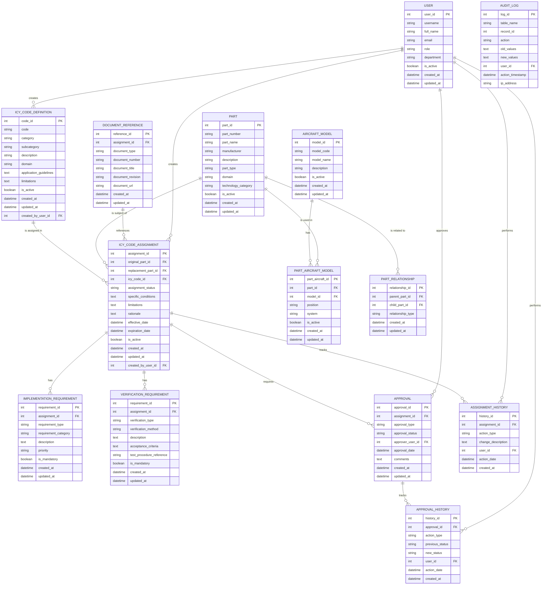

# 🌐 GAIA-QAO Landing Page – Web Gateway Overview

**Version:** 1.0.0  
**Status:** Stable  
**Maintainer:** GAIA-MCP Interface Layer  
**Last Updated:** 2025-05-08  
**Format:** `HTML + JS + MCP-Bound YAML`  
**InfoCode:** GAIA-QAO-WEB-LANDING-GATEWAY-0001

---

## 🛰️ Overview

This repository hosts the landing interface for the **GAIA-QAO Federated Quantum Aerospace Organization**, including:

- Public and internal status visibility (AGAD 10/1 and beyond)
- Federated organizational structure rendering
- Core documentation & ontology links
- Real-time or simulated system reporting via MCP fetch interface

---

## 📁 Directory Structure

```

<!DOCTYPE html>
<html lang="en">
<head>
  <meta charset="UTF-8">
  <title>Quantum Aerospace Organization</title>
</head>
<body>

  <h1>Quantum Aerospace Organization</h1>
  <p><strong>Author:</strong> Amedeo Pelliccia</p>
  <hr>

  <h2>Quantum Aerospace Organization Structure</h2>
  <p><strong>Quantum Aerospace Organization (GAIA‑QAO)</strong> model is composed of five main modules (or virtual teams), working in synergy across domains:</p>

  <ul>
    <li><strong>GAIA-Q‑AIR</strong>: Quantum-enhanced intelligent flight systems, avionics, and mission optimization.</li>
    <li><strong>GAIA‑Q-SPACE</strong>: Orbital and vector systems, mechanics, satellite AI agents, and quantum-secure communication frameworks.</li>
    <li><strong>GAIA-Q-GreenTech</strong>: Sustainable aerospace materials, energy efficiency models, and CO₂-reduction strategies.</li>
    <li><strong>GAIA‑Q-HPC</strong>: High-performance computing infrastructure for quantum simulation, digital twins, and agentic orchestration.</li>
    <li><strong>GAIA‑SCIREF</strong>: Scientific research team focusing on emerging technologies, ontology, ethics, and experimental models.</li>
  </ul>

  <hr>

  <h3>Quick Access Footer Links</h3>
  <ul>
    <li><a href="https://github.com/enterprises/gaia-qao/gaia-air">Gaia‑Q-Air</a></li>
    <li><a href="https://github.com/enterprises/gaia-qao/gaia-space">Gaia‑Q-Space</a></li>
    <li><a href="https://github.com/enterprises/gaia-qao/gaia-greentech">Gaia‑Q-GreenTech</a></li>
    <li><a href="https://github.com/enterprises/gaia-qao/gaia-hpc">Gaia‑Q-High‑Performance‑Computing</a></li>
    <li><a href="https://github.com/enterprises/gaia-qao/gaia-sciref">Gaia‑Science-Research</a></li>
  </ul>


  <h1>📊 Matriz AGAD ↔ TRL ↔ Registro Contextual</h1>
  <p>Esta tabla forma parte del marco AGAD 3.2 y representa la relación entre fases de desarrollo, niveles TRL, datos registrados por AGAD-ID y artefactos V&amp;V en un ciclo aeronáutico completo.</p>

  <table>
    <caption>Fases AGAD, TRL y datos contextualizados</caption>
    <thead>
      <tr>
        <th>Fase AGAD</th>
        <th>Nombre de Fase Principal</th>
        <th>Nivel TRL</th>
        <th>Tipos de datos AGAD-ID registrados</th>
        <th>Procesos de V&amp;V asociados</th>
        <th>Ejemplo de Artefacto V&amp;V</th>
      </tr>
    </thead>
    <tbody>
    
      <tr>
        <td>AGAD 1/1</td><td>Concept Definition</td><td>1</td>
        <td>Mission requirements, primary use-cases, initial feasibility</td>
        <td>Conceptual validation, use-case mapping</td>
        <td>UseCaseReview – mission_concept_review_001.pdf</td>
      </tr>
      <tr>
        <td>AGAD 1/2</td><td>Concept Definition</td><td>2</td>
        <td>High-level objectives, early design constraints</td>
        <td>Conceptual validation, use-case mapping</td>
        <td>FeasibilityStudyReview – concept_feasibility_002.pdf</td>
      </tr>
      <tr>
        <td>AGAD 1/3</td><td>Concept Definition</td><td>3</td>
        <td>Refinement of requirements, cost/performance estimates</td>
        <td>Conceptual validation, use-case mapping</td>
        <td>ConceptModelReview – concept_model_v0.1_review.pdf</td>
      </tr>
      <tr>
        <td>AGAD 1/4</td><td>Concept Definition</td><td>4</td>
        <td>Selection of base concept, preliminary functional architecture</td>
        <td>Conceptual validation, use-case mapping</td>
        <td>ArchitectureReview – prelim_arch_review_001.pdf</td>
      </tr>
      <tr>
        <td>AGAD 1/5</td><td>Concept Definition</td><td>5</td>
        <td>Project plan development, resource allocation, risk plan</td>
        <td>Conceptual validation, use-case mapping</td>
        <td>ProjectPlanReview – project_plan_v0.1_review.pdf</td>
      </tr>
      <tr>
        <td>AGAD 1/6</td><td>Concept Definition</td><td>6</td>
        <td>Proof-of-concept demos, early stakeholder feedback</td>
        <td>Conceptual validation, use-case mapping</td>
        <td>PoC_DemoReview – concept_definition_report_006.pdf</td>
      </tr>
      <tr>
        <td>AGAD 1/7</td><td>Concept Definition</td><td>7</td>
        <td>Environment demonstration, interface validation</td>
        <td>Conceptual validation, use-case mapping</td>
        <td>EnvDemoReview – concept_env_demo_001.pdf</td>
      </tr>
      <tr>
        <td>AGAD 1/8</td><td>Concept Definition</td><td>8</td>
        <td>System qualification review in operational context</td>
        <td>Conceptual validation, use-case mapping</td>
        <td>SystemQualificationReview – concept_definition_report_008.pdf</td>
      </tr>
      <tr>
        <td>AGAD 1/9</td><td>Concept Definition</td><td>9</td>
        <td>Simulated mission success review</td>
        <td>Conceptual validation, use-case mapping</td>
        <td>MissionSuccessReview – concept_definition_report_009.pdf</td>
      </tr>
      <tr>
        <td>AGAD 1/10</td><td>Concept Definition</td><td>10</td>
        <td>Final concept validation</td>
        <td>Conceptual validation, use-case mapping</td>
        <td>FinalConceptValidation – concept_definition_report_010.pdf</td>
      </tr>

      <!-- Phase 2: Preliminary Design -->
      <tr>
        <td>AGAD 2/1</td><td>Preliminary Design</td><td>1</td>
        <td>Identification of main subsystems, trade-off studies, preliminary risk analysis</td>
        <td>Trade-off studies, feasibility checks</td>
        <td>TradeStudyReview – arch_trade_study_001.pdf</td>
      </tr>
      <tr>
        <td>AGAD 2/2</td><td>Preliminary Design</td><td>2</td>
        <td>Definition of subsystem interfaces, candidate technology selection, simulation models</td>
        <td>Trade-off studies, feasibility checks</td>
        <td>InterfaceDefReview – prelim_interface_def_001.pdf</td>
      </tr>
      <tr>
        <td>AGAD 2/3</td><td>Preliminary Design</td><td>3</td>
        <td>Subsystem functional specifications, preliminary performance analysis, supplier identification</td>
        <td>Trade-off studies, feasibility checks</td>
        <td>SubsystemSpecReview – subsystem_func_spec_001.pdf</td>
      </tr>
      <tr>
        <td>AGAD 2/4</td><td>Preliminary Design</td><td>4</td>
        <td>Initial critical component design, detailed cost analysis, prototype development plan</td>
        <td>Trade-off studies, feasibility checks</td>
        <td>CriticalCompReview – crit_comp_design_v0.1.pdf</td>
      </tr>
      <tr>
        <td>AGAD 2/5</td><td>Preliminary Design</td><td>5</td>
        <td>Prototyping of critical components/subsystems, lab PoC testing, simulation validation</td>
        <td>Trade-off studies, feasibility checks</td>
        <td>LabPrototypeTest – prelim_poc_lab_report_001.pdf</td>
      </tr>
      <tr>
        <td>AGAD 2/6</td><td>Preliminary Design</td><td>6</td>
        <td>Subsystem demonstration in relevant environment, interface validation, design refinement</td>
        <td>Trade-off studies, feasibility checks</td>
        <td>SubsystemDemoReview – subsystem_env_demo_001.pdf</td>
      </tr>
      <tr>
        <td>AGAD 2/7</td><td>Preliminary Design</td><td>7</td>
        <td>Integration of subsystems into representative prototype, functional testing</td>
        <td>Trade-off studies, feasibility checks</td>
        <td>SystemPrototypeTest – system_prototype_func_test_001.pdf</td>
      </tr>
      <tr>
        <td>AGAD 2/8</td><td>Preliminary Design</td><td>8</td>
        <td>Fully qualified system via tests/demos in operational environment (preliminary)</td>
        <td>Trade-off studies, feasibility checks</td>
        <td>PrelimSystemQualReview – prelim_system_qual_001.pdf</td>
      </tr>
      <tr>
        <td>AGAD 2/9</td><td>Preliminary Design</td><td>9</td>
        <td>Preliminary mission successfully demonstrated in operational environment</td>
        <td>Trade-off studies, feasibility checks</td>
        <td>PrelimMissionSuccess – prelim_mission_success_001.pdf</td>
      </tr>

      <!-- Phase 3: Analytical Modeling -->
      <tr>
        <td>AGAD 3/1</td><td>Analytical Modeling</td><td>1</td>
        <td>High-level physical & mathematical model definitions, key parameter identification</td>
        <td>Functional simulation, constraints testing</td>
        <td>ModelDefinitionReview – analytical_model_def_001.pdf</td>
      </tr>
      <tr>
        <td>AGAD 3/2</td><td>Analytical Modeling</td><td>2</td>
        <td>Development of simulation scripts/software, initial model calibration</td>
        <td>Functional simulation, constraints testing</td>
        <td>SimulationCodeReview – sim_code_v0.1_review.pdf</td>
      </tr>
      <tr>
        <td>AGAD 3/3</td><td>Analytical Modeling</td><td>3</td>
        <td>Execution of functional simulations, sensitivity analysis of parameters</td>
        <td>Functional simulation, constraints testing</td>
        <td>SimulationResultsAnalysis – func_sim_results_001.pdf</td>
      </tr>
      <tr>
        <td>AGAD 3/4</td><td>Analytical Modeling</td><td>4</td>
        <td>Design optimization based on analytical models, identification of performance bottlenecks</td>
        <td>Functional simulation, constraints testing</td>
        <td>DesignOptimizationReview – analytical_opt_report_001.pdf</td>
      </tr>
      <tr>
        <td>AGAD 3/5</td><td>Analytical Modeling</td><td>5</td>
        <td>Verification of models against limited experimental data, model refinement</td>
        <td>Functional simulation, constraints testing</td>
        <td>ModelVerificationData – model_exp_verification_001.pdf</td>
      </tr>
      <tr>
        <td>AGAD 3/6</td><td>Analytical Modeling</td><td>6</td>
        <td>Failure Modes & Effects Analysis (FMEA) at conceptual level</td>
        <td>Functional simulation, constraints testing</td>
        <td>FMEA_Review – conceptual_fmea_report_001.pdf</td>
      </tr>
      <tr>
        <td>AGAD 3/7</td><td>Analytical Modeling</td><td>7</td>
        <td>Documentation of analytic model results, preparation for detailed design hand-off</td>
        <td>Functional simulation, constraints testing</td>
        <td>DocumentationReview – analytical_model_docs_001.pdf</td>
      </tr>
      <tr>
        <td>AGAD 3/8</td><td>Analytical Modeling</td><td>8</td>
        <td>Critical design review of analytical models, approval to proceed</td>
        <td>Functional simulation, constraints testing</td>
        <td>CriticalDesignReview – analytical_cdr_001.pdf</td>
      </tr>
      <tr>
        <td>AGAD 3/9</td><td>Analytical Modeling</td><td>9</td>
        <td>Final model validation, ready for detailed design input</td>
        <td>Functional simulation, constraints testing</td>
        <td>FinalModelValidation – final_analytical_model_validation.pdf</td>
      </tr>

      <!-- Phase 4: Detailed Design -->
      <tr>
        <td>AGAD 4/1</td><td>Detailed Design</td><td>1</td>
        <td>Component specifications breakdown, detailed interface definitions (ICDs)</td>
        <td>Subsystem modeling, interface V&amp;V</td>
        <td>RequirementsBreakdownReview – component_spec_v0.1.pdf</td>
      </tr>
      <tr>
        <td>AGAD 4/2</td><td>Detailed Design</td><td>2</td>
        <td>CAD models & schematics, final material/process selection</td>
        <td>Subsystem modeling, interface V&amp;V</td>
        <td>CADModelReview – component_cad_review_001.pdf</td>
      </tr>
      <tr>
        <td>AGAD 4/3</td><td>Detailed Design</td><td>3</td>
        <td>FEA/CFD/thermal analyses of components, performance simulation</td>
        <td>Subsystem modeling, interface V&amp;V</td>
        <td>FEA_CFD_ResultsReview – component_analysis_report_001.pdf</td>
      </tr>
      <tr>
        <td>AGAD 4/4</td><td>Detailed Design</td><td>4</td>
        <td>Verification of CAD against requirements, BOM generation</td>
        <td>Subsystem modeling, interface V&amp;V</td>
        <td>DesignVerificationMatrix – component_design_verif_001.pdf</td>
      </tr>
      <tr>
        <td>AGAD 4/5</td><td>Detailed Design</td><td>5</td>
        <td>Prototype component fabrication & testing, interface checks</td>
        <td>Subsystem modeling, interface V&amp;V</td>
        <td>ComponentPrototypeTest – key_component_test_report_001.pdf</td>
      </tr>
      <tr>
        <td>AGAD 4/6</td><td>Detailed Design</td><td>6</td>
        <td>Subsystem assembly design, integration & test planning</td>
        <td>Subsystem modeling, interface V&amp;V</td>
        <td>SubsystemAssemblyReview – subsystem_assembly_plan_001.pdf</td>
      </tr>
      <tr>
        <td>AGAD 4/7</td><td>Detailed Design</td><td>7</td>
        <td>Complete detailed design documentation (drawings, specs, analysis)</td>
        <td>Subsystem modeling, interface V&amp;V</td>
        <td>FullDocReview – detailed_design_doc_package_001.pdf</td>
      </tr>
      <tr>
        <td>AGAD 4/8</td><td>Detailed Design</td><td>8</td>
        <td>Critical design review (CDR) approval to proceed to manufacturing</td>
        <td>Subsystem modeling, interface V&amp;V</td>
        <td>CriticalDesignReview_Detailed – detailed_cdr_001.pdf</td>
      </tr>
      <tr>
        <td>AGAD 4/9</td><td>Detailed Design</td><td>9</td>
        <td>Finalized, frozen design for production/integration</td>
        <td>Subsystem modeling, interface V&amp;V</td>
        <td>DesignFreezeConfirmation – design_freeze_confirm_001.pdf</td>
      </tr>

      <!-- Phase 5: Subsystem Integration -->
      <tr>
        <td>AGAD 5/1</td><td>Subsystem Integration</td><td>1</td>
        <td>Subsystem integration planning, test environment setup, ICD procedures</td>
        <td>ICD verification, agent comms test</td>
        <td>IntegrationPlanReview – subsystem_integ_plan_001.pdf</td>
      </tr>
      <tr>
        <td>AGAD 5/2</td><td>Subsystem Integration</td><td>2</td>
        <td>Fabrication/acquisition of subsystem components, incoming quality inspection</td>
        <td>ICD verification, agent comms test</td>
        <td>IncomingInspection – component_qc_pass_001.pdf</td>
      </tr>
      <tr>
        <td>AGAD 5/3</td><td>Subsystem Integration</td><td>3</td>
        <td>Subsystem assembly, initial functional testing</td>
        <td>ICD verification, agent comms test</td>
        <td>SubsystemFunctionalTest – subsystem_func_test_report_001.pdf</td>
      </tr>
      <tr>
        <td>AGAD 5/4</td><td>Subsystem Integration</td><td>4</td>
        <td>ICD-based integration, physical and logical interface verification</td>
        <td>ICD verification, agent comms test</td>
        <td>ICD_Verification – interface_verif_report_001.pdf</td>
      </tr>
      <tr>
        <td>AGAD 5/5</td><td>Subsystem Integration</td><td>5</td>
        <td>Agent communication tests, data flow validation</td>
        <td>ICD verification, agent comms test</td>
        <td>AgentCommsTest – agent_comms_test_report_001.pdf</td>
      </tr>
      <tr>
        <td>AGAD 5/6</td><td>Subsystem Integration</td><td>6</td>
        <td>Integrated subsystem performance tests in representative lab environment</td>
        <td>ICD verification, agent comms test</td>
        <td>IntegratedSubsystemTest – integ_subsystem_perf_001.pdf</td>
      </tr>
      <tr>
        <td>AGAD 5/7</td><td>Subsystem Integration</td><td>7</td>
        <td>Documentation of integration results, issue identification and corrective actions</td>
        <td>ICD verification, agent comms test</td>
        <td>TestReportReview – subsystem_integ_final_report_001.pdf</td>
      </tr>
      <tr>
        <td>AGAD 5/8</td><td>Subsystem Integration</td><td>8</td>
        <td>Integration review and approval to proceed to system-level integration</td>
        <td>ICD verification, agent comms test</td>
        <td>SubsystemIntegReview – subsystem_integ_approval_001.pdf</td>
      </tr>
      <tr>
        <td>AGAD 5/9</td><td>Subsystem Integration</td><td>9</td>
        <td>Fully validated subsystems ready for system-level integration</td>
        <td>ICD verification, agent comms test</td>
        <td>SubsystemValidationComplete – subsystem_validation_complete_001.pdf</td>
      </tr>

      <!-- Phase 6: Functional Simulation -->
      <tr>
        <td>AGAD 6/1</td><td>Functional Simulation</td><td>1</td>
        <td>Definition of functional simulation scenarios, HIL/SIL/VIL setup</td>
        <td>HIL/SIL/VIL validation, quantum stubs</td>
        <td>SimulationScenarioReview – functional_simulation_report_001.pdf</td>
      </tr>
      <tr>
        <td>AGAD 6/2</td><td>Functional Simulation</td><td>2</td>
        <td>Integration of quantum stubs and AI models into simulation</td>
        <td>HIL/SIL/VIL validation, quantum stubs</td>
        <td>StubIntegrationTest – functional_simulation_report_002.pdf</td>
      </tr>
      <tr>
        <td>AGAD 6/3</td><td>Functional Simulation</td><td>3</td>
        <td>Execution of full-system simulations, data collection</td>
        <td>HIL/SIL/VIL validation, quantum stubs</td>
        <td>SimulationExecutionLog – functional_simulation_report_003.pdf</td>
      </tr>
      <tr>
        <td>AGAD 6/4</td><td>Functional Simulation</td><td>4</td>
        <td>Analysis of simulation results against requirements</td>
        <td>HIL/SIL/VIL validation, quantum stubs</td>
        <td>ResultsAnalysis – functional_simulation_report_004.pdf</td>
      </tr>
      <tr>
        <td>AGAD 6/5</td><td>Functional Simulation</td><td>5</td>
        <td>Validation of HIL/SIL/VIL outputs, discrepancy identification</td>
        <td>HIL/SIL/VIL validation, quantum stubs</td>
        <td>HIL_SIL_VIL_Validation – functional_simulation_report_005.pdf</td>
      </tr>
      <tr>
        <td>AGAD 6/6</td><td>Functional Simulation</td><td>6</td>
        <td>Iterative simulation adjustments, performance optimization</td>
        <td>HIL/SIL/VIL validation, quantum stubs</td>
        <td>IterativeSimReview – functional_simulation_report_006.pdf</td>
      </tr>
      <tr>
        <td>AGAD 6/7</td><td>Functional Simulation</td><td>7</td>
        <td>Documentation of functional simulation validation</td>
        <td>HIL/SIL/VIL validation, quantum stubs</td>
        <td>DocumentationReview – functional_simulation_report_007.pdf</td>
      </tr>
      <tr>
        <td>AGAD 6/8</td><td>Functional Simulation</td><td>8</td>
        <td>Critical review of simulation outcomes, approval to prototype</td>
        <td>HIL/SIL/VIL validation, quantum stubs</td>
        <td>FunctionalValidationReview – functional_simulation_report_008.pdf</td>
      </tr>
      <tr>
        <td>AGAD 6/9</td><td>Functional Simulation</td><td>9</td>
        <td>Final simulation validation, ready for physical prototype</td>
        <td>HIL/SIL/VIL validation, quantum stubs</td>
        <td>SimValidationComplete – functional_simulation_report_009.pdf</td>
      </tr>

      <!-- Phase 7: Prototype Development -->
      <tr>
        <td>AGAD 7/1</td><td>Prototype Development</td><td>1</td>
        <td>Prototype manufacturing plan, material acquisition, tooling preparation</td>
        <td>Lab tests, prototype V&amp;V procedures</td>
        <td>ManufacturingPlanReview – prototype_mfg_plan_001.pdf</td>
      </tr>
      <tr>
        <td>AGAD 7/2</td><td>Prototype Development</td><td>2</td>
        <td>Component and subsystem assembly, quality inspections</td>
        <td>Lab tests, prototype V&amp;V procedures</td>
        <td>AssemblyInspection – prototype_assembly_qc_001.pdf</td>
      </tr>
      <tr>
        <td>AGAD 7/3</td><td>Prototype Development</td><td>3</td>
        <td>Integration of full prototype, initial power-on and basic functional tests</td>
        <td>Lab tests, prototype V&amp;V procedures</td>
        <td>PowerOnTest – prototype_power_on_test_001.pdf</td>
      </tr>
      <tr>
        <td>AGAD 7/4</td><td>Prototype Development</td><td>4</td>
        <td>Execution of lab V&amp;V test plans, data collection</td>
        <td>Lab tests, prototype V&amp;V procedures</td>
        <td>LabTestExecution – prototype_lab_test_data_001.csv</td>
      </tr>
      <tr>
        <td>AGAD 7/5</td><td>Prototype Development</td><td>5</td>
        <td>Analysis of lab test results, comparison with simulation requirements</td>
        <td>Lab tests, prototype V&amp;V procedures</td>
        <td>LabTestAnalysis – lab_test_analysis_001.pdf</td>
      </tr>
      <tr>
        <td>AGAD 7/6</td><td>Prototype Development</td><td>6</td>
        <td>Identification and correction of prototype deviations, retesting</td>
        <td>Lab tests, prototype V&amp;V procedures</td>
        <td>CorrectiveActionReview – prototype_fixes_retest_001.pdf</td>
      </tr>
      <tr>
        <td>AGAD 7/7</td><td>Prototype Development</td><td>7</td>
        <td>Documentation of prototype build and test results</td>
        <td>Lab tests, prototype V&amp;V procedures</td>
        <td>DocumentationReview – prototype_realization_docs_001.pdf</td>
      </tr>
      <tr>
        <td>AGAD 7/8</td><td>Prototype Development</td><td>8</td>
        <td>Prototype review and approval to proceed to system validation</td>
        <td>Lab tests, prototype V&amp;V procedures</td>
        <td>PrototypeReview – prototype_review_approval_001.pdf</td>
      </tr>
      <tr>
        <td>AGAD 7/9</td><td>Prototype Development</td><td>9</td>
        <td>Complete, tested prototype ready for system-level validation</td>
        <td>Lab tests, prototype V&amp;V procedures</td>
        <td>PrototypeComplete – prototype_complete_validation_001.pdf</td>
      </tr>

      <!-- Phase 8: System Validation -->
      <tr>
        <td>AGAD 8/1</td><td>System Validation</td><td>1</td>
        <td>System-level test plans, integrated test setups, audit checklists</td>
        <td>System-level verification, audits</td>
        <td>SystemValidationPlanReview – system_validation_report_001.pdf</td>
      </tr>
      <tr>
        <td>AGAD 8/2</td><td>System Validation</td><td>2</td>
        <td>Prototype preparation for system testing, environmental chamber setups</td>
        <td>System-level verification, audits</td>
        <td>TestReadinessReview – system_val_readiness_002.pdf</td>
      </tr>
      <tr>
        <td>AGAD 8/3</td><td>System Validation</td><td>3</td>
        <td>Execution of system validation tests, data acquisition</td>
        <td>System-level verification, audits</td>
        <td>SystemTestExecution – system_val_test_data_003.csv</td>
      </tr>
      <tr>
        <td>AGAD 8/4</td><td>System Validation</td><td>4</td>
        <td>Analysis of test results against requirements, compliance checks</td>
        <td>System-level verification, audits</td>
        <td>ResultsComplianceAnalysis – system_val_compliance_004.pdf</td>
      </tr>
      <tr>
        <td>AGAD 8/5</td><td>System Validation</td><td>5</td>
        <td>Internal system audits, documentation reviews</td>
        <td>System-level verification, audits</td>
        <td>InternalAudit – system_val_internal_audit_005.pdf</td>
      </tr>
      <tr>
        <td>AGAD 8/6</td><td>System Validation</td><td>6</td>
        <td>Non-conformance identification and CAPA implementation</td>
        <td>System-level verification, audits</td>
        <td>CAPAReview – system_capa_log_006.pdf</td>
      </tr>
      <tr>
        <td>AGAD 8/7</td><td>System Validation</td><td>7</td>
        <td>Comprehensive validation documentation, pre-certification prep</td>
        <td>System-level verification, audits</td>
        <td>DocumentationReview – system_val_docs_007.pdf</td>
      </tr>
      <tr>
        <td>AGAD 8/8</td><td>System Validation</td><td>8</td>
        <td>Validation gate review and approval for certification testing</td>
        <td>System-level verification, audits</td>
        <td>SystemValidationGateReview – system_val_gate_008.pdf</td>
      </tr>
      <tr>
        <td>AGAD 8/9</td><td>System Validation</td><td>9</td>
        <td>Complete system validated in representative environment</td>
        <td>System-level verification, audits</td>
        <td>SystemValidationComplete – system_val_final_009.pdf</td>
      </tr>

      <!-- Phase 9: Certification -->
      <tr>
        <td>AGAD 9/1</td><td>Certification</td><td>1</td>
        <td>Regulatory compliance documentation, initial certification test results</td>
        <td>Regulatory conformance, documentation</td>
        <td>CertificationPackageAudit – cert_package_submission_001.zip</td>
      </tr>
      <tr>
        <td>AGAD 9/2</td><td>Certification</td><td>2</td>
        <td>Ground conformity tests with certifying authorities</td>
        <td>Regulatory conformance, documentation</td>
        <td>GroundConformityTest – ground_conformity_witness_002.pdf</td>
      </tr>
      <tr>
        <td>AGAD 9/3</td><td>Certification</td><td>3</td>
        <td>Certification flight tests, flight data collection for compliance</td>
        <td>Regulatory conformance, documentation</td>
        <td>CertificationFlightTest – cert_flight_test_data_003.csv</td>
      </tr>
      <tr>
        <td>AGAD 9/4</td><td>Certification</td><td>4</td>
        <td>Analysis of certification test data, regulatory compliance demonstration</td>
        <td>Regulatory conformance, documentation</td>
        <td>DataAnalysisForCompliance – cert_compliance_report_004.pdf</td>
      </tr>
      <tr>
        <td>AGAD 9/5</td><td>Certification</td><td>5</td>
        <td>Interaction logs with authorities, responses to findings</td>
        <td>Regulatory conformance, documentation</td>
        <td>RegulatoryInteractionLog – authority_correspondence_005.log</td>
      </tr>
      <tr>
        <td>AGAD 9/6</td><td>Certification()</td><td>6</td>
        <td>Implementation of required modifications per authority feedback</td>
        <td>Regulatory conformance, documentation</td>
        <td>ModificationCompliance – cert_mod_compliance_006.pdf</td>
      </tr>
      <tr>
        <td>AGAD 9/7</td><td>Certification</td><td>7</td>
        <td>Receipt of Type Certificate (TC) or equivalent authorization</td>
        <td>Regulatory conformance, documentation</td>
        <td>TypeCertificateReceipt – type_certificate_scan_007.pdf</td>
      </tr>
      <tr>
        <td>AGAD 9/8</td><td>Certification</td><td>8</td>
        <td>Final production documentation and entry-into-service planning</td>
        <td>Regulatory conformance, documentation</td>
        <td>ProductionDocReview – final_production_docs_008.pdf</td>
      </tr>
      <tr>
        <td>AGAD 9/9</td><td>Certification</td><td>9</td>
        <td>Aircraft certified and ready for serial production and deployment</td>
        <td>Regulatory conformance, documentation</td>
        <td>CertificationComplete – full_certification_summary_009.pdf</td>
      </tr>

      <!-- Phase 10: Operational Use -->
      <tr>
        <td>AGAD 10/1</td><td>Operational Use</td><td>1</td>
        <td>Entry-into-service planning, support infrastructure setup</td>
        <td>Operational V&amp;V, user feedback loop</td>
        <td>EntryIntoServicePlanReview – eis_plan_001.pdf</td>
      </tr>
      <tr>
        <td>AGAD 10/2</td><td>Operational Use</td><td>2</td>
        <td>First aircraft deliveries, crew and ground staff training</td>
        <td>Operational V&amp;V, user feedback loop</td>
        <td>DeliveryAcceptance – delivery_acceptance_002.pdf</td>
      </tr>
      <tr>
        <td>AGAD 10/3</td><td>Operational Use</td><td>3</td>
        <td>Initial operational flights, in-service performance data collection</td>
        <td>Operational V&amp;V, user feedback loop</td>
        <td>InitialOpDataCollection – op_data_003.csv</td>
      </tr>
      <tr>
        <td>AGAD 10/4</td><td>Operational Use</td><td>4</td>
        <td>Ongoing performance monitoring, comparison against predictions</td>
        <td>Operational V&amp;V, user feedback loop</td>
        <td>PerformanceMonitoring – perf_monitoring_004.pdf</td>
      </tr>
      <tr>
        <td>AGAD 10/5</td><td>Operational Use</td><td>5</td>
        <td>User feedback analysis from crews, maintenance teams, passengers</td>
        <td>Operational V&amp;V, user feedback loop</td>
        <td>UserFeedbackAnalysis – feedback_summary_005.pdf</td>
      </tr>
      <tr>
        <td>AGAD 10/6</td><td>Operational Use</td><td>6</td>
        <td>Implementation of minor updates and service bulletins</td>
        <td>Operational V&amp;V, user feedback loop</td>
        <td>ServiceBulletinCompliance – sb_compliance_006.pdf</td>
      </tr>
      <tr>
        <td>AGAD 10/7</td><td>Operational Use</td><td>7</td>
        <td>Operational and safety audits, continuous conformity checks</td>
        <td>Operational V&amp;V, user feedback loop</td>
        <td>OperationalAudit – op_audit_007.pdf</td>
      </tr>
      <tr>
        <td>AGAD 10/8</td><td>Operational Use</td><td>8</td>
        <td>Optimization of maintenance procedures and SOPs based on data</td>
        <td>Operational V&amp;V, user feedback loop</td>
        <td>ProcedureOptimizationReview – sop_optimization_008.pdf</td>       	
      </tr>
      <tr>
        <td>AGAD 10/9</td><td>Operational Use</td><td>9</td>
        <td>Stable, mature operations with continuous improvement feeding the Digital Twin</td>
        <td>Operational V&amp;V, user feedback loop</td>
        <td>MatureOpsReview – mature_ops_009.pdf</td>
      </tr>

      <!-- Phase 11: Lifecycle Sustainment -->
      <tr>  
        <td>AGAD 11/1</td><td>Lifecycle Sustainment</td><td>1</td>
        <td>Long-term support plan, obsolescence management, spare parts supply chain</td>
        <td>Evolutionary V&amp;V, twin alignment</td>
        <td>LongTermSupportPlanReview – ltsp_v1.0.pdf</td>
      </tr>
      <tr>
        <td>AGAD 11/2</td><td>Lifecycle Sustainment</td><td>2</td>
        <td>Continuous fleet health monitoring via Digital Twin, RUL prediction</td>
        <td>Evolutionary V&amp;V, twin alignment</td>
        <td>FleetHealthMonitoring – fleet_rul_prediction_accuracy_001.pdf</td>
      </tr>
      <tr>
        <td>AGAD 11/3</td><td>Lifecycle Sustainment</td><td>3</td>
        <td>Implementation of CBM (Condition-Based Maintenance) programs</td>
        <td>Evolutionary V&amp;V, twin alignment</td>
        <td>CBM_EffectivenessReview – cbm_program_effectiveness_001.pdf</td>
      </tr>
      <tr>
        <td>AGAD 11/4</td><td>Lifecycle Sustainment</td><td>4</td>
        <td>Major update and modernization planning and execution</td>
        <td>Evolutionary V&amp;V, twin alignment</td>
        <td>UpgradeProgramValidation – upgrade_package_vv_001.pdf</td>
      </tr>
      <tr>
        <td>AGAD 11/5</td><td>Lifecycle Sustainment</td><td>5</td>
        <td>Configuration management across the fleet, traceability maintenance</td>
        <td>Evolutionary V&amp;V, twin alignment</td>
        <td>ConfigAudit – fleet_config_audit_001.pdf</td>        
      </tr>
      <tr>
        <td>AGAD 11/6</td><td>Lifecycle Sustainment</td><td>6</td>
        <td>Continuous Digital Twin alignment and model calibration</td>
        <td>Evolutionary V&amp;V, twin alignment</td>
        <td>DigitalTwinAlignmentCheck – dt_alignment_accuracy_001.pdf</td>
      </tr>
      <tr>
        <td>AGAD 11/7</td><td>Lifecycle Sustainment</td><td>7</td>
        <td>Lifecycle cost optimization and support profitability analysis</td>
        <td>Evolutionary V&amp;V, twin alignment</td>
        <td>LCC_AnalysisReview – lifecycle_cost_optimization_report_001.pdf</td>
      </tr>
      <tr>
        <td>AGAD 11/8</td><td>Lifecycle Sustainment</td><td>8</td>
        <td>End-of-life planning for fleet and individual components</td>
        <td>Evolutionary V&amp;V, twin alignment</td>
        <td>EOL_PlanReview – end_of_life_plan_v1.0.pdf</td>
      </tr>
      <tr>
        <td>AGAD 11/9</td><td>Lifecycle Sustainment</td><td>9</td>
        <td>Mature sustainment system, robust processes for entire lifecycle management</td>
        <td>Evolutionary V&amp;V, twin alignment</td>
        <td>SustainmentProgramReview – sustainment_program_effectiveness_final.pdf</td>
      </tr>

      <!-- Phase 12: Decommission & Recycle -->
      <tr>
        <td>AGAD 12/1</td><td>Decommission &amp; Recycle</td><td>1</td>
        <td>Disassembly &amp; recycling plan, material segregation reports, EOL impact assessments</td>
        <td>End-of-life V&amp;V, material traceability audits</td>
        <td>DecomPlanReview – decommission_recycle_report_001.pdf</td>
      </tr>
      <tr>
        <td>AGAD 12/2</td><td>Decommission &amp; Recycle</td><td>2</td>
        <td>Identification &amp; qualification of recycling partners, reverse logistics setup</td>
        <td>End-of-life V&amp;V, material traceability audits</td>
        <td>PartnerAudit – decommission_recycle_report_002.pdf</td>
      </tr>
      <tr>
        <td>AGAD 12/3</td><td>Decommission &amp; Recycle</td><td>3</td>
        <td>Safe disassembly procedures, neutralization of hazardous/quantum materials</td>
        <td>End-of-life V&amp;V, material traceability audits</td>
        <td>SafeDecomProcedureReview – decommission_recycle_report_003.pdf</td>
      </tr>
      <tr>
        <td>AGAD 12/4</td><td>Decommission &amp; Recycle</td><td>4</td>
        <td>Material segregation for recycling, reuse or disposal, value-recovery optimization</td>
        <td>End-of-life V&amp;V, material traceability audits</td>
        <td>MaterialSegregationAudit – decommission_recycle_report_004.pdf</td>
      </tr>
      <tr>
        <td>AGAD 12/5</td><td>Decommission &amp; Recycle</td><td>5</td>
        <td>Traceability audits of recycled materials and reusable parts, circularity metrics</td>
        <td>End-of-life V&amp;V, material traceability audits</td>
        <td>TraceabilityAudit – decommission_recycle_report_005.pdf</td>
      </tr>
      <tr>
        <td>AGAD 12/6</td><td>Decommission &amp; Recycle</td><td>6</td>
        <td>Environmental impact &amp; recovery reports, documentation of EOL processes</td>
        <td>End-of-life V&amp;V, material traceability audits</td>
        <td>EOL_ReportReview – decommission_recycle_report_006.pdf</td>
      </tr>
      <tr>
        <td>AGAD 12/7</td><td>Decommission &amp; Recycle</td><td>7</td>
        <td>Regulatory &amp; sustainability compliance checks for EOL</td>
        <td>End-of-life V&amp;V, material traceability audits</td>
        <td>RegulatoryComplianceEOL – decommission_recycle_report_007.pdf</td>
      </tr>
      <tr>
        <td>AGAD 12/8</td><td>Decommission &amp; Recycle</td><td>8</td>
        <td>Design feedback for future DfD/DfR (Design for Disassembly/Recycling)</td>
        <td>End-of-life V&amp;V, material traceability audits</td>
        <td>DesignFeedbackLoopReview – decommission_recycle_report_008.pdf</td>
      </tr>
      <tr>
        <td>AGAD 12/9</td><td>Decommission &amp; Recycle</td><td>9</td>
        <td>Complete EOL process documentation, lessons learned for continuous improvement</td>
        <td>End-of-life V&amp;V, material traceability audits</td>
        <td>EOL_ProcessCompleteReview – decommission_recycle_report_009.pdf</td>
      </tr>
    </tbody>
  </# Matriz AGAD ↔ TRL ↔ Registro Contextual (AGAD-ID)

| Fase AGAD | Nombre de Fase Principal  | Nivel TRL | Tipos de datos AGAD-ID registrados (Ejemplos)                                                                                                | Procesos de V&V asociados                                  | Ejemplo de Artefacto V&V (Conceptual)                                                                 |
| :-------- | :------------------------ | :-------- | :------------------------------------------------------------------------------------------------------------------------------------------- | :--------------------------------------------------------- | :---------------------------------------------------------------------------------------------------- |
| AGAD 1/1  | Concept Definition        | 1         | Requisitos de misión iniciales, análisis de mercado, identificación de stakeholders, casos de uso primarios, decisiones de viabilidad conceptual. | Conceptual validation, use-case mapping                    | `VerificationMethod: [UseCaseReview]`, `ValidationReport: mission_concept_review_001.pdf`, `Passed: true`, `Coverage: N/A` |
| AGAD 1/2  | Concept Definition        | 2         | Definición de objetivos de alto nivel, primeras restricciones de diseño, evaluación inicial de tecnologías clave, datos de tendencias.            | Conceptual validation, use-case mapping                    | `VerificationMethod: [FeasibilityStudy]`, `ValidationReport: tech_feasibility_study_001.pdf`, `Passed: true`, `Coverage: N/A` |
| AGAD 1/3  | Concept Definition        | 3         | Refinamiento de requisitos, análisis de alternativas conceptuales, primeras estimaciones de coste/rendimiento, modelado conceptual básico.       | Conceptual validation, use-case mapping                    | `VerificationMethod: [ConceptModelReview]`, `ValidationReport: concept_model_v0.1_review.pdf`, `Passed: true`, `Coverage: N/A` |
| AGAD 1/4  | Concept Definition        | 4         | Selección del concepto base, definición de la arquitectura funcional preliminar, identificación de interfaces críticas.                     | Conceptual validation, use-case mapping                    | `VerificationMethod: [ArchitectureReview]`, `ValidationReport: prelim_arch_review_001.pdf`, `Passed: true`, `Coverage: N/A` |
| AGAD 1/5  | Concept Definition        | 5         | Desarrollo del plan de proyecto, asignación de recursos preliminar, definición del plan de gestión de riesgos conceptual.                   | Conceptual validation, use-case mapping                    | `VerificationMethod: [ProjectPlanReview]`, `ValidationReport: project_plan_v0.1_review.pdf`, `Passed: true`, `Coverage: N/A` |
| AGAD 1/6  | Concept Definition        | 6         | Pruebas de concepto (PoC) para tecnologías críticas, validación de modelos de simulación de bajo nivel, feedback inicial de stakeholders.      | Conceptual validation, use-case mapping                    | `VerificationMethod: [PoC_Demo]`, `ValidationReport: crit_tech_poc_report_001.pdf`, `Passed: true`, `Coverage: N/A` |
| AGAD 1/7  | Concept Definition        | 7         | Demostración del concepto en entorno relevante, validación de interfaces clave, refinamiento de la arquitectura funcional.                  | Conceptual validation, use-case mapping                    | `VerificationMethod: [EnvDemoReview]`, `ValidationReport: concept_env_demo_001.pdf`, `Passed: true`, `Coverage: N/A` |
| AGAD 1/8  | Concept Definition        | 8         | Sistema completo y cualificado a través de pruebas y demostraciones en su entorno operacional final (conceptual).                           | Conceptual validation, use-case mapping                    | `VerificationMethod: [SystemQualificationReview]`, `ValidationReport: system_qual_review_001.pdf`, `Passed: true`, `Coverage: N/A` |
| AGAD 1/9  | Concept Definition        | 9         | Misión conceptual probada con éxito en el entorno operacional (simulado para la fase de concepto).                                          | Conceptual validation, use-case mapping                    | `VerificationMethod: [MissionSuccessReview]`, `ValidationReport: mission_sim_success_001.pdf`, `Passed: true`, `Coverage: N/A` |
| AGAD 2/1  | Preliminary Design        | 1         | Identificación de subsistemas principales, estudios de trade-off de arquitecturas, análisis de riesgos técnicos preliminares.              | Trade-off studies, feasibility checks                      | `VerificationMethod: [TradeStudyReview]`, `ValidationReport: arch_trade_study_001.pdf`, `Passed: true`, `Coverage: N/A` |
| AGAD 2/2  | Preliminary Design        | 2         | Definición de interfaces de subsistemas, selección de tecnologías candidatas, modelos de simulación de subsistemas.                         | Trade-off studies, feasibility checks                      | `VerificationMethod: [InterfaceDefReview]`, `ValidationReport: prelim_interface_def_001.pdf`, `Passed: true`, `Coverage: N/A` |
| AGAD 2/3  | Preliminary Design        | 3         | Especificaciones funcionales de subsistemas, análisis de rendimiento preliminar, identificación de proveedores clave.                       | Trade-off studies, feasibility checks                      | `VerificationMethod: [SubsystemSpecReview]`, `ValidationReport: subsystem_func_spec_001.pdf`, `Passed: true`, `Coverage: N/A` |
| AGAD 2/4  | Preliminary Design        | 4         | Diseño preliminar de componentes críticos, análisis de costes detallado, plan de desarrollo de prototipos.                                  | Trade-off studies, feasibility checks                      | `VerificationMethod: [CriticalCompReview]`, `ValidationReport: crit_comp_design_v0.1.pdf`, `Passed: true`, `Coverage: N/A` |
| AGAD 2/5  | Preliminary Design        | 5         | Prototipado de componentes/subsistemas críticos, pruebas de concepto en laboratorio, validación de modelos de simulación.                  | Trade-off studies, feasibility checks                      | `VerificationMethod: [LabPrototypeTest]`, `ValidationReport: subsystem_poc_lab_report_001.pdf`, `Passed: true`, `Coverage: N/A` |
| AGAD 2/6  | Preliminary Design        | 6         | Demostración de subsistemas en entorno relevante, validación de interfaces, refinamiento del diseño preliminar.                          | Trade-off studies, feasibility checks                      | `VerificationMethod: [SubsystemDemoReview]`, `ValidationReport: subsystem_env_demo_001.pdf`, `Passed: true`, `Coverage: N/A` |
| AGAD 2/7  | Preliminary Design        | 7         | Integración de subsistemas en un prototipo representativo del sistema, pruebas funcionales.                                                | Trade-off studies, feasibility checks                      | `VerificationMethod: [SystemPrototypeTest]`, `ValidationReport: system_prototype_func_test_001.pdf`, `Passed: true`, `Coverage: N/A` |
| AGAD 2/8  | Preliminary Design        | 8         | Sistema completo y cualificado a través de pruebas y demostraciones en su entorno operacional (preliminar).                               | Trade-off studies, feasibility checks                      | `VerificationMethod: [PrelimSystemQualReview]`, `ValidationReport: prelim_system_qual_001.pdf`, `Passed: true`, `Coverage: N/A` |
| AGAD 2/9  | Preliminary Design        | 9         | Misión preliminar probada con éxito en el entorno operacional (con prototipo).                                                              | Trade-off studies, feasibility checks                      | `VerificationMethod: [PrelimMissionSuccess]`, `ValidationReport: prelim_mission_success_001.pdf`, `Passed: true`, `Coverage: N/A` |
| AGAD 3/1  | Analytical Modeling       | 1         | Definición de modelos físicos y matemáticos de alto nivel, identificación de parámetros clave para análisis.                               | Functional simulation, constraints test                    | `VerificationMethod: [ModelDefinitionReview]`, `ValidationReport: analytical_model_def_001.pdf`, `Passed: true`, `Coverage: N/A` |
| AGAD 3/2  | Analytical Modeling       | 2         | Desarrollo de software/scripts para simulación analítica, calibración inicial de modelos.                                                  | Functional simulation, constraints test                    | `VerificationMethod: [SimulationCodeReview]`, `ValidationReport: sim_code_v0.1_review.pdf`, `Passed: true`, `Coverage: N/A` |
| AGAD 3/3  | Analytical Modeling       | 3         | Ejecución de simulaciones funcionales, análisis de sensibilidad de parámetros, validación de restricciones de diseño.                        | Functional simulation, constraints test                    | `VerificationMethod: [SimulationResultsAnalysis]`, `ValidationReport: func_sim_results_001.pdf`, `Passed: true`, `Coverage: N/A` |
| AGAD 3/4  | Analytical Modeling       | 4         | Optimización de diseño basada en modelos analíticos, identificación de puntos críticos de rendimiento.                                    | Functional simulation, constraints test                    | `VerificationMethod: [DesignOptimizationReview]`, `ValidationReport: analytical_opt_report_001.pdf`, `Passed: true`, `Coverage: N/A` |
| AGAD 3/5  | Analytical Modeling       | 5         | Verificación de modelos analíticos con datos experimentales limitados (si disponibles), ajuste de modelos.                                | Functional simulation, constraints test                    | `VerificationMethod: [ModelVerificationData]`, `ValidationReport: model_exp_verification_001.pdf`, `Passed: true`, `Coverage: N/A` |
| AGAD 3/6  | Analytical Modeling       | 6         | Refinamiento de modelos analíticos, análisis de modos de fallo y efectos (FMEA) a nivel conceptual.                                       | Functional simulation, constraints test                    | `VerificationMethod: [FMEA_Review]`, `ValidationReport: conceptual_fmea_report_001.pdf`, `Passed: true`, `Coverage: N/A` |
| AGAD 3/7  | Analytical Modeling       | 7         | Documentación de modelos analíticos y resultados, preparación para diseño detallado.                                                       | Functional simulation, constraints test                    | `VerificationMethod: [DocumentationReview]`, `ValidationReport: analytical_model_docs_001.pdf`, `Passed: true`, `Coverage: N/A` |
| AGAD 3/8  | Analytical Modeling       | 8         | Revisión crítica del diseño analítico, aprobación para proceder a diseño detallado.                                                        | Functional simulation, constraints test                    | `VerificationMethod: [CriticalDesignReview]`, `ValidationReport: analytical_cdr_001.pdf`, `Passed: true`, `Coverage: N/A` |
| AGAD 3/9  | Analytical Modeling       | 9         | Modelos analíticos validados y listos para informar el diseño detallado.                                                                   | Functional simulation, constraints test                    | `VerificationMethod: [FinalModelValidation]`, `ValidationReport: final_analytical_model_validation.pdf`, `Passed: true`, `Coverage: N/A` |
| AGAD 4/1  | Detailed Design           | 1         | Desglose de especificaciones de subsistemas a componentes, definición de interfaces detalladas (ICDs).                                   | Subsystem modeling, interface V&V                          | `VerificationMethod: [RequirementsBreakdownReview]`, `ValidationReport: component_spec_v0.1.pdf`, `Passed: true`, `Coverage: N/A` |
| AGAD 4/2  | Detailed Design           | 2         | Diseño detallado de componentes (CAD, esquemas), selección final de materiales y procesos de fabricación.                                 | Subsystem modeling, interface V&V                          | `VerificationMethod: [CADModelReview]`, `ValidationReport: component_cad_review_001.pdf`, `Passed: true`, `Coverage: N/A` |
| AGAD 4/3  | Detailed Design           | 3         | Análisis detallado de componentes (FEM, CFD, térmico), simulación de rendimiento de componentes.                                          | Subsystem modeling, interface V&V                          | `VerificationMethod: [FEA_CFD_ResultsReview]`, `ValidationReport: component_analysis_report_001.pdf`, `Passed: true`, `Coverage: N/A` |
| AGAD 4/4  | Detailed Design           | 4         | Verificación del diseño de componentes contra especificaciones, creación de BOM detallada.                                                 | Subsystem modeling, interface V&V                          | `VerificationMethod: [DesignVerificationMatrix]`, `ValidationReport: component_design_verif_001.pdf`, `Passed: true`, `Coverage: N/A` |
| AGAD 4/5  | Detailed Design           | 5         | Prototipado y prueba de componentes clave, validación de interfaces de componentes.                                                      | Subsystem modeling, interface V&V                          | `VerificationMethod: [ComponentPrototypeTest]`, `ValidationReport: key_component_test_report_001.pdf`, `Passed: true`, `Coverage: N/A` |
| AGAD 4/6  | Detailed Design           | 6         | Diseño detallado de ensamblajes de subsistemas, planes de integración y prueba de subsistemas.                                            | Subsystem modeling, interface V&V                          | `VerificationMethod: [SubsystemAssemblyReview]`, `ValidationReport: subsystem_assembly_plan_001.pdf`, `Passed: true`, `Coverage: N/A` |
| AGAD 4/7  | Detailed Design           | 7         | Documentación completa del diseño detallado (planos, especificaciones, informes de análisis).                                              | Subsystem modeling, interface V&V                          | `VerificationMethod: [FullDocReview]`, `ValidationReport: detailed_design_doc_package_001.pdf`, `Passed: true`, `Coverage: N/A` |
| AGAD 4/8  | Detailed Design           | 8         | Revisión crítica del diseño detallado (CDR), aprobación para la fabricación e integración.                                               | Subsystem modeling, interface V&V                          | `VerificationMethod: [CriticalDesignReview_Detailed]`, `ValidationReport: detailed_cdr_001.pdf`, `Passed: true`, `Coverage: N/A` |
| AGAD 4/9  | Detailed Design           | 9         | Diseño detallado completo, validado, y congelado para producción/integración.                                                              | Subsystem modeling, interface V&V                          | `VerificationMethod: [DesignFreezeConfirmation]`, `ValidationReport: design_freeze_confirm_001.pdf`, `Passed: true`, `Coverage: N/A` |
| AGAD 5/1  | Subsystem Integration     | 1         | Planificación de la integración de subsistemas, preparación de entornos de prueba, definición de procedimientos de ICD.                  | ICD verification, agent comms test                         | `VerificationMethod: [IntegrationPlanReview]`, `ValidationReport: subsystem_integ_plan_001.pdf`, `Passed: true`, `Coverage: N/A` |
| AGAD 5/2  | Subsystem Integration     | 2         | Fabricación/adquisición de componentes de subsistemas, inspección de calidad de entrada.                                                 | ICD verification, agent comms test                         | `VerificationMethod: [IncomingInspection]`, `ValidationReport: component_qc_pass_001.pdf`, `Passed: true`, `Coverage: N/A` |
| AGAD 5/3  | Subsystem Integration     | 3         | Ensamblaje de subsistemas, pruebas funcionales iniciales de subsistemas individuales.                                                    | ICD verification, agent comms test                         | `VerificationMethod: [SubsystemFunctionalTest]`, `ValidationReport: subsystem_func_test_report_001.pdf`, `Passed: true`, `Coverage: N/A` |
| AGAD 5/4  | Subsystem Integration     | 4         | Integración de subsistemas según ICDs, verificación de interfaces físicas y lógicas.                                                     | ICD verification, agent comms test                         | `VerificationMethod: [ICD_Verification]`, `ValidationReport: interface_verif_report_001.pdf`, `Passed: true`, `Coverage: N/A` |
| AGAD 5/5  | Subsystem Integration     | 5         | Pruebas de comunicación entre agentes/módulos de subsistemas, validación de flujo de datos.                                               | ICD verification, agent comms test                         | `VerificationMethod: [AgentCommsTest]`, `ValidationReport: agent_comms_test_report_001.pdf`, `Passed: true`, `Coverage: N/A` |
| AGAD 5/6  | Subsystem Integration     | 6         | Pruebas de rendimiento de subsistemas integrados, validación en entorno de laboratorio representativo.                                    | ICD verification, agent comms test                         | `VerificationMethod: [IntegratedSubsystemTest]`, `ValidationReport: integ_subsystem_perf_001.pdf`, `Passed: true`, `Coverage: N/A` |
| AGAD 5/7  | Subsystem Integration     | 7         | Documentación de resultados de integración y pruebas de subsistemas, identificación de problemas y acciones correctivas.                 | ICD verification, agent comms test                         | `VerificationMethod: [TestReportReview]`, `ValidationReport: subsystem_integ_final_report_001.pdf`, `Passed: true`, `Coverage: N/A` |
| AGAD 5/8  | Subsystem Integration     | 8         | Revisión de la integración de subsistemas, aprobación para la integración a nivel de sistema.                                              | ICD verification, agent comms test                         | `VerificationMethod: [SubsystemIntegReview]`, `ValidationReport: subsystem_integ_approval_001.pdf`, `Passed: true`, `Coverage: N/A` |
| AGAD 5/9  | Subsystem Integration     | 9         | Subsistemas integrados y validados, listos para la integración a nivel de sistema completo.                                                | ICD verification, agent comms test                         | `VerificationMethod: [SubsystemValidationComplete]`, `ValidationReport: subsystem_validation_complete_001.pdf`, `Passed: true`, `Coverage: N/A` |
| AGAD 6/1  | Functional Simulation     | 1         | Definición de escenarios de simulación funcional completa del sistema, configuración de modelos HIL/SIL/VIL.                             | HIL/SIL/VIL validation, quantum stubs                      | `VerificationMethod: [SimulationScenarioReview]`, `ValidationReport: full_sim_scenario_def_001.pdf`, `Passed: true`, `Coverage: N/A` |
| AGAD 6/2  | Functional Simulation     | 2         | Integración de stubs cuánticos y modelos de IA en el entorno de simulación.                                                              | HIL/SIL/VIL validation, quantum stubs                      | `VerificationMethod: [StubIntegrationTest]`, `ValidationReport: quantum_ai_stub_integ_001.pdf`, `Passed: true`, `Coverage: N/A` |
| AGAD 6/3  | Functional Simulation     | 3         | Ejecución de simulaciones funcionales completas, recolección de datos de rendimiento.                                                      | HIL/SIL/VIL validation, quantum stubs                      | `VerificationMethod: [SimulationExecutionLog]`, `ValidationReport: full_system_sim_run_001.log`, `Passed: true`, `Coverage: N/A` |
| AGAD 6/4  | Functional Simulation     | 4         | Análisis de resultados de simulación, comparación con requisitos y modelos analíticos.                                                   | HIL/SIL/VIL validation, quantum stubs                      | `VerificationMethod: [ResultsAnalysis]`, `ValidationReport: sim_results_vs_reqs_001.pdf`, `Passed: true`, `Coverage: N/A` |
| AGAD 6/5  | Functional Simulation     | 5         | Validación de HIL/SIL/VIL, identificación de discrepancias y necesidad de ajustes en diseño o modelos.                                  | HIL/SIL/VIL validation, quantum stubs                      | `VerificationMethod: [HIL_SIL_VIL_Validation]`, `ValidationReport: hil_sil_vil_validation_report_001.pdf`, `Passed: true`, `Coverage: N/A` |
| AGAD 6/6  | Functional Simulation     | 6         | Iteración de simulaciones con ajustes, optimización del rendimiento del sistema en simulación.                                           | HIL/SIL/VIL validation, quantum stubs                      | `VerificationMethod: [IterativeSimReview]`, `ValidationReport: optimized_sim_run_002.log`, `Passed: true`, `Coverage: N/A` |
| AGAD 6/7  | Functional Simulation     | 7         | Documentación de la validación funcional completa a través de simulación.                                                                | HIL/SIL/VIL validation, quantum stubs                      | `VerificationMethod: [DocumentationReview]`, `ValidationReport: functional_sim_validation_docs_001.pdf`, `Passed: true`, `Coverage: N/A` |
| AGAD 6/8  | Functional Simulation     | 8         | Revisión de la validación funcional, aprobación para la realización del prototipo completo.                                                 | HIL/SIL/VIL validation, quantum stubs                      | `VerificationMethod: [FunctionalValidationReview]`, `ValidationReport: func_val_approval_001.pdf`, `Passed: true`, `Coverage: N/A` |
| AGAD 6/9  | Functional Simulation     | 9         | Sistema funcionalmente validado en simulación, listo para prototipado físico completo.                                                   | HIL/SIL/VIL validation, quantum stubs                      | `VerificationMethod: [SimValidationComplete]`, `ValidationReport: sim_validation_complete_001.pdf`, `Passed: true`, `Coverage: N/A` |
| AGAD 7/1  | Prototype Development     | 1         | Plan de fabricación del prototipo completo, adquisición de materiales, preparación de utillaje.                                          | Lab tests, prototype V&V procedures                        | `VerificationMethod: [ManufacturingPlanReview]`, `ValidationReport: prototype_mfg_plan_001.pdf`, `Passed: true`, `Coverage: N/A` |
| AGAD 7/2  | Prototype Development     | 2         | Fabricación y ensamblaje de los componentes y subsistemas del prototipo.                                                                  | Lab tests, prototype V&V procedures                        | `VerificationMethod: [AssemblyInspection]`, `ValidationReport: prototype_assembly_qc_001.pdf`, `Passed: true`, `Coverage: N/A` |
| AGAD 7/3  | Prototype Development     | 3         | Integración del prototipo completo, primeras pruebas de encendido y funcionales básicas.                                                  | Lab tests, prototype V&V procedures                        | `VerificationMethod: [PowerOnTest]`, `ValidationReport: prototype_power_on_test_001.pdf`, `Passed: true`, `Coverage: N/A` |
| AGAD 7/4  | Prototype Development     | 4         | Ejecución de planes de prueba de V&V en laboratorio sobre el prototipo, recolección de datos.                                              | Lab tests, prototype V&V procedures                        | `VerificationMethod: [LabTestExecution]`, `ValidationReport: prototype_lab_test_data_001.csv`, `Passed: true`, `Coverage: N/A` |
| AGAD 7/5  | Prototype Development     | 5         | Análisis de resultados de pruebas de laboratorio, comparación con simulaciones y requisitos.                                             | Lab tests, prototype V&V procedures                        | `VerificationMethod: [LabTestAnalysis]`, `ValidationReport: lab_test_analysis_001.pdf`, `Passed: true`, `Coverage: N/A` |
| AGAD 7/6  | Prototype Development     | 6         | Identificación y corrección de desviaciones en el prototipo, iteración de pruebas si es necesario.                                       | Lab tests, prototype V&V procedures                        | `VerificationMethod: [CorrectiveActionReview]`, `ValidationReport: prototype_fixes_retest_001.pdf`, `Passed: true`, `Coverage: N/A` |
| AGAD 7/7  | Prototype Development     | 7         | Documentación completa de la realización y pruebas del prototipo.                                                                         | Lab tests, prototype V&V procedures                        | `VerificationMethod: [DocumentationReview]`, `ValidationReport: prototype_realization_docs_001.pdf`, `Passed: true`, `Coverage: N/A` |
| AGAD 7/8  | Prototype Development     | 8         | Revisión del prototipo y resultados de pruebas, aprobación para pruebas de validación a nivel de sistema.                               | Lab tests, prototype V&V procedures                        | `VerificationMethod: [PrototypeReview]`, `ValidationReport: prototype_review_approval_001.pdf`, `Passed: true`, `Coverage: N/A` |
| AGAD 7/9  | Prototype Development     | 9         | Prototipo completo, funcional y probado en laboratorio, listo para validación de sistema.                                                | Lab tests, prototype V&V procedures                        | `VerificationMethod: [PrototypeComplete]`, `ValidationReport: prototype_complete_validation_001.pdf`, `Passed: true`, `Coverage: N/A` |
| AGAD 8/1  | System Validation         | 1         | Plan de validación a nivel de sistema, incluyendo escenarios operativos y ambientales.                                                     | System-level verification, audits                          | `VerificationMethod: [SystemValidationPlanReview]`, `ValidationReport: system_val_plan_001.pdf`, `Passed: true`, `Coverage: N/A` |
| AGAD 8/2  | System Validation         | 2         | Preparación del prototipo y entorno de prueba para validación de sistema (puede incluir pruebas en tierra, cámaras ambientales).           | System-level verification, audits                          | `VerificationMethod: [TestReadinessReview]`, `ValidationReport: sys_val_readiness_001.pdf`, `Passed: true`, `Coverage: N/A` |
| AGAD 8/3  | System Validation         | 3         | Ejecución de pruebas de validación del sistema, recolección de datos de rendimiento y fiabilidad.                                        | System-level verification, audits                          | `VerificationMethod: [SystemTestExecution]`, `ValidationReport: system_val_test_data_001.csv`, `Passed: true`, `Coverage: N/A` |
| AGAD 8/4  | System Validation         | 4         | Análisis de resultados de validación del sistema, verificación de cumplimiento de todos los requisitos.                                 | System-level verification, audits                          | `VerificationMethod: [ResultsComplianceAnalysis]`, `ValidationReport: system_val_compliance_001.pdf`, `Passed: true`, `Coverage: N/A` |
| AGAD 8/5  | System Validation         | 5         | Auditorías internas del sistema y procesos de desarrollo, verificación de documentación.                                                   | System-level verification, audits                          | `VerificationMethod: [InternalAudit]`, `ValidationReport: internal_audit_report_001.pdf`, `Passed: true`, `Coverage: N/A` |
| AGAD 8/6  | System Validation         | 6         | Identificación de no conformidades, implementación de acciones correctivas y preventivas (CAPA).                                       | System-level verification, audits                          | `VerificationMethod: [CAPAReview]`, `ValidationReport: capa_log_001.pdf`, `Passed: true`, `Coverage: N/A` |
| AGAD 8/7  | System Validation         | 7         | Documentación de la validación completa del sistema, preparación para la preparación de vuelo/certificación.                               | System-level verification, audits                          | `VerificationMethod: [DocumentationReview]`, `ValidationReport: system_validation_docs_001.pdf`, `Passed: true`, `Coverage: N/A` |
| AGAD 8/8  | System Validation         | 8         | Revisión de la validación del sistema, aprobación de la madurez del sistema para el siguiente paso.                                      | System-level verification, audits                          | `VerificationMethod: [SystemValidationGateReview]`, `ValidationReport: system_val_gate_approval_001.pdf`, `Passed: true`, `Coverage: N/A` |
| AGAD 8/9  | System Validation         | 9         | Sistema completamente validado en entorno representativo, listo para pruebas de preparación de vuelo y certificación.                        | System-level verification, audits                          | `VerificationMethod: [SystemValidationComplete]`, `ValidationReport: system_validation_final_001.pdf`, `Passed: true`, `Coverage: N/A` |
| AGAD 9/1  | Certification             | 1         | Preparación del paquete de certificación para autoridades (EASA, FAA), incluyendo toda la documentación de V&V.                         | Regulatory conformance, documentation                      | `VerificationMethod: [CertificationPackageAudit]`, `ValidationReport: cert_package_submission_001.zip`, `Passed: true`, `Coverage: N/A` |
| AGAD 9/2  | Certification             | 2         | Pruebas de conformidad en tierra con presencia de autoridades certificadoras.                                                            | Regulatory conformance, documentation                      | `VerificationMethod: [GroundConformityTest]`, `ValidationReport: ground_conformity_witness_001.pdf`, `Passed: true`, `Coverage: N/A` |
| AGAD 9/3  | Certification             | 3         | Pruebas de vuelo de certificación, recolección de datos de vuelo para conformidad.                                                       | Regulatory conformance, documentation                      | `VerificationMethod: [CertificationFlightTest]`, `ValidationReport: cert_flight_test_data_001.csv`, `Passed: true`, `Coverage: N/A` |
| AGAD 9/4  | Certification             | 4         | Análisis de datos de pruebas de certificación, demostración de cumplimiento de todos los requisitos regulatorios.                            | Regulatory conformance, documentation                      | `VerificationMethod: [DataAnalysisForCompliance]`, `ValidationReport: cert_compliance_report_001.pdf`, `Passed: true`, `Coverage: N/A` |
| AGAD 9/5  | Certification             | 5         | Interacción con autoridades certificadoras, respuesta a hallazgos y solicitudes de información adicional.                                | Regulatory conformance, documentation                      | `VerificationMethod: [RegulatoryInteractionLog]`, `ValidationReport: authority_correspondence_001.log`, `Passed: true`, `Coverage: N/A` |
| AGAD 9/6  | Certification             | 6         | Implementación de correcciones o modificaciones requeridas por las autoridades.                                                          | Regulatory conformance, documentation                      | `VerificationMethod: [ModificationCompliance]`, `ValidationReport: cert_mod_compliance_001.pdf`, `Passed: true`, `Coverage: N/A` |
| AGAD 9/7  | Certification             | 7         | Obtención del Certificado de Tipo (TC) o autorización equivalente.                                                                        | Regulatory conformance, documentation                      | `VerificationMethod: [TypeCertificateReceipt]`, `ValidationReport: type_certificate_scan.pdf`, `Passed: true`, `Coverage: N/A` |
| AGAD 9/8  | Certification             | 8         | Preparación de la documentación final para la producción y entrada en servicio.                                                            | Regulatory conformance, documentation                      | `VerificationMethod: [ProductionDocReview]`, `ValidationReport: final_production_docs_001.pdf`, `Passed: true`, `Coverage: N/A` |
| AGAD 9/9  | Certification             | 9         | Aeronave certificada y lista para la producción en serie y despliegue operacional.                                                       | Regulatory conformance, documentation                      | `VerificationMethod: [CertificationComplete]`, `ValidationReport: full_certification_summary_001.pdf`, `Passed: true`, `Coverage: N/A` |
| AGAD 10/1 | Operational Use           | 1         | Planificación de la entrada en servicio, preparación de la infraestructura de soporte y personal.                                       | Operational V&V, user feedback loop                        | `VerificationMethod: [EntryIntoServicePlanReview]`, `ValidationReport: eis_plan_001.pdf`, `Passed: true`, `Coverage: N/A` |
| AGAD 10/2 | Operational Use           | 2         | Entrega de las primeras aeronaves, entrenamiento de tripulaciones y personal de tierra.                                                  | Operational V&V, user feedback loop                        | `VerificationMethod: [DeliveryAcceptance]`, `ValidationReport: aircraft_delivery_acceptance_001.pdf`, `Passed: true`, `Coverage: N/A` |
| AGAD 10/3 | Operational Use           | 3         | Primeros vuelos operacionales, recolección de datos de rendimiento en servicio y fiabilidad.                                             | Operational V&V, user feedback loop                        | `VerificationMethod: [InitialOpDataCollection]`, `ValidationReport: initial_op_data_001.csv`, `Passed: true`, `Coverage: N/A` |
| AGAD 10/4 | Operational Use           | 4         | Monitoreo continuo del rendimiento operacional, comparación con predicciones y especificaciones.                                        | Operational V&V, user feedback loop                        | `VerificationMethod: [PerformanceMonitoring]`, `ValidationReport: quarterly_op_perf_report_001.pdf`, `Passed: true`, `Coverage: N/A` |
| AGAD 10/5 | Operational Use           | 5         | Recolección y análisis del feedback de los usuarios (tripulaciones, mantenimiento, pasajeros).                                           | Operational V&V, user feedback loop                        | `VerificationMethod: [UserFeedbackAnalysis]`, `ValidationReport: user_feedback_summary_001.pdf`, `Passed: true`, `Coverage: N/A` |
| AGAD 10/6 | Operational Use           | 6         | Implementación de mejoras menores y actualizaciones basadas en la experiencia operacional.                                                | Operational V&V, user feedback loop                        | `VerificationMethod: [ServiceBulletinCompliance]`, `ValidationReport: service_bulletin_imp_001.pdf`, `Passed: true`, `Coverage: N/A` |
| AGAD 10/7 | Operational Use           | 7         | Auditorías operacionales y de seguridad, verificación de la conformidad continua.                                                         | Operational V&V, user feedback loop                        | `VerificationMethod: [OperationalAudit]`, `ValidationReport: operational_safety_audit_001.pdf`, `Passed: true`, `Coverage: N/A` |
| AGAD 10/8 | Operational Use           | 8         | Optimización de los procedimientos de mantenimiento y operación basados en datos en servicio.                                              | Operational V&V, user feedback loop                        | `VerificationMethod: [ProcedureOptimizationReview]`, `ValidationReport: optimized_sop_maint_001.pdf`, `Passed: true`, `Coverage: N/A` |
| AGAD 10/9 | Operational Use           | 9         | Operación estable y madura, con procesos de mejora continua establecidos y datos alimentando el Digital Twin.                              | Operational V&V, user feedback loop                        | `VerificationMethod: [MatureOpsReview]`, `ValidationReport: mature_ops_performance_review_001.pdf`, `Passed: true`, `Coverage: N/A` |
| AGAD 11/1 | Lifecycle Sustainment     | 1         | Establecimiento del plan de soporte a largo plazo, gestión de obsolescencia, cadena de suministro de repuestos.                           | Evolutionary V&V, twin alignment                           | `VerificationMethod: [LongTermSupportPlanReview]`, `ValidationReport: ltsp_v1.0.pdf`, `Passed: true`, `Coverage: N/A` |
| AGAD 11/2 | Lifecycle Sustainment     | 2         | Monitoreo continuo de la salud de la flota mediante Digital Twin y AGAD-ID, predicción de RUL.                                          | Evolutionary V&V, twin alignment                           | `VerificationMethod: [FleetHealthMonitoring]`, `ValidationReport: fleet_rul_prediction_accuracy_001.pdf`, `Passed: true`, `Coverage: N/A` |
| AGAD 11/3 | Lifecycle Sustainment     | 3         | Implementación de programas de mantenimiento predictivo y basado en condición (CBM).                                                      | Evolutionary V&V, twin alignment                           | `VerificationMethod: [CBM_EffectivenessReview]`, `ValidationReport: cbm_program_effectiveness_001.pdf`, `Passed: true`, `Coverage: N/A` |
| AGAD 11/4 | Lifecycle Sustainment     | 4         | Planificación e implementación de actualizaciones mayores y programas de modernización.                                                    | Evolutionary V&V, twin alignment                           | `VerificationMethod: [UpgradeProgramValidation]`, `ValidationReport: upgrade_package_vv_001.pdf`, `Passed: true`, `Coverage: N/A` |
| AGAD 11/5 | Lifecycle Sustainment     | 5         | Gestión de la configuración de la flota a lo largo del tiempo, mantenimiento de la trazabilidad.                                         | Evolutionary V&V, twin alignment                           | `VerificationMethod: [ConfigAudit]`, `ValidationReport: fleet_config_audit_001.pdf`, `Passed: true`, `Coverage: N/A` |
| AGAD 11/6 | Lifecycle Sustainment     | 6         | Alineación continua del Digital Twin con el estado físico de la flota, calibración de modelos.                                           | Evolutionary V&V, twin alignment                           | `VerificationMethod: [DigitalTwinAlignmentCheck]`, `ValidationReport: dt_alignment_accuracy_001.pdf`, `Passed: true`, `Coverage: N/A` |
| AGAD 11/7 | Lifecycle Sustainment     | 7         | Optimización de costes de ciclo de vida, análisis de rentabilidad del soporte.                                                          | Evolutionary V&V, twin alignment                           | `VerificationMethod: [LCC_AnalysisReview]`, `ValidationReport: lifecycle_cost_optimization_report_001.pdf`, `Passed: true`, `Coverage: N/A` |
| AGAD 11/8 | Lifecycle Sustainment     | 8         | Planificación para el final de la vida útil (EOL) de la flota y componentes individuales.                                                | Evolutionary V&V, twin alignment                           | `VerificationMethod: [EOL_PlanReview]`, `ValidationReport: end_of_life_plan_v1.0.pdf`, `Passed: true`, `Coverage: N/A` |
| AGAD 11/9 | Lifecycle Sustainment     | 9         | Sistema de sostenimiento maduro y optimizado, con procesos robustos para la gestión de toda la vida útil de la flota.                      | Evolutionary V&V, twin alignment                           | `VerificationMethod: [SustainmentProgramReview]`, `ValidationReport: sustainment_program_effectiveness_final.pdf`, `Passed: true`, `Coverage: N/A` |
| AGAD 12/1 | Decommission & Recycle    | 1         | Desarrollo del plan detallado de desmantelamiento y reciclaje para la aeronave y sus componentes.                                        | End-of-life V&V, material traceability audits             | `VerificationMethod: [DecomPlanReview]`, `ValidationReport: decom_recycle_plan_v1.0.pdf`, `Passed: true`, `Coverage: N/A` |
| AGAD 12/2 | Decommission & Recycle    | 2         | Identificación y cualificación de socios para el desmantelamiento y reciclaje, establecimiento de la cadena logística inversa.            | End-of-life V&V, material traceability audits             | `VerificationMethod: [PartnerAudit]`, `ValidationReport: recycling_partner_audit_001.pdf`, `Passed: true`, `Coverage: N/A` |
| AGAD 12/3 | Decommission & Recycle    | 3         | Procedimientos de desmantelamiento seguro, incluyendo la neutralización de materiales peligrosos y sistemas cuánticos.                    | End-of-life V&V, material traceability audits             | `VerificationMethod: [SafeDecomProcedureReview]`, `ValidationReport: safe_decom_proc_001.pdf`, `Passed: true`, `Coverage: N/A` |
| AGAD 12/4 | Decommission & Recycle    | 4         | Segregación de materiales para reciclaje, reutilización o disposición final, maximizando la recuperación de valor.                         | End-of-life V&V, material traceability audits             | `VerificationMethod: [MaterialSegregationAudit]`, `ValidationReport: material_recovery_rate_001.pdf`, `Passed: true`, `Coverage: N/A` |
| AGAD 12/5 | Decommission & Recycle    | 5         | Auditorías de trazabilidad de materiales reciclados y componentes reutilizados, asegurando el cumplimiento de objetivos de circularidad.  | End-of-life V&V, material traceability audits             | `VerificationMethod: [TraceabilityAudit]`, `ValidationReport: material_traceability_audit_001.pdf`, `Passed: true`, `Coverage: N/A` |
| AGAD 12/6 | Decommission & Recycle    | 6         | Documentación del proceso de fin de vida, incluyendo informes de impacto ambiental y recuperación de materiales.                         | End-of-life V&V, material traceability audits             | `VerificationMethod: [EOL_ReportReview]`, `ValidationReport: eol_impact_report_001.pdf`, `Passed: true`, `Coverage: N/A` |
| AGAD 12/7 | Decommission & Recycle    | 7         | Verificación del cumplimiento de todos los requisitos regulatorios y de sostenibilidad para el fin de vida.                               | End-of-life V&V, material traceability audits             | `VerificationMethod: [RegulatoryComplianceEOL]`, `ValidationReport: eol_regulatory_compliance_001.pdf`, `Passed: true`, `Coverage: N/A` |
| AGAD 12/8 | Decommission & Recycle    | 8         | Feedback del proceso de fin de vida para informar el diseño de futuras aeronaves (Diseño para Desmantelamiento/Reciclaje).             | End-of-life V&V, material traceability audits             | `VerificationMethod: [DesignFeedbackLoopReview]`, `ValidationReport: design_for_decom_lessons_learned_001.pdf`, `Passed: true`, `Coverage: N/A` |
| AGAD 12/9 | Decommission & Recycle    | 9         | Proceso de desmantelamiento y reciclaje completado y documentado, con lecciones aprendidas integradas para la mejora continua.           | End-of-life V&V, material traceability audits             | `VerificationMethod: [EOL_ProcessCompleteReview]`, `ValidationReport: eol_process_final_review_001.pdf`, `Passed: true`, `Coverage: N/A` |>

</body>
</html>
```

</body>
</html>


```

---

## 🧪 Live Preview (GitHub Pages)

To deploy this page via GitHub Pages:

1. Push content to `main` branch of your repo.
2. Go to **Settings → Pages**.
3. Set **Source** to `main` branch and root (`/`).
4. Your page will be available at:
```

https\://<your-org>.github.io/<repo-name>/

````

---

## ⚙️ Local Deployment (Docker or Python)

### Option A: Python HTTP Server

```bash
cd GAIA-QAO-Web-Landing
python3 -m http.server 8080
````

Then visit: [http://localhost:8080](http://localhost:8080)

### Option B: NGINX Docker Container

```bash
docker run -d -p 8080:80 \
  -v $(pwd)/GAIA-QAO-Web-Landing:/usr/share/nginx/html \
  nginx
```

---

## 📡 AGAD-10/1 Live Status Feed

This page includes a section that fetches the system status for **AGAD Phase 10/1** using a standard MCP JSON interface:

```javascript
fetch('https://mcp.gaiaqao.space/status/AGAD-10/1')
```

If the endpoint is not available, mock data is displayed with a soft fallback warning color.

---

## 🧠 AMP●EL Integration (Optional)

You may optionally include AMP●EL intent snapshots using:

```html
<pre id="ampel-preview"></pre>

<script>
fetch('https://mcp.gaiaqao.space/agents/AGAD-10-1/intent.yaml')
  .then(res => res.text())
  .then(text => {
    document.getElementById('ampel-preview').textContent = text;
  })
  .catch(() => {
    document.getElementById('ampel-preview').textContent = '# AMP●EL data unavailable.';
  });
</script>
```

---

## 🔐 Internal Use Notice

> This landing may contain internal-only data. Make sure you’ve set proper access controls if hosted publicly.

---

## 📬 Contact & Governance

For contributions, structure updates or coordination, please reach out to:

* `@Project-Managment-Governance`
* `@Gaia-QAO-Core-MCP`

---

© 2025 GAIA-QAO — All rights reserved. Quantum-augmented aerospace begins here.

### ICY Code Training Module

> **DISCLAIMER: GenAI Proposal Status**This document was generated with AI assistance and represents a proposed training module for ICY code implementation for GAIA Quantum Aerospace Organization (GAIA-QAO). The content is subject to review, modification, and approval by authorized stakeholders.


# ICY Code Training Module

## For Engineering and Maintenance Personnel


**Version 1.0****GAIA Quantum Aerospace Organization****AMPEL BWB Quantum Embarked Project**

---

## Table of Contents

1. [Introduction](#1-introduction)
2. [ICY Code Fundamentals](#2-icy-code-fundamentals)
3. [Expanded ICY Code System](#3-expanded-icy-code-system)
4. [ICY Code Selection Process](#4-icy-code-selection-process)
5. [Documentation Requirements](#5-documentation-requirements)
6. [Implementation Procedures](#6-implementation-procedures)
7. [Verification Process](#7-verification-process)
8. [Case Studies](#8-case-studies)
9. [Practical Exercises](#9-practical-exercises)
10. [Assessment and Certification](#10-assessment-and-certification)
11. [References and Resources](#11-references-and-resources)


---

## 1. Introduction

### 1.1 Purpose of This Training

This training module is designed to provide engineering and maintenance personnel with the knowledge and skills necessary to effectively implement and verify the expanded Interchangeability (ICY) codes system for the AMPEL BWB Quantum Embarked aircraft project. By the end of this training, you will be able to:

- Understand the purpose and importance of ICY codes
- Navigate the expanded ICY codes system
- Select appropriate ICY codes using the decision flowchart
- Document ICY code assignments properly
- Implement and verify ICY code requirements
- Troubleshoot common ICY code issues


### 1.2 Why ICY Codes Matter

Interchangeability codes are critical for aerospace safety, maintenance efficiency, and regulatory compliance. For the AMPEL BWB Quantum Embarked aircraft, with its revolutionary integration of conventional, quantum, and sustainable technologies, proper interchangeability management is even more crucial.

**Key Benefits of the ICY Codes System:**

- **Safety Assurance**: Prevents installation of incompatible components that could compromise safety
- **Maintenance Efficiency**: Reduces maintenance time by clearly defining which parts can replace others
- **Cost Reduction**: Prevents costly errors and optimizes inventory management
- **Configuration Control**: Maintains airworthiness across technology domains
- **Regulatory Compliance**: Ensures compliance with certification requirements
- **Knowledge Management**: Preserves critical engineering decisions about part interchangeability


### 1.3 Training Overview

This training module consists of:

- **Theoretical Sections**: Understanding ICY codes and their application
- **Practical Exercises**: Hands-on application of ICY code knowledge
- **Case Studies**: Real-world examples of ICY code implementation
- **Assessment**: Evaluation of your understanding and ability to apply ICY codes


The training is designed to be completed in approximately 8 hours, divided into multiple sessions. Each section includes knowledge checks to reinforce learning.

---

## 2. ICY Code Fundamentals

### 2.1 What Are ICY Codes?

Interchangeability (ICY) codes are standardized identifiers that define the relationship between parts, assemblies, and components, specifying whether and under what conditions they can replace one another.

**ICY Code Structure:**

Each ICY code consists of a three-digit identifier:

- **First Digit**: Indicates the interchangeability category
- **Second Digit**: Specifies the interchangeability condition
- **Third Digit**: Defines the implementation requirements


### 2.2 Historical Context

Traditional aerospace ICY codes were developed to manage interchangeability in conventional aircraft systems. However, as aerospace technology has evolved, so has the need for more sophisticated interchangeability management.

**Evolution of ICY Codes:**

1. **First Generation (1960s-1970s)**: Basic interchangeable/not interchangeable designations
2. **Second Generation (1980s-1990s)**: Added conditional interchangeability
3. **Third Generation (2000s-2010s)**: Expanded to include one-way and partial interchangeability
4. **Fourth Generation (Current)**: Comprehensive system including quantum and sustainable technologies


### 2.3 Regulatory Framework

ICY codes are governed by several regulatory frameworks:

- **FAA Advisory Circular AC 20-62E**: Eligibility, Quality, and Identification of Aeronautical Replacement Parts
- **EASA Part 21**: Certification of Aircraft and Related Products, Parts and Appliances
- **AS9100D**: Quality Management Systems - Requirements for Aviation, Space, and Defense Organizations
- **GAIA-QAO Standards**: Internal standards specific to GAIA Quantum Aerospace Organization


### 2.4 Knowledge Check

1. What does each digit in an ICY code represent?
2. Why are ICY codes particularly important for the AMPEL BWB project?
3. What regulatory frameworks govern ICY codes?


---

## 3. Expanded ICY Code System

### 3.1 Overview of the Expanded System

The expanded ICY codes system extends beyond traditional aerospace interchangeability to address the unique requirements of quantum computing integration and sustainable technologies.

**The Three Domains:**

1. **Conventional Systems (100-699)**: Traditional aerospace components
2. **Quantum Systems (700-799)**: Quantum computing and sensing components
3. **Sustainable Systems (800-899)**: Sustainable materials and technologies


### 3.2 Conventional ICY Codes (100-699)

The conventional ICY codes are organized into six categories:

1. **Complete Interchangeability (100-199)**: Parts that are fully interchangeable
2. **Conditional Interchangeability (200-299)**: Parts interchangeable under specific conditions
3. **One-Way Interchangeability (300-399)**: Newer part can replace older part, but not vice versa
4. **Partial Interchangeability (400-499)**: Parts share some but not all functions
5. **Assembly Interchangeability (500-599)**: Complete assemblies are interchangeable
6. **Non-Interchangeability (600-699)**: Parts cannot be substituted


**Example: Conditional Interchangeability**

| Code | Description | Application | Example
|-----|-----|-----|-----
| 210 | Interchangeable in specific aircraft models only | Parts are only interchangeable in certain aircraft variants | Model-specific components
| 220 | Interchangeable in specific positions only | Parts are only interchangeable in certain installation positions | Position-sensitive components


### 3.3 Quantum Systems ICY Codes (700-799)

The quantum ICY codes address the unique challenges of quantum-classical integration:

1. **Quantum-Classical Interchangeability (700-719)**: Relationship between quantum and classical components
2. **Quantum Hardware Interchangeability (720-739)**: Relationship between quantum hardware components
3. **Quantum Software Interchangeability (740-759)**: Relationship between quantum software components
4. **Quantum-Quantum Interchangeability (760-779)**: Relationship between different quantum technologies
5. **Quantum Integration Interchangeability (780-799)**: Relationship between quantum integration components


**Example: Quantum-Classical Interchangeability**

| Code | Description | Application | Example
|-----|-----|-----|-----
| 700 | Quantum-classical interchangeable - general | Quantum component can replace classical component | Quantum-enhanced sensors with classical interfaces
| 701 | Classical-to-quantum one-way interchangeable | Quantum component can replace classical, not vice versa | Quantum processors with classical compatibility


### 3.4 Sustainable Systems ICY Codes (800-899)

The sustainable ICY codes address the unique requirements of sustainable aerospace technologies:

1. **Sustainable Materials Interchangeability (800-819)**: Relationship between sustainable and conventional materials
2. **Energy Systems Interchangeability (820-839)**: Relationship between sustainable and conventional energy systems
3. **Propulsion Systems Interchangeability (840-859)**: Relationship between sustainable and conventional propulsion
4. **Circular Economy Interchangeability (860-879)**: Relationship between circular and conventional designs
5. **Sustainable Operations Interchangeability (880-899)**: Relationship between sustainable and conventional operations


**Example: Sustainable Materials Interchangeability**

| Code | Description | Application | Example
|-----|-----|-----|-----
| 800 | Sustainable material interchangeable - general | Sustainable materials can replace conventional materials | Bio-based composites replacing petroleum-based composites
| 801 | Conventional-to-sustainable one-way interchangeable | Sustainable material can replace conventional, not vice versa | Advanced sustainable materials with superior properties


### 3.5 Knowledge Check

1. What are the three main domains in the expanded ICY codes system?
2. What is the difference between code 300 and code 701?
3. Why are separate ICY codes needed for sustainable systems?


---

## 4. ICY Code Selection Process

### 4.1 The Decision Flowchart

The ICY code selection process follows a structured decision flowchart:


The flowchart guides you through a series of questions to determine the appropriate ICY code:

1. What is the technology domain? (Conventional/Quantum/Sustainable)
2. What is the interchangeability relationship?
3. What are the specific conditions or limitations?


### 4.2 Step-by-Step Selection Process

**Step 1: Identify Technology Domain**

- Determine which of the three primary technology domains the components belong to


**Step 2: Determine Interchangeability Relationship**

- Based on the technology domain, assess the specific interchangeability relationship


**Step 3: Identify Specific Conditions**

- Determine the specific conditions or limitations for the interchangeability


**Step 4: Select the Appropriate ICY Code**

- Based on the previous steps, select the most appropriate three-digit ICY code


**Step 5: Document the ICY Code Decision**

- Complete the ICY code documentation using the standardized template


### 4.3 Common Selection Challenges

**Challenge 1: Cross-Domain Components**

- Components that span multiple technology domains
- Solution: Select the domain that represents the primary function of the component


**Challenge 2: Multiple Interchangeability Relationships**

- Components with different interchangeability relationships for different aspects
- Solution: Document each relationship separately with appropriate conditions


**Challenge 3: Evolving Technologies**

- New technologies that don't clearly fit existing categories
- Solution: Consult with the ICY Code Governance Board for guidance


### 4.4 Practical Exercise: Code Selection

**Exercise 1: Conventional Component**

- Scenario: A new version of a hydraulic actuator (v2) can replace the original version (v1), but the original cannot replace the new version due to improved pressure handling.
- Task: Select the appropriate ICY code and justify your selection.


**Exercise 2: Quantum Component**

- Scenario: A quantum-enhanced navigation sensor can replace a conventional inertial reference unit, but requires software updates to the flight management system.
- Task: Select the appropriate ICY code and justify your selection.


**Exercise 3: Sustainable Component**

- Scenario: A bio-based composite panel can replace a conventional carbon fiber panel, but requires weight and balance recalculation due to slightly different density.
- Task: Select the appropriate ICY code and justify your selection.


### 4.5 Knowledge Check

1. What is the first step in the ICY code selection process?
2. How would you handle a component that spans multiple technology domains?
3. What should you do if you encounter a new technology that doesn't clearly fit existing categories?


---

## 5. Documentation Requirements

### 5.1 ICY Code Documentation Template

Proper documentation is essential for effective ICY code implementation. The standard documentation template includes:

```plaintext
# ICY Code Documentation

## Basic Information
- ICY Code: [Three-digit code]
- Original Part Number: [Part number]
- Replacement Part Number: [Part number]
- System: [System name]
- Aircraft Effectivity: [Aircraft models]
- Date: [Documentation date]
- Prepared By: [Engineer name]

## Interchangeability Assessment
- Interchangeability Category: [Category description]
- Specific Conditions: [Detailed conditions]
- Limitations: [Any limitations]
- Rationale: [Engineering rationale for the ICY code assignment]

## Implementation Requirements
- Physical Modifications: [Required modifications]
- Software/Firmware Updates: [Required updates]
- Documentation Updates: [Required documentation changes]
- Training Requirements: [Required training]
- Tools/Equipment: [Special tools or equipment needed]

## Verification Method
- Inspection Requirements: [Required inspections]
- Test Procedures: [Required tests]
- Acceptance Criteria: [Criteria for successful implementation]
- Test Documentation: [Required test documentation]

## Approval
- Engineering Approval: [Name, signature, date]
- Quality Approval: [Name, signature, date]
- Certification Approval: [Name, signature, date]
- Configuration Management Approval: [Name, signature, date]

## References
- Engineering Drawings: [Drawing numbers]
- Technical Documents: [Document numbers]
- Test Procedures: [Procedure numbers]
- Certification Documents: [Document numbers]
```

### 5.2 Documentation Best Practices

**Clarity and Precision**

- Use clear, unambiguous language
- Be specific about conditions and limitations
- Include quantitative criteria where possible


**Completeness**

- Document all relevant information
- Include all necessary references
- Address all aspects of interchangeability


**Traceability**

- Ensure all decisions are traceable to requirements
- Document the rationale for decisions
- Reference supporting analyses and tests


**Accessibility**

- Use standard terminology
- Organize information logically
- Make documentation easily searchable


### 5.3 Common Documentation Errors

**Error 1: Insufficient Detail**

- Problem: Conditions or limitations are too vague
- Impact: Ambiguity leads to incorrect implementation
- Solution: Be specific and quantitative where possible


**Error 2: Missing Implementation Requirements**

- Problem: Not all implementation steps are documented
- Impact: Incomplete or incorrect implementation
- Solution: Use a checklist to ensure all requirements are addressed


**Error 3: Inadequate Verification Methods**

- Problem: Verification methods don't fully validate interchangeability
- Impact: Undetected incompatibilities
- Solution: Ensure verification methods address all aspects of interchangeability


### 5.4 Practical Exercise: Documentation

**Exercise: Complete ICY Code Documentation**

- Scenario: A quantum-enhanced navigation sensor (QTM-NAV-001) can replace a conventional inertial reference unit (CNV-NAV-001) with software updates to the flight management system.
- Task: Complete the ICY code documentation template for this scenario.


### 5.5 Knowledge Check

1. What are the main sections of the ICY code documentation template?
2. What are three best practices for ICY code documentation?
3. What is the impact of insufficient detail in ICY code documentation?


---

## 6. Implementation Procedures

### 6.1 Implementation Planning

Proper planning is essential for successful ICY code implementation:

**Implementation Plan Components**

- Scope definition
- Resource requirements
- Schedule
- Risk assessment
- Contingency plans
- Communication plan


**Key Planning Considerations**

- Impact on aircraft availability
- Required personnel and skills
- Special tools or equipment
- Testing requirements
- Documentation updates
- Training needs


### 6.2 Implementation Steps

The implementation process follows these general steps:

1. **Preparation**

1. Review ICY code documentation
2. Gather required resources
3. Prepare work area
4. Obtain necessary parts and tools


2. **Physical Implementation**

1. Remove original component (if applicable)
2. Perform required modifications
3. Install replacement component
4. Make necessary connections


3. **Software/Firmware Implementation**

1. Update software/firmware as required
2. Configure settings
3. Perform integration testing


4. **Documentation Implementation**

1. Update technical manuals
2. Update maintenance procedures
3. Update parts catalogs
4. Update configuration records


5. **Verification**

1. Perform required inspections
2. Conduct functional tests
3. Verify performance
4. Document results


### 6.3 Domain-Specific Implementation Considerations

**Conventional Systems**

- Standard aerospace maintenance practices apply
- Follow established procedures for the specific system
- Use standard aerospace tooling and equipment


**Quantum Systems**

- May require specialized handling procedures
- May require controlled environment (temperature, EMI shielding)
- May require specialized test equipment
- May require specialized software tools


**Sustainable Systems**

- May require different handling procedures than conventional materials
- May have different environmental sensitivities
- May require different processing techniques
- May require different disposal/recycling procedures


### 6.4 Common Implementation Challenges

**Challenge 1: Interface Compatibility**

- Problem: Unexpected interface incompatibilities
- Solution: Thorough pre-implementation interface analysis and testing


**Challenge 2: Software Integration**

- Problem: Software compatibility issues
- Solution: Comprehensive software testing in a representative environment


**Challenge 3: Performance Verification**

- Problem: Difficulty verifying performance across all conditions
- Solution: Develop comprehensive test plans that cover the full operational envelope


### 6.5 Practical Exercise: Implementation Planning

**Exercise: Develop Implementation Plan**

- Scenario: Implementing a quantum-enhanced navigation sensor (QTM-NAV-001) to replace a conventional inertial reference unit (CNV-NAV-001).
- Task: Develop a high-level implementation plan including key steps, resources, and verification methods.


### 6.6 Knowledge Check

1. What are the five main steps in the implementation process?
2. What special considerations apply to quantum systems implementation?
3. How would you address software integration challenges during implementation?


---

## 7. Verification Process

### 7.1 Verification Principles

Verification ensures that the interchangeability implementation meets all requirements:

**Key Verification Principles**

- Independence: Verification should be performed by someone other than the implementer
- Objectivity: Verification should be based on objective criteria
- Traceability: Verification should trace to documented requirements
- Documentation: Verification results should be fully documented


### 7.2 The Verification Checklist

The ICY Code Verification Checklist provides a structured approach to verification:

**Pre-Implementation Verification**

- Documentation completeness
- Code selection verification
- Engineering analysis verification
- Safety assessment verification
- Regulatory compliance verification


**Implementation Verification**

- Physical implementation
- Software/firmware implementation
- Documentation implementation
- Training implementation


**Post-Implementation Verification**

- Functional verification
- Environmental verification
- Reliability verification
- Safety verification
- Documentation verification


### 7.3 Verification Methods

Different verification methods are appropriate for different aspects of interchangeability:

**Inspection**

- Visual examination
- Dimensional verification
- Configuration verification


**Analysis**

- Engineering calculations
- Simulation
- Comparative analysis


**Demonstration**

- Functional operation
- Performance measurement
- Operational scenarios


**Test**

- Bench testing
- System integration testing
- Environmental testing
- Performance testing


### 7.4 Domain-Specific Verification Considerations

**Conventional Systems**

- Standard aerospace verification methods apply
- Follow established test procedures for the specific system
- Use standard aerospace test equipment


**Quantum Systems**

- May require specialized verification procedures
- May require specialized test equipment
- May require specialized expertise
- May require verification of quantum-specific parameters (coherence, entanglement, etc.)


**Sustainable Systems**

- May require verification of sustainability metrics
- May require lifecycle assessment verification
- May require verification of environmental impact
- May require verification of circular economy features


### 7.5 Practical Exercise: Verification

**Exercise: Complete Verification Checklist**

- Scenario: A quantum-enhanced navigation sensor (QTM-NAV-001) has been installed to replace a conventional inertial reference unit (CNV-NAV-001).
- Task: Complete the verification checklist for this implementation.


### 7.6 Knowledge Check

1. What are the three main categories in the verification checklist?
2. What are four different verification methods and when would you use each?
3. What special verification considerations apply to sustainable systems?


---

## 8. Case Studies

### 8.1 Case Study 1: Conventional to Quantum Upgrade

**Scenario:**
Replacing a conventional navigation sensor with a quantum-enhanced version.

**ICY Code:** 701 (Classical-to-quantum one-way interchangeable)

**Key Challenges:**

- Software integration with flight management system
- Environmental sensitivity of quantum components
- Performance verification across operational envelope


**Implementation Approach:**

1. Comprehensive software integration testing
2. Enhanced environmental protection for quantum components
3. Extended flight testing program


**Lessons Learned:**

- Early involvement of software team is critical
- Environmental qualification testing should be more rigorous than for conventional components
- Performance benefits exceeded expectations in certain flight regimes


### 8.2 Case Study 2: Sustainable Material Substitution

**Scenario:**
Replacing conventional composite panels with bio-based sustainable composites.

**ICY Code:** 802 (Sustainable material interchangeable with weight consideration)

**Key Challenges:**

- Slightly different material properties
- Weight and balance implications
- Long-term durability verification


**Implementation Approach:**

1. Detailed structural analysis
2. Comprehensive weight and balance recalculation
3. Accelerated aging testing


**Lessons Learned:**

- Bio-based composites performed better than expected in humidity cycling
- Weight savings were greater than anticipated
- Installation procedures needed minor modifications


### 8.3 Case Study 3: Quantum-Quantum Replacement

**Scenario:**
Replacing a superconducting quantum processor with an ion trap quantum processor.

**ICY Code:** 763 (Quantum-quantum interchangeable with topology mapping)

**Key Challenges:**

- Different qubit topologies
- Different cooling requirements
- Different control systems


**Implementation Approach:**

1. Quantum circuit remapping
2. Cooling system modification
3. Control system reconfiguration


**Lessons Learned:**

- Circuit remapping was more complex than anticipated
- Cooling system modifications required specialized expertise
- Performance improvements in coherence time exceeded expectations


### 8.4 Discussion Questions

1. How did the implementation approaches differ across the three case studies?
2. What common challenges were encountered across different technology domains?
3. How could the lessons learned be applied to future interchangeability implementations?


---

## 9. Practical Exercises

### 9.1 Exercise 1: ICY Code Selection

**Scenario:**
You are evaluating the interchangeability of the following components:

1. A new version of a fuel pump (v2) that can replace the original version (v1) but requires software updates to the fuel management system.
2. A quantum computing module that can replace a conventional flight management computer but requires additional cooling and power.
3. A sustainable composite material that can replace a conventional material in non-structural applications only.


**Task:**
For each scenario, select the appropriate ICY code and document your rationale.

### 9.2 Exercise 2: Documentation

**Scenario:**
A quantum-enhanced radar system (QTM-RAD-002) can replace a conventional radar system (CNV-RAD-001) but requires software updates, additional power, and specialized testing.

**Task:**
Complete the ICY code documentation template for this scenario.

### 9.3 Exercise 3: Implementation Planning

**Scenario:**
You are planning the implementation of a sustainable energy storage system (SUS-PWR-005) to replace a conventional battery system (CNV-PWR-003).

**Task:**
Develop an implementation plan including:

- Required resources
- Implementation steps
- Verification methods
- Risk assessment
- Contingency plans


### 9.4 Exercise 4: Verification

**Scenario:**
A quantum navigation system has been installed to replace a conventional inertial reference system.

**Task:**
Develop a verification plan including:

- Inspection requirements
- Test procedures
- Acceptance criteria
- Documentation requirements


### 9.5 Exercise 5: Troubleshooting

**Scenario:**
After implementing a quantum-enhanced sensor, the system is experiencing intermittent performance issues.

**Task:**
Develop a troubleshooting approach including:

- Potential causes
- Diagnostic steps
- Verification methods
- Documentation requirements


---

## 10. Assessment and Certification

### 10.1 Assessment Overview

To successfully complete this training, you must demonstrate proficiency in ICY code implementation through:

1. **Knowledge Assessment**: Multiple-choice examination covering ICY code concepts
2. **Practical Assessment**: Completion of practical exercises
3. **Case Study Analysis**: Analysis of a complex interchangeability scenario


### 10.2 Knowledge Assessment

The knowledge assessment consists of 50 multiple-choice questions covering:

- ICY code fundamentals
- Expanded ICY code system
- Selection process
- Documentation requirements
- Implementation procedures
- Verification process


A passing score of 80% is required.

### 10.3 Practical Assessment

The practical assessment requires completion of:

- ICY code selection exercise
- Documentation exercise
- Implementation planning exercise
- Verification planning exercise


Each exercise is evaluated based on completeness, accuracy, and adherence to best practices.

### 10.4 Case Study Analysis

The case study analysis requires you to:

1. Review a complex interchangeability scenario
2. Select appropriate ICY codes
3. Develop implementation and verification plans
4. Identify potential challenges and mitigation strategies


### 10.5 Certification

Upon successful completion of all assessments, you will receive:

- ICY Code Implementation Certification
- Digital badge for your professional profile
- Authorization to implement ICY codes for the AMPEL BWB project


Certification is valid for two years, after which refresher training is required.

---

## 11. References and Resources

### 11.1 Reference Documents

- **GAIA-QAO-ICY-001**: Expanded ICY Codes Reference Table
- **GAIA-QAO-ICY-002**: ICY Code Decision Flowchart
- **GAIA-QAO-ICY-003**: ICY Code Documentation Template
- **GAIA-QAO-ICY-004**: ICY Code Verification Checklist
- **GAIA-QAO-ICY-005**: ICY Code Implementation Guide


### 11.2 Regulatory References

- **FAA AC 20-62E**: Eligibility, Quality, and Identification of Aeronautical Replacement Parts
- **EASA Part 21**: Certification of Aircraft and Related Products, Parts and Appliances
- **AS9100D**: Quality Management Systems - Requirements for Aviation, Space, and Defense Organizations


### 11.3 Technical References

- **GAIA-QAO-QTM-001**: Quantum Systems Integration Guide
- **GAIA-QAO-SUS-001**: Sustainable Materials Implementation Guide
- **GAIA-QAO-AMP-001**: AMPEL BWB System Architecture Document


### 11.4 Online Resources

- **ICY Code Database**: [https://icy.gaia-qao.org](https://icy.gaia-qao.org)
- **ICY Code Community Forum**: [https://community.gaia-qao.org/icy](https://community.gaia-qao.org/icy)
- **ICY Code Training Portal**: [https://training.gaia-qao.org/icy](https://training.gaia-qao.org/icy)


### 11.5 Support Contacts

- **ICY Code Governance Board**: [icy-board@gaia-qao.org](mailto:icy-board@gaia-qao.org)
- **Technical Support**: [icy-support@gaia-qao.org](mailto:icy-support@gaia-qao.org)
- **Training Support**: [icy-training@gaia-qao.org](mailto:icy-training@gaia-qao.org)


---

## Appendix A: Glossary of Terms

| Term | Definition
|-----|-----|-----|-----
| **Interchangeability** | The ability of one component to replace another without affecting form, fit, or function
| **ICY Code** | Three-digit code defining interchangeability relationship between components
| **Form** | The physical characteristics of a component including size, shape, and mass
| **Fit** | The ability of a component to physically interface with other components
| **Function** | The ability of a component to perform its intended purpose
| **One-Way Interchangeability** | When a newer component can replace an older component, but not vice versa
| **Partial Interchangeability** | When components share some but not all functions
| **Quantum-Classical Interchangeability** | The relationship between quantum and classical components
| **Sustainable Materials** | Materials designed to minimize environmental impact throughout their lifecycle
| **Circular Economy** | An economic system aimed at eliminating waste and continual use of resources


---

## Appendix B: ICY Code Quick Reference

### Conventional Systems (100-699)

- **100-199**: Complete Interchangeability
- **200-299**: Conditional Interchangeability
- **300-399**: One-Way Interchangeability
- **400-499**: Partial Interchangeability
- **500-599**: Assembly Interchangeability
- **600-699**: Non-Interchangeability


### Quantum Systems (700-799)

- **700-719**: Quantum-Classical Interchangeability
- **720-739**: Quantum Hardware Interchangeability
- **740-759**: Quantum Software Interchangeability
- **760-779**: Quantum-Quantum Interchangeability
- **780-799**: Quantum Integration Interchangeability


### Sustainable Systems (800-899)

- **800-819**: Sustainable Materials Interchangeability
- **820-839**: Energy Systems Interchangeability
- **840-859**: Propulsion Systems Interchangeability
- **860-879**: Circular Economy Interchangeability
- **880-899**: Sustainable Operations Interchangeability


---

## Appendix C: Training Evaluation Form

Please help us improve this training by providing your feedback:

1. How would you rate the overall quality of this training? (1-5)
2. How relevant was the content to your job responsibilities? (1-5)
3. How effective were the practical exercises? (1-5)
4. How clear were the explanations of ICY code concepts? (1-5)
5. What topics would you like to see covered in more detail?
6. What additional resources would help you implement ICY codes?
7. Any other comments or suggestions?


---

**End of Training Module**

### ICY Code Database Schema

> **DISCLAIMER: GenAI Proposal Status**This document was generated with AI assistance and represents a proposed database schema for storing and querying ICY code information for GAIA Quantum Aerospace Organization (GAIA-QAO). The content is subject to review, modification, and approval by authorized stakeholders.


## 1. Introduction

This document presents a comprehensive database schema designed to store, manage, and query Interchangeability (ICY) code information for the AMPEL BWB Quantum Embarked aircraft project. The schema supports the expanded ICY codes system covering conventional, quantum, and sustainable aerospace systems.

### 1.1 Purpose

The ICY Code Database serves as the central repository for all interchangeability information, enabling:

- Storage of ICY code definitions and relationships
- Documentation of part interchangeability
- Tracking of implementation requirements and verification status
- Support for approval workflows
- Audit trail of interchangeability decisions
- Efficient querying for maintenance and engineering operations


### 1.2 Design Principles

The database schema follows these key design principles:

1. **Normalization**: Properly normalized to minimize redundancy while maintaining data integrity
2. **Scalability**: Designed to accommodate growth in data volume and complexity
3. **Performance**: Optimized for common query patterns with appropriate indexes
4. **Flexibility**: Adaptable to evolving interchangeability requirements
5. **Traceability**: Maintains complete history of changes and approvals
6. **Security**: Supports role-based access control
7. **Integration**: Designed for integration with existing systems


## 2. Entity-Relationship Diagram



## 3. Table Definitions

### 3.1 ICY_CODE_DEFINITION

Stores the definitions of all ICY codes in the expanded system.

```sql
CREATE TABLE ICY_CODE_DEFINITION (
    code_id INT AUTO_INCREMENT PRIMARY KEY,
    code VARCHAR(10) NOT NULL,
    category VARCHAR(100) NOT NULL,
    subcategory VARCHAR(100) NOT NULL,
    description TEXT NOT NULL,
    domain ENUM('Conventional', 'Quantum', 'Sustainable') NOT NULL,
    application_guidelines TEXT,
    limitations TEXT,
    is_active BOOLEAN DEFAULT TRUE,
    created_at DATETIME DEFAULT CURRENT_TIMESTAMP,
    updated_at DATETIME DEFAULT CURRENT_TIMESTAMP ON UPDATE CURRENT_TIMESTAMP,
    created_by_user_id INT,
    FOREIGN KEY (created_by_user_id) REFERENCES USER(user_id),
    UNIQUE INDEX idx_code (code)
);
```

### 3.2 PART

Stores information about all parts and components that may be subject to interchangeability.

```sql
CREATE TABLE PART (
    part_id INT AUTO_INCREMENT PRIMARY KEY,
    part_number VARCHAR(100) NOT NULL,
    part_name VARCHAR(255) NOT NULL,
    manufacturer VARCHAR(255),
    description TEXT,
    part_type VARCHAR(100),
    domain ENUM('Conventional', 'Quantum', 'Sustainable'),
    technology_category VARCHAR(100),
    is_active BOOLEAN DEFAULT TRUE,
    created_at DATETIME DEFAULT CURRENT_TIMESTAMP,
    updated_at DATETIME DEFAULT CURRENT_TIMESTAMP ON UPDATE CURRENT_TIMESTAMP,
    UNIQUE INDEX idx_part_number (part_number)
);
```

### 3.3 ICY_CODE_ASSIGNMENT

Records the assignment of ICY codes to specific part interchangeability relationships.

```sql
CREATE TABLE ICY_CODE_ASSIGNMENT (
    assignment_id INT AUTO_INCREMENT PRIMARY KEY,
    original_part_id INT NOT NULL,
    replacement_part_id INT NOT NULL,
    icy_code_id INT NOT NULL,
    assignment_status ENUM('Draft', 'Pending Approval', 'Approved', 'Rejected', 'Superseded', 'Expired') DEFAULT 'Draft',
    specific_conditions TEXT,
    limitations TEXT,
    rationale TEXT,
    effective_date DATETIME,
    expiration_date DATETIME,
    is_active BOOLEAN DEFAULT TRUE,
    created_at DATETIME DEFAULT CURRENT_TIMESTAMP,
    updated_at DATETIME DEFAULT CURRENT_TIMESTAMP ON UPDATE CURRENT_TIMESTAMP,
    created_by_user_id INT,
    FOREIGN KEY (original_part_id) REFERENCES PART(part_id),
    FOREIGN KEY (replacement_part_id) REFERENCES PART(part_id),
    FOREIGN KEY (icy_code_id) REFERENCES ICY_CODE_DEFINITION(code_id),
    FOREIGN KEY (created_by_user_id) REFERENCES USER(user_id),
    UNIQUE INDEX idx_part_relationship (original_part_id, replacement_part_id),
    INDEX idx_assignment_status (assignment_status),
    INDEX idx_effective_date (effective_date),
    INDEX idx_expiration_date (expiration_date)
);
```

### 3.4 IMPLEMENTATION_REQUIREMENT

Stores the implementation requirements for ICY code assignments.

```sql
CREATE TABLE IMPLEMENTATION_REQUIREMENT (
    requirement_id INT AUTO_INCREMENT PRIMARY KEY,
    assignment_id INT NOT NULL,
    requirement_type ENUM('Physical', 'Software', 'Documentation', 'Training', 'Tools', 'Other') NOT NULL,
    requirement_category VARCHAR(100),
    description TEXT NOT NULL,
    priority ENUM('Low', 'Medium', 'High', 'Critical') DEFAULT 'Medium',
    is_mandatory BOOLEAN DEFAULT TRUE,
    created_at DATETIME DEFAULT CURRENT_TIMESTAMP,
    updated_at DATETIME DEFAULT CURRENT_TIMESTAMP ON UPDATE CURRENT_TIMESTAMP,
    FOREIGN KEY (assignment_id) REFERENCES ICY_CODE_ASSIGNMENT(assignment_id),
    INDEX idx_assignment_id (assignment_id),
    INDEX idx_requirement_type (requirement_type)
);
```

### 3.5 VERIFICATION_REQUIREMENT

Stores the verification requirements for ICY code assignments.

```sql
CREATE TABLE VERIFICATION_REQUIREMENT (
    requirement_id INT AUTO_INCREMENT PRIMARY KEY,
    assignment_id INT NOT NULL,
    verification_type ENUM('Inspection', 'Analysis', 'Demonstration', 'Test') NOT NULL,
    verification_method VARCHAR(100) NOT NULL,
    description TEXT NOT NULL,
    acceptance_criteria TEXT NOT NULL,
    test_procedure_reference VARCHAR(255),
    is_mandatory BOOLEAN DEFAULT TRUE,
    created_at DATETIME DEFAULT CURRENT_TIMESTAMP,
    updated_at DATETIME DEFAULT CURRENT_TIMESTAMP ON UPDATE CURRENT_TIMESTAMP,
    FOREIGN KEY (assignment_id) REFERENCES ICY_CODE_ASSIGNMENT(assignment_id),
    INDEX idx_assignment_id (assignment_id),
    INDEX idx_verification_type (verification_type)
);
```

### 3.6 APPROVAL

Tracks approvals for ICY code assignments.

```sql
CREATE TABLE APPROVAL (
    approval_id INT AUTO_INCREMENT PRIMARY KEY,
    assignment_id INT NOT NULL,
    approval_type ENUM('Engineering', 'Quality', 'Safety', 'Certification', 'Configuration Management') NOT NULL,
    approval_status ENUM('Pending', 'Approved', 'Rejected', 'Deferred') DEFAULT 'Pending',
    approver_user_id INT,
    approval_date DATETIME,
    comments TEXT,
    created_at DATETIME DEFAULT CURRENT_TIMESTAMP,
    updated_at DATETIME DEFAULT CURRENT_TIMESTAMP ON UPDATE CURRENT_TIMESTAMP,
    FOREIGN KEY (assignment_id) REFERENCES ICY_CODE_ASSIGNMENT(assignment_id),
    FOREIGN KEY (approver_user_id) REFERENCES USER(user_id),
    UNIQUE INDEX idx_assignment_approval_type (assignment_id, approval_type),
    INDEX idx_approval_status (approval_status)
);
```

### 3.7 ASSIGNMENT_HISTORY

Tracks the history of changes to ICY code assignments.

```sql
CREATE TABLE ASSIGNMENT_HISTORY (
    history_id INT AUTO_INCREMENT PRIMARY KEY,
    assignment_id INT NOT NULL,
    action_type ENUM('Created', 'Updated', 'Activated', 'Deactivated', 'Status Changed') NOT NULL,
    change_description TEXT,
    user_id INT,
    action_date DATETIME DEFAULT CURRENT_TIMESTAMP,
    created_at DATETIME DEFAULT CURRENT_TIMESTAMP,
    FOREIGN KEY (assignment_id) REFERENCES ICY_CODE_ASSIGNMENT(assignment_id),
    FOREIGN KEY (user_id) REFERENCES USER(user_id),
    INDEX idx_assignment_id (assignment_id),
    INDEX idx_action_date (action_date)
);
```

### 3.8 APPROVAL_HISTORY

Tracks the history of approval actions.

```sql
CREATE TABLE APPROVAL_HISTORY (
    history_id INT AUTO_INCREMENT PRIMARY KEY,
    approval_id INT NOT NULL,
    action_type ENUM('Submitted', 'Approved', 'Rejected', 'Deferred', 'Reopened') NOT NULL,
    previous_status VARCHAR(50),
    new_status VARCHAR(50),
    user_id INT,
    action_date DATETIME DEFAULT CURRENT_TIMESTAMP,
    created_at DATETIME DEFAULT CURRENT_TIMESTAMP,
    FOREIGN KEY (approval_id) REFERENCES APPROVAL(approval_id),
    FOREIGN KEY (user_id) REFERENCES USER(user_id),
    INDEX idx_approval_id (approval_id),
    INDEX idx_action_date (action_date)
);
```

### 3.9 DOCUMENT_REFERENCE

Stores references to documents related to ICY code assignments.

```sql
CREATE TABLE DOCUMENT_REFERENCE (
    reference_id INT AUTO_INCREMENT PRIMARY KEY,
    assignment_id INT NOT NULL,
    document_type VARCHAR(100) NOT NULL,
    document_number VARCHAR(100) NOT NULL,
    document_title VARCHAR(255) NOT NULL,
    document_revision VARCHAR(50),
    document_url VARCHAR(255),
    created_at DATETIME DEFAULT CURRENT_TIMESTAMP,
    updated_at DATETIME DEFAULT CURRENT_TIMESTAMP ON UPDATE CURRENT_TIMESTAMP,
    FOREIGN KEY (assignment_id) REFERENCES ICY_CODE_ASSIGNMENT(assignment_id),
    INDEX idx_assignment_id (assignment_id),
    INDEX idx_document_type (document_type),
    INDEX idx_document_number (document_number)
);
```

### 3.10 USER

Stores information about users who interact with the ICY code system.

```sql
CREATE TABLE USER (
    user_id INT AUTO_INCREMENT PRIMARY KEY,
    username VARCHAR(50) NOT NULL,
    full_name VARCHAR(255) NOT NULL,
    email VARCHAR(255) NOT NULL,
    role VARCHAR(50) NOT NULL,
    department VARCHAR(100),
    is_active BOOLEAN DEFAULT TRUE,
    created_at DATETIME DEFAULT CURRENT_TIMESTAMP,
    updated_at DATETIME DEFAULT CURRENT_TIMESTAMP ON UPDATE CURRENT_TIMESTAMP,
    UNIQUE INDEX idx_username (username),
    UNIQUE INDEX idx_email (email),
    INDEX idx_role (role)
);
```

### 3.11 AIRCRAFT_MODEL

Stores information about aircraft models.

```sql
CREATE TABLE AIRCRAFT_MODEL (
    model_id INT AUTO_INCREMENT PRIMARY KEY,
    model_code VARCHAR(50) NOT NULL,
    model_name VARCHAR(255) NOT NULL,
    description TEXT,
    is_active BOOLEAN DEFAULT TRUE,
    created_at DATETIME DEFAULT CURRENT_TIMESTAMP,
    updated_at DATETIME DEFAULT CURRENT_TIMESTAMP ON UPDATE CURRENT_TIMESTAMP,
    UNIQUE INDEX idx_model_code (model_code)
);
```

### 3.12 PART_AIRCRAFT_MODEL

Maps parts to aircraft models, indicating which parts are used in which aircraft.

```sql
CREATE TABLE PART_AIRCRAFT_MODEL (
    part_aircraft_id INT AUTO_INCREMENT PRIMARY KEY,
    part_id INT NOT NULL,
    model_id INT NOT NULL,
    position VARCHAR(100),
    system VARCHAR(100),
    is_active BOOLEAN DEFAULT TRUE,
    created_at DATETIME DEFAULT CURRENT_TIMESTAMP,
    updated_at DATETIME DEFAULT CURRENT_TIMESTAMP ON UPDATE CURRENT_TIMESTAMP,
    FOREIGN KEY (part_id) REFERENCES PART(part_id),
    FOREIGN KEY (model_id) REFERENCES AIRCRAFT_MODEL(model_id),
    UNIQUE INDEX idx_part_model_position (part_id, model_id, position),
    INDEX idx_system (system)
);
```

### 3.13 PART_RELATIONSHIP

Defines hierarchical relationships between parts (assemblies, subassemblies, components).

```sql
CREATE TABLE PART_RELATIONSHIP (
    relationship_id INT AUTO_INCREMENT PRIMARY KEY,
    parent_part_id INT NOT NULL,
    child_part_id INT NOT NULL,
    relationship_type ENUM('Assembly', 'Installation', 'Connection', 'Interface') NOT NULL,
    created_at DATETIME DEFAULT CURRENT_TIMESTAMP,
    updated_at DATETIME DEFAULT CURRENT_TIMESTAMP ON UPDATE CURRENT_TIMESTAMP,
    FOREIGN KEY (parent_part_id) REFERENCES PART(part_id),
    FOREIGN KEY (child_part_id) REFERENCES PART(part_id),
    UNIQUE INDEX idx_parent_child (parent_part_id, child_part_id),
    INDEX idx_relationship_type (relationship_type)
);
```

### 3.14 AUDIT_LOG

Provides a comprehensive audit trail of all changes to the database.

```sql
CREATE TABLE AUDIT_LOG (
    log_id INT AUTO_INCREMENT PRIMARY KEY,
    table_name VARCHAR(100) NOT NULL,
    record_id INT NOT NULL,
    action ENUM('INSERT', 'UPDATE', 'DELETE') NOT NULL,
    old_values JSON,
    new_values JSON,
    user_id INT,
    action_timestamp DATETIME DEFAULT CURRENT_TIMESTAMP,
    ip_address VARCHAR(45),
    FOREIGN KEY (user_id) REFERENCES USER(user_id),
    INDEX idx_table_record (table_name, record_id),
    INDEX idx_action_timestamp (action_timestamp)
);
```

## 4. Initial Data Population

### 4.1 ICY Code Definitions

The database should be initially populated with the complete set of ICY codes from the expanded system:

```sql
-- Example insertions for conventional ICY codes
INSERT INTO ICY_CODE_DEFINITION (code, category, subcategory, description, domain, application_guidelines)
VALUES 
('100', 'Complete Interchangeability', 'General', 'Fully interchangeable without restriction', 'Conventional', 'Use for parts that are identical in form, fit, and function'),
('110', 'Complete Interchangeability', 'With Inspection', 'Interchangeable after inspection', 'Conventional', 'Use for parts that require visual or dimensional inspection before substitution'),
-- Additional conventional codes...

-- Example insertions for quantum ICY codes
INSERT INTO ICY_CODE_DEFINITION (code, category, subcategory, description, domain, application_guidelines)
VALUES 
('700', 'Quantum-Classical Interchangeability', 'General', 'Quantum component can replace classical component', 'Quantum', 'Use for quantum components with classical interfaces'),
('701', 'Quantum-Classical Interchangeability', 'One-way', 'Quantum component can replace classical, not vice versa', 'Quantum', 'Use for quantum components with backward compatibility'),
-- Additional quantum codes...

-- Example insertions for sustainable ICY codes
INSERT INTO ICY_CODE_DEFINITION (code, category, subcategory, description, domain, application_guidelines)
VALUES 
('800', 'Sustainable Materials Interchangeability', 'General', 'Sustainable materials can replace conventional materials', 'Sustainable', 'Use for bio-based composites replacing petroleum-based composites'),
('801', 'Sustainable Materials Interchangeability', 'One-way', 'Sustainable material can replace conventional, not vice versa', 'Sustainable', 'Use for advanced sustainable materials with superior properties'),
-- Additional sustainable codes...
```

### 4.2 User Roles

Initial user roles should be defined:

```sql
-- Example user insertions
INSERT INTO USER (username, full_name, email, role, department)
VALUES 
('jsmith', 'John Smith', 'jsmith@gaia-qao.org', 'Engineer', 'Engineering'),
('mgarcia', 'Maria Garcia', 'mgarcia@gaia-qao.org', 'Quality', 'Quality Assurance'),
('rwilson', 'Robert Wilson', 'rwilson@gaia-qao.org', 'Approver', 'Certification'),
('alee', 'Alice Lee', 'alee@gaia-qao.org', 'Admin', 'Configuration Management'),
('bjohnson', 'Brian Johnson', 'bjohnson@gaia-qao.org', 'Viewer', 'Maintenance');
```

## 5. Common Queries

### 5.1 Find Interchangeable Parts

```sql
-- Find all parts that can replace a specific part
SELECT 
    p.part_number AS replacement_part_number,
    p.part_name AS replacement_part_name,
    icd.code AS icy_code,
    icd.description AS icy_code_description,
    ica.specific_conditions,
    ica.limitations
FROM 
    ICY_CODE_ASSIGNMENT ica
JOIN 
    PART p ON ica.replacement_part_id = p.part_id
JOIN 
    ICY_CODE_DEFINITION icd ON ica.icy_code_id = icd.code_id
WHERE 
    ica.original_part_id = (SELECT part_id FROM PART WHERE part_number = 'CNV-NAV-001')
    AND ica.assignment_status = 'Approved'
    AND ica.is_active = TRUE
    AND (ica.expiration_date IS NULL OR ica.expiration_date > NOW());
```

### 5.2 Find Implementation Requirements

```sql
-- Find all implementation requirements for a specific interchangeability relationship
SELECT 
    ir.requirement_type,
    ir.requirement_category,
    ir.description,
    ir.priority,
    ir.is_mandatory
FROM 
    IMPLEMENTATION_REQUIREMENT ir
JOIN 
    ICY_CODE_ASSIGNMENT ica ON ir.assignment_id = ica.assignment_id
JOIN 
    PART original ON ica.original_part_id = original.part_id
JOIN 
    PART replacement ON ica.replacement_part_id = replacement.part_id
WHERE 
    original.part_number = 'CNV-NAV-001'
    AND replacement.part_number = 'QTM-NAV-001'
ORDER BY 
    ir.priority DESC, ir.requirement_type;
```

### 5.3 Find Verification Requirements

```sql
-- Find all verification requirements for a specific interchangeability relationship
SELECT 
    vr.verification_type,
    vr.verification_method,
    vr.description,
    vr.acceptance_criteria,
    vr.test_procedure_reference,
    vr.is_mandatory
FROM 
    VERIFICATION_REQUIREMENT vr
JOIN 
    ICY_CODE_ASSIGNMENT ica ON vr.assignment_id = ica.assignment_id
JOIN 
    PART original ON ica.original_part_id = original.part_id
JOIN 
    PART replacement ON ica.replacement_part_id = replacement.part_id
WHERE 
    original.part_number = 'CNV-NAV-001'
    AND replacement.part_number = 'QTM-NAV-001'
ORDER BY 
    vr.verification_type;
```

### 5.4 Check Approval Status

```sql
-- Check approval status for a specific interchangeability relationship
SELECT 
    a.approval_type,
    a.approval_status,
    u.full_name AS approver_name,
    a.approval_date,
    a.comments
FROM 
    APPROVAL a
JOIN 
    ICY_CODE_ASSIGNMENT ica ON a.assignment_id = ica.assignment_id
JOIN 
    PART original ON ica.original_part_id = original.part_id
JOIN 
    PART replacement ON ica.replacement_part_id = replacement.part_id
LEFT JOIN 
    USER u ON a.approver_user_id = u.user_id
WHERE 
    original.part_number = 'CNV-NAV-001'
    AND replacement.part_number = 'QTM-NAV-001'
ORDER BY 
    a.approval_type;
```

### 5.5 Find Parts by ICY Code

```sql
-- Find all interchangeability relationships using a specific ICY code
SELECT 
    op.part_number AS original_part_number,
    op.part_name AS original_part_name,
    rp.part_number AS replacement_part_number,
    rp.part_name AS replacement_part_name,
    ica.specific_conditions,
    ica.limitations,
    ica.assignment_status
FROM 
    ICY_CODE_ASSIGNMENT ica
JOIN 
    PART op ON ica.original_part_id = op.part_id
JOIN 
    PART rp ON ica.replacement_part_id = rp.part_id
JOIN 
    ICY_CODE_DEFINITION icd ON ica.icy_code_id = icd.code_id
WHERE 
    icd.code = '701'
    AND ica.is_active = TRUE
ORDER BY 
    op.part_number, rp.part_number;
```

### 5.6 Find Parts by Aircraft Model

```sql
-- Find all interchangeability relationships for parts used in a specific aircraft model
SELECT 
    op.part_number AS original_part_number,
    rp.part_number AS replacement_part_number,
    icd.code AS icy_code,
    icd.description AS icy_code_description,
    ica.specific_conditions
FROM 
    ICY_CODE_ASSIGNMENT ica
JOIN 
    PART op ON ica.original_part_id = op.part_id
JOIN 
    PART rp ON ica.replacement_part_id = rp.part_id
JOIN 
    ICY_CODE_DEFINITION icd ON ica.icy_code_id = icd.code_id
JOIN 
    PART_AIRCRAFT_MODEL pam ON op.part_id = pam.part_id
JOIN 
    AIRCRAFT_MODEL am ON pam.model_id = am.model_id
WHERE 
    am.model_code = 'AMPEL-BWB-001'
    AND ica.assignment_status = 'Approved'
    AND ica.is_active = TRUE
ORDER BY 
    op.part_number;
```

### 5.7 Audit Trail Query

```sql
-- Get audit trail for a specific interchangeability relationship
SELECT 
    ah.action_type,
    ah.change_description,
    u.full_name AS user_name,
    ah.action_date
FROM 
    ASSIGNMENT_HISTORY ah
JOIN 
    ICY_CODE_ASSIGNMENT ica ON ah.assignment_id = ica.assignment_id
JOIN 
    PART original ON ica.original_part_id = original.part_id
JOIN 
    PART replacement ON ica.replacement_part_id = replacement.part_id
JOIN 
    USER u ON ah.user_id = u.user_id
WHERE 
    original.part_number = 'CNV-NAV-001'
    AND replacement.part_number = 'QTM-NAV-001'
ORDER BY 
    ah.action_date DESC;
```

## 6. Views

### 6.1 Active Interchangeability View

```sql
CREATE VIEW V_ACTIVE_INTERCHANGEABILITY AS
SELECT 
    ica.assignment_id,
    op.part_id AS original_part_id,
    op.part_number AS original_part_number,
    op.part_name AS original_part_name,
    op.domain AS original_domain,
    rp.part_id AS replacement_part_id,
    rp.part_number AS replacement_part_number,
    rp.part_name AS replacement_part_name,
    rp.domain AS replacement_domain,
    icd.code_id,
    icd.code AS icy_code,
    icd.category,
    icd.subcategory,
    icd.description AS icy_code_description,
    ica.specific_conditions,
    ica.limitations,
    ica.assignment_status,
    ica.effective_date,
    ica.expiration_date,
    u.full_name AS created_by
FROM 
    ICY_CODE_ASSIGNMENT ica
JOIN 
    PART op ON ica.original_part_id = op.part_id
JOIN 
    PART rp ON ica.replacement_part_id = rp.part_id
JOIN 
    ICY_CODE_DEFINITION icd ON ica.icy_code_id = icd.code_id
LEFT JOIN 
    USER u ON ica.created_by_user_id = u.user_id
WHERE 
    ica.is_active = TRUE
    AND (ica.expiration_date IS NULL OR ica.expiration_date > NOW());
```

### 6.2 Approval Status View

```sql
CREATE VIEW V_APPROVAL_STATUS AS
SELECT 
    ica.assignment_id,
    op.part_number AS original_part_number,
    rp.part_number AS replacement_part_number,
    icd.code AS icy_code,
    ica.assignment_status,
    COUNT(a.approval_id) AS total_approvals_required,
    SUM(CASE WHEN a.approval_status = 'Approved' THEN 1 ELSE 0 END) AS approvals_received,
    SUM(CASE WHEN a.approval_status = 'Rejected' THEN 1 ELSE 0 END) AS rejections_received,
    GROUP_CONCAT(DISTINCT CASE WHEN a.approval_status = 'Pending' THEN a.approval_type END) AS pending_approvals,
    MAX(a.updated_at) AS last_approval_update
FROM 
    ICY_CODE_ASSIGNMENT ica
JOIN 
    PART op ON ica.original_part_id = op.part_id
JOIN 
    PART rp ON ica.replacement_part_id = rp.part_id
JOIN 
    ICY_CODE_DEFINITION icd ON ica.icy_code_id = icd.code_id
LEFT JOIN 
    APPROVAL a ON ica.assignment_id = a.assignment_id
WHERE 
    ica.is_active = TRUE
GROUP BY 
    ica.assignment_id, op.part_number, rp.part_number, icd.code, ica.assignment_status;
```

### 6.3 Implementation Status View

```sql
CREATE VIEW V_IMPLEMENTATION_STATUS AS
SELECT 
    ica.assignment_id,
    op.part_number AS original_part_number,
    rp.part_number AS replacement_part_number,
    icd.code AS icy_code,
    COUNT(ir.requirement_id) AS total_implementation_requirements,
    SUM(CASE WHEN ir.is_mandatory = TRUE THEN 1 ELSE 0 END) AS mandatory_requirements,
    COUNT(DISTINCT ir.requirement_type) AS requirement_types,
    GROUP_CONCAT(DISTINCT ir.requirement_type) AS requirement_type_list
FROM 
    ICY_CODE_ASSIGNMENT ica
JOIN 
    PART op ON ica.original_part_id = op.part_id
JOIN 
    PART rp ON ica.replacement_part_id = rp.part_id
JOIN 
    ICY_CODE_DEFINITION icd ON ica.icy_code_id = icd.code_id
LEFT JOIN 
    IMPLEMENTATION_REQUIREMENT ir ON ica.assignment_id = ir.assignment_id
WHERE 
    ica.is_active = TRUE
GROUP BY 
    ica.assignment_id, op.part_number, rp.part_number, icd.code;
```

### 6.4 Verification Status View

```sql
CREATE VIEW V_VERIFICATION_STATUS AS
SELECT 
    ica.assignment_id,
    op.part_number AS original_part_number,
    rp.part_number AS replacement_part_number,
    icd.code AS icy_code,
    COUNT(vr.requirement_id) AS total_verification_requirements,
    SUM(CASE WHEN vr.is_mandatory = TRUE THEN 1 ELSE 0 END) AS mandatory_requirements,
    COUNT(DISTINCT vr.verification_type) AS verification_types,
    GROUP_CONCAT(DISTINCT vr.verification_type) AS verification_type_list
FROM 
    ICY_CODE_ASSIGNMENT ica
JOIN 
    PART op ON ica.original_part_id = op.part_id
JOIN 
    PART rp ON ica.replacement_part_id = rp.part_id
JOIN 
    ICY_CODE_DEFINITION icd ON ica.icy_code_id = icd.code_id
LEFT JOIN 
    VERIFICATION_REQUIREMENT vr ON ica.assignment_id = vr.assignment_id
WHERE 
    ica.is_active = TRUE
GROUP BY 
    ica.assignment_id, op.part_number, rp.part_number, icd.code;
```

### 6.5 Domain Crossover View

```sql
CREATE VIEW V_DOMAIN_CROSSOVER AS
SELECT 
    ica.assignment_id,
    op.part_number AS original_part_number,
    op.domain AS original_domain,
    rp.part_number AS replacement_part_number,
    rp.domain AS replacement_domain,
    icd.code AS icy_code,
    icd.description AS icy_code_description,
    ica.specific_conditions,
    ica.assignment_status
FROM 
    ICY_CODE_ASSIGNMENT ica
JOIN 
    PART op ON ica.original_part_id = op.part_id
JOIN 
    PART rp ON ica.replacement_part_id = rp.part_id
JOIN 
    ICY_CODE_DEFINITION icd ON ica.icy_code_id = icd.code_id
WHERE 
    ica.is_active = TRUE
    AND op.domain != rp.domain
ORDER BY 
    op.domain, rp.domain, op.part_number;
```

## 7. Stored Procedures

### 7.1 Create ICY Code Assignment

```sql
DELIMITER //

CREATE PROCEDURE sp_create_icy_assignment(
    IN p_original_part_number VARCHAR(100),
    IN p_replacement_part_number VARCHAR(100),
    IN p_icy_code VARCHAR(10),
    IN p_specific_conditions TEXT,
    IN p_limitations TEXT,
    IN p_rationale TEXT,
    IN p_effective_date DATETIME,
    IN p_expiration_date DATETIME,
    IN p_user_id INT,
    OUT p_assignment_id INT
)
BEGIN
    DECLARE v_original_part_id INT;
    DECLARE v_replacement_part_id INT;
    DECLARE v_icy_code_id INT;
    DECLARE v_existing_assignment_id INT;
    
    -- Get part IDs
    SELECT part_id INTO v_original_part_id FROM PART WHERE part_number = p_original_part_number;
    SELECT part_id INTO v_replacement_part_id FROM PART WHERE part_number = p_replacement_part_number;
    SELECT code_id INTO v_icy_code_id FROM ICY_CODE_DEFINITION WHERE code = p_icy_code;
    
    -- Check if parts and ICY code exist
    IF v_original_part_id IS NULL THEN
        SIGNAL SQLSTATE '45000' SET MESSAGE_TEXT = 'Original part not found';
    END IF;
    
    IF v_replacement_part_id IS NULL THEN
        SIGNAL SQLSTATE '45000' SET MESSAGE_TEXT = 'Replacement part not found';
    END IF;
    
    IF v_icy_code_id IS NULL THEN
        SIGNAL SQLSTATE '45000' SET MESSAGE_TEXT = 'ICY code not found';
    END IF;
    
    -- Check if assignment already exists
    SELECT assignment_id INTO v_existing_assignment_id 
    FROM ICY_CODE_ASSIGNMENT 
    WHERE original_part_id = v_original_part_id 
    AND replacement_part_id = v_replacement_part_id
    AND is_active = TRUE;
    
    IF v_existing_assignment_id IS NOT NULL THEN
        SIGNAL SQLSTATE '45000' SET MESSAGE_TEXT = 'An active assignment already exists for these parts';
    END IF;
    
    -- Create new assignment
    INSERT INTO ICY_CODE_ASSIGNMENT (
        original_part_id,
        replacement_part_id,
        icy_code_id,
        specific_conditions,
        limitations,
        rationale,
        effective_date,
        expiration_date,
        created_by_user_id
    ) VALUES (
        v_original_part_id,
        v_replacement_part_id,
        v_icy_code_id,
        p_specific_conditions,
        p_limitations,
        p_rationale,
        p_effective_date,
        p_expiration_date,
        p_user_id
    );
    
    SET p_assignment_id = LAST_INSERT_ID();
    
    -- Create history record
    INSERT INTO ASSIGNMENT_HISTORY (
        assignment_id,
        action_type,
        change_description,
        user_id
    ) VALUES (
        p_assignment_id,
        'Created',
        'Initial creation of ICY code assignment',
        p_user_id
    );
    
    -- Create approval records
    INSERT INTO APPROVAL (assignment_id, approval_type)
    VALUES 
        (p_assignment_id, 'Engineering'),
        (p_assignment_id, 'Quality'),
        (p_assignment_id, 'Safety'),
        (p_assignment_id, 'Configuration Management');
        
    -- If it's a certification-affecting code, add certification approval
    IF p_icy_code IN ('360', '560', '660', '708', '768', '808', '828', '848', '868', '888') THEN
        INSERT INTO APPROVAL (assignment_id, approval_type)
        VALUES (p_assignment_id, 'Certification');
    END IF;
END //

DELIMITER ;
```

### 7.2 Update Assignment Status

```sql
DELIMITER //

CREATE PROCEDURE sp_update_assignment_status(
    IN p_assignment_id INT,
    IN p_new_status VARCHAR(50),
    IN p_user_id INT,
    IN p_comments TEXT
)
BEGIN
    DECLARE v_old_status VARCHAR(50);
    
    -- Get current status
    SELECT assignment_status INTO v_old_status 
    FROM ICY_CODE_ASSIGNMENT 
    WHERE assignment_id = p_assignment_id;
    
    -- Update status
    UPDATE ICY_CODE_ASSIGNMENT
    SET assignment_status = p_new_status,
        updated_at = NOW()
    WHERE assignment_id = p_assignment_id;
    
    -- Create history record
    INSERT INTO ASSIGNMENT_HISTORY (
        assignment_id,
        action_type,
        change_description,
        user_id
    ) VALUES (
        p_assignment_id,
        'Status Changed',
        CONCAT('Status changed from ', v_old_status, ' to ', p_new_status, '. Comments: ', IFNULL(p_comments, 'None')),
        p_user_id
    );
END //

DELIMITER ;
```

### 7.3 Record Approval

```sql
DELIMITER //

CREATE PROCEDURE sp_record_approval(
    IN p_assignment_id INT,
    IN p_approval_type VARCHAR(50),
    IN p_approval_status VARCHAR(50),
    IN p_user_id INT,
    IN p_comments TEXT
)
BEGIN
    DECLARE v_approval_id INT;
    DECLARE v_old_status VARCHAR(50);
    DECLARE v_all_approved BOOLEAN DEFAULT FALSE;
    DECLARE v_any_rejected BOOLEAN DEFAULT FALSE;
    
    -- Get approval record
    SELECT approval_id, approval_status INTO v_approval_id, v_old_status
    FROM APPROVAL
    WHERE assignment_id = p_assignment_id AND approval_type = p_approval_type;
    
    IF v_approval_id IS NULL THEN
        SIGNAL SQLSTATE '45000' SET MESSAGE_TEXT = 'Approval record not found';
    END IF;
    
    -- Update approval
    UPDATE APPROVAL
    SET approval_status = p_approval_status,
        approver_user_id = p_user_id,
        approval_date = NOW(),
        comments = p_comments,
        updated_at = NOW()
    WHERE approval_id = v_approval_id;
    
    -- Create history record
    INSERT INTO APPROVAL_HISTORY (
        approval_id,
        action_type,
        previous_status,
        new_status,
        user_id
    ) VALUES (
        v_approval_id,
        CASE 
            WHEN p_approval_status = 'Approved' THEN 'Approved'
            WHEN p_approval_status = 'Rejected' THEN 'Rejected'
            WHEN p_approval_status = 'Deferred' THEN 'Deferred'
            ELSE 'Updated'
        END,
        v_old_status,
        p_approval_status,
        p_user_id
    );
    
    -- Check if all approvals are complete
    SELECT 
        (COUNT(*) = SUM(CASE WHEN approval_status = 'Approved' THEN 1 ELSE 0 END)) INTO v_all_approved
    FROM APPROVAL
    WHERE assignment_id = p_assignment_id;
    
    SELECT 
        SUM(CASE WHEN approval_status = 'Rejected' THEN 1 ELSE 0 END) > 0 INTO v_any_rejected
    FROM APPROVAL
    WHERE assignment_id = p_assignment_id;
    
    -- Update assignment status if needed
    IF v_all_approved = TRUE THEN
        CALL sp_update_assignment_status(p_assignment_id, 'Approved', p_user_id, 'All approvals received');
    ELSEIF v_any_rejected = TRUE THEN
        CALL sp_update_assignment_status(p_assignment_id, 'Rejected', p_user_id, 'One or more approvals rejected');
    END IF;
END //

DELIMITER ;
```

### 7.4 Add Implementation Requirement

```sql
DELIMITER //

CREATE PROCEDURE sp_add_implementation_requirement(
    IN p_assignment_id INT,
    IN p_requirement_type VARCHAR(50),
    IN p_requirement_category VARCHAR(100),
    IN p_description TEXT,
    IN p_priority VARCHAR(50),
    IN p_is_mandatory BOOLEAN,
    IN p_user_id INT
)
BEGIN
    -- Add requirement
    INSERT INTO IMPLEMENTATION_REQUIREMENT (
        assignment_id,
        requirement_type,
        requirement_category,
        description,
        priority,
        is_mandatory
    ) VALUES (
        p_assignment_id,
        p_requirement_type,
        p_requirement_category,
        p_description,
        p_priority,
        p_is_mandatory
    );
    
    -- Create history record
    INSERT INTO ASSIGNMENT_HISTORY (
        assignment_id,
        action_type,
        change_description,
        user_id
    ) VALUES (
        p_assignment_id,
        'Updated',
        CONCAT('Added ', p_requirement_type, ' implementation requirement: ', p_description),
        p_user_id
    );
END //

DELIMITER ;
```

### 7.5 Add Verification Requirement

```sql
DELIMITER //

CREATE PROCEDURE sp_add_verification_requirement(
    IN p_assignment_id INT,
    IN p_verification_type VARCHAR(50),
    IN p_verification_method VARCHAR(100),
    IN p_description TEXT,
    IN p_acceptance_criteria TEXT,
    IN p_test_procedure_reference VARCHAR(255),
    IN p_is_mandatory BOOLEAN,
    IN p_user_id INT
)
BEGIN
    -- Add requirement
    INSERT INTO VERIFICATION_REQUIREMENT (
        assignment_id,
        verification_type,
        verification_method,
        description,
        acceptance_criteria,
        test_procedure_reference,
        is_mandatory
    ) VALUES (
        p_assignment_id,
        p_verification_type,
        p_verification_method,
        p_description,
        p_acceptance_criteria,
        p_test_procedure_reference,
        p_is_mandatory
    );
    
    -- Create history record
    INSERT INTO ASSIGNMENT_HISTORY (
        assignment_id,
        action_type,
        change_description,
        user_id
    ) VALUES (
        p_assignment_id,
        'Updated',
        CONCAT('Added ', p_verification_type, ' verification requirement: ', p_description),
        p_user_id
    );
END //

DELIMITER ;
```

## 8. Triggers

### 8.1 Audit Log Triggers

```sql
DELIMITER //

-- ICY_CODE_ASSIGNMENT audit trigger
CREATE TRIGGER trg_icy_assignment_audit_insert
AFTER INSERT ON ICY_CODE_ASSIGNMENT
FOR EACH ROW
BEGIN
    INSERT INTO AUDIT_LOG (
        table_name,
        record_id,
        action,
        old_values,
        new_values,
        user_id,
        ip_address
    ) VALUES (
        'ICY_CODE_ASSIGNMENT',
        NEW.assignment_id,
        'INSERT',
        NULL,
        JSON_OBJECT(
            'original_part_id', NEW.original_part_id,
            'replacement_part_id', NEW.replacement_part_id,
            'icy_code_id', NEW.icy_code_id,
            'assignment_status', NEW.assignment_status,
            'specific_conditions', NEW.specific_conditions,
            'limitations', NEW.limitations,
            'rationale', NEW.rationale,
            'effective_date', NEW.effective_date,
            'expiration_date', NEW.expiration_date,
            'is_active', NEW.is_active
        ),
        NEW.created_by_user_id,
        SUBSTRING_INDEX(USER(), '@', -1)
    );
END //

CREATE TRIGGER trg_icy_assignment_audit_update
AFTER UPDATE ON ICY_CODE_ASSIGNMENT
FOR EACH ROW
BEGIN
    INSERT INTO AUDIT_LOG (
        table_name,
        record_id,
        action,
        old_values,
        new_values,
        user_id,
        ip_address
    ) VALUES (
        'ICY_CODE_ASSIGNMENT',
        NEW.assignment_id,
        'UPDATE',
        JSON_OBJECT(
            'original_part_id', OLD.original_part_id,
            'replacement_part_id', OLD.replacement_part_id,
            'icy_code_id', OLD.icy_code_id,
            'assignment_status', OLD.assignment_status,
            'specific_conditions', OLD.specific_conditions,
            'limitations', OLD.limitations,
            'rationale', OLD.rationale,
            'effective_date', OLD.effective_date,
            'expiration_date', OLD.expiration_date,
            'is_active', OLD.is_active
        ),
        JSON_OBJECT(
            'original_part_id', NEW.original_part_id,
            'replacement_part_id', NEW.replacement_part_id,
            'icy_code_id', NEW.icy_code_id,
            'assignment_status', NEW.assignment_status,
            'specific_conditions', NEW.specific_conditions,
            'limitations', NEW.limitations,
            'rationale', NEW.rationale,
            'effective_date', NEW.effective_date,
            'expiration_date', NEW.expiration_date,
            'is_active', NEW.is_active
        ),
        NEW.created_by_user_id,
        SUBSTRING_INDEX(USER(), '@', -1)
    );
END //

-- Similar triggers for other tables...

DELIMITER ;
```

### 8.2 Status Update Trigger

```sql
DELIMITER //

CREATE TRIGGER trg_approval_status_update
AFTER UPDATE ON APPROVAL
FOR EACH ROW
BEGIN
    DECLARE v_all_approved BOOLEAN DEFAULT FALSE;
    DECLARE v_any_rejected BOOLEAN DEFAULT FALSE;
    DECLARE v_assignment_status VARCHAR(50);
    
    IF NEW.approval_status != OLD.approval_status THEN
        -- Check current assignment status
        SELECT assignment_status INTO v_assignment_status
        FROM ICY_CODE_ASSIGNMENT
        WHERE assignment_id = NEW.assignment_id;
        
        -- Only proceed if status is 'Pending Approval'
        IF v_assignment_status = 'Pending Approval' THEN
            -- Check if all approvals are complete
            SELECT 
                (COUNT(*) = SUM(CASE WHEN approval_status = 'Approved' THEN 1 ELSE 0 END)) INTO v_all_approved
            FROM APPROVAL
            WHERE assignment_id = NEW.assignment_id;
            
            SELECT 
                SUM(CASE WHEN approval_status = 'Rejected' THEN 1 ELSE 0 END) > 0 INTO v_any_rejected
            FROM APPROVAL
            WHERE assignment_id = NEW.assignment_id;
            
            -- Update assignment status if needed
            IF v_all_approved = TRUE THEN
                UPDATE ICY_CODE_ASSIGNMENT
                SET assignment_status = 'Approved',
                    updated_at = NOW()
                WHERE assignment_id = NEW.assignment_id;
                
                INSERT INTO ASSIGNMENT_HISTORY (
                    assignment_id,
                    action_type,
                    change_description,
                    user_id
                ) VALUES (
                    NEW.assignment_id,
                    'Status Changed',
                    'Status automatically changed to Approved after all approvals received',
                    NEW.approver_user_id
                );
            ELSEIF v_any_rejected = TRUE THEN
                UPDATE ICY_CODE_ASSIGNMENT
                SET assignment_status = 'Rejected',
                    updated_at = NOW()
                WHERE assignment_id = NEW.assignment_id;
                
                INSERT INTO ASSIGNMENT_HISTORY (
                    assignment_id,
                    action_type,
                    change_description,
                    user_id
                ) VALUES (
                    NEW.assignment_id,
                    'Status Changed',
                    'Status automatically changed to Rejected after approval rejection',
                    NEW.approver_user_id
                );
            END IF;
        END IF;
    END IF;
END //

DELIMITER ;
```

## 9. Indexes and Performance Considerations

### 9.1 Additional Indexes

In addition to the indexes defined in the table creation scripts, the following indexes should be added to optimize common query patterns:

```sql
-- Indexes for common queries
CREATE INDEX idx_part_domain ON PART(domain);
CREATE INDEX idx_part_technology_category ON PART(technology_category);
CREATE INDEX idx_icy_code_domain ON ICY_CODE_DEFINITION(domain);
CREATE INDEX idx_assignment_effective_date ON ICY_CODE_ASSIGNMENT(effective_date);
CREATE INDEX idx_assignment_expiration_date ON ICY_CODE_ASSIGNMENT(expiration_date);
CREATE INDEX idx_implementation_requirement_type ON IMPLEMENTATION_REQUIREMENT(requirement_type);
CREATE INDEX idx_verification_requirement_type ON VERIFICATION_REQUIREMENT(verification_type);
```

### 9.2 Partitioning Strategy

For large deployments, consider partitioning the following tables:

```sql
-- Partition ICY_CODE_ASSIGNMENT by domain
ALTER TABLE ICY_CODE_ASSIGNMENT
PARTITION BY LIST (
    (SELECT domain FROM PART WHERE part_id = original_part_id)
) (
    PARTITION p_conventional VALUES IN ('Conventional'),
    PARTITION p_quantum VALUES IN ('Quantum'),
    PARTITION p_sustainable VALUES IN ('Sustainable')
);

-- Partition AUDIT_LOG by year and month
ALTER TABLE AUDIT_LOG
PARTITION BY RANGE (YEAR(action_timestamp) * 100 + MONTH(action_timestamp)) (
    PARTITION p_history VALUES LESS THAN (202501),
    PARTITION p_202501 VALUES LESS THAN (202502),
    PARTITION p_202502 VALUES LESS THAN (202503),
    -- Additional partitions as needed
    PARTITION p_future VALUES LESS THAN MAXVALUE
);
```

### 9.3 Query Optimization

For complex queries, consider creating materialized views that are refreshed periodically:

```sql
-- Create materialized view for interchangeability report
CREATE TABLE MV_INTERCHANGEABILITY_REPORT (
    original_part_number VARCHAR(100),
    original_part_name VARCHAR(255),
    original_domain VARCHAR(50),
    replacement_part_number VARCHAR(100),
    replacement_part_name VARCHAR(255),
    replacement_domain VARCHAR(50),
    icy_code VARCHAR(10),
    icy_code_description TEXT,
    specific_conditions TEXT,
    implementation_count INT,
    verification_count INT,
    approval_status VARCHAR(50),
    last_updated DATETIME,
    INDEX idx_original_part (original_part_number),
    INDEX idx_replacement_part (replacement_part_number),
    INDEX idx_domains (original_domain, replacement_domain)
);

-- Procedure to refresh materialized view
DELIMITER //

CREATE PROCEDURE sp_refresh_mv_interchangeability_report()
BEGIN
    TRUNCATE TABLE MV_INTERCHANGEABILITY_REPORT;
    
    INSERT INTO MV_INTERCHANGEABILITY_REPORT
    SELECT 
        op.part_number AS original_part_number,
        op.part_name AS original_part_name,
        op.domain AS original_domain,
        rp.part_number AS replacement_part_number,
        rp.part_name AS replacement_part_name,
        rp.domain AS replacement_domain,
        icd.code AS icy_code,
        icd.description AS icy_code_description,
        ica.specific_conditions,
        COUNT(DISTINCT ir.requirement_id) AS implementation_count,
        COUNT(DISTINCT vr.requirement_id) AS verification_count,
        ica.assignment_status,
        ica.updated_at AS last_updated
    FROM 
        ICY_CODE_ASSIGNMENT ica
    JOIN 
        PART op ON ica.original_part_id = op.part_id
    JOIN 
        PART rp ON ica.replacement_part_id = rp.part_id
    JOIN 
        ICY_CODE_DEFINITION icd ON ica.icy_code_id = icd.code_id
    LEFT JOIN 
        IMPLEMENTATION_REQUIREMENT ir ON ica.assignment_id = ir.assignment_id
    LEFT JOIN 
        VERIFICATION_REQUIREMENT vr ON ica.assignment_id = vr.assignment_id
    WHERE 
        ica.is_active = TRUE
    GROUP BY 
        ica.assignment_id, op.part_number, op.part_name, op.domain, 
        rp.part_number, rp.part_name, rp.domain, 
        icd.code, icd.description, ica.specific_conditions, 
        ica.assignment_status, ica.updated_at;
END //

DELIMITER ;

-- Schedule regular refresh
CREATE EVENT evt_refresh_mv_interchangeability_report
ON SCHEDULE EVERY 1 DAY
DO
    CALL sp_refresh_mv_interchangeability_report();
```

## 10. Security Considerations

### 10.1 Role-Based Access Control

The database should be accessed through role-based permissions:

```sql
-- Create database roles
CREATE ROLE 'icy_admin', 'icy_engineer', 'icy_approver', 'icy_viewer';

-- Grant permissions to roles
GRANT ALL PRIVILEGES ON icy_code_db.* TO 'icy_admin';

GRANT SELECT, INSERT, UPDATE ON icy_code_db.ICY_CODE_ASSIGNMENT TO 'icy_engineer';
GRANT SELECT, INSERT, UPDATE ON icy_code_db.IMPLEMENTATION_REQUIREMENT TO 'icy_engineer';
GRANT SELECT, INSERT, UPDATE ON icy_code_db.VERIFICATION_REQUIREMENT TO 'icy_engineer';
GRANT SELECT, INSERT ON icy_code_db.DOCUMENT_REFERENCE TO 'icy_engineer';
GRANT SELECT ON icy_code_db.* TO 'icy_engineer';

GRANT SELECT ON icy_code_db.* TO 'icy_approver';
GRANT SELECT, UPDATE ON icy_code_db.APPROVAL TO 'icy_approver';

GRANT SELECT ON icy_code_db.* TO 'icy_viewer';
```

### 10.2 Data Encryption

Sensitive data should be encrypted:

```sql
-- Enable encryption for sensitive columns
ALTER TABLE ICY_CODE_ASSIGNMENT
MODIFY COLUMN rationale TEXT ENCRYPTED;

ALTER TABLE APPROVAL
MODIFY COLUMN comments TEXT ENCRYPTED;
```

### 10.3 Audit Trail

The AUDIT_LOG table provides a comprehensive audit trail of all changes to the database. Ensure that this table is regularly backed up and that its contents are never modified or deleted.

## 11. Integration Considerations

### 11.1 API Integration

The database schema is designed to be accessed through a RESTful API. Key endpoints would include:

- `/api/icy-codes` - Get all ICY code definitions
- `/api/parts` - Get all parts
- `/api/assignments` - Get all ICY code assignments
- `/api/assignments/{id}` - Get a specific assignment
- `/api/assignments/{id}/requirements` - Get requirements for an assignment
- `/api/assignments/{id}/approvals` - Get approvals for an assignment


### 11.2 Integration with Existing Systems

The database can be integrated with:

1. **Parts Management System**: To synchronize part information
2. **Configuration Management System**: To track configuration changes
3. **Maintenance Management System**: To provide interchangeability information for maintenance operations
4. **Document Management System**: To link to relevant technical documentation


### 11.3 Data Import/Export

Procedures for importing and exporting data should be implemented:

```sql
DELIMITER //

CREATE PROCEDURE sp_export_icy_assignments(
    IN p_domain VARCHAR(50),
    IN p_status VARCHAR(50)
)
BEGIN
    SELECT 
        op.part_number AS original_part_number,
        rp.part_number AS replacement_part_number,
        icd.code AS icy_code,
        ica.specific_conditions,
        ica.limitations,
        ica.rationale,
        ica.assignment_status,
        ica.effective_date,
        ica.expiration_date
    FROM 
        ICY_CODE_ASSIGNMENT ica
    JOIN 
        PART op ON ica.original_part_id = op.part_id
    JOIN 
        PART rp ON ica.replacement_part_id = rp.part_id
    JOIN 
        ICY_CODE_DEFINITION icd ON ica.icy_code_id = icd.code_id
    WHERE 
        (p_domain IS NULL OR op.domain = p_domain)
        AND (p_status IS NULL OR ica.assignment_status = p_status)
        AND ica.is_active = TRUE;
END //

DELIMITER ;
```

## 12. Conclusion

This database schema provides a comprehensive solution for storing and querying ICY code information for the AMPEL BWB Quantum Embarked aircraft project. It supports the expanded ICY codes system covering conventional, quantum, and sustainable aerospace systems, and provides the necessary functionality for managing interchangeability relationships, implementation requirements, verification requirements, and approvals.

The schema is designed to be scalable, performant, and secure, with appropriate indexes, partitioning strategies, and security measures. It can be integrated with existing systems through a RESTful API and includes procedures for importing and exporting data.

By implementing this database schema, GAIA-QAO will have a robust foundation for managing interchangeability across all technology domains, supporting the project's goals of integrating revolutionary technologies while maintaining safety, efficiency, and regulatory compliance.
